# ADOHI Portfolio

> 외부 라이브러리 없이 **순수 HTML · CSS · JavaScript**만으로 만든 인디 게임 개발자 ADOHI의 반응형 포트폴리오 웹사이트

[](https://adohi.github.io/Codyssey_1_1/)


| 구분 | 주소 |
|---|---|
| **배포 URL** | **<https://adohi.github.io/Codyssey_1_1/>** |
| **저장소 URL** | **<https://github.com/ADOHI/Codyssey_1_1>** |
| 상태별 UI 데모 | [로딩](https://adohi.github.io/Codyssey_1_1/?demo=loading#projects) · [에러](https://adohi.github.io/Codyssey_1_1/?demo=error#projects) · [빈 상태](https://adohi.github.io/Codyssey_1_1/?demo=empty#projects) |

> **동료평가 하시는 분께** — 시간이 없다면 [8. 요구사항 체크리스트](#8-요구사항-체크리스트-동료평가용)와 [11. 동료평가 5분 체크 가이드](#11-동료평가-5분-체크-가이드)부터 보시면 됩니다. 과제에서 README에 적도록 한 기준값은 **스크롤 탑 버튼 300px 이상 · 헤더 배경 변경 60px 이상 · Intersection Observer threshold 0.2** 입니다 ([7. 기준값](#7-기준값)).

---

## 목차

1. [프로젝트 소개](#1-프로젝트-소개)
2. [스크린샷](#2-스크린샷)
3. [주요 기능](#3-주요-기능)
4. [사용 기술](#4-사용-기술)
5. [폴더 구조](#5-폴더-구조)
6. [실행 방법](#6-실행-방법)
7. [기준값](#7-기준값)
8. [요구사항 체크리스트 (동료평가용)](#8-요구사항-체크리스트-동료평가용)
9. [설계 설명](#9-설계-설명)
   - [9.1 시맨틱 HTML 구조와 설계 기준](#91-시맨틱-html-구조와-설계-기준)
   - [9.2 CSS 설계](#92-css-설계)
   - [9.3 JavaScript 구조](#93-javascript-구조)
   - [9.4 상태 → 렌더링 흐름](#94-상태--렌더링-흐름)
   - [9.5 이벤트 목록](#95-이벤트-목록)
   - [9.6 비동기 & 에러 처리](#96-비동기--에러-처리)
10. [상태별 UI 확인 방법](#10-상태별-ui-확인-방법)
11. [동료평가 5분 체크 가이드](#11-동료평가-5분-체크-가이드)
12. [접근성 & 사용자 배려](#12-접근성--사용자-배려)
13. [보안](#13-보안)
14. [개발 과정 & 트러블슈팅](#14-개발-과정--트러블슈팅)
15. [Formspree 실제 전송 설정 방법](#15-formspree-실제-전송-설정-방법)
16. [알려진 한계 & 개선 아이디어](#16-알려진-한계--개선-아이디어)
17. [관련 문서](#17-관련-문서)
18. [참고 자료 & 출처](#18-참고-자료--출처)

---

## 1. 프로젝트 소개

Codyssey 과정의 웹 기초 미션으로 만든 **개인 포트폴리오 사이트**입니다. 인디 게임 개발자(ADO STUDIO) ADOHI를 소개하고, GitHub에 올린 저장소를 **GitHub API로 실시간으로 불러와** 보여 줍니다.

미션의 목표는 "화면을 예쁘게 만드는 것"보다 **웹의 기본기를 직접 설명할 수 있게 되는 것**입니다. 그래서 이 프로젝트는 다음을 모두 프레임워크 없이 직접 구현했습니다.

- **반응형 레이아웃** — 모바일 퍼스트로 작성하고 768px(태블릿) · 1024px(데스크톱)에서 확장
- **인터랙티브 UI** — 다크 모드, 햄버거 메뉴, 부드러운 스크롤, 스크롤 애니메이션, 폼 유효성 검사
- **외부 API 연동** — GitHub REST API로 저장소 목록을 가져와 카드로 렌더링하고 로딩 / 에러 / 빈 상태를 UI로 표현
- **상태 유지** — 다크 모드 설정을 `localStorage`에 저장해 새로고침 후에도 유지
- **배포** — GitHub Pages로 누구나 접속할 수 있는 URL 제공

### 핵심 아이디어: 사용자 이벤트 → 상태 변경 → 화면 업데이트

이 사이트의 모든 기능은 같은 모양으로 만들었습니다. React의 `useState` → 리렌더링과 같은 흐름을 순수 JavaScript로 흉내 낸 것입니다.

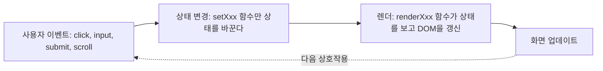
```mermaid
flowchart LR
    E["사용자 이벤트: click, input, submit, scroll"] --> S["상태 변경: setXxx 함수만 상태를 바꾼다"]
    S --> R["렌더: renderXxx 함수가 상태를 보고 DOM을 갱신"]
    R --> U["화면 업데이트"]
    U -.->|"다음 상호작용"| E
```

| 기능 | 상태 | 상태를 바꾸는 함수 | 화면을 그리는 함수 |
|---|---|---|---|
| 다크 모드 | `currentTheme` | [`setTheme`](js/theme.js#L49) | [`renderTheme`](js/theme.js#L42) |
| GitHub API | `projectState.status / repos / errorMessage` | [`setProjectState`](js/projects.js#L42) | [`renderProjects`](js/projects.js#L174) |
| 폼 유효성 검사 | `formState.values / touched / status` | [`setFormState`](js/contact.js#L68) | [`renderForm`](js/contact.js#L85) |
| 언어 필터 · 더 보기 | `projectState.filter / visibleCount` | [`setProjectState`](js/projects.js#L42) | [`renderProjects`](js/projects.js#L174) |

**프레임워크와 라이브러리는 쓰지 않았습니다.** React · Vue · jQuery · Bootstrap · Tailwind 모두 사용하지 않았고, npm이나 번들러 같은 빌드 도구도 없습니다. 외부에서 불러오는 스타일 · 폰트 · 스크립트는 과제에서 허용한 **Google Fonts 웹 폰트** 하나뿐이며(데이터는 GitHub API에서 받아 옵니다), 아이콘은 SVG 코드를 HTML 안에 직접 넣었습니다.

사이트 구성: **Header(네비게이션) · Hero · About · Skills · Projects · Contact · Footer**

---

## 2. 스크린샷

> 스크린샷은 headless Chrome을 Chrome DevTools Protocol로 조작해 찍었습니다. 애니메이션이 멈춘 상태로 찍히도록 `prefers-reduced-motion`을 에뮬레이션했고, 시간당 60회 제한을 피하려고 GitHub API 응답은 한 번 받아 둔 fixture로 제공했습니다. 그래서 저장소 개수(전체 27개)는 **촬영 시점 기준**입니다.
> 데스크톱: 1440×900 (1x) · 모바일: 390×844 (2x, 실제 파일 780×1688)

### 데스크톱 — 라이트 모드

| Hero | About |
|:---:|:---:|
| 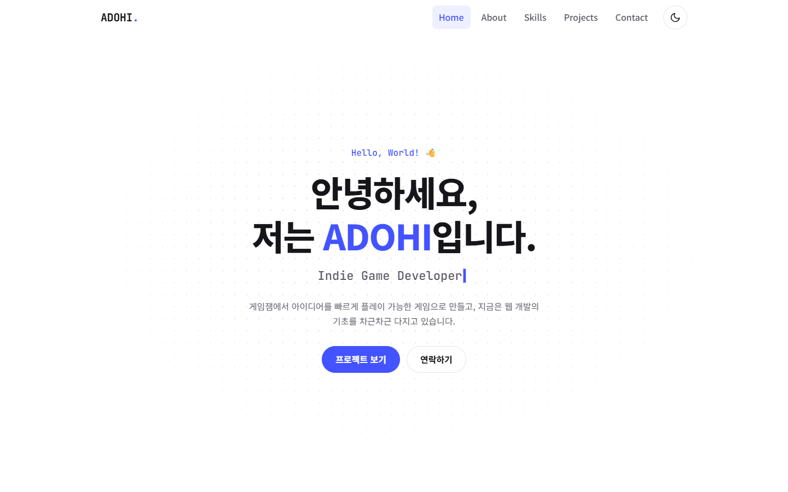 | 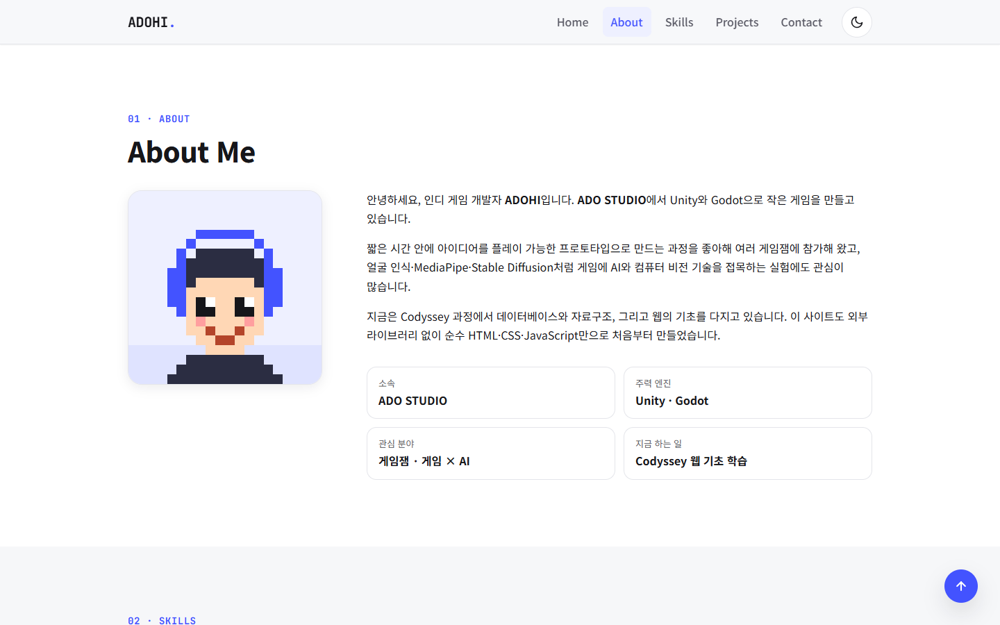 |
| **Skills** | **Projects** |
| 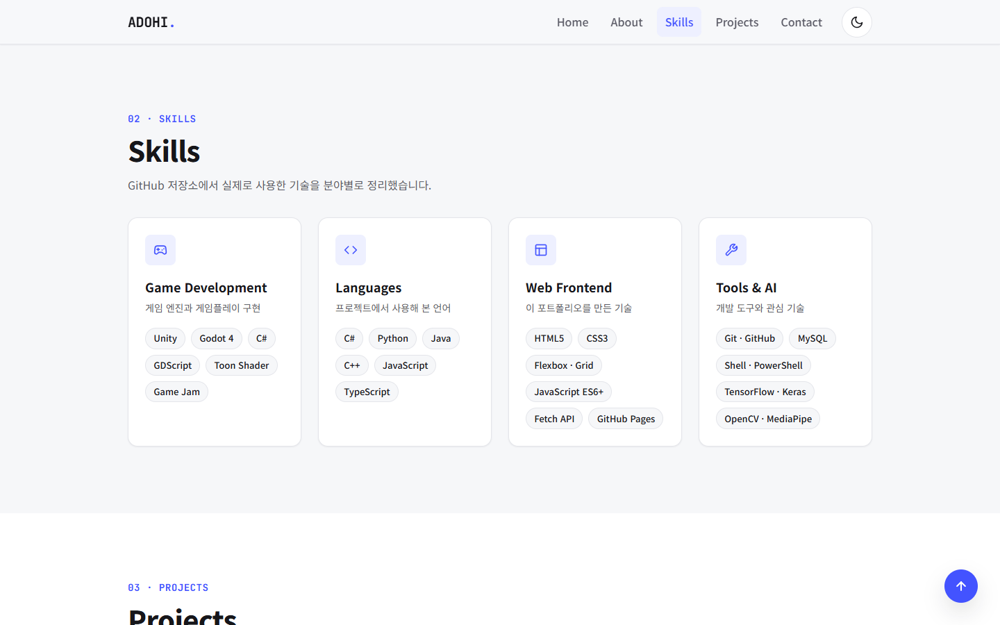 | 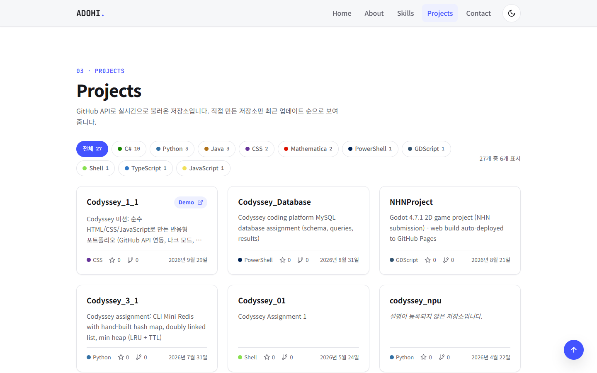 |
| **Contact** | |
| 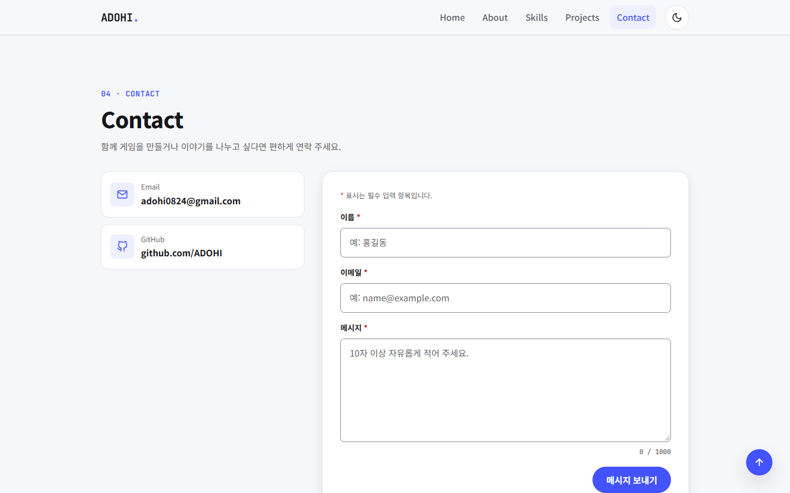 | |

### 다크 모드

| 데스크톱 Hero | 데스크톱 Projects |
|:---:|:---:|
| 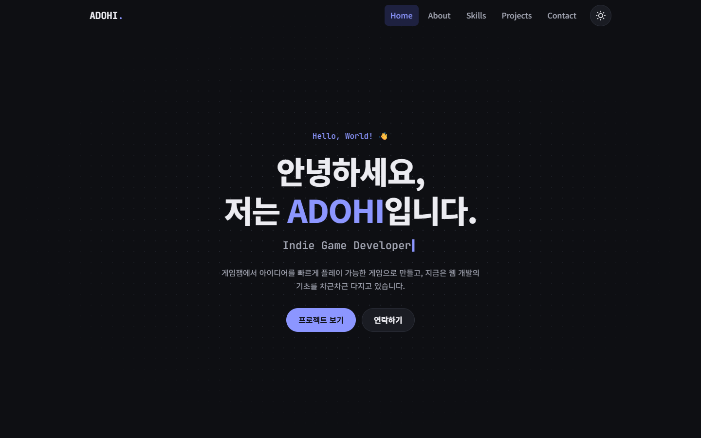 | 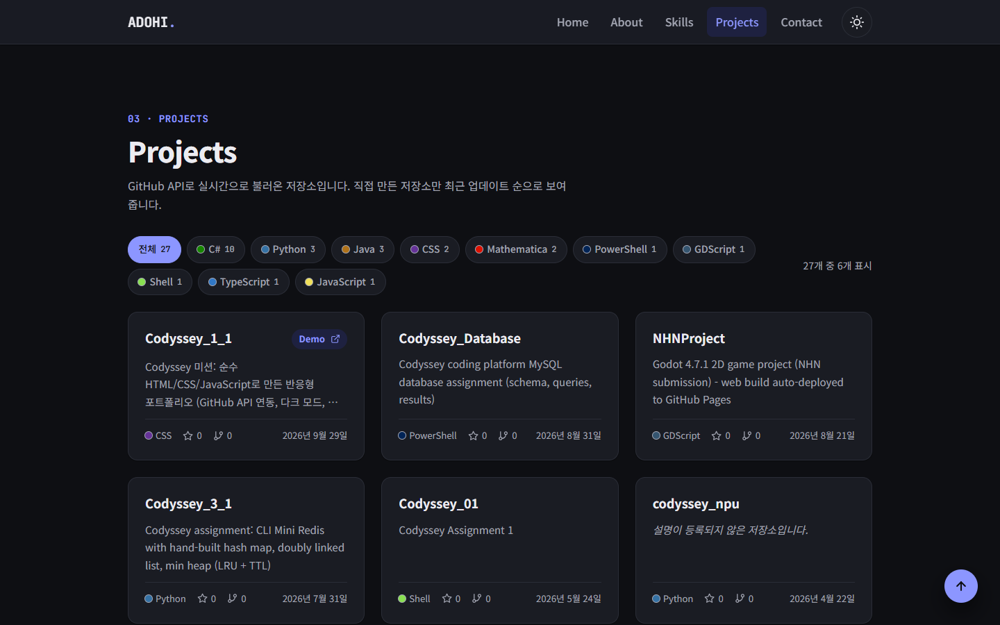 |
| **모바일 Hero** | **모바일 Projects** |
| 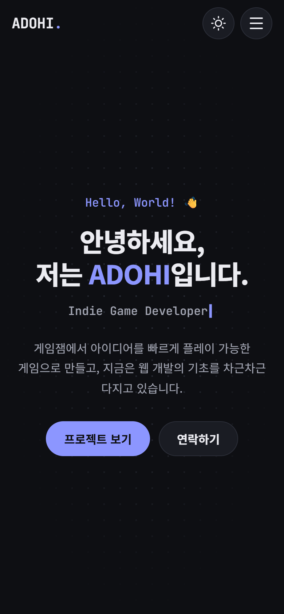 | 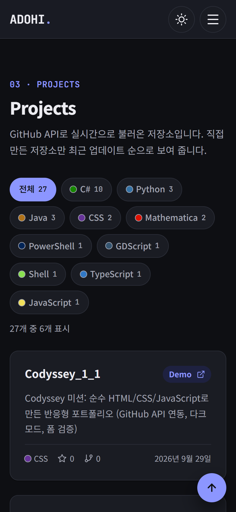 |

### 모바일 — 라이트 모드

| 첫 화면 | 햄버거 메뉴 열림 | Projects |
|:---:|:---:|:---:|
| 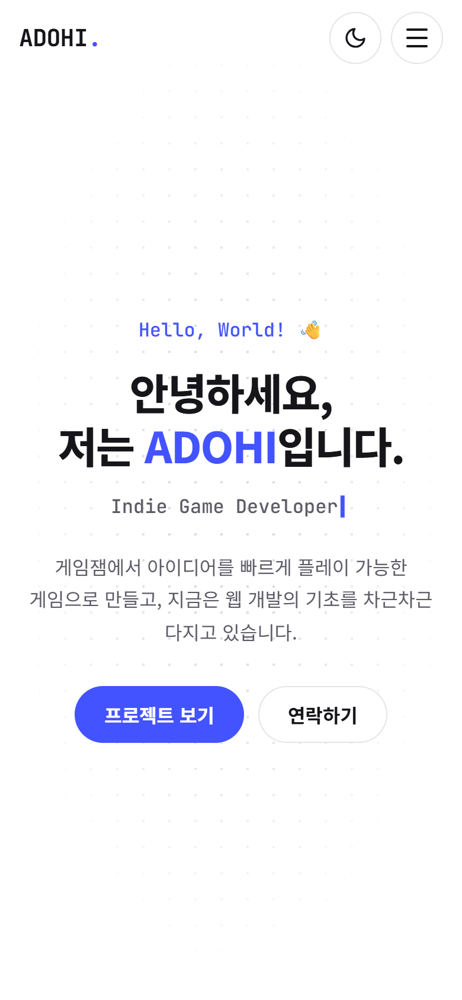 | 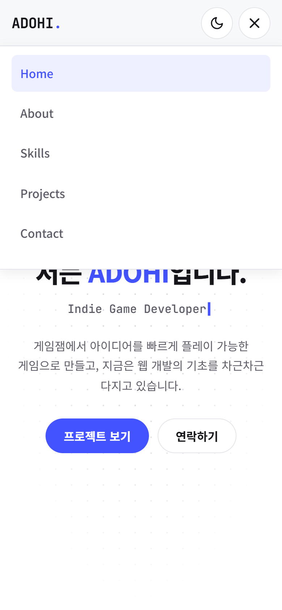 | 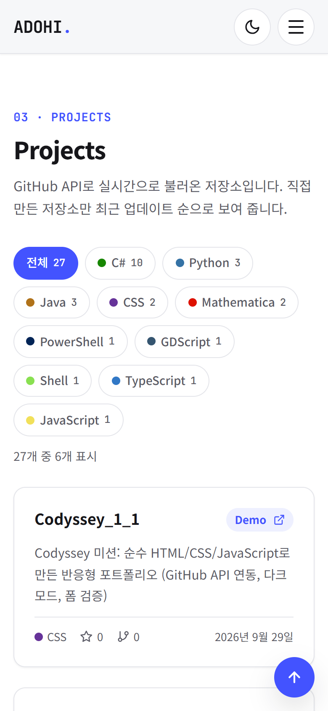 |

### 상태별 UI (GitHub API)

| 로딩 | 에러 |
|:---:|:---:|
| 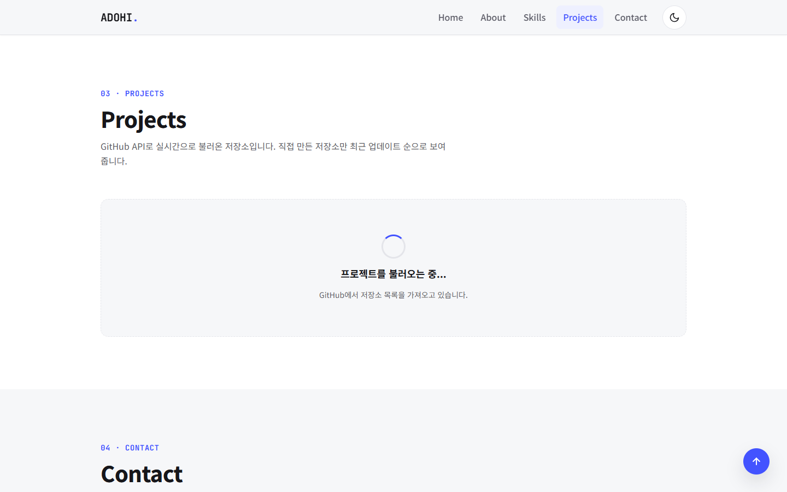 | 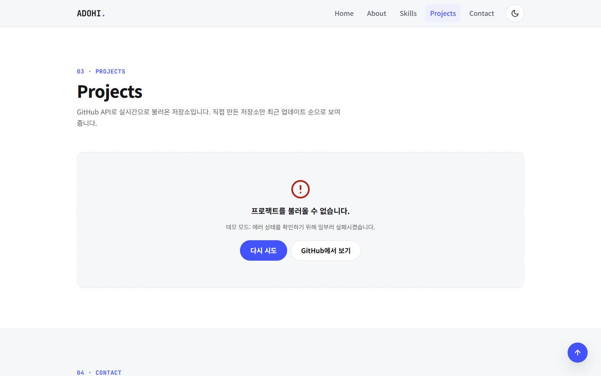 |
| **빈 상태** | **언어 필터 적용** |
| 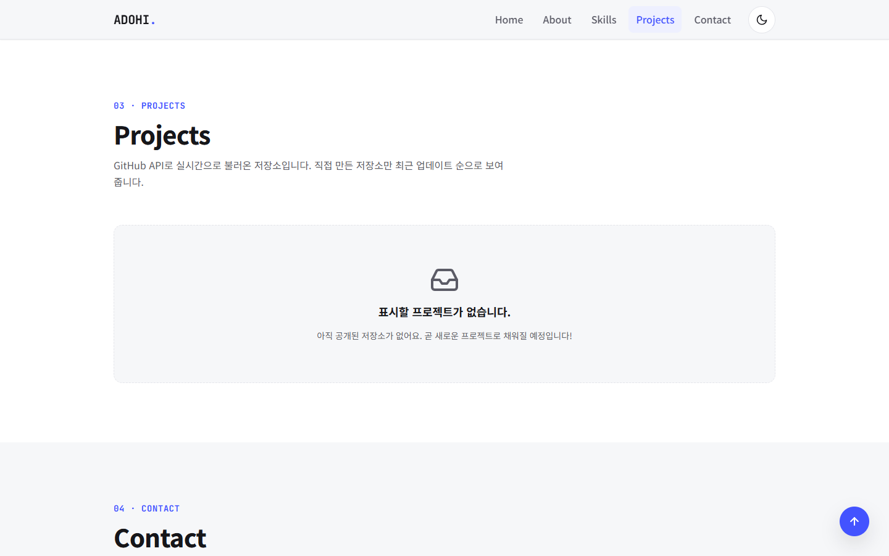 | 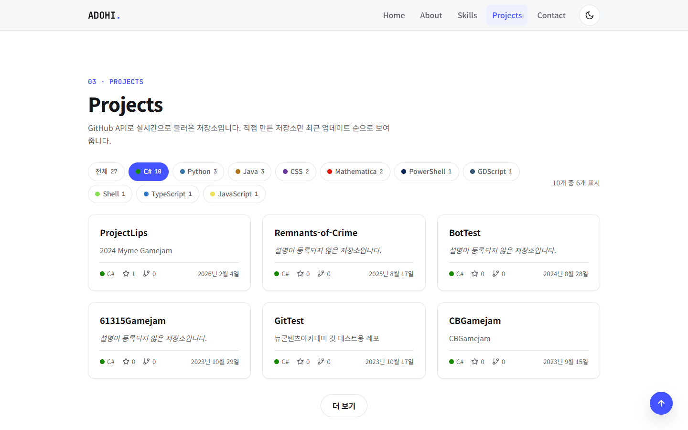 |

### 폼 유효성 검사

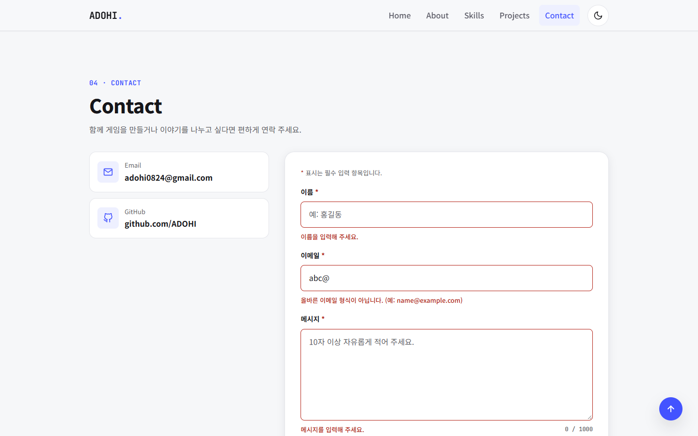

---

## 3. 주요 기능

| 기능 | 설명 | 관련 파일 |
|---|---|---|
| 반응형 레이아웃 | 모바일 퍼스트. 768px · 1024px에서 메뉴, About, Skills, Contact, Footer 배치가 바뀌고, 프로젝트 카드는 미디어 쿼리 없이 `auto-fit + minmax`로 1~3열 | [css/style.css](css/style.css#L1323) |
| 다크 모드 | 토글 버튼 → `<html data-theme>` 변경 → CSS 변수 교체. `localStorage`에 저장, 저장값이 없으면 OS 설정(`prefers-color-scheme`)을 따름 | [js/theme.js](js/theme.js#L49) |
| 햄버거 메뉴 | 768px 미만에서 `classList.toggle('active')`로 열고 닫음. Esc · 바깥 클릭 · 링크 클릭 · 화면이 768px 이상으로 넓어질 때(가로 회전 등) 닫힘 | [js/layout.js](js/layout.js#L40) |
| 부드러운 스크롤 | `href="#..."` 링크 클릭 시 `preventDefault()` 후 `scrollIntoView({ behavior: 'smooth' })`(동작 줄이기 설정이면 즉시 이동), 주소창 해시와 포커스도 이동 | [js/layout.js](js/layout.js#L72) |
| 헤더 배경 변경 | **60px 이상** 스크롤하면 헤더에 `.scrolled` → 반투명 배경 · 테두리 · 그림자 | [js/layout.js](js/layout.js#L97) |
| 스크롤 탑 버튼 | **300px 이상** 스크롤하면 `.visible`로 나타남. 누르면 맨 위로 이동 | [js/layout.js](js/layout.js#L98) |
| 현재 섹션 표시 | IntersectionObserver로 보고 있는 섹션의 메뉴에 `.current` + `aria-current` | [js/layout.js](js/layout.js#L118) |
| 스크롤 애니메이션 | IntersectionObserver **threshold 0.2** — 요소가 20% 보이면 `.revealed`로 떠오름 | [js/effects.js](js/effects.js#L12) |
| 타이핑 효과 (보너스) | Hero의 역할 문구를 한 글자씩 쓰고 지우기 반복 (`async/await` + `sleep`) | [js/effects.js](js/effects.js#L51) |
| GitHub 저장소 카드 | `fetch` + `async/await`로 저장소 목록을 받아 포크를 제외하고 카드로 렌더링 | [js/projects.js](js/projects.js#L251) |
| 로딩 / 에러 / 빈 상태 UI | 스피너, "프로젝트를 불러올 수 없습니다." + 다시 시도, "표시할 프로젝트가 없습니다." | [js/projects.js](js/projects.js#L74) |
| 언어별 필터 (보너스) | 저장소 언어로 버튼을 자동 생성하고 `array.filter`로 걸러서 표시 | [js/projects.js](js/projects.js#L149) |
| 더 보기 | 처음 6개만 보여 주고 버튼을 누를 때마다 6개씩 추가 | [js/projects.js](js/projects.js#L286) |
| 폼 유효성 검사 | 필수값 · 최소 길이 · 이메일 형식 검사, 에러는 각 입력칸 바로 아래에 표시 | [js/contact.js](js/contact.js#L32) |
| 폼 전송 (보너스) | Formspree로 `fetch` POST 전송 코드 구현. **현재는 폼 ID 미설정으로 데모 모드** | [js/contact.js](js/contact.js#L115) |
| 상태별 UI 데모 | 주소 뒤에 `?demo=loading · error · empty`를 붙이면 해당 상태를 강제로 재현 | [js/projects.js](js/projects.js#L213) |

---

## 4. 사용 기술

| 분류 | 기술 | 어디에 썼나 |
|---|---|---|
| 마크업 | **HTML5** | 시맨틱 태그(`header` `nav` `main` `section` `article` `figure` `address` `dl` `footer` `time`), ARIA 속성 |
| 스타일 | **CSS3** | CSS 변수(디자인 토큰), Flexbox, Grid(`auto-fit` + `minmax`), 미디어 쿼리, `clamp()`, `:has()`, `:where()`, `color-mix()`, `transition` · `@keyframes` |
| 스크립트 | **Vanilla JavaScript (ES6+)** | 화살표 함수, 템플릿 리터럴, 구조분해 할당, 전개 연산자, `map` · `filter` · `forEach` · `reduce`, `async/await`, `?.` · `??` |
| 브라우저 API | Fetch API, `AbortSignal.timeout`, IntersectionObserver, `localStorage`, `matchMedia`, History API(`pushState`), `FormData`, View Transitions API(지원 브라우저에서만) | 데이터 요청, 스크롤 감지, 테마 저장 등 |
| 외부 API | **GitHub REST API** | `GET https://api.github.com/users/ADOHI/repos?sort=updated&per_page=100` (인증 없이 호출) |
| 폼 전송 | **Formspree** | 문의 폼 실제 메일 전송용 (현재 데모 모드, [15장](#15-formspree-실제-전송-설정-방법) 참고) |
| 웹 폰트 | **Google Fonts** | Noto Sans KR(본문), JetBrains Mono(로고 · 코드 느낌 텍스트) |
| 아이콘 | **인라인 SVG 아이콘** | [Feather Icons](https://feathericons.com/) (MIT), [Lucide](https://lucide.dev/) (ISC) 모양을 SVG `<symbol>` 스프라이트로 넣고 `<use>`로 재사용 ([index.html#L46-L93](index.html#L46-L93)) |
| 배포 | **GitHub Pages** | `main` 브랜치의 루트 폴더를 그대로 배포 |
| 개발 환경 | **VS Code + Live Server** | [.vscode/extensions.json](.vscode/extensions.json)이 Live Server 확장을 추천, 포트 5500 |

### 사용하지 않은 것

- **프레임워크 / UI 라이브러리 없음**: React, Vue, jQuery, Bootstrap, Tailwind 등 전혀 사용하지 않음
- **빌드 도구 없음**: npm, `package.json`, 번들러(Webpack · Vite 등), 트랜스파일러(Babel · TypeScript) 없음 — 저장소의 파일이 **작성한 그대로** 브라우저에서 실행됨
- **아이콘 폰트 없음**: Font Awesome도 쓰지 않고 SVG를 직접 넣음
- **금지 문법 없음**: `var`, `onclick` 같은 인라인 이벤트 속성, `style="..."` 인라인 스타일, 심지어 `function` 키워드도 쓰지 않음 (모두 화살표 함수)

---

## 5. 폴더 구조

```text
Codyssey_1_1/
├── index.html                  # 페이지 전체 구조 (시맨틱 HTML) + SVG 아이콘 스프라이트
├── css/
│   ├── style.css               # 모든 스타일: 디자인 토큰, 레이아웃, 컴포넌트, 반응형, 다크 모드
│   └── noscript.css            # JavaScript가 꺼진 환경에서만 <noscript>로 불러오는 보조 스타일
├── js/
│   ├── utils.js                # 공통 도우미: sleep(ms), prefersReducedMotion()
│   ├── theme.js                # 다크 모드: 상태·렌더·localStorage·prefers-color-scheme
│   ├── layout.js               # 햄버거 메뉴, 부드러운 스크롤, 헤더(60px)·스크롤 탑(300px), 현재 섹션 표시, 푸터 연도
│   ├── effects.js              # 스크롤 애니메이션(threshold 0.2), Hero 타이핑 효과
│   ├── projects.js             # GitHub API 요청, 상태별 렌더링, 언어 필터, 더 보기, ?demo= 모드
│   └── contact.js              # 문의 폼 검증(상태·렌더) + Formspree 전송
├── images/
│   ├── profile.svg             # 스크립트로 생성한 픽셀 아트 프로필 이미지 (About)
│   ├── favicon.svg             # 브라우저 탭 아이콘
│   └── screenshots/            # README용 스크린샷 17장 (데스크톱·모바일·다크·상태별·폼)
├── docs/
│   ├── QNA.md                  # 동료평가 예상 질문과 답변
│   └── CONCEPTS.md             # 과제에 쓰인 개념 정리
├── .vscode/
│   ├── extensions.json         # Live Server 확장(ritwickdey.LiveServer) 추천
│   └── settings.json           # Live Server 포트 5500, 루트 "/"
├── .nojekyll                   # GitHub Pages가 Jekyll 변환 없이 파일을 그대로 배포하게 하는 빈 파일
├── .gitignore                  # OS 임시 파일(.DS_Store, Thumbs.db)과 로컬 도구 설정(.claude/) 제외
└── README.md                   # 지금 보고 있는 문서
```

---

## 6. 실행 방법

빌드 과정이 없으므로 **정적 파일을 웹 서버로 열기만 하면** 됩니다.

### (a) VS Code + Live Server (권장)

1. 저장소를 내려받습니다.
   ```bash
   git clone https://github.com/ADOHI/Codyssey_1_1.git
   ```
2. VS Code에서 **파일 → 폴더 열기**로 `Codyssey_1_1` 폴더를 엽니다.
3. 오른쪽 아래에 권장 확장을 설치할지 묻는 알림이 뜨면 **설치**를 누릅니다. ([.vscode/extensions.json](.vscode/extensions.json)이 `ritwickdey.LiveServer`를 추천합니다.) 알림이 없으면 확장(Ctrl+Shift+X)에서 "Live Server"를 검색해 설치합니다.
4. 탐색기에서 `index.html`을 오른쪽 클릭 → **Open with Live Server**, 또는 상태 표시줄의 **Go Live**를 누릅니다.
5. 브라우저에서 `http://127.0.0.1:5500/` 이 열립니다. 포트 5500은 [.vscode/settings.json](.vscode/settings.json)에 지정되어 있습니다.
6. 파일을 저장하면 Live Server가 페이지를 자동으로 새로고침합니다.

### (b) 다른 방법: Python 내장 서버

Python이 설치되어 있다면 프로젝트 폴더에서 다음을 실행하고 `http://localhost:5500/`을 엽니다.

```bash
python -m http.server 5500
```

> `index.html`을 파일로 직접 더블클릭해 열어도 대부분 보이지만, 배포 환경(GitHub Pages, `https://`)과 같은 조건에서 확인하려면 로컬 서버를 쓰는 것이 안전합니다.

### 주의: GitHub API 요청 한도

인증 없이 GitHub API를 호출하면 **IP당 시간당 60회**로 제한됩니다. 페이지를 불러올 때마다 1회씩 요청하므로, 개발 중에 새로고침을 아주 많이 하면 한도를 넘을 수 있습니다. 한도를 넘으면 Projects 영역에 "GitHub API 요청 한도(시간당 60회)를 초과했습니다. HH:MM 이후에 다시 시도해 주세요." 에러 UI가 나옵니다. 화면만 확인하고 싶을 때는 `?demo=` 모드([10장](#10-상태별-ui-확인-방법))를 쓰면 API를 호출하지 않습니다.

---

## 7. 기준값

과제에서 README에 명시하라고 한 값은 다음 세 가지입니다.

> - **스크롤 탑 버튼: 300px 이상** 스크롤하면 나타남 — [`SCROLL_TOP_THRESHOLD`](js/layout.js#L14)
> - **헤더 배경 변경: 60px 이상** 스크롤하면 배경 · 테두리 · 그림자가 생김 — [`HEADER_SCROLL_THRESHOLD`](js/layout.js#L13)
> - **Intersection Observer threshold: 0.2** — 요소가 20% 이상 보이면 등장 애니메이션 실행 — [`REVEAL_THRESHOLD`](js/effects.js#L12)

비교는 모두 `>=`(이상)입니다: `scrollY >= HEADER_SCROLL_THRESHOLD`, `scrollY >= SCROLL_TOP_THRESHOLD` ([js/layout.js#L97-L98](js/layout.js#L97-L98)).

**왜 이 값인가?**
- **60px**: 헤더 높이(`--header-height: 64px`, [css/style.css#L84](css/style.css#L84))와 비슷한 거리입니다. 헤더 높이만큼 내려가 본문이 헤더 뒤로 들어가기 시작할 즈음 배경을 채워 글자가 겹쳐 보이지 않게 했습니다.
- **300px**: 첫 화면(Hero)을 어느 정도 벗어나 "위로 돌아갈 이유"가 생겼을 때만 버튼을 보여 줘서, 첫 화면을 가리지 않게 했습니다.
- **0.2**: 과제 권장값(0.2 이상)을 따랐습니다. 너무 크면(예: 0.8) 키가 큰 요소가 한참 늦게 나타나고, 요소가 화면보다 훨씬 크면 그 비율만큼 보이는 순간이 오지 않아 아예 나타나지 않을 수도 있습니다. 반대로 0이면 가장자리만 걸쳐도 실행되어 애니메이션이 눈에 잘 띄지 않습니다.

### 조정 가능한 모든 상수

| 이름 | 값 | 의미 | 위치 |
|---|---|---|---|
| `HEADER_SCROLL_THRESHOLD` | `60` (px) | 이 값 이상 스크롤하면 헤더에 `.scrolled` | [js/layout.js#L13](js/layout.js#L13) |
| `SCROLL_TOP_THRESHOLD` | `300` (px) | 이 값 이상 스크롤하면 스크롤 탑 버튼에 `.visible` | [js/layout.js#L14](js/layout.js#L14) |
| `REVEAL_THRESHOLD` | `0.2` | `.reveal` 요소가 20% 보이면 `.revealed` | [js/effects.js#L12](js/effects.js#L12) |
| 현재 섹션 감지 `rootMargin` | `'-45% 0px -50% 0px'` | 화면 세로 중앙 부근 띠에 들어온 섹션을 현재 섹션으로 판단 | [js/layout.js#L130](js/layout.js#L130) |
| `TYPE_DELAY` | `90` (ms) | 타이핑 효과: 한 글자 쓰는 간격 | [js/effects.js#L31](js/effects.js#L31) |
| `ERASE_DELAY` | `45` (ms) | 타이핑 효과: 한 글자 지우는 간격 | [js/effects.js#L32](js/effects.js#L32) |
| `HOLD_DELAY` | `1800` (ms) | 타이핑 효과: 단어를 다 쓴 뒤 멈춰 있는 시간 | [js/effects.js#L33](js/effects.js#L33) |
| `TYPING_WORDS` | 4개 문구 | 타이핑으로 순환할 역할 문구 | [js/effects.js#L30](js/effects.js#L30) |
| `PAGE_SIZE` | `6` | 처음 보여 줄 카드 수이자 "더 보기" 1회당 추가 수 | [js/projects.js#L19](js/projects.js#L19) |
| `REQUEST_TIMEOUT` | `10000` (ms) | GitHub API 응답을 기다리는 최대 시간 | [js/projects.js#L18](js/projects.js#L18) |
| `per_page` | `100` | API 1회 요청으로 받는 최대 저장소 수 | [js/projects.js#L17](js/projects.js#L17) |
| 카드 토픽 표시 개수 | `3` | `topics.slice(0, 3)` | [js/projects.js#L129](js/projects.js#L129) |
| 데모 지연 | `800` (ms) | `?demo=error`, `?demo=empty`에서 결과를 보여 주기 전 대기 | [js/projects.js#L217](js/projects.js#L217), [#L221](js/projects.js#L221) |
| `SEND_TIMEOUT` | `10000` (ms) | Formspree 전송 응답을 기다리는 최대 시간 | [js/contact.js#L24](js/contact.js#L24) |
| `NAME_MIN_LENGTH` | `2` | 이름 최소 글자 수 | [js/contact.js#L19](js/contact.js#L19) |
| `MESSAGE_MIN_LENGTH` | `10` | 메시지 최소 글자 수 | [js/contact.js#L20](js/contact.js#L20) |
| `MESSAGE_MAX_LENGTH` | `1000` | 글자 수 카운터의 최대값 표시 (`0 / 1000`). 실제 입력 제한은 HTML `maxlength="1000"` | [js/contact.js#L21](js/contact.js#L21), [index.html#L334](index.html#L334) |
| `EMAIL_PATTERN` | 정규식 | `아이디@도메인.최상위도메인(2자 이상)` 형식 검사 | [js/contact.js#L23](js/contact.js#L23) |
| 입력 최대 길이 | 이름 `50`, 이메일 `100` | HTML `maxlength` | [index.html#L322](index.html#L322), [#L328](index.html#L328) |
| 데모 전송 지연 | `800` (ms) | 데모 모드에서 "전송 중..."을 보여 주는 시간 | [js/contact.js#L118](js/contact.js#L118) |
| 태블릿 브레이크포인트 | `768px` | `@media (min-width: 768px)` + JS의 메뉴 초기화 기준 | [css/style.css#L1323](css/style.css#L1323), [js/layout.js#L49](js/layout.js#L49) |
| 데스크톱 브레이크포인트 | `1024px` | `@media (min-width: 1024px)` | [css/style.css#L1413](css/style.css#L1413) |
| `--header-height` | `64px` | 헤더 높이이자 앵커 이동 시 `scroll-padding-top` | [css/style.css#L84](css/style.css#L84), [#L134](css/style.css#L134) |
| `--container-width` | `1120px` | 본문 최대 너비 | [css/style.css#L85](css/style.css#L85) |
| 프로젝트 카드 최소 너비 | `300px` | `minmax(min(100%, 300px), 1fr)` | [css/style.css#L806](css/style.css#L806) |

---

## 8. 요구사항 체크리스트 (동료평가용)

> 코드 위치 링크를 누르면 GitHub에서 해당 줄로 바로 이동합니다. "확인 방법"은 [배포 사이트](https://adohi.github.io/Codyssey_1_1/)나 Chrome DevTools에서 직접 확인하는 방법입니다.

### 최종 결과물

| 상태 | 결과물 | 어떻게 충족했나 | 참고 |
|:---:|---|---|---|
| ✅ | 1. 반응형 웹사이트 (Hero · About · Skills · Projects · Contact · Footer) | 모바일 퍼스트 + 768px/1024px 브레이크포인트, 6개 섹션 모두 구현 | [9.2](#92-css-설계), [스크린샷](#2-스크린샷) |
| ✅ | 2. 인터랙티브 UI | 다크 모드, 햄버거 메뉴, 부드러운 스크롤, 스크롤 애니메이션, 폼 유효성 검사 | 아래 5·6번 |
| ✅ | 3. 외부 API 연동 | GitHub API → 카드 동적 렌더링, 로딩/에러/빈 상태 UI | 아래 8번 |
| ✅ | 4. 상태 유지 | 다크 모드를 `localStorage`에 저장, 새로고침 후 유지 | 아래 5-5 |
| ✅ | 5. 배포 | GitHub Pages: <https://adohi.github.io/Codyssey_1_1/> | 아래 10번 |

### 기능 요구 사항 1. 프로젝트 기본 구성

| 상태 | 요구사항 | 구현 방법 | 코드 위치 | 확인 방법 |
|:---:|---|---|---|---|
| ✅ | 1-1. `index.html`, `css/`, `js/`, `images/` 분리 | 역할별 폴더로 분리, JS는 기능별 6개 파일 | [5. 폴더 구조](#5-폴더-구조) | 저장소 루트 목록 확인 |
| ✅ | 1-2. 외부 스타일시트 · JS 올바르게 연결 | `<link rel="stylesheet" href="css/style.css">`, `<script src="js/..." defer>` 6개 | [index.html#L25](index.html#L25), [index.html#L35-L40](index.html#L35-L40) | DevTools → Network에서 css/js가 200으로 로드되는지 확인 |
| ✅ | 1-3. VS Code + Live Server 개발 환경 | 확장 추천 + 포트 설정 파일 포함 | [.vscode/extensions.json](.vscode/extensions.json), [.vscode/settings.json](.vscode/settings.json) | [6. 실행 방법](#6-실행-방법) 따라 실행 |

### 기능 요구 사항 2. HTML 구조

| 상태 | 요구사항 | 구현 방법 | 코드 위치 | 확인 방법 |
|:---:|---|---|---|---|
| ✅ | 2-1. `div`만 쓰지 않고 시맨틱 태그 사용 | `header` `nav` `main` `section` `article` `footer` + `figure` `address` `dl` `time`. `div`는 레이아웃용 틀에만 사용 | [header#L96](index.html#L96), [nav#L100](index.html#L100), [main#L124](index.html#L124), [section#L126](index.html#L126), [article#L196](index.html#L196), [footer#L356](index.html#L356) | DevTools → Elements에서 태그 구조 확인 |
| ✅ | 2-2. Hero: 인사말, CTA 버튼 | "Hello, World!" + `h1` 인사말, "프로젝트 보기" · "연락하기" 버튼 | [index.html#L126-L141](index.html#L126-L141) | 첫 화면에서 버튼 클릭 → 해당 섹션으로 이동 |
| ✅ | 2-3. About: 자기소개, 프로필 이미지 | 소개 문단 3개 + `figure > img` 프로필 + `dl` 정보 | [index.html#L144-L182](index.html#L144-L182) | About 섹션 확인 |
| ✅ | 2-4. Skills: 기술 스택 목록 | 분야별 카드 4개(`article`) 안에 `ul.tag-list` 기술 목록 | [index.html#L185-L256](index.html#L185-L256) | Skills 섹션 확인 |
| ✅ | 2-5. Projects: GitHub API 카드 | 빈 컨테이너를 두고 JS가 카드(`article.project-card`)를 채움 | [index.html#L259-L284](index.html#L259-L284), [js/projects.js#L100](js/projects.js#L100) | Projects 섹션에 저장소 카드가 보이는지 |
| ✅ | 2-6. Contact: 문의 폼 | 이름 · 이메일 · 메시지 `form` + `address` 연락처 | [index.html#L287-L352](index.html#L287-L352) | Contact 섹션 확인 |
| ✅ | 2-7. Footer: 저작권, 소셜 링크 | `© 연도 ADOHI` (연도는 JS가 자동 갱신) + GitHub · 이메일 아이콘 링크 | [index.html#L356-L372](index.html#L356-L372), [js/layout.js#L138](js/layout.js#L138) | 페이지 맨 아래 확인 |
| ✅ | 2-8. 네비게이션 앵커 링크 | `href="#hero"` ~ `href="#contact"`, 각 `section`에 같은 `id` | [index.html#L102-L106](index.html#L102-L106) | 메뉴 클릭 → 섹션 이동, 주소창에 `#about` 등 표시 |
| ✅ | 2-9. 모든 이미지에 의미 있는 `alt` | 유일한 ``인 프로필에 "헤드폰을 쓰고 웃고 있는 ADOHI의 픽셀 아트 프로필 캐릭터". 장식용 SVG 아이콘은 `aria-hidden="true"`, 아이콘만 있는 링크·버튼은 `aria-label` | [index.html#L153](index.html#L153), [index.html#L361](index.html#L361) | Elements에서 `img` 검색 |
| ✅ | 2-10. `label`의 `for`와 입력의 `id` 매칭 | `contact-name` · `contact-email` · `contact-message` (+ honeypot `contact-gotcha`) | [index.html#L321-L322](index.html#L321-L322), [#L327-L328](index.html#L327-L328), [#L333-L334](index.html#L333-L334) | 라벨 글자를 클릭하면 해당 입력칸에 커서가 가는지 |

### 기능 요구 사항 3. CSS 스타일링

| 상태 | 요구사항 | 구현 방법 | 코드 위치 | 확인 방법 |
|:---:|---|---|---|---|
| ✅ | 3-1. `css/style.css` 사용 | 메인 스타일을 한 파일에 17개 구역으로 정리 (맨 위 목차 주석). JS가 꺼졌을 때만 쓰는 보조 스타일은 `css/noscript.css` | [css/style.css#L1-L27](css/style.css#L1-L27) | 파일 확인 |
| ✅ | 3-2. `:root` 변수 (색상, 폰트, 간격) | 색상 15개, 그림자, 폰트 · 글자 크기, 간격 `--space-1~9`, 모서리, 트랜지션 | [css/style.css#L33-L91](css/style.css#L33-L91) | DevTools → Elements → `html` 선택 → Styles에서 변수 확인 |
| ✅ | 3-3. `[data-theme="dark"]` 변수 | 같은 변수 이름에 어두운 값만 다시 지정 | [css/style.css#L94-L116](css/style.css#L94-L116) | 테마 토글 후 `html`의 `data-theme` 값 확인 |
| ✅ | 3-4. 네비게이션 Flexbox (로고 왼쪽, 메뉴 오른쪽) | `.header__inner { display: flex; justify-content: space-between }` + `.nav { margin-left: auto }` | [css/style.css#L362-L368](css/style.css#L362-L368), [#L381-L383](css/style.css#L381-L383) | 데스크톱에서 로고 왼쪽, 메뉴·버튼 오른쪽 |
| ✅ | 3-5. Projects 카드 Grid (`auto-fit`, `minmax`) | `grid-template-columns: repeat(auto-fit, minmax(min(100%, 300px), 1fr))` | [css/style.css#L804-L808](css/style.css#L804-L808) | 창 너비를 줄이면 3열 → 2열 → 1열 |
| ✅ | 3-6. 모바일 퍼스트 | 기본 스타일 = 모바일, 미디어 쿼리는 `min-width`만 사용 (`max-width` 없음) | [css/style.css#L1323](css/style.css#L1323), [#L1413](css/style.css#L1413) | `@media` 검색 → 화면 폭 조건은 `min-width` 두 개뿐 (나머지 두 개는 동작 줄이기 · 고대비 모드) |
| ✅ | 3-7. 브레이크포인트 768px / 1024px | 태블릿 · 데스크톱 두 단계 | [css/style.css#L1323-L1407](css/style.css#L1323-L1407), [#L1413-L1432](css/style.css#L1413-L1432) | DevTools 기기 모드에서 767 ↔ 768, 1023 ↔ 1024 비교 |
| ✅ | 3-8. 모바일에서 네비 숨김 + 햄버거 | 모바일: 메뉴 `opacity: 0; visibility: hidden`, `.active`일 때 표시. 768px 이상: 햄버거 `display: none`, 메뉴 가로 배치 | [css/style.css#L386-L417](css/style.css#L386-L417), [#L1333-L1348](css/style.css#L1333-L1348) | 767px에서 햄버거, 768px에서 가로 메뉴 |
| ✅ | 3-9. 버튼 · 카드 hover + `transition` | 버튼 · 아이콘 버튼 · 스킬 카드 · 프로젝트 카드 · 연락처 카드가 떠오르며 그림자·테두리 색 변화 | [.btn#L256-L277](css/style.css#L256-L277), [.skill-card#L686-L703](css/style.css#L686-L703), [.project-card#L810-L840](css/style.css#L810-L840), [.contact__link#L1068-L1086](css/style.css#L1068-L1086) | 마우스를 올려 보기 |
| ✅ | 3-10. 카드 `box-shadow` | `--shadow-sm/md/lg` 토큰, hover 시 `--shadow-lg` | [css/style.css#L52-L54](css/style.css#L52-L54), [#L692](css/style.css#L692), [#L819](css/style.css#L819) | 카드 그림자 확인 |

### 기능 요구 사항 4. JavaScript 기초

| 상태 | 요구사항 | 구현 방법 | 코드 위치 | 확인 방법 |
|:---:|---|---|---|---|
| ✅ | 4-1. `defer`로 스크립트 연결 | 6개 스크립트 모두 `defer`, 의존 순서대로 나열 | [index.html#L29-L40](index.html#L29-L40) | `index.html` `<head>` 확인 |
| ✅ | 4-2. `const` / `let`만 사용 | `var` 0개. 최상위 선언 80개 모두 `const` / `let` | 모든 `js/*.js` | `git grep -nw var -- js` → 결과 없음 |
| ✅ | 4-3. `onclick` 대신 `addEventListener` | 모든 이벤트를 `addEventListener`로 연결 | [9.5 이벤트 목록](#95-이벤트-목록) | `git grep -n onclick -- index.html js` → 결과 없음 |
| ✅ | 4-4. `querySelector` / `querySelectorAll` | 요소는 이 두 메서드로 찾음 (폼 입력칸은 `form.elements[이름]`도 사용) | [js/layout.js#L16-L20](js/layout.js#L16-L20), [js/effects.js#L25](js/effects.js#L25) | 코드 확인 |
| ✅ | 4-5. `textContent` / `innerHTML` | 사용자·상태 문구는 `textContent`, 템플릿으로 만든 HTML은 `innerHTML`(외부 데이터는 이스케이프) | [js/contact.js#L96](js/contact.js#L96), [js/projects.js#L195](js/projects.js#L195), [js/projects.js#L199](js/projects.js#L199) | 코드 확인 |
| ✅ | 4-6. `classList.add` / `remove` / `toggle` | `add('revealed')`, `remove('active')`, `toggle('active')`, `toggle('scrolled', 조건)` 등 | [add: effects.js#L18](js/effects.js#L18), [remove: layout.js#L36](js/layout.js#L36), [toggle: layout.js#L42](js/layout.js#L42), [toggle: layout.js#L97](js/layout.js#L97) | 동작 중 Elements에서 클래스 변화 관찰 |
| ✅ | 4-7. `click` · `submit` · `scroll` · `input` 이벤트 | 햄버거 click, 폼 submit, 창 scroll, 폼 input (+ `focusout`, `keydown`, `change`) | [click](js/layout.js#L40), [submit](js/contact.js#L156), [scroll](js/layout.js#L102), [input](js/contact.js#L137) | [9.5](#95-이벤트-목록) 표 참고 |
| ✅ | 4-8. `event.preventDefault()` | 앵커 링크의 순간 이동을 막고 부드럽게 이동, 폼의 페이지 이동(새로고침)을 막고 JS로 처리 | [js/layout.js#L78](js/layout.js#L78), [js/contact.js#L157](js/contact.js#L157) | 폼 제출 시 페이지가 새로고침되지 않음 |

### 기능 요구 사항 5. 인터랙션

| 상태 | 요구사항 | 구현 방법 | 코드 위치 | 확인 방법 |
|:---:|---|---|---|---|
| ✅ | 5-1. 햄버거 메뉴 토글 (`classList.toggle('active')`) | `navMenu.classList.toggle('active')`의 반환값으로 버튼 모양·`aria-expanded`까지 맞춤 | [js/layout.js#L40-L46](js/layout.js#L40-L46) | 모바일 폭에서 ☰ 클릭 → 메뉴 열림, X 모양 |
| ✅ | 5-2. 부드러운 스크롤 | 모든 `a[href^="#"]`에 click → `preventDefault()` → `scrollIntoView({ behavior: 'smooth' })` (동작 줄이기 설정이면 `'auto'`로 즉시 이동) | [js/layout.js#L72-L90](js/layout.js#L72-L90) | 메뉴 · CTA · 로고 클릭 |
| ✅ | 5-3. 스크롤 탑 버튼 (**300px 이상**, README 명시) | `scrollY >= 300`이면 `.visible`, 클릭 시 `scrollTo({ top: 0 })` | [js/layout.js#L14](js/layout.js#L14), [#L98](js/layout.js#L98), [#L108-L112](js/layout.js#L108-L112) | [7. 기준값](#7-기준값), 콘솔에서 `scrollTo(0, 299)` / `scrollTo(0, 300)` |
| ✅ | 5-4. 네비게이션 스타일 변경 (**60px 이상**, README 명시) | `scrollY >= 60`이면 헤더에 `.scrolled` → 배경 · 테두리 · 그림자 · blur | [js/layout.js#L13](js/layout.js#L13), [#L97](js/layout.js#L97), [css/style.css#L353-L360](css/style.css#L353-L360) | 콘솔에서 `scrollTo(0, 59)` / `scrollTo(0, 60)` |
| ✅ | 5-5. 다크 모드 (`localStorage` 유지) | 토글 시 `localStorage.setItem('theme', ...)`, 시작 시 저장값 → OS 설정 → light 순으로 결정 | [js/theme.js#L19-L39](js/theme.js#L19-L39), [#L56-L65](js/theme.js#L56-L65) | 토글 → 새로고침 → 유지. Application → Local Storage → `theme` |
| ✅ | 5-6. 스크롤 애니메이션 (IntersectionObserver, **threshold 0.2**, README 명시) | `.reveal` 요소가 20% 보이면 `.revealed` 추가 후 관찰 해제 | [js/effects.js#L12-L25](js/effects.js#L12-L25), [css/style.css#L1301-L1310](css/style.css#L1301-L1310) | 스크롤하며 섹션 제목·카드가 떠오르는지 |

### 기능 요구 사항 6. 폼 UX

| 상태 | 요구사항 | 구현 방법 | 코드 위치 | 확인 방법 |
|:---:|---|---|---|---|
| ✅ | 6-1. 이름 · 이메일 · 메시지 필드 | `input[type=text]`, `input[type=email]`, `textarea` | [index.html#L320-L339](index.html#L320-L339) | Contact 폼 확인 |
| ✅ | 6-2. 필수값 검증 | 앞뒤 공백을 뺀(`trim`) 값이 비어 있으면 "이름을 입력해 주세요." 등 | [js/contact.js#L32-L48](js/contact.js#L32-L48), [#L51-L52](js/contact.js#L51-L52) | 빈 채로 제출 |
| ✅ | 6-3. 이메일 형식 검증 | 정규식 `EMAIL_PATTERN` (`a@b..com`, `a@.com` 같은 형식도 거부) | [js/contact.js#L23](js/contact.js#L23), [#L38-L42](js/contact.js#L38-L42) | `abc@` 입력 후 다른 칸 클릭 |
| ✅ | 6-4. 필드 근처에 에러 메시지 | 각 입력칸 바로 아래 `p.form-field__error`에 문구, 입력칸은 빨간 테두리 + `aria-invalid` | [index.html#L323](index.html#L323), [js/contact.js#L91-L100](js/contact.js#L91-L100) | [폼 검증 스크린샷](#폼-유효성-검사) |
| ✅ | 6-5. 제출 시 `preventDefault` + 성공 메시지 | 기본 제출 막기 → 전체 검증 → 통과 시 "전송 중..." → 성공 메시지 + 폼 초기화 | [js/contact.js#L156-L184](js/contact.js#L156-L184), [#L73-L80](js/contact.js#L73-L80) | 올바르게 입력 후 제출 |

### 기능 요구 사항 7. ES6+ 문법

| 상태 | 요구사항 | 구현 방법 | 코드 위치 | 확인 방법 |
|:---:|---|---|---|---|
| ✅ | 7-1. 화살표 함수 | 모든 함수가 화살표 함수 (`function` 키워드 0개) | [js/utils.js#L10](js/utils.js#L10) 등 전체 | `git grep -nw function -- js` → 결과 없음 |
| ✅ | 7-2. 템플릿 리터럴로 HTML 생성 | 카드 · 필터 버튼 · 상태 UI를 `` `...${값}...` ``로 생성 | [js/projects.js#L100-L146](js/projects.js#L100-L146), [#L74-L97](js/projects.js#L74-L97) | 코드 확인 |
| ✅ | 7-3. 구조분해 할당 | 매개변수에서 꺼내며 이름 바꾸기(`stargazers_count: stars`), 상태 꺼내기, `const { scrollY } = window` | [js/projects.js#L100-L110](js/projects.js#L100-L110), [#L175](js/projects.js#L175), [js/layout.js#L96](js/layout.js#L96), [js/contact.js#L138](js/contact.js#L138) | 코드 확인 |
| ✅ | 7-4. `map` (GitHub 데이터 → 카드) | `shownRepos.map(createProjectCard).join('')` | [js/projects.js#L195](js/projects.js#L195) | 코드 확인 |
| ✅ | 7-5. `filter` (선택) | 포크 제외 `data.filter(({ fork }) => !fork)`, 언어 필터 `repos.filter(({ language }) => ...)` | [js/projects.js#L256](js/projects.js#L256), [#L68](js/projects.js#L68) | 언어 버튼 클릭 |
| ✅ | 7-6. `forEach` | 링크마다 이벤트 연결, 관찰 대상 등록, 필드별 렌더 등 | [js/layout.js#L72](js/layout.js#L72), [js/effects.js#L25](js/effects.js#L25), [js/contact.js#L91](js/contact.js#L91) | 코드 확인 |

### 기능 요구 사항 8. 비동기 처리

| 상태 | 요구사항 | 구현 방법 | 코드 위치 | 확인 방법 |
|:---:|---|---|---|---|
| ✅ | 8-1. `fetch` + `async/await`, 엔드포인트 `https://api.github.com/users/{아이디}/repos` | `https://api.github.com/users/ADOHI/repos?sort=updated&per_page=100` | [js/projects.js#L16-L17](js/projects.js#L16-L17), [#L213-L249](js/projects.js#L213-L249) | DevTools → Network → `repos` 요청 |
| ✅ | 8-2. 로딩 상태 (스피너 / 로딩 중) | 회전 스피너 + "프로젝트를 불러오는 중...", 그리드에 `aria-busy="true"` | [js/projects.js#L74-L79](js/projects.js#L74-L79), [css/style.css#L1027-L1040](css/style.css#L1027-L1040) | [`?demo=loading`](https://adohi.github.io/Codyssey_1_1/?demo=loading#projects) |
| ✅ | 8-3. 성공 상태 (카드) | 저장소 카드 목록 + "N개 중 M개 표시" | [js/projects.js#L195-L200](js/projects.js#L195-L200) | 기본 접속 |
| ✅ | 8-4. 에러 상태 ("프로젝트를 불러올 수 없습니다" + 재시도 버튼) | 원인별 안내 문구 + "다시 시도" 버튼(재요청) + "GitHub에서 보기" | [js/projects.js#L81-L90](js/projects.js#L81-L90), [#L277-L284](js/projects.js#L277-L284) | [`?demo=error`](https://adohi.github.io/Codyssey_1_1/?demo=error#projects) |
| ✅ | 8-5. 빈 상태 ("표시할 프로젝트가 없습니다") | 저장소가 0개면 빈 상태 템플릿 | [js/projects.js#L92-L97](js/projects.js#L92-L97), [#L183](js/projects.js#L183) | [`?demo=empty`](https://adohi.github.io/Codyssey_1_1/?demo=empty#projects) |
| ✅ | 8-6. `try/catch` 에러 처리 | 요청 전체를 `try/catch`로 감싸 실패 시 에러 상태로 전환 | [js/projects.js#L254-L264](js/projects.js#L254-L264), [js/contact.js#L173-L180](js/contact.js#L173-L180) | [9.6](#96-비동기--에러-처리) 참고 |

### 기능 요구 사항 9. 상태 관리 패턴

| 상태 | 요구사항 | 구현 방법 | 코드 위치 | 확인 방법 |
|:---:|---|---|---|---|
| ✅ | 9-1. 이벤트 → 상태 변경 → 화면 업데이트 | 상태 변수 1개 + 상태를 바꾸는 함수 1개 + 상태만 보고 그리는 렌더 함수 1개 | [9.4](#94-상태--렌더링-흐름) | 각 파일 머리 주석의 `[상태 → 렌더링 흐름]` |
| ✅ | 9-2. 3가지 이상의 상태 → 렌더링 흐름 | **4가지**: ① 다크 모드 ② API 상태 ③ 폼 유효성 ④ 필터 · 더 보기 | [theme.js#L4-L6](js/theme.js#L4-L6), [projects.js#L4-L11](js/projects.js#L4-L11), [contact.js#L4-L10](js/contact.js#L4-L10) | [9.4](#94-상태--렌더링-흐름) 다이어그램 |

### 기능 요구 사항 10. 배포

| 상태 | 요구사항 | 구현 방법 | 코드 위치 | 확인 방법 |
|:---:|---|---|---|---|
| ✅ | 10-1. GitHub Pages 배포 | `main` 브랜치 루트 폴더 배포, `.nojekyll` 포함 | [.nojekyll](.nojekyll) | <https://adohi.github.io/Codyssey_1_1/> 접속 |
| ✅ | 10-2. 배포 URL에서 모든 기능 동작 | 상대 경로만 사용(`css/style.css`, `images/...`)해 하위 경로(`/Codyssey_1_1/`)에서도 동작. Formspree 실제 전송만 데모 모드(의도한 결정) | [index.html#L25](index.html#L25) | [11. 5분 체크 가이드](#11-동료평가-5분-체크-가이드) |
| ✅ | 10-3. README에 프로젝트 설명, 사용 기술, 배포 URL, 스크린샷 | 이 문서 | [1장](#1-프로젝트-소개), [4장](#4-사용-기술), [맨 위](#adohi-portfolio), [2장](#2-스크린샷) | 이 문서 |

### 보너스 과제

| 상태 | 요구사항 | 구현 방법 | 코드 위치 | 확인 방법 |
|:---:|---|---|---|---|
| ✅ | B-1. 언어별 필터링 버튼 (`array.filter`) | 받은 저장소의 언어별 개수를 `reduce`로 세어 버튼 자동 생성(많은 순), 클릭 시 `filter` 상태 변경 → `repos.filter(...)` | [js/projects.js#L149-L169](js/projects.js#L149-L169), [#L66-L69](js/projects.js#L66-L69), [#L271-L275](js/projects.js#L271-L275) | 필터 버튼 클릭 ([스크린샷](#상태별-ui-github-api)) |
| ✅ | B-2. Hero 타이핑 효과 | 4개 문구를 쓰고 지우기 반복. 스크린 리더에는 전체 문구를 한 번에 제공(`sr-only`), 타이핑 영역은 `aria-hidden` | [js/effects.js#L30-L64](js/effects.js#L30-L64), [index.html#L132-L133](index.html#L132-L133) | 첫 화면 문구 관찰 |
| ✅ (코드 구현 완료 · **현재 데모 모드**) | B-3. Formspree 실제 이메일 전송 | `fetch` POST(FormData, `Accept: application/json`, 10초 타임아웃) 구현 완료. 데모 모드로 제출하기로 결정해 `action`이 `YOUR_FORM_ID` 자리표시자 → 800ms "전송 중..." 후 "데모 모드라 실제 메일은 전송되지 않았어요" 안내. `action`만 바꾸면 실제 전송 | [index.html#L317](index.html#L317), [js/contact.js#L27](js/contact.js#L27), [#L115-L131](js/contact.js#L115-L131) | 폼 제출 후 안내 문구. 설정 방법은 [15장](#15-formspree-실제-전송-설정-방법) |
| ✅ | B-4. `prefers-color-scheme` 시스템 다크 모드 감지 | 저장값이 없으면 OS 설정을 따르고, OS 설정이 바뀌면 실시간 반영(직접 고른 적이 없을 때만) | [js/theme.js#L16](js/theme.js#L16), [#L36-L39](js/theme.js#L36-L39), [#L68-L70](js/theme.js#L68-L70) | Local Storage의 `theme` 삭제 → DevTools Rendering → `prefers-color-scheme: dark` 에뮬레이션 |

### 제약 사항

| 상태 | 요구사항 | 구현 방법 | 코드 위치 | 확인 방법 |
|:---:|---|---|---|---|
| ✅ | C-1. 외부 라이브러리 금지 (React, Vue, jQuery, Bootstrap, Tailwind 등) | 스크립트는 직접 작성한 6개 파일뿐, `package.json` 없음 | [index.html#L35-L40](index.html#L35-L40) | Network에서 외부 JS 요청이 없음 |
| ✅ | C-2. 순수 HTML/CSS/JS (아이콘 · 웹 폰트만 허용) | 외부에서 불러오는 CSS · 폰트 · JS는 Google Fonts뿐. 아이콘은 인라인 SVG(Feather MIT / Lucide ISC) | [index.html#L19-L22](index.html#L19-L22), [#L46-L93](index.html#L46-L93) | `<head>` 확인 |
| ✅ | C-3. `var` 대신 `const` / `let` | `var` 0개 | 모든 `js/*.js` | `git grep -nw var -- js` → 결과 없음 |
| ✅ | C-4. `onclick` 대신 `addEventListener` | 인라인 이벤트 속성 0개 | 모든 파일 | `git grep -n onclick -- index.html js` → 결과 없음 |
| ✅ | C-5. 인라인 스타일(`style="..."`) 금지 | HTML · JS 템플릿 · `element.style` 모두 미사용. 모양은 클래스 토글로만 변경 | 모든 파일 | `git grep -n "style=" -- index.html js` → 결과 없음 |
| ✅ | C-6. 최신 Chrome 정상 동작 | 브라우저 수동 확인 + 리뷰 단계에서 headless Chrome 실행 테스트 | [14장](#14-개발-과정--트러블슈팅) | 최신 Chrome으로 배포 URL 접속 |
| ✅ | C-7. 제출물: 저장소 URL, 배포 URL, 데스크톱/모바일/다크 모드 스크린샷 | 이 README 맨 위 URL 표 + [2. 스크린샷](#2-스크린샷) 17장 | [images/screenshots/](images/screenshots/) | 이 문서 |
| ✅ | C-8. GitHub API 시간당 60회 제한 → 403 레이트 리밋 시 에러 상태 UI | 403/429이면서 `x-ratelimit-remaining`이 `'0'`일 때 "요청 한도(시간당 60회)를 초과했습니다. HH:MM 이후에…" (재설정 시각 표시) | [js/projects.js#L231-L244](js/projects.js#L231-L244) | [9.6](#96-비동기--에러-처리), [10장](#10-상태별-ui-확인-방법) |

---

## 9. 설계 설명

### 9.1 시맨틱 HTML 구조와 설계 기준

**설계 기준**: "이 영역이 **무슨 의미**인가?"를 먼저 정하고, 그 의미에 맞는 태그를 골랐습니다. 태그가 의미를 가지면 ① 스크린 리더가 "배너, 탐색, 본문, 영역" 같은 랜드마크로 페이지를 건너뛰며 읽을 수 있고, ② 검색 엔진이 구조를 이해하며, ③ 코드를 읽는 사람도 구조를 바로 알 수 있습니다. 의미 없이 **배치만을 위한 틀**(`.container`, 그리드 묶음)에만 `div`를 썼습니다.

**문서 개요 (랜드마크)**

```text
body
├── a.skip-link                       "본문으로 건너뛰기" (Tab 첫 번째)
├── header.header                     ← 배너 랜드마크
│   ├── a.logo
│   ├── nav[aria-label="주요 메뉴"]   ← 탐색 랜드마크
│   │   └── ul > li > a × 5           (#hero, #about, #skills, #projects, #contact)
│   └── div.header__actions           (테마 토글 button, 햄버거 button)
├── main#main                         ← 본문 랜드마크 (페이지에 1개)
│   ├── section#hero      h1          인사말 + CTA
│   ├── section#about     header > h2, figure > img, dl
│   ├── section#skills    header > h2, ul > li > article (h3) × 4
│   ├── section#projects  header > h2, JS가 만드는 article.project-card (h3)
│   └── section#contact   header > h2, address, form
├── footer.footer                     ← 콘텐츠 정보 랜드마크 (저작권, 소셜 링크)
└── button.scroll-top
```

- **제목 계층**: `h1`은 Hero에 하나([index.html#L129](index.html#L129)), 각 섹션은 `h2`, 카드는 `h3`. 각 `section`은 `aria-labelledby`로 자기 제목(Hero는 `h1`, 나머지는 `h2`)을 이름으로 가집니다(예: [index.html#L144](index.html#L144)).

| 태그 | 사용한 곳 | 고른 이유 |
|---|---|---|
| `<header>` (섹션 안) | 각 섹션의 머리말(작은 제목 · `h2` · 설명) [index.html#L146](index.html#L146) | `header`는 페이지 맨 위에만 쓰는 태그가 아니라 "어떤 영역의 소개 부분"을 뜻합니다. 섹션 안에 있으면 배너 랜드마크가 되지 않고 그 섹션의 머리말이 됩니다. 프로젝트 카드 안에도 제목 부분을 `header`, 메타 정보를 `footer`로 썼습니다 [js/projects.js#L112](js/projects.js#L112), [#L131](js/projects.js#L131) |
| `<article>` | 스킬 카드 [index.html#L196](index.html#L196), 프로젝트 카드 [js/projects.js#L111](js/projects.js#L111) | 카드 하나만 떼어 다른 곳에 옮겨도 뜻이 통하는 **독립적인 콘텐츠 단위**이고, 각자 제목(`h3`)을 가집니다 |
| `<ul>` + `<li>` | 메뉴, 스킬 카드 묶음, 기술 태그, 토픽, 소셜 링크 | "여러 항목의 목록"이라는 의미. 스크린 리더가 "목록, 4개 항목"처럼 개수를 알려 줍니다 |
| `<figure>` | 프로필 사진 [index.html#L152](index.html#L152) | 본문과 연관되지만 독립적으로 존재하는 이미지 묶음. 의미는 `img`의 `alt`로 전달합니다 |
| `<dl>` `<dt>` `<dd>` | About의 "소속 · 주력 엔진 · 관심 분야 · 지금 하는 일" [index.html#L161-L178](index.html#L161-L178) | **이름–값 쌍**을 나타내는 목록. `dt`/`dd` 묶음을 `div`로 감싸는 것도 표준에서 허용됩니다(스타일용) |
| `<address>` | Contact의 이메일 · GitHub 링크 [index.html#L296](index.html#L296) | `address`는 "주소"가 아니라 **가장 가까운 `article` 또는 `body`의 작성자 연락처**를 뜻합니다. 여기서는 페이지 주인(ADOHI)의 연락처입니다. 기본 기울임꼴은 CSS로 없앴습니다 [css/style.css#L1065](css/style.css#L1065) |
| `<form>` + `<label for>` | 문의 폼 [index.html#L317](index.html#L317) | 라벨을 누르면 입력칸에 포커스가 가고, 스크린 리더가 입력칸 이름을 읽어 줍니다 |
| `<time datetime>` | 프로젝트 카드의 업데이트 날짜 [js/projects.js#L144](js/projects.js#L144) | 사람이 읽는 날짜("2026년 9월 29일")와 기계가 읽는 날짜(ISO)를 함께 제공 |
| `<button>` vs `<a>` | 동작(테마 · 메뉴 · 필터 · 더 보기)은 `button`, 이동은 `a` | 키보드(Enter/Space) 동작과 스크린 리더 역할이 의미에 맞게 자동 제공됩니다 |

### 9.2 CSS 설계

#### 디자인 토큰 (CSS 변수)

색상 · 폰트 · 간격을 `:root`에 변수로 모아 두고([css/style.css#L33-L91](css/style.css#L33-L91)), 컴포넌트는 값 대신 변수만 씁니다.

| 종류 | 예시 | 효과 |
|---|---|---|
| 색상 | `--color-bg`, `--color-text`, `--color-text-muted`, `--color-primary`, `--color-error`, `--color-border-strong` | 다크 모드에서 값만 바꾸면 전체 색이 바뀜 |
| 폰트 · 글자 크기 | `--font-sans`, `--font-mono`, `--fs-sm` … `--fs-hero: clamp(2.25rem, 7vw, 4rem)` | 화면 크기에 따라 자연스럽게 커지는 제목 |
| 간격 | `--space-1`(4px) ~ `--space-9`(96px), 4px 배수 | 여백이 일정한 리듬을 가짐 |
| 모양 · 움직임 | `--radius-*`, `--shadow-sm/md/lg`, `--transition-fast/base` | 카드 · 버튼이 같은 규칙을 공유 |

#### 다크 모드 = 변수 값 교체

```css
/* css/style.css#L94 — 같은 변수 이름에 다른 값만 넣는다 */
[data-theme="dark"] {
  --color-bg: #0e0f13;
  --color-text: #ececf1;
  --color-primary: #8c96ff;
  /* ... */
  color-scheme: dark;
}
```

JS는 `<html data-theme="dark">` 속성 하나만 바꾸고([js/theme.js#L43](js/theme.js#L43)), 색을 직접 칠하지 않습니다. 컴포넌트 CSS는 한 줄도 바꾸지 않아도 되고, `color-scheme`으로 스크롤바 · 폼 컨트롤 같은 브라우저 기본 UI도 어둡게 바뀝니다.

#### Flexbox vs Grid — 어디에 무엇을, 왜

**선택 기준**: 한 방향(가로 한 줄 또는 세로 한 줄)으로 **내용 크기에 맞춰** 늘어놓을 때는 **Flexbox**, 행과 열이 있는 **격자**에서 열 개수와 너비를 통제할 때는 **Grid**.

| 위치 | 사용 | 이유 |
|---|---|---|
| 헤더 `.header__inner` [L362](css/style.css#L362) | **Flexbox** | 로고 · 메뉴 · 버튼을 한 줄로. `space-between` + `.nav { margin-left: auto }`로 로고는 왼쪽, 나머지는 오른쪽 |
| 메뉴 `.nav__menu` [L386](css/style.css#L386) | **Flexbox** | 모바일 `column`(세로 드롭다운) → 768px 이상 `row` 로 방향만 바꿈 |
| Hero 버튼 `.hero__cta` [L559](css/style.css#L559), 에러 버튼 `.state__actions` [L1014](css/style.css#L1014) | **Flexbox** | 가운데 정렬 + 좁으면 `flex-wrap`으로 줄바꿈 |
| 기술 태그 `.tag-list` [L728](css/style.css#L728), 필터 `.project-filters` [L755](css/style.css#L755), 토픽 [L907](css/style.css#L907) | **Flexbox** | 개수와 글자 길이가 제각각인 항목을 `flex-wrap`으로 자연스럽게 흘려 배치 |
| 프로젝트 카드 내부 `.project-card` [L810](css/style.css#L810) | **Flexbox** (column) | 설명에 `flex-grow: 1`을 줘서 설명 길이가 달라도 메타 정보 줄이 카드 맨 아래에 붙음 |
| 카드 메타 `.project-card__meta` [L923](css/style.css#L923) | **Flexbox** | 언어 · 스타 · 포크를 한 줄로, 날짜는 `margin-left: auto`로 오른쪽 끝 |
| 상태 UI `.state` [L981](css/style.css#L981), 폼 `.contact-form` [L1112](css/style.css#L1112) · `.form-field` [L1128](css/style.css#L1128) | **Flexbox** (column) | 세로로 쌓으면서 `gap`으로 간격 통일 |
| 푸터 `.footer__inner` [L1237](css/style.css#L1237) | **Flexbox** | 모바일 세로 가운데 → 768px 이상 가로 양 끝 |
| 프로젝트 목록 `.project-grid` [L804](css/style.css#L804) | **Grid** | `repeat(auto-fit, minmax(min(100%, 300px), 1fr))` — 카드 최소 300px을 지키며 들어갈 만큼 열을 **자동으로** 만듦. 미디어 쿼리 없이 1 → 2 → 3열 |
| 스킬 카드 `.skills__grid` [L681](css/style.css#L681) | **Grid** | 1열 → 2열(768px) → 4열(1024px). 같은 줄 카드 높이가 맞춰짐 |
| About `.about__grid` [L627](css/style.css#L627) | **Grid** | 1열 → `220px 1fr` → `280px 1fr` (사진 고정 폭 + 소개 나머지) |
| About 정보 `.about__facts` [L654](css/style.css#L654) | **Grid** | 1열 → 2×2 |
| Contact `.contact__grid` [L1056](css/style.css#L1056) | **Grid** | 1열 → `1fr 1.8fr` (연락처 : 폼) |

> 프로젝트 목록이 데스크톱에서 최대 3열인 이유: 본문 최대 너비 1120px에서 좌우 여백(24px×2)을 빼면 1072px이고, 4열이 되려면 300px×4 + 간격 24px×3 = 1272px이 필요해서 3열까지만 들어갑니다.

#### 모바일 퍼스트 — 브레이크포인트에서 바뀌는 것

기본 CSS는 **모바일 기준**이고, 화면이 커질 때만 `@media (min-width: …)`로 덮어씁니다. `max-width` 미디어 쿼리는 없습니다.

| 요소 | 기본 (모바일) | 768px 이상 [L1323](css/style.css#L1323) | 1024px 이상 [L1413](css/style.css#L1413) |
|---|---|---|---|
| 좌우 여백 `.container` | 16px | 24px | – |
| 섹션 상하 여백 `.section` | 64px | 96px | – |
| 네비게이션 | 햄버거 버튼 + 숨겨진 세로 드롭다운 메뉴 | 햄버거 숨김, 메뉴 가로 한 줄 | 메뉴 간격 4px → 8px |
| About | 1열 (사진 위, 소개 아래, 가운데 정렬) | `220px 1fr` 2열 | `280px 1fr` |
| About 정보 카드 | 1열 | 2열 | – |
| Skills 카드 | 1열 | 2열 | 4열 |
| Projects 툴바 | 필터와 개수 안내가 세로 | 가로 양 끝 정렬 | – |
| Projects 카드 | `auto-fit` — 미디어 쿼리 없이 화면 폭에 따라 1~3열 | ← | ← |
| Contact | 1열, 제출 버튼 전체 폭 | 폼 여백 확대, 제출 버튼 오른쪽 정렬 | `1fr 1.8fr` 2열 |
| Footer | 세로 가운데 정렬 | 가로 양 끝 + 아래 여백 확보(스크롤 탑 버튼이 가리지 않게) | – |
| 스크롤 탑 버튼 위치 | 오른쪽 아래 16px | 32px | – |

### 9.3 JavaScript 구조

| 파일 | 역할 | 주요 이름 |
|---|---|---|
| [js/utils.js](js/utils.js) | 여러 파일이 함께 쓰는 도우미 | `sleep`, `prefersReducedMotion` |
| [js/theme.js](js/theme.js) | 다크 모드 (흐름 ①) | `currentTheme`, `setTheme`, `renderTheme`, `readSavedTheme`, `saveTheme` |
| [js/layout.js](js/layout.js) | 헤더 · 메뉴 · 스크롤 관련 인터랙션 | `HEADER_SCROLL_THRESHOLD`, `SCROLL_TOP_THRESHOLD`, `closeNavMenu`, `handleScroll`, `sectionObserver` |
| [js/effects.js](js/effects.js) | 시각 효과 | `REVEAL_THRESHOLD`, `revealObserver`, `runTypingEffect` |
| [js/projects.js](js/projects.js) | GitHub API (흐름 ②), 필터 · 더 보기 (흐름 ④) | `projectState`, `setProjectState`, `renderProjects`, `fetchRepos`, `loadRepos`, `escapeHTML` |
| [js/contact.js](js/contact.js) | 폼 검증 · 전송 (흐름 ③) | `formState`, `setFormState`, `renderForm`, `validateForm`, `sendMessage` |

#### `defer`와 불러오는 순서

```html
<!-- index.html#L35-L40 -->
<script src="js/utils.js" defer></script>
<script src="js/theme.js" defer></script>
<script src="js/layout.js" defer></script>
<script src="js/effects.js" defer></script>
<script src="js/projects.js" defer></script>
<script src="js/contact.js" defer></script>
```

- `defer` 스크립트는 HTML을 읽는 동안 **함께 내려받고**, HTML 파싱이 **끝난 뒤에** **적힌 순서대로** 실행됩니다. 그래서 `document.querySelector('.theme-toggle')`처럼 파일 맨 위에서 요소를 찾아도 요소가 이미 존재합니다. `DOMContentLoaded`를 기다리는 코드가 필요 없습니다.
- `utils.js`를 **가장 먼저** 둔 이유: 다른 파일이 `sleep`과 `prefersReducedMotion`을 쓰기 때문입니다. 예를 들어 `effects.js`는 불러오자마자 `runTypingEffect()`를 실행하고 그 안에서 두 함수를 부릅니다 ([js/effects.js#L56-L57](js/effects.js#L56-L57), [#L64](js/effects.js#L64)).

#### 일반 스크립트는 전역 스코프를 공유한다 — 이름 충돌을 어떻게 피했나

`type="module"`이 아닌 일반 스크립트 6개는 **하나의 전역 스코프를 공유**합니다. 파일 맨 위에서 `const`/`let`으로 선언한 이름은 다른 파일에서도 보이고, 두 파일이 **같은 이름을 다시 선언하면** `SyntaxError: Identifier '...' has already been declared`가 나서 **뒤 파일 전체가 실행되지 않습니다.**

그래서 다음 규칙을 지켰습니다.

1. **여러 파일이 쓰는 함수는 `utils.js` 한 곳에만** 선언하고 가장 먼저 불러옵니다 ([js/utils.js#L1-L7](js/utils.js#L1-L7) 주석).
2. **파일마다 구체적인 이름**을 붙였습니다. 예: 상태는 `currentTheme` / `projectState` / `formState`, 관찰자는 `revealObserver` / `sectionObserver`, 요소는 `siteHeader` / `themeToggle` / `projectGrid` / `contactForm`, 타임아웃은 `REQUEST_TIMEOUT` / `SEND_TIMEOUT`.
3. **검증**: 6개 파일의 최상위 선언 **80개가 모두 서로 다릅니다.** 아래 명령의 출력이 비어 있으면 중복이 없는 것입니다.
   ```bash
   grep -hoE '^(const|let) [A-Za-z_$][A-Za-z0-9_$]*' js/*.js | awk '{print $2}' | sort | uniq -d
   ```

### 9.4 상태 → 렌더링 흐름

네 가지 흐름 모두 같은 규칙을 따릅니다.

1. **상태는 한 곳**(`let` 변수 하나)에 둔다.
2. **상태는 정해진 함수로만** 바꾼다 (`setTheme`, `setProjectState`, `setFormState`) — React의 `setState` 역할.
3. 상태를 바꾸면 **항상 렌더 함수가 다시 그린다.** 렌더 함수는 "지금 상태"만 보고 화면을 만든다 — 이전 화면이 어땠는지 신경 쓰지 않는다.

#### ① 다크 모드 — [js/theme.js](js/theme.js)

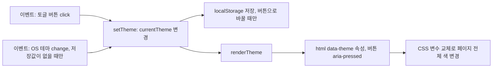
```mermaid
flowchart LR
    E1["이벤트: 토글 버튼 click"] --> S["setTheme: currentTheme 변경"]
    E2["이벤트: OS 테마 change, 저장값이 없을 때만"] --> S
    S --> L["localStorage 저장, 버튼으로 바꿀 때만"]
    S --> R["renderTheme"]
    R --> D["html data-theme 속성, 버튼 aria-pressed"]
    D --> C["CSS 변수 교체로 페이지 전체 색 변경"]
```

```js
// js/theme.js#L39-L53 (발췌)
let currentTheme = readSavedTheme() ?? getSystemTheme();

const renderTheme = () => {
  document.documentElement.setAttribute('data-theme', currentTheme);
  themeToggle.setAttribute('aria-pressed', String(currentTheme === 'dark'));
};

const setTheme = (nextTheme, { save = false } = {}) => {
  currentTheme = nextTheme;
  if (save) saveTheme(nextTheme);
  renderTheme();
};
```

- **상태**: `currentTheme` ([L39](js/theme.js#L39)) — 시작값은 `localStorage` 저장값 → 없으면(`??`) OS 설정.
- **변경**: `setTheme` ([L49](js/theme.js#L49)) — 버튼 클릭([L56](js/theme.js#L56))에서는 `{ save: true }`로 저장까지, OS 설정 변경([L68](js/theme.js#L68))에서는 저장하지 않음(사용자가 직접 고른 값을 덮어쓰지 않기 위해).
- **렌더**: `renderTheme` ([L42](js/theme.js#L42)) — `data-theme` 속성과 `aria-pressed`만 바꾸고, 실제 색은 CSS 변수가 처리.
- 지원 브라우저에서는 View Transitions API로 화면 전체가 부드럽게 전환됩니다([L60-L61](js/theme.js#L60-L61)). `localStorage` 접근은 시크릿 모드 등에서 에러가 날 수 있어 `try/catch`로 감쌌습니다([L19-L34](js/theme.js#L19-L34)).

#### ② GitHub API 상태 — [js/projects.js](js/projects.js)

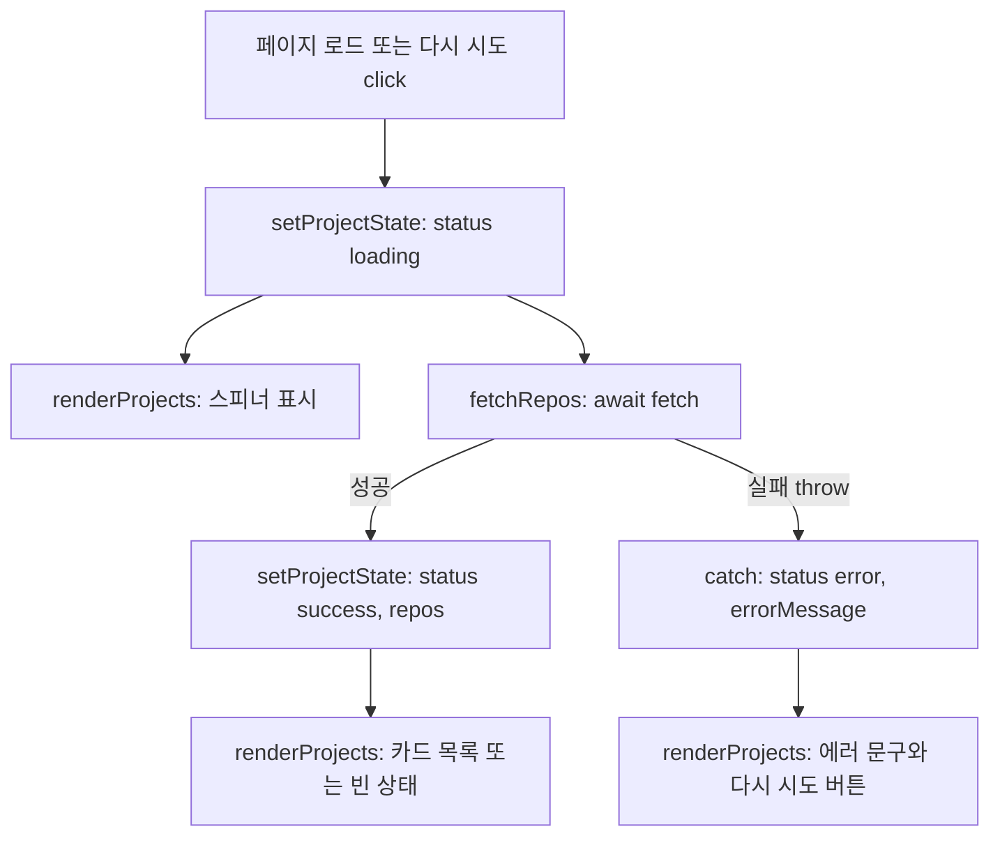
```mermaid
flowchart TD
    A["페이지 로드 또는 다시 시도 click"] --> B["setProjectState: status loading"]
    B --> R1["renderProjects: 스피너 표시"]
    B --> F["fetchRepos: await fetch"]
    F -->|"성공"| S["setProjectState: status success, repos"]
    F -->|"실패 throw"| E["catch: status error, errorMessage"]
    S --> R2["renderProjects: 카드 목록 또는 빈 상태"]
    E --> R3["renderProjects: 에러 문구와 다시 시도 버튼"]
```

```js
// js/projects.js#L251-L265 (발췌)
const loadRepos = async () => {
  setProjectState({ status: 'loading', errorMessage: '' });

  try {
    const data = await fetchRepos();
    const repos = data.filter(({ fork }) => !fork); // 포크한 저장소는 빼고 직접 만든 것만
    projectFilters.innerHTML = createFilterButtons(repos);
    setProjectState({ status: 'success', repos, filter: ALL_FILTER, visibleCount: PAGE_SIZE });
  } catch (error) {
    console.error('[Projects] 저장소를 불러오지 못했습니다.', error);
    setProjectState({ status: 'error', errorMessage: toErrorMessage(error) });
  }
};
```

- **상태**: `projectState` ([L33-L39](js/projects.js#L33-L39)) — `status`(`idle` / `loading` / `success` / `error`), `repos`, `errorMessage`, `filter`, `visibleCount`.
- **변경**: `setProjectState` ([L42-L45](js/projects.js#L42-L45)) — `{ ...projectState, ...changes }`로 기존 상태를 복사하고 바뀐 값만 덮어쓴 뒤 곧바로 `renderProjects()` 호출.
- **렌더**: `renderProjects` ([L174-L201](js/projects.js#L174-L201)) — 상태별로 아래처럼 그립니다.

| `status` | 상태 메시지 영역 | 카드 그리드 | 필터 버튼 | 개수 안내 · 더 보기 |
|---|---|---|---|---|
| `loading` | 스피너 + "프로젝트를 불러오는 중..." | 비움, `aria-busy="true"` | 숨김 | 숨김 |
| `error` | "프로젝트를 불러올 수 없습니다." + 원인 + 다시 시도 | 비움 | 숨김 | 숨김 |
| `success` (0개) | "표시할 프로젝트가 없습니다." | 비움 | 숨김 | 숨김 |
| `success` (1개 이상) | 비움 | 카드 `visibleCount`개 | 표시, 선택 버튼 강조 | "N개 중 M개 표시", 남은 카드가 있으면 "더 보기" |

> 필터 버튼 HTML은 **데이터가 바뀔 때만** 새로 만들고([L259](js/projects.js#L259)), 렌더에서는 선택 표시(`active`, `aria-pressed`)만 바꿉니다([L188-L192](js/projects.js#L188-L192)). 매 렌더마다 버튼을 새로 만들면 방금 누른 버튼이 사라져 키보드 포커스를 잃기 때문입니다.

#### ③ 폼 유효성 검사 — [js/contact.js](js/contact.js)

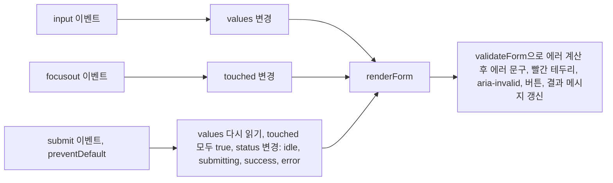
```mermaid
flowchart LR
    I["input 이벤트"] --> V["values 변경"]
    O["focusout 이벤트"] --> T["touched 변경"]
    SU["submit 이벤트, preventDefault"] --> ST["values 다시 읽기, touched 모두 true, status 변경: idle, submitting, success, error"]
    V --> RF["renderForm"]
    T --> RF
    ST --> RF
    RF --> ER["validateForm으로 에러 계산 후 에러 문구, 빨간 테두리, aria-invalid, 버튼, 결과 메시지 갱신"]
```

```js
// js/contact.js#L137-L153 (발췌)
contactForm.addEventListener('input', (event) => {
  const { name, value } = event.target;
  if (!FIELD_NAMES.includes(name)) return;
  setFormState({
    values: { ...formState.values, [name]: value },
    status: formState.status === 'submitting' ? 'submitting' : 'idle',
  });
});

contactForm.addEventListener('focusout', (event) => {
  const { name } = event.target;
  if (!FIELD_NAMES.includes(name) || formState.touched[name]) return;
  setFormState({ touched: { ...formState.touched, [name]: true } });
});
```

- **상태**: `formState` ([L62-L66](js/contact.js#L62-L66)) — `values`(입력값), `touched`(한 번이라도 벗어난 필드), `status`.
- **변경**: `setFormState` ([L68-L71](js/contact.js#L68-L71)) — `input`은 `values`, `focusout`은 `touched`, `submit`은 입력칸에서 `values`를 다시 읽고 `touched`를 모두 `true`로 바꾼 뒤 `status`를 바꿈.
- **렌더**: `renderForm` ([L85-L110](js/contact.js#L85-L110)) — **에러 메시지는 상태로 저장하지 않고** 렌더할 때마다 `validateForm(values)`로 계산합니다(파생 값). 그래서 "값은 고쳤는데 에러는 남아 있는" 불일치가 생길 수 없습니다.
- **언제 에러를 보여 주나**: 입력 도중에 미리 재촉하지 않도록 **칸을 벗어난 뒤(`touched`)** 부터 보여 주고, 에러가 보이던 칸은 **고치는 즉시** 사라집니다. 제출하면 모든 칸의 에러를 한꺼번에 보여 주고 첫 번째 잘못된 칸으로 포커스를 옮깁니다([L160-L169](js/contact.js#L160-L169)).

#### ④ 언어 필터 · 더 보기 — [js/projects.js](js/projects.js)

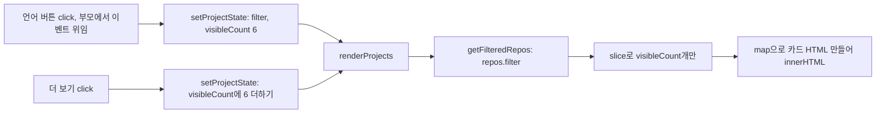
```mermaid
flowchart LR
    F1["언어 버튼 click, 부모에서 이벤트 위임"] --> S1["setProjectState: filter, visibleCount 6"]
    M1["더 보기 click"] --> S2["setProjectState: visibleCount에 6 더하기"]
    S1 --> R["renderProjects"]
    S2 --> R
    R --> G["getFilteredRepos: repos.filter"]
    G --> SL["slice로 visibleCount개만"]
    SL --> MP["map으로 카드 HTML 만들어 innerHTML"]
```

```js
// js/projects.js#L66-L69, L271-L275 (발췌)
const getFilteredRepos = () => {
  const { repos, filter } = projectState;
  return filter === ALL_FILTER ? repos : repos.filter(({ language }) => language === filter);
};

projectFilters.addEventListener('click', (event) => {
  const button = event.target.closest('.filter-btn');
  if (!button) return;
  setProjectState({ filter: button.dataset.filter, visibleCount: PAGE_SIZE });
});
```

- **상태**: `projectState.filter`, `projectState.visibleCount`.
- **변경**: 필터 클릭 → 언어를 바꾸고 보여 줄 개수를 6으로 되돌림([L274](js/projects.js#L274)). 더 보기 클릭 → `visibleCount + PAGE_SIZE`([L288](js/projects.js#L288)).
- **렌더**: 같은 `renderProjects`. 원본 `repos`는 그대로 두고 **그릴 때만** 거르고 자르므로, "전체"로 돌아오면 모든 저장소가 다시 보입니다.
- **이벤트 위임**: 필터 버튼은 JS가 나중에 만들어 넣기 때문에, 항상 존재하는 부모(`.project-filters`)에 리스너를 **한 번만** 달고 `event.target.closest('.filter-btn')`으로 어떤 버튼인지 찾습니다. 다시 시도 버튼도 같은 방식입니다([L277-L278](js/projects.js#L277-L278)).

### 9.5 이벤트 목록

| 이벤트 | 대상 요소 | 하는 일 | 위치 |
|---|---|---|---|
| `click` | `.nav-toggle` (햄버거) | 메뉴 `.active` 토글, `aria-expanded`·라벨 갱신, 열리면 첫 링크로 포커스 | [js/layout.js#L40](js/layout.js#L40) |
| `click` | `document` | 메뉴가 열린 상태에서 헤더 바깥을 누르면 닫기 | [js/layout.js#L62](js/layout.js#L62) |
| `click` | 모든 `a[href^="#"]` | `preventDefault()` → 부드러운 스크롤, 주소창 해시 갱신, 섹션으로 포커스 이동, 메뉴 닫기 | [js/layout.js#L73](js/layout.js#L73) |
| `click` | `.scroll-top` | 맨 위로 스크롤, 포커스를 로고로 | [js/layout.js#L108](js/layout.js#L108) |
| `click` | `.theme-toggle` | 테마 전환 + 저장 | [js/theme.js#L56](js/theme.js#L56) |
| `click` | `.project-filters` (위임 → `.filter-btn`) | 언어 필터 변경 | [js/projects.js#L271](js/projects.js#L271) |
| `click` | `.project-status` (위임 → `.retry-btn`) | 저장소 다시 요청, 끝나면 포커스 복원 | [js/projects.js#L277](js/projects.js#L277) |
| `click` | `.project-more` | 6개 더 보기 | [js/projects.js#L286](js/projects.js#L286) |
| `submit` | `.contact-form` | `preventDefault()` → 전체 검증 → 전송 → 결과 표시 | [js/contact.js#L156](js/contact.js#L156) |
| `scroll` | `window` (`passive: true`) | 60px/300px 기준으로 헤더 `.scrolled`, 스크롤 탑 `.visible` 토글 | [js/layout.js#L102](js/layout.js#L102) |
| `input` | `.contact-form` (위임) | 입력값 상태 갱신 → 에러 · 글자 수 즉시 반영 | [js/contact.js#L137](js/contact.js#L137) |
| `focusout` | `.contact-form` (위임) | 벗어난 필드를 `touched`로 표시 → 그 필드 에러 표시 시작 | [js/contact.js#L148](js/contact.js#L148) |
| `keydown` | `document` | Esc로 열린 메뉴 닫기 + 햄버거 버튼으로 포커스 | [js/layout.js#L54](js/layout.js#L54) |
| `change` | `matchMedia('(min-width: 768px)')` | 메뉴를 연 채 화면이 768px 이상이 되면(가로 회전 등) 메뉴 닫기 | [js/layout.js#L49](js/layout.js#L49) |
| `change` | `matchMedia('(prefers-color-scheme: dark)')` | 저장값이 없을 때 OS 테마 변경을 실시간 반영 | [js/theme.js#L68](js/theme.js#L68) |

> `focusout`을 쓴 이유: `blur`는 버블링되지 않아 폼(부모)에 단 일반 리스너로는 받을 수 없지만(캡처 단계 리스너로는 가능), `focusout`은 버블링되므로 폼 하나에 리스너를 달아 세 필드를 모두 처리할 수 있습니다.
>
> 이벤트는 아니지만 스크롤 위치 감지에는 **IntersectionObserver**도 씁니다: 등장 애니메이션 [js/effects.js#L14](js/effects.js#L14), 현재 섹션 표시 [js/layout.js#L118](js/layout.js#L118). `scroll` 이벤트로 매번 위치를 계산하는 것보다 브라우저가 효율적으로 알려 줍니다.

### 9.6 비동기 & 에러 처리

#### 요청 흐름

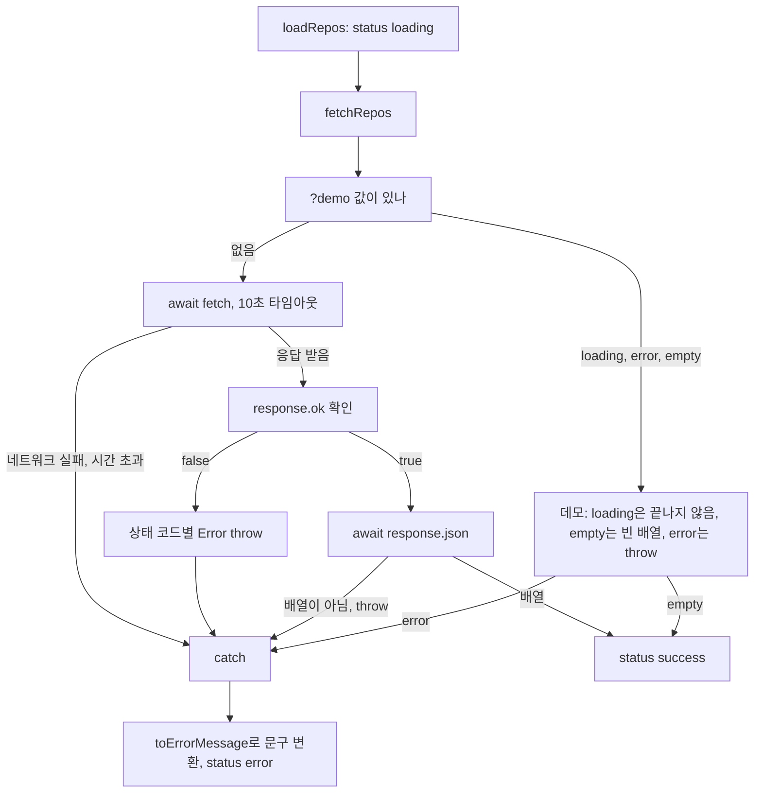
```mermaid
flowchart TD
    A["loadRepos: status loading"] --> B["fetchRepos"]
    B --> D["?demo 값이 있나"]
    D -->|"loading, error, empty"| DM["데모: loading은 끝나지 않음, empty는 빈 배열, error는 throw"]
    D -->|"없음"| F["await fetch, 10초 타임아웃"]
    F -->|"응답 받음"| OK["response.ok 확인"]
    F -->|"네트워크 실패, 시간 초과"| C["catch"]
    OK -->|"false"| H["상태 코드별 Error throw"]
    OK -->|"true"| J["await response.json"]
    H --> C
    J -->|"배열"| S["status success"]
    J -->|"배열이 아님, throw"| C
    DM -->|"empty"| S
    DM -->|"error"| C
    C --> E["toErrorMessage로 문구 변환, status error"]
```

```js
// js/projects.js#L225-L244 (발췌, 일부 생략)
const response = await fetch(REPOS_API_URL, {
  headers: { Accept: 'application/vnd.github+json' },
  signal: AbortSignal.timeout(REQUEST_TIMEOUT),
});

// fetch는 404·403 같은 HTTP 에러에서도 reject되지 않으므로 response.ok를 직접 확인해야 한다
if (!response.ok) {
  if (response.status === 403 || response.status === 429) {
    const isRateLimited = response.headers.get('x-ratelimit-remaining') === '0';
    if (isRateLimited) { /* 재설정 시각을 계산해 한도 초과 안내 */ }
    throw new Error(`GitHub API 요청이 거부되었습니다. (HTTP ${response.status}) 잠시 후 다시 시도해 주세요.`);
  }
  if (response.status === 404) throw new Error(`GitHub 사용자 '${GITHUB_USERNAME}'를 찾을 수 없습니다.`);
  throw new Error(`GitHub 서버에서 오류가 발생했습니다. (HTTP ${response.status})`);
}
```

**핵심 포인트**

- **`async/await`**: `await`는 Promise가 끝날 때까지 **그 함수 안에서만** 기다리고, 그동안 브라우저는 다른 일을 계속합니다. 그래서 요청 중에도 스크롤 · 클릭이 멈추지 않습니다.
- **`response.ok` 확인이 필요한 이유**: `fetch`는 **응답을 받기만 하면**(404, 403, 500이어도) 성공으로 끝납니다. reject되는 것은 응답 자체를 받지 못했을 때(네트워크 연결 실패, CORS 차단, 요청 취소 · 시간 초과)뿐입니다. 그래서 `response.ok`(상태 코드 200~299)를 직접 검사해서 실패면 `throw`합니다.
- **`try/catch`**: `fetchRepos` 안에서 `throw`한 에러와 `fetch` 자체의 실패가 모두 [`loadRepos`의 `catch`](js/projects.js#L261-L264)로 모입니다. 여기서 `console.error`로 개발자용 기록을 남기고, 사용자에게는 [`toErrorMessage`](js/projects.js#L207-L211)로 바꾼 문장을 보여 줍니다.

| 상황 | 감지 방법 | 화면에 보이는 원인 문구 | 위치 |
|---|---|---|---|
| 레이트 리밋 (시간당 60회 초과) | 403 또는 429 **이면서** `x-ratelimit-remaining` 헤더가 `'0'` | "GitHub API 요청 한도(시간당 60회)를 초과했습니다. HH:MM 이후에 다시 시도해 주세요." (`x-ratelimit-reset`으로 재설정 시각 계산) | [L233-L239](js/projects.js#L233-L239) |
| 그 밖의 403 / 429 | 위 헤더가 `'0'`이 아님 | "GitHub API 요청이 거부되었습니다. (HTTP 403) 잠시 후 다시 시도해 주세요." | [L240](js/projects.js#L240) |
| 사용자 없음 | 404 | "GitHub 사용자 'ADOHI'를 찾을 수 없습니다." | [L242](js/projects.js#L242) |
| 서버 오류 등 | 그 외 `!response.ok` | "GitHub 서버에서 오류가 발생했습니다. (HTTP 500)" | [L243](js/projects.js#L243) |
| 시간 초과 (10초) | `AbortSignal.timeout(10000)`이 요청을 취소 → 에러 이름 `TimeoutError` | "서버 응답이 너무 늦습니다. 네트워크 상태를 확인한 뒤 다시 시도해 주세요." | [L208](js/projects.js#L208), [L227](js/projects.js#L227) |
| 네트워크 끊김 · 요청 차단 | `fetch`가 `TypeError`로 reject | "네트워크에 연결할 수 없습니다. 인터넷 연결을 확인해 주세요." | [L209](js/projects.js#L209) |
| 예상과 다른 응답 | `Array.isArray(data)`가 거짓 | "GitHub에서 예상하지 못한 형식의 응답을 받았습니다." | [L247](js/projects.js#L247) |

> **왜 403을 모두 "60회 초과"라고 하지 않나?** 403은 레이트 리밋 말고도 다른 이유로 올 수 있습니다. 처음에는 모든 403/429를 "시간당 60회 초과"로 안내했는데, 리뷰에서 "사실과 다른 안내가 나갈 수 있다"는 지적을 받아 **남은 요청 수 헤더가 `'0'`일 때만** 한도 초과로 판단하도록 고쳤습니다([14장 사례 7](#사례-7-모든-403429를-시간당-60회-초과로-안내)).

- **재시도**: 에러 화면의 "다시 시도" 버튼은 [`loadRepos()`를 다시 실행](js/projects.js#L277-L284)합니다. 로딩 → 결과로 다시 그려지면서 누른 버튼이 사라지므로, 끝난 뒤 포커스를 새 "다시 시도" 버튼이나 첫 필터 버튼으로 돌려줍니다.
- **폼 전송도 같은 패턴**: [`sendMessage`](js/contact.js#L115-L131)는 `AbortSignal.timeout(SEND_TIMEOUT)` + `response.ok` 검사를 하고, [`submit` 핸들러의 `try/catch`](js/contact.js#L173-L180)가 실패 시 "전송에 실패했습니다…" 상태로 바꿉니다.

---

## 10. 상태별 UI 확인 방법

GitHub API는 보통 금방 성공하기 때문에 로딩 · 에러 · 빈 상태를 눈으로 보기 어렵습니다. 그래서 **주소 뒤에 `?demo=` 값을 붙이면** 실제 요청 없이 해당 상태를 재현하도록 만들었습니다([js/projects.js#L22](js/projects.js#L22), [#L213-L223](js/projects.js#L213-L223)). 뒤의 `#projects`는 Projects 섹션으로 바로 이동하기 위한 것입니다.

| 상태 | 링크 | 동작 |
|---|---|---|
| 로딩 | <https://adohi.github.io/Codyssey_1_1/?demo=loading#projects> | 끝나지 않는 Promise를 돌려줘서 스피너가 계속 보임 |
| 에러 | <https://adohi.github.io/Codyssey_1_1/?demo=error#projects> | 800ms 뒤 일부러 에러를 던짐 → 에러 UI + "다시 시도" 버튼 (다시 눌러도 데모라 다시 에러) |
| 빈 상태 | <https://adohi.github.io/Codyssey_1_1/?demo=empty#projects> | 800ms 뒤 빈 배열 `[]` 반환 → "표시할 프로젝트가 없습니다." |
| 정상 | <https://adohi.github.io/Codyssey_1_1/#projects> | 실제 GitHub API 호출 |

### Chrome DevTools로 "진짜" 에러 경로 확인하기

데모 모드는 에러를 흉내 낸 것이므로, 실제 요청이 실패하는 경로는 DevTools로 확인할 수 있습니다. (F12 → **Network** 탭)

1. **요청 차단 → 네트워크 에러**: Network 탭에서 `repos?sort=updated...` 요청을 오른쪽 클릭 → **Block request URL** → 새로고침. 페이지는 뜨지만 API 요청만 막혀 `TypeError`가 발생하고 "네트워크에 연결할 수 없습니다. 인터넷 연결을 확인해 주세요." 에러 UI가 나옵니다. 이어서 차단 목록 패널(Network request blocking)에서 체크를 해제하고 **다시 시도**를 누르면 카드가 정상으로 표시됩니다(재시도 동작 확인).
2. **느린 네트워크 → 실제 로딩 상태**: Network 탭의 스로틀링을 **Slow 3G**(또는 3G)로 바꾸고 새로고침하면 실제 요청 동안 스피너가 오래 보입니다.
3. **오프라인 → 네트워크 에러**: 에러 화면이 떠 있는 상태(1번 방법)에서 스로틀링을 **Offline**으로 바꾸고 차단을 해제한 뒤 "다시 시도"를 누르면 오프라인이라 다시 네트워크 에러가 나옵니다. (Offline 상태에서 새로고침하면 페이지 자체가 안 열리므로, 페이지를 먼저 연 뒤에 Offline으로 바꿉니다.)
4. **레이트 리밋 헤더 보기**: Network 탭에서 `repos` 요청 → **Headers** → Response Headers의 `x-ratelimit-limit`(60), `x-ratelimit-remaining`(남은 횟수), `x-ratelimit-reset`(재설정 시각, 초 단위 Unix 시간)을 확인할 수 있습니다. 남은 횟수가 `0`인 상태에서 요청이 403/429로 거부되면 코드가 한도 초과 문구를 보여 줍니다. (60번째 요청은 `remaining`이 `0`이어도 정상 응답이므로 카드가 그대로 보입니다.)

---

## 11. 동료평가 5분 체크 가이드

최신 Chrome에서 **<https://adohi.github.io/Codyssey_1_1/>** 를 열고 순서대로 따라 해 주세요.

1. **첫 화면 (Hero)** — 인사말 아래의 역할 문구가 한 글자씩 쓰이고 지워지는지(타이핑 효과) 확인합니다. "프로젝트 보기" · "연락하기"를 눌러 **부드럽게** 이동하고 주소창에 `#projects` · `#contact`가 붙는지 확인합니다.
2. **헤더 60px** — F12 → Console에서 아래 네 줄을 **한 줄씩 따로** 실행합니다. (`scroll` 이벤트는 스크롤 직후 다음 프레임에 발생하므로, 같은 줄에서 바로 확인하면 이전 값이 나올 수 있습니다.)
   ```js
   scrollTo(0, 59)
   document.querySelector('.header').classList.contains('scrolled')   // false
   scrollTo(0, 60)
   document.querySelector('.header').classList.contains('scrolled')   // true
   ```
3. **스크롤 탑 300px** — 같은 방법으로 확인하고, 나타난 버튼을 눌러 맨 위로 돌아가는지 봅니다.
   ```js
   scrollTo(0, 299)
   document.querySelector('.scroll-top').classList.contains('visible')  // false
   scrollTo(0, 300)
   document.querySelector('.scroll-top').classList.contains('visible')  // true
   ```
4. **스크롤 애니메이션 (threshold 0.2)** — 천천히 스크롤하면 섹션 제목 · 카드 · 폼이 아래에서 떠오릅니다. Elements 탭에서 `.reveal` 요소에 `revealed` 클래스가 붙는 순간을 볼 수 있습니다. 메뉴에서 지금 보고 있는 섹션이 강조되는지도 확인합니다.
5. **다크 모드 + 유지** — 오른쪽 위 달 아이콘 → 다크 모드(아이콘이 해로 바뀜) → **새로고침(F5)** → 다크 모드 유지. Application 탭 → Local Storage → `https://adohi.github.io` → 키 `theme` 값이 `dark`인지 확인합니다.
6. **시스템 테마 감지 (보너스)** — Local Storage에서 `theme` 키를 삭제하고 새로고침 → DevTools에서 `Ctrl+Shift+P` → `Show Rendering` → Rendering 패널의 **Emulate CSS media feature prefers-color-scheme**를 `dark` / `light`로 바꾸면 페이지가 따라 바뀝니다. (토글 버튼으로 직접 고르면 그 뒤로는 저장값이 우선합니다.)
7. **반응형** — `Ctrl+Shift+M`(기기 모드)로 폭을 바꿔 봅니다.
   - **767px 이하**: 메뉴가 숨고 햄버거(☰) 버튼이 보임, Skills · About · Contact 1열
   - **768px 이상**: 가로 메뉴, Skills 2열, About 2열
   - **1024px 이상**: Skills 4열, Contact 2열
   - **프로젝트 카드**는 브레이크포인트와 상관없이 `auto-fit`으로 열 수가 정해집니다: 폭 약 656px 미만 1열, 그 이상 2열, 약 996px 이상 3열 (카드 최소 300px + 간격 24px + 좌우 여백으로 계산)
8. **햄버거 메뉴** — 모바일 폭(예: 390px)에서 ☰ 클릭 → 메뉴가 펼쳐지고 버튼이 X로 바뀜 → 메뉴 링크 클릭 시 이동 후 자동으로 닫힘. 다시 열고 **Esc** 또는 **메뉴 바깥 클릭**으로도 닫히는지, 연 상태에서 폭을 768px 이상으로 늘리면 초기화되는지 확인합니다.
9. **GitHub 프로젝트 · 필터 · 더 보기** — Projects에 저장소 카드가 보이고 "N개 중 6개 표시"가 나옵니다. 언어 버튼(예: C#)을 누르면 해당 언어만 남고 개수가 바뀝니다. "더 보기"를 누를 때마다 6개씩 늘어나고, 다 보이면 버튼이 사라집니다. Network 탭에서 `api.github.com/users/ADOHI/repos` 요청을 볼 수 있습니다.
10. **상태별 UI** — [`?demo=loading`](https://adohi.github.io/Codyssey_1_1/?demo=loading#projects) · [`?demo=error`](https://adohi.github.io/Codyssey_1_1/?demo=error#projects) · [`?demo=empty`](https://adohi.github.io/Codyssey_1_1/?demo=empty#projects)를 열어 스피너 / "프로젝트를 불러올 수 없습니다." + 다시 시도 / "표시할 프로젝트가 없습니다."를 확인합니다.
11. **폼 에러** — Contact에서 아무것도 입력하지 않고 "메시지 보내기" → 세 칸 모두 빨간 테두리와 에러 문구, 커서가 이름 칸으로 이동, 페이지는 새로고침되지 않음(`preventDefault`). 이메일에 `abc@`를 입력하고 다른 칸을 누르면 "올바른 이메일 형식이 아닙니다. (예: name@example.com)". 이름 1글자 → "이름은 2자 이상…", 메시지 9글자 → "메시지는 10자 이상…". 고치는 즉시 에러가 사라지고 글자 수 카운터(`0 / 1000`)가 바뀝니다.
12. **폼 성공** — 올바르게 입력하고 제출 → 버튼이 "전송 중..."으로 잠시 바뀜 → "메시지가 접수되었습니다! (데모 모드라 실제 메일은 전송되지 않았어요. …)" 성공 메시지와 함께 폼이 비워집니다. (현재 데모 모드 — [15장](#15-formspree-실제-전송-설정-방법))
13. **키보드** — 페이지 맨 위에서 `Tab`을 누르면 "본문으로 건너뛰기" 링크가 나타납니다. 모든 버튼 · 링크를 `Tab`으로 이동할 수 있고 포커스 테두리가 보입니다.
14. **코드 제약** — 저장소를 clone 했다면 아래 세 명령 모두 **아무것도 출력하지 않아야** 합니다.
    ```bash
    git grep -nw var -- js
    git grep -n onclick -- index.html js
    git grep -n "style=" -- index.html js
    ```

---

## 12. 접근성 & 사용자 배려

| 항목 | 내용 | 위치 |
|---|---|---|
| 본문 바로가기 | 첫 `Tab`에 나타나는 "본문으로 건너뛰기" → `main`으로 이동 | [index.html#L44](index.html#L44), [css/style.css#L222-L238](css/style.css#L222-L238) |
| 랜드마크 · 제목 계층 | `header` · `nav[aria-label]` · `main` · `footer`, 섹션마다 `aria-labelledby` | [9.1](#91-시맨틱-html-구조와-설계-기준) |
| `aria-expanded` · `aria-controls` · `aria-label` | 햄버거 버튼이 메뉴(`#nav-menu`)를 제어하고 열림 여부와 "메뉴 열기/닫기" 라벨을 알림 | [index.html#L115](index.html#L115), [js/layout.js#L29-L33](js/layout.js#L29-L33) |
| `aria-pressed` | 테마 토글(다크 모드 켜짐 여부), 필터 버튼(선택 여부) | [js/theme.js#L45](js/theme.js#L45), [js/projects.js#L191](js/projects.js#L191) |
| `aria-current="location"` | 지금 보고 있는 섹션의 메뉴 링크 | [js/layout.js#L125](js/layout.js#L125) |
| `aria-live` · `role="status"` | 프로젝트 상태 · 개수 변화, 폼 전송 결과를 스크린 리더가 읽어 줌. 결과 영역은 `display:none` 대신 여백만 0으로 해서 새 메시지를 놓치지 않게 함 | [index.html#L270](index.html#L270), [#L273](index.html#L273), [#L348](index.html#L348), [css/style.css#L1214-L1216](css/style.css#L1214-L1216) |
| `aria-busy` | 로딩 중인 카드 그리드 | [js/projects.js#L196](js/projects.js#L196) |
| `aria-invalid` · `aria-describedby` | 잘못된 입력칸 표시, 에러 문구 · 글자 수를 입력칸 설명으로 연결 | [index.html#L322](index.html#L322), [js/contact.js#L98](js/contact.js#L98) |
| 스크린 리더 전용 텍스트 | 타이핑 효과 대신 전체 문구, "(새 창)", "스타", "포크" 등 `.sr-only` | [index.html#L132](index.html#L132), [js/projects.js#L115](js/projects.js#L115) |
| 포커스 관리 | 메뉴 열면 첫 링크로 / Esc로 닫으면 햄버거로 / 앵커 이동 후 해당 섹션으로 / 스크롤 탑 후 로고로 / 더 보기로 버튼이 사라지면 새 첫 카드로 / 다시 시도 후 결과 화면의 버튼으로 / 검증 실패 시 첫 잘못된 칸으로 / 전송 후 제출 버튼으로 | [layout.js#L45](js/layout.js#L45), [#L57](js/layout.js#L57), [#L85-L86](js/layout.js#L85-L86), [#L111](js/layout.js#L111), [projects.js#L290](js/projects.js#L290), [#L281-L283](js/projects.js#L281-L283), [contact.js#L167](js/contact.js#L167), [#L183](js/contact.js#L183) |
| 키보드 포커스 표시 | `:focus-visible`에만 포커스 링(마우스 클릭 때는 안 보임), 카드는 카드 전체에 링 | [css/style.css#L178-L181](css/style.css#L178-L181), [#L868-L871](css/style.css#L868-L871) |
| 동작 줄이기 | OS의 "애니메이션 줄이기"가 켜져 있으면 CSS 애니메이션 · 전환을 사실상 끄고, JS 스크롤은 즉시 이동, 타이핑 효과와 View Transition도 멈춤 | [css/style.css#L1438-L1453](css/style.css#L1438-L1453), [js/layout.js#L23](js/layout.js#L23), [js/effects.js#L56](js/effects.js#L56), [js/theme.js#L60](js/theme.js#L60) |
| 명도 대비 | 흐린 글자에 `opacity`를 쓰지 않고 색 토큰으로만 표현(대비 4.5:1 미만이 되는 문제를 고침), 라이트 모드 에러 색 `#b42318`, 입력칸 테두리는 `--color-border-strong` | [css/style.css#L39-L46](css/style.css#L39-L46), [#L1153-L1156](css/style.css#L1153-L1156) |
| 고대비 모드 | Windows 고대비(`forced-colors`)에서 배경색으로 그린 햄버거 줄이 사라지지 않게 `CanvasText` 지정 | [css/style.css#L1459-L1463](css/style.css#L1459-L1463) |
| 터치 영역 | 아이콘 버튼 44×44px, 스크롤 탑 48×48px | [css/style.css#L316-L317](css/style.css#L316-L317), [#L1267-L1268](css/style.css#L1267-L1268) |
| JavaScript 꺼짐 대비 | `<noscript>`로 `noscript.css`를 불러와 숨겨 둔 `.reveal` 요소를 보이게 하고, JS가 필요한 버튼은 숨기고, 메뉴를 한 줄로 펼침. Projects에는 "GitHub에서 저장소 보기" 링크 | [index.html#L27](index.html#L27), [css/noscript.css](css/noscript.css), [index.html#L280-L282](index.html#L280-L282) |
| 고정 헤더 가림 방지 | 앵커 이동 시 헤더 높이만큼 여백(`scroll-padding-top`) | [css/style.css#L134](css/style.css#L134) |

---

## 13. 보안

| 위험 | 대응 | 위치 |
|---|---|---|
| **XSS** — 저장소 이름 · 설명 · 토픽은 외부(GitHub) 데이터이고, 카드는 `innerHTML`로 넣음 | 모든 외부 문자열을 [`escapeHTML`](js/projects.js#L51-L58)로 `& < > " '`를 HTML 엔티티로 바꾼 뒤 넣습니다. 예: 설명에 ``가 있어도 글자로만 보입니다 | [js/projects.js#L114-L144](js/projects.js#L114-L144) |
| **`javascript:` 링크** — 저장소 홈페이지(`homepage`) 값은 저장소 주인이 아무 문자열이나 넣을 수 있음 | [`isSafeUrl`](js/projects.js#L61)로 `http://` · `https://`로 시작할 때만 "Demo" 링크를 만듭니다 | [js/projects.js#L118](js/projects.js#L118) |
| **탭 내빙(tabnabbing)** — `target="_blank"`로 연 페이지가 `window.opener`로 원래 페이지를 조작 | 새 창 링크에 모두 `rel="noopener noreferrer"` | [index.html#L304](index.html#L304), [#L361](index.html#L361), [js/projects.js#L88](js/projects.js#L88), [#L114](js/projects.js#L114), [#L119](js/projects.js#L119) |
| **스팸 봇** | 사람에게 보이지 않는 honeypot 필드 `_gotcha`(Formspree 규칙: 값이 채워진 제출은 무시). `tabindex="-1"`, `aria-hidden`으로 키보드 · 스크린 리더 사용자도 건너뜀 | [index.html#L341-L345](index.html#L341-L345), [css/style.css#L1199-L1201](css/style.css#L1199-L1201) |
| **비밀 값 노출** | GitHub API는 인증 없이 호출하므로 토큰이 코드에 없습니다(정적 사이트의 JS는 누구나 볼 수 있으므로 토큰을 넣으면 안 됨). Formspree 폼 ID는 공개되어도 되는 값입니다 | [js/projects.js#L225-L228](js/projects.js#L225-L228) |

---

## 14. 개발 과정 & 트러블슈팅

### 개발 과정

1. **구현** — 과제 명세의 모든 기능을 순수 HTML/CSS/JS로 구현
2. **브라우저 확인** — 실제 브라우저에서 동작 확인
3. **자동화 리뷰** — 서로 독립된 리뷰어 에이전트 5개가 각자 다른 관점으로 검토
   - ① 명세 준수 ② 코드 스타일 제약(`var` · `onclick` · 인라인 스타일 등) ③ JS 엣지 케이스 ④ CSS · 반응형 · 접근성 ⑤ headless Chrome에서 실제로 실행해 보는 런타임 테스트
   - 그다음 **반박 역할의 판정 에이전트**가 각 지적이 진짜 문제인지 따져, **지적 49건 중 27건을 확정**
4. **수정** — 확정된 27건 모두 수정
5. **재확인** — 고친 뒤 다시 검증
6. **스크린샷 촬영** — headless Chrome (동작 줄이기 에뮬레이션, API는 fixture 사용)
7. **문서 작성** — README, `docs/`

커밋 기록: `feat: 순수 HTML/CSS/JS 반응형 포트폴리오 초기 구현` → `fix: 다관점 리뷰 반영 (hover·접근성·반응형·에러 처리)` → 문서 커밋

### 트러블슈팅 사례

#### 사례 1. 스킬 카드에 마우스를 올려도 아무 변화가 없음

- **문제**: `.skill-card:hover`에 떠오르기 효과를 넣었는데 동작하지 않았습니다.
- **원인**: 처음에는 한 요소에 `class="skill-card reveal"`을 함께 붙였습니다. 명시도가 같으면 **나중에 선언된 규칙이 이기므로**, ① `.reveal`과 `.skill-card`는 명시도가 같고 `.reveal`이 뒤에 선언되어, `.reveal`의 `transition`이 카드의 `transition` 목록을 통째로 덮어썼습니다. ② `.reveal.revealed`와 `.skill-card:hover`도 명시도가 (0,2,0)으로 같은데 `.reveal.revealed`가 더 뒤에 있어서, hover의 `transform` 대신 `.revealed`의 `transform: translateY(0)`이 적용됐습니다.
- **해결**: **책임을 나눴습니다.** `<li class="reveal">`이 등장 애니메이션을, 그 안의 `<article class="skill-card">`가 카드 모양과 hover를 맡습니다. 두 `transform`이 서로 다른 요소에 있으니 충돌하지 않습니다.
- **코드**: [index.html#L193-L196](index.html#L193-L196), [css/style.css#L686-L703](css/style.css#L686-L703)
- **배운 점**: 같은 속성(`transform`, `transition`)을 여러 클래스가 건드리면 충돌한다. 한 요소에는 한 가지 책임만.

#### 사례 2. 프로젝트 카드 hover 떠오르기가 동작하지 않음

- **문제**: 카드가 나타나는 애니메이션은 되는데 hover 시 위로 뜨지 않았습니다.
- **원인**: `animation: fade-up ... both`의 `both`(= `forwards` 포함)는 애니메이션이 끝난 뒤에도 **마지막 키프레임의 `transform`을 계속 붙잡아 둡니다.** 애니메이션 값은 일반 규칙보다 우선하므로 `:hover`의 `transform`이 무시됐습니다.
- **해결**: `animation-fill-mode`를 `backwards`로 바꿨습니다. 시작 전(지연 시간 동안)에는 첫 키프레임을 적용하지만, 끝난 뒤에는 놓아 줍니다.
- **코드**: [css/style.css#L820-L821](css/style.css#L820-L821), [#L835-L840](css/style.css#L835-L840)
- **배운 점**: `animation-fill-mode`가 애니메이션 이후 상태에 영향을 준다.

#### 사례 3. 모바일 메뉴의 안쪽 여백이 0

- **문제**: `.nav__menu`에 `padding`을 줬는데 모바일 메뉴가 화면 가장자리에 붙어 있었습니다.
- **원인**: 리셋 규칙 `ul[class] { padding: 0 }`의 명시도는 (0,1,1)(속성 선택자 1 + 태그 1)로, `.nav__menu`의 (0,1,0)보다 높아서 이겼습니다.
- **해결**: 리셋을 `:where(ul[class])`로 감쌌습니다. `:where()` 안의 선택자는 **명시도가 0**이 되므로 어떤 클래스 규칙이든 리셋을 덮어쓸 수 있습니다.
- **코드**: [css/style.css#L160-L164](css/style.css#L160-L164)
- **배운 점**: 리셋 · 기본값 규칙은 명시도를 낮게 유지해야 한다.

#### 사례 4. 키보드로 메뉴를 열면 Tab이 메뉴 링크를 건너뜀

- **문제**: 햄버거를 Enter로 열고 Tab을 누르면 메뉴가 아니라 다음 영역으로 넘어갔습니다.
- **원인 ①**: HTML에서 메뉴(`nav`)가 햄버거 버튼보다 **앞에** 있어서, 버튼 다음 Tab 순서에 메뉴가 없습니다.
- **해결 ①**: 메뉴를 열면 첫 링크로 포커스를 옮겼습니다.
- **원인 ②**: 그런데 `focus()`가 조용히 실패했습니다. 메뉴의 `visibility`가 `hidden → visible`로 **전환(transition) 중**이라, 여는 순간(t=0)에는 아직 `hidden`이었고, 숨겨진 요소는 포커스를 받을 수 없습니다.
- **해결 ②**: 열 때는 `visibility`를 **즉시**(`0s`) 바꾸고, 닫을 때만 흐려지는 효과가 끝난 뒤(`0.2s` 지연) `hidden`으로 바꿉니다.
- **코드**: [js/layout.js#L44-L45](js/layout.js#L44-L45), [css/style.css#L401-L405](css/style.css#L401-L405), [#L412-L416](css/style.css#L412-L416)
- **배운 점**: 눈에 보이는 순서와 DOM(Tab) 순서는 다를 수 있다. CSS 전환이 JS 동작 타이밍에 영향을 준다.

#### 사례 5. 태블릿 폭에서 스크롤 탑 버튼이 푸터 이메일 링크를 가림

- **문제**: 768px ~ 약 1230px 폭에서 오른쪽 아래에 고정된 스크롤 탑 버튼이 푸터의 이메일 아이콘 링크 위에 겹쳤습니다.
- **원인**: 고정(`position: fixed`) 요소는 다른 요소의 배치에 영향을 주지 않아서, 페이지 맨 아래에서 푸터와 겹칩니다.
- **해결**: 768px 이상에서 푸터 아래 여백을 `기본 여백 + 버튼 크기(48px) + 간격`만큼 늘렸습니다.
- **코드**: [css/style.css#L1393-L1396](css/style.css#L1393-L1396)
- **배운 점**: 고정 요소를 만들면 "페이지 맨 끝에서 무엇을 가리는지"도 확인해야 한다.

#### 사례 6. 흐린 글자의 명도 대비 부족

- **문제**: 입력칸 안내 문구(placeholder), 필터 개수, "설명이 등록되지 않은 저장소입니다." 등이 너무 흐려 읽기 어려웠습니다.
- **원인**: 이미 흐린 색(`--color-text-muted`)에 `opacity`를 한 번 더 걸어 대비가 **4.5:1** 아래로 떨어졌습니다.
- **해결**: `opacity`를 없애고 색 토큰만 사용했습니다. 라이트 모드 에러 색을 더 진한 `#b42318`로, 입력칸 테두리는 더 진한 `--color-border-strong` 토큰으로 바꿨습니다.
- **코드**: [css/style.css#L41](css/style.css#L41), [#L46](css/style.css#L46), [#L1143-L1156](css/style.css#L1143-L1156)
- **배운 점**: 흐리게 만들 때는 `opacity` 대신 대비를 계산한 색을 쓰자.

#### 사례 7. 모든 403/429를 "시간당 60회 초과"로 안내

- **문제**: 403 또는 429 응답이면 무조건 "요청 한도(시간당 60회)를 초과했습니다"라고 안내했습니다.
- **원인**: 403은 레이트 리밋 외의 이유로도 올 수 있는데, 상태 코드만 보고 판단했습니다.
- **해결**: 응답 헤더 `x-ratelimit-remaining`이 `'0'`일 때만 한도 초과로 안내하고(재설정 시각 포함), 나머지는 "요청이 거부되었습니다 (HTTP 403)"로 구분했습니다.
- **코드**: [js/projects.js#L233-L241](js/projects.js#L233-L241)
- **배운 점**: 에러 메시지도 "사실"이어야 한다. 서버가 주는 헤더로 원인을 확인하자.

#### 사례 8. 다시 그려지거나 비활성화된 버튼에서 키보드 포커스가 사라짐

- **문제**: "다시 시도"를 누르면, 그리고 폼 제출 버튼이 "전송 중..." 동안 비활성화되면 키보드 포커스가 페이지 맨 처음(`body`)으로 날아갔습니다.
- **원인**: 포커스를 가진 요소가 `innerHTML`로 **삭제**되거나 `disabled`가 되면 포커스를 잃습니다.
- **해결**: 비동기 작업이 **끝난 뒤** 포커스가 `body`로 가 있으면 알맞은 버튼으로 되돌립니다. 전송 중에는 입력칸을 `readOnly`로 잠가, 전송 중 고친 내용이 초기화로 사라지지 않게 했습니다.
- **코드**: [js/projects.js#L277-L284](js/projects.js#L277-L284), [js/contact.js#L99](js/contact.js#L99), [#L182-L183](js/contact.js#L182-L183)
- **배운 점**: 화면을 다시 그리는 코드는 "포커스가 어디로 가는지"까지 책임져야 한다.

#### 사례 9. 메뉴를 연 채로 화면을 돌리면 메뉴가 열린 상태로 남음

- **문제**: 휴대폰 세로 화면에서 메뉴를 연 뒤 가로로 돌려 768px 이상이 되면, `.active` 상태가 남아 있어 다시 세로로 돌렸을 때 메뉴가 열려 있었습니다.
- **원인**: CSS 미디어 쿼리는 모양만 바꾸고, JS가 붙인 클래스(상태)는 그대로 남습니다.
- **해결**: `matchMedia('(min-width: 768px)')`의 `change` 이벤트로 768px 이상이 되는 순간 메뉴를 닫습니다.
- **코드**: [js/layout.js#L48-L51](js/layout.js#L48-L51)
- **배운 점**: 화면 크기가 바뀌어도 JS 상태는 자동으로 초기화되지 않는다.

---

## 15. Formspree 실제 전송 설정 방법

### 현재 상태: **데모 모드**

문의 폼의 `action`이 아직 자리표시자 `https://formspree.io/f/YOUR_FORM_ID`입니다([index.html#L317](index.html#L317)). 이번 제출 버전은 외부 서비스 계정 없이 **데모 모드로 제출하기로 결정**했기 때문입니다. 이때 [`isFormspreeReady`](js/contact.js#L27)가 `false`가 되어:

- 제출하면 **800ms 동안 "전송 중..."** 을 보여 준 뒤,
- "메시지가 접수되었습니다! (**데모 모드라 실제 메일은 전송되지 않았어요.** 급한 연락은 이메일로 부탁드립니다.)"라고 **사실대로** 안내합니다([js/contact.js#L76-L78](js/contact.js#L76-L78), [#L116-L121](js/contact.js#L116-L121)).

실제 전송 코드는 이미 구현되어 있어서, **`action` 주소만 바꾸면** 바로 동작합니다.

```js
// js/contact.js#L123-L130 — 폼 ID가 설정되면 실행되는 실제 전송 경로
const response = await fetch(contactForm.action, {
  method: 'POST',
  body: formData,
  headers: { Accept: 'application/json' }, // JSON으로 응답받아 페이지 이동 없이 결과만 확인
  signal: AbortSignal.timeout(SEND_TIMEOUT),
});
if (!response.ok) throw new Error(`Formspree 응답 오류 (HTTP ${response.status})`);
```

### 설정 순서

1. <https://formspree.io>에 가입합니다.
2. 대시보드에서 **New Form**을 만들고, 메시지를 받을 이메일을 지정합니다.
3. 생성된 **폼 엔드포인트**(`https://formspree.io/f/xxxxxxxx` 형태)를 복사합니다.
4. `index.html`의 [form `action`](index.html#L317)에서 `https://formspree.io/f/YOUR_FORM_ID`를 복사한 주소로 바꿉니다. (Formspree 주소는 이 한 곳에서만 관리합니다. JS는 `contactForm.action`을 읽습니다.)
5. 커밋하고 `main` 브랜치에 push합니다 → GitHub Pages가 자동으로 다시 배포합니다.
6. 배포된 사이트에서 **처음 한 번 제출**하면 Formspree가 확인 메일을 보냅니다. 메일에서 **이메일 인증(confirm)** 을 해야 이후 메시지가 전달됩니다.
7. 이후에는 성공 문구가 "메시지가 전송되었습니다. 확인 후 답장드릴게요. 감사합니다!"로 바뀝니다([js/contact.js#L76-L77](js/contact.js#L76-L77)).

> JavaScript가 꺼진 환경에서는 폼이 `action` 주소로 일반 전송(`method="POST"`)됩니다. honeypot 필드 `_gotcha`는 Formspree가 스팸 판별에 사용합니다.

---

## 16. 알려진 한계 & 개선 아이디어

| 한계 | 설명 | 개선 아이디어 |
|---|---|---|
| **인증 없는 API 요청 한도** | 방문자 IP당 시간당 60회. 새로고침을 많이 하면 에러 UI가 나옴 | 정적 사이트에는 토큰을 넣을 수 없으므로, 필요하면 서버리스 함수로 프록시 + 캐시 |
| **응답 캐싱 없음** | 페이지를 열 때마다 API를 새로 호출 | `sessionStorage`에 응답과 시각을 저장해 몇 분간 재사용, 또는 `ETag` 조건부 요청 검토 |
| **최대 100개 저장소** | `per_page=100` 한 번만 요청하고 다음 페이지는 요청하지 않음 (현재 저장소 수로는 충분) | `Link` 헤더를 따라가는 페이지네이션 |
| **테마 깜빡임 가능성** | 과제 요구로 모든 스크립트가 `defer`이고 CSS 기본값이 라이트라서, 최종 테마가 다크인 방문자(저장값이 다크이거나 OS가 다크)는 이론상 `theme.js` 실행 전 잠깐 라이트 화면을 볼 수 있음 (측정해 보니 일반적인 로드에서는 첫 화면이 그려지기 전에 테마가 적용됨) | CSS에 `prefers-color-scheme` 대체 규칙 추가, 또는 `<head>`에 테마만 먼저 적용하는 아주 작은 스크립트 추가 (다만 과제의 `defer` 규칙과 절충 필요) |
| **`localStorage` 키 공유** | GitHub Pages 프로젝트 사이트는 모두 같은 출처(`https://adohi.github.io`)라, 같은 출처의 다른 페이지가 `theme` 키를 쓰면 설정이 서로 영향을 줄 수 있음 | 키 이름에 프로젝트 접두사 붙이기 (예: `codyssey-portfolio-theme`) |
| **Formspree 미설정** | 폼 ID가 없어 현재 데모 모드 | [15장](#15-formspree-실제-전송-설정-방법) 절차로 폼 ID 설정 |
| **최소한의 noscript 대체** | JS가 없으면 프로젝트 카드 대신 GitHub 링크만 보이고, 테마 전환 · 필터를 쓸 수 없음. 폼은 `action` 주소로 일반 전송되지만 지금은 자리표시자라 실제로 전달되지 않음 | 폼 ID 설정 후 no-JS 전송 확인 |
| **언어 색상 목록** | 언어 점 색은 14개 언어만 지정되어 있고, 나머지는 회색 | 필요한 언어 색 추가 |
| **타이핑 효과 반복** | 타이핑 루프는 화면 밖에 있어도 계속 돎 (동작 줄이기 설정 시에만 멈춤) | IntersectionObserver로 Hero가 보일 때만 실행 |
| **자동화 테스트 코드 없음** | 리뷰 단계에서 브라우저 테스트를 했지만, 저장소에 테스트 코드는 포함되어 있지 않음 | 검증 로직(`validateForm`, `escapeHTML`, `isSafeUrl`)부터 간단한 테스트 추가 |

---

## 17. 관련 문서

| 문서 | 내용 |
|---|---|
| [docs/QNA.md](docs/QNA.md) | **예상 질문 & 답변** — 동료평가에서 나올 만한 질문(왜 이렇게 만들었는지, 코드가 어떻게 동작하는지)과 답변 |
| [docs/CONCEPTS.md](docs/CONCEPTS.md) | **개념 정리** — 시맨틱 HTML, Flexbox · Grid, DOM 이벤트, ES6+ 문법, fetch · async/await, 상태 → 렌더링 흐름 등 이 프로젝트에 쓰인 개념 |

---

## 18. 참고 자료 & 출처

**아이콘 · 폰트 (사용한 외부 리소스)**
- [Feather Icons](https://feathericons.com/) — MIT License
- [Lucide](https://lucide.dev/) — ISC License
- [Google Fonts — Noto Sans KR](https://fonts.google.com/specimen/Noto+Sans+KR), [JetBrains Mono](https://fonts.google.com/specimen/JetBrains+Mono)
- 언어 색상: [GitHub Linguist `languages.yml`](https://github.com/github-linguist/linguist/blob/main/lib/linguist/languages.yml)

**API · 서비스**
- [GitHub REST API — List repositories for a user](https://docs.github.com/en/rest/repos/repos#list-repositories-for-a-user)
- [GitHub REST API — Rate limits](https://docs.github.com/en/rest/using-the-rest-api/rate-limits-for-the-rest-api)
- [GitHub Pages 문서](https://docs.github.com/en/pages)
- [Formspree](https://formspree.io/) · [Formspree Help](https://help.formspree.io/)

**웹 표준 (MDN)**
- [HTML 요소 참고서](https://developer.mozilla.org/ko/docs/Web/HTML/Element) · [`<script defer>`](https://developer.mozilla.org/en-US/docs/Web/HTML/Element/script#defer) · [`<address>`](https://developer.mozilla.org/en-US/docs/Web/HTML/Element/address)
- [CSS Flexible Box Layout](https://developer.mozilla.org/en-US/docs/Web/CSS/CSS_flexible_box_layout) · [CSS Grid Layout](https://developer.mozilla.org/en-US/docs/Web/CSS/CSS_grid_layout) · [`:where()`](https://developer.mozilla.org/en-US/docs/Web/CSS/:where) · [`animation-fill-mode`](https://developer.mozilla.org/en-US/docs/Web/CSS/animation-fill-mode)
- [`prefers-color-scheme`](https://developer.mozilla.org/en-US/docs/Web/CSS/@media/prefers-color-scheme) · [`prefers-reduced-motion`](https://developer.mozilla.org/en-US/docs/Web/CSS/@media/prefers-reduced-motion)
- [Using the Fetch API](https://developer.mozilla.org/en-US/docs/Web/API/Fetch_API/Using_Fetch) · [`AbortSignal.timeout()`](https://developer.mozilla.org/en-US/docs/Web/API/AbortSignal/timeout_static) · [Intersection Observer API](https://developer.mozilla.org/en-US/docs/Web/API/Intersection_Observer_API) · [`localStorage`](https://developer.mozilla.org/en-US/docs/Web/API/Window/localStorage) · [View Transition API](https://developer.mozilla.org/en-US/docs/Web/API/View_Transition_API)
- [ARIA](https://developer.mozilla.org/en-US/docs/Web/Accessibility/ARIA)

**접근성 · 도구**
- [WCAG 2.1 — Contrast (Minimum)](https://www.w3.org/WAI/WCAG21/Understanding/contrast-minimum.html)
- [Chrome DevTools — Network](https://developer.chrome.com/docs/devtools/network)
- [Live Server (VS Code 확장)](https://marketplace.visualstudio.com/items?itemName=ritwickdey.LiveServer)
- [shields.io](https://shields.io/) — README 배지

---

<sub>© ADOHI · 연락: [adohi0824@gmail.com](mailto:adohi0824@gmail.com) · [github.com/ADOHI](https://github.com/ADOHI)</sub>
