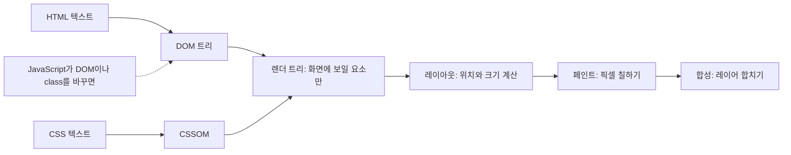
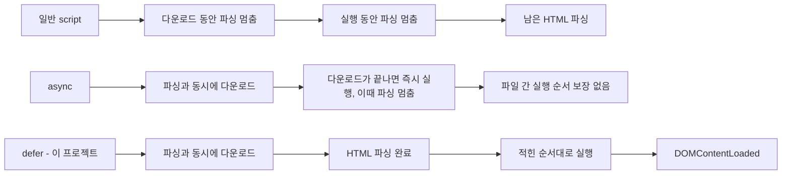
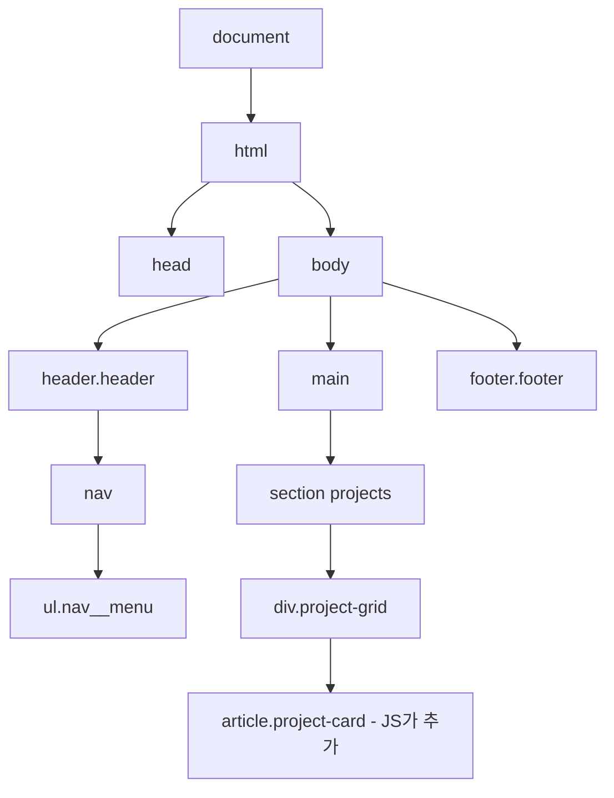
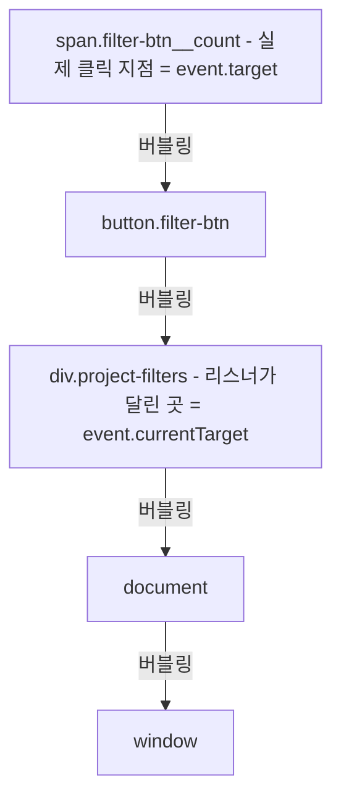
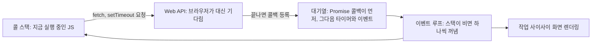
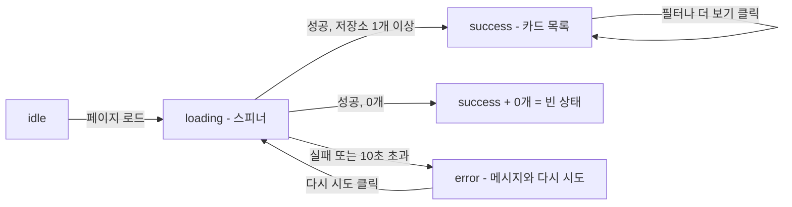
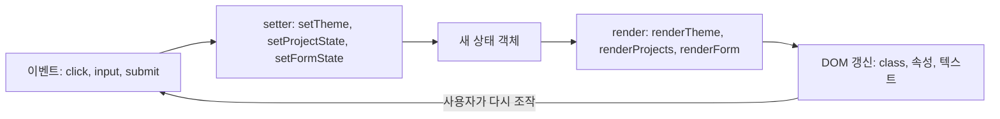
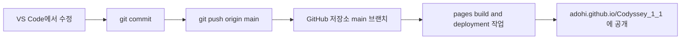

# 웹 개발 기초 개념 정리

> 이 포트폴리오를 만들면서 쓴 웹 개념을 **처음부터** 정리한 학습 노트입니다.
> C#·Unity·Python은 조금 다뤄 봤지만 웹은 처음인 사람을 기준으로 썼습니다.
>
> 각 개념은 다음 순서로 설명합니다.
> **한 줄 정의 → 왜 필요한가 → 작은 예제 → 이 프로젝트에서는 → 자주 하는 실수**
>
> - 프로젝트 소개·실행 방법·스크린샷: [README](../README.md)
> - 동료평가 예상 질문과 답변: [QNA.md](./QNA.md)
> - 코드 링크의 줄 번호(`#L숫자`)는 이 문서를 쓴 시점 기준입니다. 코드가 바뀌어 줄이 밀리면 함께 적어 둔 **함수·변수 이름**으로 찾아 주세요.
> - 코드 링크가 붙지 않은 코드 블록은 개념 설명용 예제입니다. 실제 프로젝트 코드는 항상 링크로 가리킵니다.

**읽는 순서 추천**: 처음에는 0장 → 9장을 차례로 읽고, 동료평가 직전에는 [15장 스스로 점검](#15-스스로-점검)으로 복습하세요.

---

## 목차

- [0. 웹은 어떻게 동작하나](#0-웹은-어떻게-동작하나) — URL, HTTP, 정적 호스팅, 렌더링 과정, defer/async
- [1. HTML](#1-html) — 요소·속성, 문서 구조, 시맨틱 태그, 링크, 이미지, 폼, aria
- [2. CSS](#2-css) — 선택자, 명시도, 상속, 박스 모델, 단위, 변수, Flexbox, Grid, 반응형, position, transition/animation, 상태 선택자, 사용자 설정 미디어 쿼리
- [3. JavaScript 기초](#3-javascript-기초) — const/let, 자료형, 함수, 객체/배열, 스코프, 조건·반복, 예외
- [4. DOM](#4-dom) — DOM 트리, 선택, 읽기·쓰기, classList, hidden, 포커스
- [5. 이벤트](#5-이벤트) — addEventListener, 이벤트 객체, 버블링, 위임, preventDefault, passive
- [6. ES6+ 문법](#6-es6-문법) — 템플릿 리터럴, 구조분해, 스프레드, `?.`, `??`, 배열 메서드
- [7. 비동기](#7-비동기) — 이벤트 루프, Promise, async/await, fetch, HTTP, CORS, 레이트 리밋, 타임아웃, 상태 UI
- [8. 브라우저 API](#8-브라우저-api) — localStorage, matchMedia, IntersectionObserver, History, View Transitions
- [9. 상태와 렌더링](#9-상태와-렌더링) — 단방향 흐름, 파생 상태, 불변 업데이트, React 비교
- [10. 접근성 기초 (a11y)](#10-접근성-기초-a11y) — 키보드, 포커스, 스크린 리더, 명암비, 동작 줄이기
- [11. 보안 기초](#11-보안-기초) — XSS, 안전한 URL, noopener
- [12. 개발 도구](#12-개발-도구) — Chrome DevTools, VS Code + Live Server
- [13. Git과 GitHub Pages](#13-git과-github-pages) — commit/push, 배포 흐름, .nojekyll
- [14. 용어집](#14-용어집)
- [15. 스스로 점검](#15-스스로-점검)

---

## 0. 웹은 어떻게 동작하나

### 0-1. URL

- **한 줄 정의**: 인터넷에 있는 자원(파일, 데이터)의 주소.
- **왜 필요한가**: 브라우저는 URL을 보고 "어느 서버에, 무엇을" 달라고 할지 정합니다.

이 사이트의 주소를 뜯어 보면 이렇습니다.

```text
https://adohi.github.io/Codyssey_1_1/?demo=error#projects
```

| 부분 | 값 | 뜻 |
| --- | --- | --- |
| scheme | `https` | 통신 규칙. 암호화된 HTTP |
| host | `adohi.github.io` | 서버 이름. DNS가 IP 주소로 바꿔 준다 |
| path | `/Codyssey_1_1/` | 서버 안의 위치. `/`로 끝나면 보통 그 폴더의 `index.html` |
| query | `?demo=error` | 페이지에 넘기는 옵션. `key=value`를 `&`로 잇는다 |
| fragment | `#projects` | 페이지 **안의** 위치. 서버로는 전송되지 않는다 |

**이 프로젝트에서는**
- query: `demoMode` 변수가 `?demo=` 값을 읽어 로딩/에러/빈 상태를 재현합니다 — [js/projects.js#L22](../js/projects.js#L22)
- fragment: 메뉴 링크 `href="#about"`이 `id="about"` 섹션으로 이동합니다 — [index.html#L102-L106](../index.html#L102-L106)

**자주 하는 실수**
- 경로를 `/css/style.css`처럼 `/`로 시작하면 "서버 루트 기준"이 됩니다. GitHub Pages 프로젝트 사이트는 `/Codyssey_1_1/` 아래에 있으므로 `adohi.github.io/css/style.css`를 찾다가 404가 납니다. 이 프로젝트는 상대 경로 `css/style.css`를 씁니다 — [index.html#L25](../index.html#L25)
- `#fragment`는 서버로 가지 않으므로 서버가 이 값을 보고 다른 페이지를 줄 수 없습니다.

### 0-2. HTTP 요청과 응답

- **한 줄 정의**: 브라우저(클라이언트)가 서버에 **요청**을 보내고 서버가 **응답**을 돌려주는 약속(프로토콜).
- **왜 필요한가**: 웹의 모든 파일과 데이터는 이 요청/응답으로 오갑니다. 식당에 비유하면 요청은 주문서, 응답은 나온 음식입니다.

```http
GET /Codyssey_1_1/css/style.css HTTP/1.1
Host: adohi.github.io

HTTP/1.1 200 OK
Content-Type: text/css

:root { --color-bg: #ffffff; ... }
```

페이지 하나를 여는 것은 요청 한 번이 아닙니다. `index.html`을 받은 뒤 그 안에 적힌 CSS(`style.css`와 Google Fonts 스타일시트), JS 6개, 폰트 파일, SVG 이미지(프로필, 파비콘)를 **각각** 요청하고(`noscript.css`는 JS가 꺼져 있을 때만 요청됩니다), 마지막으로 JS가 GitHub API에 또 요청을 보냅니다. Chrome DevTools의 Network 탭에서 전부 볼 수 있습니다([12장](#12-개발-도구)). 메서드·상태 코드·헤더는 [7장](#7-비동기)에서 자세히 다룹니다.

### 0-3. 정적 호스팅과 GitHub Pages

- **한 줄 정의**: 서버가 파일을 **있는 그대로** 돌려주기만 하는 호스팅. 서버에서 실행되는 코드가 없습니다.
- **왜 필요한가**: HTML/CSS/JS만으로 된 사이트는 서버 프로그램이 필요 없으므로, 무료이고 간단한 정적 호스팅으로 충분합니다. Unity WebGL 빌드 폴더를 itch.io에 올리는 것과 같은 개념입니다.

| | 정적 호스팅 (이 프로젝트) | 동적 서버 |
| --- | --- | --- |
| 서버가 하는 일 | 파일 전달만 | 요청마다 코드 실행, DB 조회 후 HTML 생성 |
| 예 | GitHub Pages, Netlify | Node.js, Spring, Django 서버 |
| 비밀 값 보관 | 불가능 (모든 파일이 공개) | 가능 |

**이 프로젝트에서는** 서버가 없다는 사실이 설계를 결정했습니다.
- GitHub API 요청은 **방문자의 브라우저**에서 나갑니다. 그래서 레이트 리밋(시간당 60회)이 방문자 IP마다 따로 적용됩니다 — [js/projects.js#L17](../js/projects.js#L17) `REPOS_API_URL`
- 메일을 보낼 서버가 없으므로 문의 폼은 외부 서비스(Formspree)를 씁니다 — [index.html#L317](../index.html#L317)
- 코드가 전부 공개되므로 API 토큰 같은 비밀 값을 넣을 수 없습니다([11장](#11-보안-기초)).

### 0-4. 브라우저 렌더링 과정

- **한 줄 정의**: 브라우저가 HTML/CSS 텍스트를 화면의 픽셀로 바꾸는 단계.
- **왜 필요한가**: 어떤 CSS 변경이 "싸고" 어떤 변경이 "비싼지", `display: none`인 요소가 왜 공간을 차지하지 않는지 이해할 수 있습니다.



1. **HTML 파싱 → DOM**: 태그를 읽어 객체 트리를 만듭니다. Unity의 Hierarchy 창과 비슷합니다.
2. **CSS 파싱 → CSSOM**: 스타일 규칙도 트리로 만듭니다.
3. **렌더 트리**: DOM과 CSSOM을 합쳐 "실제로 그릴 것"만 남깁니다. `display: none`은 여기서 빠집니다.
4. **레이아웃(리플로우)**: 각 박스의 위치와 크기를 계산합니다.
5. **페인트 → 합성**: 색을 칠하고 레이어를 겹칩니다.

**이 프로젝트에서는**
- 움직임은 거의 `transform`과 `opacity`로만 만듭니다. 이 둘은 레이아웃을 다시 계산하지 않고 합성 단계에서 처리되어 가볍습니다 — `.reveal` [css/style.css#L1301-L1310](../css/style.css#L1301-L1310), `.btn:hover` [css/style.css#L274-L277](../css/style.css#L274-L277)
- `[hidden]`을 `display: none`으로 강제해 렌더 트리에서 빼 버립니다 — [css/style.css#L189-L191](../css/style.css#L189-L191)

**자주 하는 실수**
- `width`, `top`, `margin`을 애니메이션하면 매 프레임 레이아웃을 다시 계산해 버벅일 수 있습니다. 움직임은 `transform`으로 표현하세요.

### 0-5. 스크립트가 파싱을 막는 이유와 defer/async

- **한 줄 정의**: `defer`와 `async`는 `<script>`를 **언제 내려받고 언제 실행할지** 정하는 속성입니다.
- **왜 필요한가**: JS는 지금 읽고 있는 문서를 바꿀 수 있습니다. 그래서 브라우저는 속성 없는 `<script>`를 만나면 **파싱을 멈추고** 다운로드·실행이 끝날 때까지 기다립니다. `<head>`에 그냥 넣으면 ① 화면이 늦게 뜨고 ② 아직 `<body>`의 요소가 만들어지지 않았으므로 `querySelector`가 `null`을 돌려줍니다.



| | 일반 `<script>` | `async` | `defer` |
| --- | --- | --- | --- |
| 다운로드 중 HTML 파싱 | 멈춤 | 계속 | 계속 |
| 실행 시점 | 만나는 즉시 | 다운로드가 끝나는 즉시 | HTML 파싱이 모두 끝난 뒤 |
| 여러 파일의 실행 순서 | 적힌 순서 | **보장 안 됨** | 적힌 순서 |
| 실행 시 DOM 전체 사용 가능 | 위쪽 요소만 | 알 수 없음 | 가능 |
| 어울리는 용도 | (거의 안 씀) | 광고·분석처럼 독립적인 스크립트 | 페이지 기능 스크립트 |

**이 프로젝트에서는** 6개 스크립트를 모두 `defer`로 `<head>`에 넣었습니다 — [index.html#L35-L40](../index.html#L35-L40). 다른 파일이 `utils.js`의 `sleep`, `prefersReducedMotion`을 쓰므로 `utils.js`를 맨 앞에 둡니다(주석 [index.html#L29-L34](../index.html#L29-L34)). `defer` 덕분에 `DOMContentLoaded`를 기다리는 코드가 따로 없습니다.

**자주 하는 실수**
- 서로 의존하는 스크립트에 `async`를 붙이면 실행 순서가 매번 달라져 가끔만 에러가 나는, 찾기 어려운 버그가 생깁니다.
- `type="module"` 스크립트는 기본이 `defer`처럼 동작합니다(이 프로젝트는 과제 요구대로 일반 스크립트 + `defer`).
- 알려진 한계: `theme.js`도 `defer`라서, 이론상 "저장된 테마가 OS 테마와 다른 방문자"는 `theme.js`가 실행되기 전 아주 잠깐 반대 테마를 볼 수 있습니다. 측정해 보니 일반적인 로드에서는 첫 페인트 전에 테마가 적용되었습니다.

---

## 1. HTML

### 1-1. 요소·속성·중첩

- **한 줄 정의**: `<태그>내용</태그>`가 **요소**, 태그 안의 `이름="값"`이 **속성**, 요소 안에 요소를 넣는 것이 **중첩**입니다.
- **왜 필요한가**: 중첩이 곧 트리 구조가 되고, 이 트리가 DOM이 됩니다. Unity로 치면 요소는 GameObject, 속성은 Inspector의 필드, 중첩은 부모-자식 관계입니다.

```html
<button type="button" class="icon-btn" aria-label="메뉴 열기">
  <span class="nav-toggle__bar"></span>
</button>
  <!-- 내용이 없는 빈 요소: 닫는 태그 없음 -->
```

**이 프로젝트에서는** 햄버거 버튼 하나에 `type`, `class`, `aria-label`, `aria-expanded`, `aria-controls` 5개 속성이 붙어 있고, 안에 막대 3개가 중첩되어 있습니다 — [index.html#L115-L119](../index.html#L115-L119)

**자주 하는 실수**
- 잘못된 중첩(`<p>` 안에 `<div>`)은 브라우저가 멋대로 고쳐서 예상과 다른 DOM이 됩니다.
- 같은 `id`를 두 번 쓰면 앵커 링크, `label for`, `querySelector('#id')`가 첫 번째 것만 찾습니다.

### 1-2. 문서 기본 구조

- **한 줄 정의**: 모든 HTML 문서가 갖는 뼈대 — `<!DOCTYPE html>`, `<html>`, `<head>`(정보), `<body>`(내용).
- **왜 필요한가**: `DOCTYPE`이 없으면 옛날 방식(쿼크 모드)으로 렌더링되고, `viewport` 메타가 없으면 휴대폰이 페이지를 약 980px 폭 PC 화면처럼 그린 뒤 축소해 버려 **반응형 CSS가 동작하지 않습니다**.

```html
<!DOCTYPE html>
<html lang="ko">
<head>
  <meta charset="UTF-8">
  <meta name="viewport" content="width=device-width, initial-scale=1.0">
  <title>페이지 제목</title>
  <link rel="stylesheet" href="css/style.css">
</head>
<body>
  보이는 내용
</body>
</html>
```

**이 프로젝트에서는**
- `lang="ko"`: 스크린 리더가 한국어 발음으로 읽습니다 — [index.html#L2](../index.html#L2)
- viewport 메타 — [index.html#L5](../index.html#L5)
- 설명·Open Graph(링크 공유 미리보기) 메타 — [index.html#L7-L15](../index.html#L7-L15)
- 외부 스타일시트와 JS가 꺼졌을 때만 쓰는 `noscript.css` — [index.html#L25-L27](../index.html#L25-L27)

**자주 하는 실수**
- viewport 메타를 빼먹고 "미디어 쿼리가 안 먹어요"라고 고민하기.
- `user-scalable=no`로 확대를 막기. 저시력 사용자가 확대할 수 없게 됩니다(이 프로젝트는 막지 않습니다).

### 1-3. 시맨틱 태그와 랜드마크

- **한 줄 정의**: 모양이 아니라 **의미**를 나타내는 태그(`header`, `nav`, `main`, `section`, `article`, `footer` 등).
- **왜 필요한가**: `div`는 의미 없는 상자입니다. 시맨틱 태그를 쓰면 ① 스크린 리더 사용자가 "메인으로", "내비게이션으로" 바로 이동할 수 있고(랜드마크) ② 검색 엔진이 구조를 이해하고 ③ 코드를 읽는 사람도 구조를 바로 파악합니다.

```html
<header>…</header>              <!-- 페이지 머리 -->
<nav aria-label="주요 메뉴">…</nav>
<main>
  <section aria-labelledby="about-title">
    <h2 id="about-title">About</h2>
  </section>
</main>
<footer>…</footer>
```

**이 프로젝트에서는** 다음 기준으로 구조를 설계했습니다.

| 기준 | 태그 | 위치 |
| --- | --- | --- |
| 페이지 전체의 머리·메뉴·본문·꼬리 | `header`, `nav`, `main`, `footer` | [index.html#L96](../index.html#L96), [#L100](../index.html#L100), [#L124](../index.html#L124), [#L356](../index.html#L356) |
| 제목이 있는 주제 묶음 | `section` + `aria-labelledby` | Hero·About·Skills·Projects·Contact — [index.html#L126](../index.html#L126), [#L144](../index.html#L144), [#L185](../index.html#L185), [#L259](../index.html#L259), [#L287](../index.html#L287) |
| 떼어 내도 의미가 통하는 독립 콘텐츠 | `article` | 스킬 카드 [index.html#L196](../index.html#L196), 프로젝트 카드 [js/projects.js#L111](../js/projects.js#L111) |
| 섹션·카드의 머리/꼬리 | `header`, `footer` (섹션 안에서도 사용 가능) | [index.html#L146](../index.html#L146), [js/projects.js#L112](../js/projects.js#L112), [#L131](../js/projects.js#L131) |
| 목록 | `ul`/`li` | 메뉴, 스킬 카드, 태그, 소셜 링크 — [index.html#L194](../index.html#L194) |
| "항목: 값" 쌍 | `dl`/`dt`/`dd` | About의 소속·주력 엔진 등 4개 항목 — [index.html#L161-L178](../index.html#L161-L178) |
| 연락처 | `address` | [index.html#L296](../index.html#L296) |
| 이미지와 그 틀 | `figure` | [index.html#L152](../index.html#L152) |
| 날짜 | `time datetime` | [js/projects.js#L144](../js/projects.js#L144) |
| 순수 배치용 상자 | `div` | `.container`, `.about__grid` 등 |

제목은 `h1`(Hero, 한 번만) → 섹션마다 `h2` → 카드마다 `h3`로 단계를 건너뛰지 않습니다 — [index.html#L129](../index.html#L129), [#L148](../index.html#L148), [#L198](../index.html#L198)

**자주 하는 실수**
- 전부 `div`로 만들기("div 수프").
- 글씨 크기 때문에 `h4`를 고르기. 크기는 CSS로, 태그는 **문서 구조**로 고릅니다.
- 제목 없는 `section`. 제목이 없다면 `div`가 맞을 가능성이 큽니다.

### 1-4. 링크와 앵커

- **한 줄 정의**: `<a href="…">`는 다른 곳으로 **이동**하는 요소. `href="#id"`는 같은 페이지의 `id` 요소로 이동하는 앵커입니다.
- **왜 필요한가**: 한 페이지짜리 사이트에서 메뉴가 각 섹션으로 이동하려면 앵커가 필요합니다.

```html
<a href="#contact">연락하기</a>                 <!-- 페이지 안 이동 -->
<a href="mailto:someone@example.com">메일</a>   <!-- 메일 앱 열기 -->
<a href="https://github.com" target="_blank" rel="noopener noreferrer">새 창</a>
...
<section id="contact">…</section>
```

**이 프로젝트에서는**
- 메뉴 링크 ↔ 섹션 `id` — [index.html#L102-L106](../index.html#L102-L106)
- "본문으로 건너뛰기" 링크 `#main` ↔ `<main id="main">` — [index.html#L44](../index.html#L44), [#L124](../index.html#L124)
- JS가 `href`가 `#`으로 시작하는 모든 링크를 찾아 부드러운 스크롤을 붙입니다 — [js/layout.js#L72](../js/layout.js#L72)
- 고정 헤더가 섹션 제목을 가리지 않도록 `scroll-padding-top` — [css/style.css#L134](../css/style.css#L134)

**자주 하는 실수**
- **이동은 `<a>`, 동작은 `<button>`**. 다크 모드 전환처럼 페이지를 이동하지 않는 동작에 `<a href="#">`를 쓰면 키보드·스크린 리더 동작이 어긋납니다. 이 프로젝트의 테마 토글·햄버거·스크롤 탑은 모두 `<button>`입니다.
- `href="#"`만 있는 링크는 맨 위로 튑니다. `layout.js`는 `#` 한 글자짜리는 건너뜁니다 — [js/layout.js#L75](../js/layout.js#L75)

### 1-5. 이미지와 alt

- **한 줄 정의**: `alt`는 이미지를 볼 수 없을 때 대신 전달할 **텍스트 대안**입니다.
- **왜 필요한가**: 스크린 리더는 `alt`를 읽고, 이미지가 깨졌을 때도 `alt`가 표시됩니다. `alt`가 없으면 파일 이름을 읽어 버리기도 합니다.

```html
  <!-- 의미 있는 이미지 -->
                          <!-- 장식: 빈 alt -->
```

**이 프로젝트에서는**
- 프로필: "무엇이 보이는지"를 설명하는 `alt`, 그리고 `width`/`height`로 로딩 전에 자리를 잡아 레이아웃이 튀지 않게 했습니다 — [index.html#L153](../index.html#L153)
- 장식용 SVG 아이콘은 `aria-hidden="true"`로 스크린 리더에서 숨깁니다 — [index.html#L112](../index.html#L112)
- 아이콘만 있는 링크는 `aria-label`로 이름을 줍니다 — [index.html#L361](../index.html#L361)

**자주 하는 실수**
- `alt="이미지"`, `alt="profile.svg"`처럼 정보가 없는 alt.
- 중요한 글자를 이미지 안에만 넣기.

### 1-6. 폼 (label, input, textarea, button)

- **한 줄 정의**: 사용자의 입력을 받아 보내는 영역. `label`은 이름표, `input`/`textarea`는 입력칸, `button type="submit"`은 제출 버튼.
- **왜 필요한가**: 올바르게 연결된 폼은 키보드·스크린 리더·자동 완성·모바일 키보드가 전부 알아서 도와줍니다.

```html
<form action="https://example.com/send" method="POST" novalidate>
  <label for="email">이메일</label>
  <input type="email" id="email" name="email" required>
  <button type="submit">보내기</button>
</form>
```

| 속성 | 역할 |
| --- | --- |
| `label for` = `input id` | 이름표를 누르면 입력칸에 포커스, 스크린 리더가 "이메일, 편집 창"처럼 읽음 |
| `name` | 제출 데이터의 **키**. `name`이 없으면 전송되지 않음 |
| `type="email"` | 모바일에서 `@`가 있는 키보드, 자동 완성 힌트 |
| `required` | 필수 항목이라는 **의미** |
| `novalidate` (form) | 브라우저 기본 검증 말풍선을 끄고 JS로 직접 검증 |
| `button type="button"` | 제출하지 않는 일반 버튼 |

**이 프로젝트에서는**
- 폼: `action`(Formspree 주소), `method="POST"`, `novalidate` — [index.html#L317](../index.html#L317). `novalidate`를 쓴 이유는 브라우저마다 다르게 생긴 말풍선 대신, 필드 바로 아래에 우리가 만든 에러 문구를 보여 주기 위해서입니다(주석 [index.html#L313-L316](../index.html#L313-L316)).
- 이름 필드: `label for="contact-name"` ↔ `id="contact-name"`, `name="name"`, `required`, `aria-describedby`로 에러 문단과 연결 — [index.html#L320-L324](../index.html#L320-L324)
- JS는 `name`으로 입력칸을 찾고(`contactForm.elements[field]`), 제출 데이터도 `name`으로 만듭니다 — [js/contact.js#L92](../js/contact.js#L92), [#L174](../js/contact.js#L174)
- 스팸 봇 방지용 숨김 필드(honeypot) `_gotcha` — [index.html#L341-L345](../index.html#L341-L345)

**자주 하는 실수**
- `<form>` 안의 `<button>`은 `type`을 안 쓰면 **기본이 submit**입니다. 이 프로젝트는 제출 버튼 외에는 전부 `type="button"`을 명시합니다 — [index.html#L111](../index.html#L111)
- `placeholder`를 `label` 대신 쓰기. 입력을 시작하면 사라져 무슨 칸이었는지 잊게 됩니다.
- `for`와 `id` 철자 불일치.

### 1-7. 접근성 기초: aria 속성

- **한 줄 정의**: 보조 기술(스크린 리더 등)에 **추가 정보**를 알려 주는 속성. 동작은 바꾸지 않습니다.
- **왜 필요한가**: "이 버튼이 눌린 상태인지", "이 메뉴가 열렸는지" 같은 정보는 눈으로는 보이지만 HTML 태그만으로는 전달되지 않습니다.
- **ARIA 제1 규칙**: 알맞은 HTML 요소가 있으면 그것을 먼저 쓰세요. `<div role="button">`보다 `<button>`.

| 속성 | 뜻 | 이 프로젝트 |
| --- | --- | --- |
| `aria-label` | 보이는 글자가 없을 때의 이름 | 테마 토글·햄버거·스크롤 탑 [index.html#L111](../index.html#L111), [#L115](../index.html#L115), [#L375](../index.html#L375) |
| `aria-labelledby` | 다른 요소의 글자를 이름으로 | 섹션 → 제목 [index.html#L126](../index.html#L126) |
| `aria-expanded` + `aria-controls` | 펼침 여부와 대상 | 햄버거 [index.html#L115](../index.html#L115), 갱신 [js/layout.js#L31](../js/layout.js#L31) |
| `aria-pressed` | 토글 버튼이 눌렸는지 | 테마 [js/theme.js#L45](../js/theme.js#L45), 필터 [js/projects.js#L191](../js/projects.js#L191) |
| `aria-current` | 현재 위치 | 스크롤 스파이 [js/layout.js#L125](../js/layout.js#L125) |
| `aria-live`, `role="status"` | 내용이 바뀌면 읽어 줌 | [index.html#L270](../index.html#L270), [#L273](../index.html#L273), [#L348](../index.html#L348) |
| `aria-busy` | 로딩 중 | [js/projects.js#L196](../js/projects.js#L196) |
| `aria-invalid` + `aria-describedby` | 입력 오류와 오류 문구 연결 | [index.html#L322](../index.html#L322), [js/contact.js#L98](../js/contact.js#L98) |
| `aria-hidden` | 보조 기술에서 숨김 | 장식 아이콘, 타이핑 애니메이션 [index.html#L133](../index.html#L133) |

자세한 활용은 [10장](#10-접근성-기초-a11y)에서 다룹니다.

**자주 하는 실수**
- 상태가 바뀌었는데 aria 값을 갱신하지 않기. 이 프로젝트는 `syncNavToggle`에서 클래스와 aria를 **함께** 바꿉니다 — [js/layout.js#L29-L33](../js/layout.js#L29-L33)
- 포커스가 가능한 요소에 `aria-hidden="true"`를 붙이기(보이지 않는 곳으로 포커스가 갑니다).

---

## 2. CSS

### 2-1. 선택자

- **한 줄 정의**: 스타일을 **어떤 요소에** 적용할지 고르는 패턴.
- **왜 필요한가**: 선택자를 알아야 CSS를 쓸 수 있고, JS의 `querySelector`도 똑같은 선택자 문법을 씁니다.

| 종류 | 예 | 뜻 | 이 프로젝트 |
| --- | --- | --- | --- |
| 타입 | `body` | 모든 body | [css/style.css#L138](../css/style.css#L138) |
| 클래스 | `.btn` | class에 btn 포함 | [css/style.css#L256](../css/style.css#L256) |
| 속성 | `[data-theme="dark"]` | 속성 값이 일치 | [css/style.css#L94](../css/style.css#L94) |
| 자손(공백) | `.theme-toggle .icon--sun` | 안쪽 어디든 | [css/style.css#L441](../css/style.css#L441) |
| 자식(`>`) | `.hero__inner > *` | 바로 아래 자식만 | [css/style.css#L509](../css/style.css#L509) |
| 인접 형제(`+`) | `p + p` | 바로 뒤의 p | [css/style.css#L650](../css/style.css#L650) |
| 여러 클래스(붙여 쓰기) | `.reveal.revealed` | **같은 요소**가 둘 다 가짐 | [css/style.css#L1307](../css/style.css#L1307) |
| 가상 클래스 | `:hover`, `:nth-child(2)`, `:empty` | 상태·순서 | [css/style.css#L1180](../css/style.css#L1180) |
| 가상 요소 | `::before`, `::placeholder` | 요소의 일부분 | [css/style.css#L492](../css/style.css#L492) |

클래스 이름은 **BEM** 규칙(`블록__요소--변형`, 예: `.project-card__title`, `.btn--primary`)을 따랐습니다. 이름만 봐도 소속을 알 수 있고, 선택자가 대부분 클래스 하나라서 명시도가 평평하게 유지됩니다.

**자주 하는 실수**
- `.a .b`(공백: 자손)와 `.a.b`(붙임: 같은 요소)를 헷갈리기. 공백 하나로 의미가 완전히 달라집니다.

### 2-2. 캐스케이드와 명시도 (:where() 포함)

- **한 줄 정의**: 같은 요소에 규칙이 여러 개 걸렸을 때 **무엇이 이기는지** 정하는 규칙.
- **왜 필요한가**: "CSS를 썼는데 적용이 안 돼요"의 대부분이 여기서 나옵니다.

이기는 순서(위가 강함):
1. `!important`
2. (애니메이션 중인 값은 일반 선언보다 강함 — [2-11](#2-11-transition-vs-animation) 참고)
3. **명시도**가 높은 선택자
4. 명시도가 같으면 **나중에 적힌** 규칙

명시도는 `(ID 개수, 클래스·속성·가상 클래스 개수, 타입·가상 요소 개수)`로 세고 왼쪽 자리부터 비교합니다.

| 선택자 | 명시도 |
| --- | --- |
| `ul[class]` | (0, 1, 1) |
| `.nav__menu` | (0, 1, 0) |
| `:where(ul[class])` | **(0, 0, 0)** — `:where()` 안은 명시도 0 |
| `.skill-card:hover` | (0, 2, 0) |
| `.reveal.revealed` | (0, 2, 0) |
| `[data-theme="dark"] .theme-toggle .icon--moon` | (0, 3, 0) |
| `#main` | (1, 0, 0) |

`:is()`, `:not()`, `:has()`는 괄호 안에서 **가장 높은** 명시도를 가져오고, `:where()`만 0입니다.

**이 프로젝트에서는** 실제로 명시도 때문에 생긴 버그를 고쳤습니다.
1. **모바일 메뉴 padding이 0**: 목록 초기화 규칙 `ul[class] { padding: 0 }` (0,1,1)이 `.nav__menu { padding: … }` (0,1,0)을 이겼습니다. 초기화 규칙을 `:where(ul[class])`로 감싸 명시도를 0으로 만들어 해결 — [css/style.css#L160-L164](../css/style.css#L160-L164)
2. **스킬 카드 hover가 안 됨**: 같은 요소에 `.skill-card`와 `.reveal`이 함께 있었습니다. 둘 다 (0,1,0)인데 `.reveal`이 나중에 적혀 `transition` 목록을 통째로 덮어썼고, `.reveal.revealed`(0,2,0, 나중)의 `transform`이 `.skill-card:hover`(0,2,0, 먼저)를 이겼습니다. 해결: 역할을 분리해 `<li class="reveal">`이 등장 애니메이션을, 안쪽 `<article class="skill-card">`가 hover를 맡게 했습니다 — [index.html#L193-L196](../index.html#L193-L196)

**자주 하는 실수**
- 이기지 못하면 `!important`부터 붙이기. 이 프로젝트에서 `!important`는 "반드시 이겨야 하는" 두 곳에만 씁니다: `[hidden]` [css/style.css#L189-L191](../css/style.css#L189-L191), 동작 줄이기 [css/style.css#L1438-L1447](../css/style.css#L1438-L1447)
- 스타일에 ID 선택자를 쓰기. 명시도가 너무 높아 나중에 덮어쓰기 어렵습니다.

### 2-3. 상속

- **한 줄 정의**: 일부 속성은 부모의 값이 자식에게 **자동으로 전달**됩니다.
- **왜 필요한가**: `body`에 글꼴과 색을 한 번만 지정하면 전체에 퍼집니다.

| 상속됨 | 상속 안 됨 |
| --- | --- |
| `color`, `font-*`, `line-height`, `text-align`, `visibility` | `margin`, `padding`, `border`, `background`, `width` |

```css
body { color: #16161a; font-family: sans-serif; }  /* 자식 대부분이 물려받음 */
button { font: inherit; color: inherit; }          /* 폼 요소는 직접 물려받게 해야 함 */
```

**이 프로젝트에서는**
- `body`에서 글꼴·색 지정 — [css/style.css#L138-L147](../css/style.css#L138-L147)
- 버튼·입력칸은 기본적으로 글꼴을 상속하지 않아서 `font: inherit` — [css/style.css#L166-L171](../css/style.css#L166-L171)
- 링크 색을 부모 색으로 — [css/style.css#L155-L158](../css/style.css#L155-L158)
- SVG 아이콘은 `stroke="currentColor"`(현재 글자색)로 그려서, 글자색만 바뀌면 아이콘 색도 따라갑니다 — [index.html#L51](../index.html#L51), 햄버거 막대 [css/style.css#L461](../css/style.css#L461). 다크 모드에서 아이콘 색을 따로 지정할 필요가 없는 이유입니다.

**자주 하는 실수**
- 버튼·입력칸 글꼴이 이상하게 작거나 다른데 원인을 못 찾기(상속 안 되는 기본값 때문).

### 2-4. 박스 모델과 box-sizing

- **한 줄 정의**: 모든 요소는 `content` → `padding` → `border` → `margin` 순서로 감싼 상자입니다.
- **왜 필요한가**: 기본값(`content-box`)에서는 `width`가 **내용 영역만**의 너비라서, padding과 border가 더해져 요소가 예상보다 커집니다.

```css
.box { width: 300px; padding: 20px; border: 1px solid; }
/* content-box: 실제 너비 = 300 + 20*2 + 1*2 = 342px */
/* border-box : 실제 너비 = 300px (padding·border가 안쪽으로 들어감) */
```

**이 프로젝트에서는**
- 모든 요소를 `border-box`로 — [css/style.css#L122-L126](../css/style.css#L122-L126)
- 기본 여백 제거 — [css/style.css#L128-L130](../css/style.css#L128-L130)
- `.container`: `max-width` + `margin-inline: auto`로 가운데 정렬 — [css/style.css#L202-L207](../css/style.css#L202-L207). `margin-inline`/`padding-block`은 (가로쓰기 기준) "좌우"/"위아래"를 뜻하는 논리 속성입니다.

**자주 하는 실수**
- `width: 100%`에 padding을 주고 가로 스크롤이 생기는 것(`border-box`로 해결).
- 세로 margin끼리 겹쳐지는 "마진 상쇄"를 모르고 헤매기. Flex/Grid 안에서는 일어나지 않고, 이 프로젝트는 간격을 주로 `gap`으로 줍니다.

### 2-5. 단위 (px, rem, %, vh, svh, clamp)

- **한 줄 정의**: 길이를 나타내는 기준. 고정(`px`)과 상대(`rem`, `%`, `vw` 등)가 있습니다.
- **왜 필요한가**: 화면 크기와 사용자 글꼴 설정이 제각각이므로 "무엇에 비례할지"를 골라야 합니다.

| 단위 | 기준 | 이 프로젝트 |
| --- | --- | --- |
| `px` | 고정 픽셀 | 헤더 높이 `64px` [css/style.css#L84](../css/style.css#L84) |
| `rem` | 루트(html) 글꼴 크기, 기본 16px | 간격 토큰 `--space-*` [css/style.css#L69-L77](../css/style.css#L69-L77) |
| `em` | 현재 요소의 글꼴 크기 | 타이핑 줄 높이 `1.7em` [css/style.css#L537](../css/style.css#L537) |
| `%` | 부모 크기 | `min(240px, 70%)` [css/style.css#L634](../css/style.css#L634) |
| `vw` / `vh` | 뷰포트 너비/높이의 1% | Hero `100vh` [css/style.css#L485](../css/style.css#L485) |
| `svh` | 모바일 주소창을 뺀 **작은** 뷰포트 높이 | Hero `100svh` [css/style.css#L486](../css/style.css#L486) |
| `fr` | Grid의 남은 공간 비율 | [css/style.css#L806](../css/style.css#L806) |
| `clamp(최소, 선호, 최대)` | 선호값을 쓰되 범위 안으로 | 제목 크기 [css/style.css#L65-L66](../css/style.css#L65-L66) |
| `min(a, b)` | 둘 중 작은 값 | [css/style.css#L806](../css/style.css#L806) |

```css
h1 { font-size: clamp(2.25rem, 7vw, 4rem); } /* 화면 폭의 7%, 단 36px~64px 사이 */
```

**이 프로젝트에서는** `min-height: 100vh;` 다음 줄에 `min-height: 100svh;`를 한 번 더 적었습니다 — [css/style.css#L485-L486](../css/style.css#L485-L486). `svh`를 모르는 옛 브라우저는 두 번째 줄을 무시하고 첫 줄을 쓰는 **폴백** 패턴입니다.

**자주 하는 실수**
- 글꼴을 전부 `px`로 지정하면 브라우저 글꼴 크기 설정을 키운 사용자에게 반영되지 않습니다. `rem`을 쓰세요.
- 모바일에서 `100vh`가 주소창 뒤로 숨어 버튼이 잘리는 문제(`svh`로 해결).

### 2-6. CSS 변수와 테마

- **한 줄 정의**: `--이름: 값`으로 선언하고 `var(--이름)`으로 쓰는, **실행 중에 바꿀 수 있는** 값.
- **왜 필요한가**: 색·간격을 한 곳에서 관리하고(디자인 토큰), 특정 범위에서 값만 바꿔 다크 모드 같은 테마를 만들 수 있습니다. Unity로 치면 머티리얼은 그대로 두고 공유 색상 팔레트(ScriptableObject)만 바꿔 끼우는 느낌입니다.

```css
:root { --color-bg: #ffffff; }
[data-theme="dark"] { --color-bg: #0e0f13; }  /* 같은 이름, 다른 값 */
body { background-color: var(--color-bg); }   /* 컴포넌트는 변수만 참조 */
```

**이 프로젝트에서는**
- 라이트 토큰 — [css/style.css#L33-L91](../css/style.css#L33-L91)
- 다크 토큰(같은 이름에 다른 값만) — [css/style.css#L94-L116](../css/style.css#L94-L116)
- JS는 `<html>`에 `data-theme` 속성만 바꿉니다 — `renderTheme` [js/theme.js#L43](../js/theme.js#L43)
- `color-scheme: light/dark`로 스크롤바·폼 기본 UI도 테마를 따라가게 — [css/style.css#L90](../css/style.css#L90), [#L115](../css/style.css#L115)

그 결과 다크 모드를 위해 **컴포넌트 CSS는 한 줄도 바꾸지 않았습니다**(주석 [css/style.css#L93](../css/style.css#L93)).

**자주 하는 실수**
- `var(--color-bg)`에서 `--` 또는 `var()`를 빼먹기. `var()`에 없는 변수 이름을 쓰면 에러 없이 그 속성이 무효가 되어 상속값이나 초기값으로 돌아갑니다(앞에 적은 다른 선언이 대신 적용되지도 않습니다). `var(--x, red)`처럼 대체값을 줄 수도 있습니다.

### 2-7. Flexbox

- **한 줄 정의**: 자식들을 **한 방향(1차원)**으로 나열하고 정렬·간격을 조절하는 레이아웃.
- **왜 필요한가**: "로고는 왼쪽, 메뉴는 오른쪽", "버튼들을 가운데 정렬, 넘치면 줄바꿈" 같은 한 줄 배치를 쉽게 합니다. Unity UI의 Horizontal/Vertical Layout Group과 비슷합니다.

핵심 개념:
- **주축**: `flex-direction` 방향(기본 `row` = 가로). **교차축**: 그와 수직.
- `justify-content`: 주축 정렬. `align-items`: 교차축 정렬.
- `flex-wrap: wrap`: 넘치면 다음 줄로. `gap`: 자식 사이 간격.
- `flex-grow`: 남는 공간을 차지. `margin-left: auto`: 오른쪽 끝으로 밀기.

```css
.header__inner {
  display: flex;
  justify-content: space-between; /* 주축: 양 끝으로 */
  align-items: center;            /* 교차축: 세로 가운데 */
  gap: 16px;
}
```

**이 프로젝트에서는**
- 헤더: 로고 왼쪽, 메뉴·버튼 오른쪽 — [css/style.css#L362-L368](../css/style.css#L362-L368), `.nav { margin-left: auto }` [css/style.css#L381-L383](../css/style.css#L381-L383)
- 모바일 메뉴는 세로(`column`) → 768px부터 가로(`row`) — [css/style.css#L391-L392](../css/style.css#L391-L392), [#L1339](../css/style.css#L1339)
- Hero 버튼·스킬 태그: 넘치면 줄바꿈 — [css/style.css#L559-L565](../css/style.css#L559-L565), [#L728-L733](../css/style.css#L728-L733)
- 프로젝트 카드: 세로 flex + 설명에 `flex-grow: 1` → 설명 길이가 달라도 카드 아래쪽 정보 줄이 바닥에 맞춰집니다 — [css/style.css#L812-L813](../css/style.css#L812-L813), [#L894](../css/style.css#L894)

**자주 하는 실수**
- `flex-direction: column`이면 축이 바뀌어 `justify-content`가 **세로**를 담당합니다. "가운데 정렬이 안 돼요"의 단골 원인.
- flex 속성은 **바로 아래 자식**에만 적용됩니다. 손자는 영향을 받지 않습니다.
- `flex-wrap`을 빼서 좁은 화면에서 옆으로 넘치기.

### 2-8. Grid

- **한 줄 정의**: 행과 열을 **동시에(2차원)** 다루는 레이아웃.
- **왜 필요한가**: 카드 목록처럼 "가로·세로 칸을 맞춘 격자"를 만들 때, 칸 수를 화면 크기에 따라 자동으로 바꿀 수 있습니다.

| 문법 | 뜻 |
| --- | --- |
| `grid-template-columns: 220px 1fr` | 첫 열 220px, 나머지 공간은 둘째 열 |
| `fr` | 남은 공간을 나누는 비율 단위 |
| `repeat(4, 1fr)` | `1fr 1fr 1fr 1fr` |
| `minmax(300px, 1fr)` | 최소 300px, 최대 1fr |
| `auto-fit` / `auto-fill` | 들어갈 수 있는 만큼 열을 자동으로 |

`auto-fit`과 `auto-fill`의 차이는 **카드가 적을 때** 드러납니다.

| | `auto-fill` | `auto-fit` (이 프로젝트) |
| --- | --- | --- |
| 빈 열 | 빈 칸으로 남겨 둠 | 없애고 기존 카드를 늘림 |
| 데스크톱에서 카드 1장 | 1/3 너비 | 전체 너비 |

**이 프로젝트에서는** Projects 카드 격자 — [css/style.css#L804-L808](../css/style.css#L804-L808)

```css
grid-template-columns: repeat(auto-fit, minmax(min(100%, 300px), 1fr));
```

"한 칸은 최소 300px(단 화면이 그보다 좁으면 100%), 들어가는 만큼 열을 만들고 남는 공간은 똑같이 나눈다"는 뜻입니다. 간격(`gap`)이 24px이므로 계산해 보면:
- 데스크톱: 컨테이너 안쪽 1072px → 3열(300×3 + 24×2 = 948 ≤ 1072, 4열은 1272라 불가)
- 태블릿(768px): 약 720px → 2열
- 모바일(390px): 약 358px → 1열

**미디어 쿼리 없이** 1/2/3열이 바뀝니다. 나머지 격자는 미디어 쿼리로 열을 바꿉니다: About [css/style.css#L1354-L1359](../css/style.css#L1354-L1359), Skills 2열 → 4열 [css/style.css#L1369-L1372](../css/style.css#L1369-L1372), [#L1423-L1425](../css/style.css#L1423-L1425), Contact `1fr 1.8fr` [css/style.css#L1427-L1431](../css/style.css#L1427-L1431)

**Flexbox vs Grid 선택 기준**

| 질문 | Flexbox | Grid |
| --- | --- | --- |
| 방향 | 한 줄(1차원) | 행과 열(2차원) |
| 크기를 누가 정하나 | 내용물이 크기를 정함 | 격자 틀이 크기를 정함 |
| 이 프로젝트 | 헤더, 메뉴, 버튼 묶음, 태그, 카드 **내부** | About, Skills, Projects, Contact **카드 배치** |

한 문장으로: **"줄 하나를 정렬하면 Flex, 칸을 맞춰 깔면 Grid."** 스킬 카드는 둘을 함께 씁니다 — 카드 배치는 Grid, 카드 안 태그 줄바꿈은 Flex(주석 [css/style.css#L679](../css/style.css#L679)).

**자주 하는 실수**
- `minmax(300px, 1fr)`만 쓰면 300px보다 좁은 화면에서 카드가 넘칩니다. 그래서 `min(100%, 300px)`로 감쌌습니다(주석 [css/style.css#L799-L803](../css/style.css#L799-L803)).
- 버튼 한 줄을 Grid로 만드는 등, 1차원 배치에 Grid를 쓰면 코드만 복잡해집니다.

### 2-9. 반응형과 미디어 쿼리 (모바일 퍼스트)

- **한 줄 정의**: 화면 조건(너비 등)에 따라 다른 CSS를 적용하는 문법. **모바일 퍼스트**는 기본을 모바일로 쓰고 큰 화면용을 `min-width`로 덧붙이는 방식입니다.
- **왜 필요한가**: 모바일 스타일이 더 단순해서, 단순한 것 위에 덧붙이는 편이 덮어쓰기보다 코드가 적고 실수도 적습니다.

```css
.skills__grid { display: grid; }                    /* 기본: 모바일 1열 */
@media (min-width: 768px)  { .skills__grid { grid-template-columns: repeat(2, 1fr); } }
@media (min-width: 1024px) { .skills__grid { grid-template-columns: repeat(4, 1fr); } }
```

**이 프로젝트에서는** 브레이크포인트 768px(태블릿) — [css/style.css#L1323](../css/style.css#L1323), 1024px(데스크톱) — [css/style.css#L1413](../css/style.css#L1413)

| 부분 | 기본(모바일) | 768px 이상 | 1024px 이상 |
| --- | --- | --- | --- |
| 네비 | 햄버거 + 펼침 메뉴 [#L386](../css/style.css#L386) | 햄버거 숨김, 메뉴 한 줄 [#L1333-L1348](../css/style.css#L1333-L1348) | 메뉴 간격 넓힘 [#L1414](../css/style.css#L1414) |
| About | 1열 | `220px 1fr` | `280px 1fr` |
| Skills | 1열 | 2열 | 4열 |
| Projects | auto-fit → 1열 | auto-fit → 2열 | auto-fit → 3열 |
| Contact | 1열 | 제출 버튼 오른쪽 | `1fr 1.8fr` 2열 |
| Footer | 세로 가운데 | 가로 양끝 [#L1398-L1401](../css/style.css#L1398-L1401) | — |

JS에도 같은 768px 기준이 있습니다: 메뉴를 연 채로 화면이 768px 이상이 되면 메뉴를 닫습니다 — [js/layout.js#L49-L51](../js/layout.js#L49-L51)

**자주 하는 실수**
- `max-width`와 `min-width`를 섞어 정확히 768px에서 두 규칙이 겹치거나 비기.
- CSS와 JS의 브레이크포인트 숫자가 달라지기(한쪽만 고치면 어긋납니다).
- viewport 메타 누락([1-2](#1-2-문서-기본-구조)).

### 2-10. position (static, relative, absolute, fixed)

- **한 줄 정의**: 요소를 일반 흐름에서 **어디에, 무엇을 기준으로** 놓을지 정하는 속성.
- **왜 필요한가**: 고정 헤더, 떠 있는 버튼, 겹쳐 놓는 장식을 만들 때 필요합니다.

| 값 | 기준 | 흐름에서 | 이 프로젝트 |
| --- | --- | --- | --- |
| `static` | (기본) | 차지함 | 768px 이상의 메뉴 [css/style.css#L1338](../css/style.css#L1338) |
| `relative` | 자기 원래 자리 | 차지함 | `.hero`, `.project-card` — absolute 자식의 **기준점** 역할 |
| `absolute` | `position`이 `static`이 아닌 가장 가까운 조상 | 빠짐 | 모바일 메뉴 [css/style.css#L386-L390](../css/style.css#L386-L390), Hero 점 무늬 [#L492-L495](../css/style.css#L492-L495) |
| `fixed` | 화면(뷰포트) | 빠짐 | 헤더 [css/style.css#L340-L343](../css/style.css#L340-L343), 스크롤 탑 [#L1259-L1263](../css/style.css#L1259-L1263) |

```css
.card { position: relative; }
.card__link::after { content: ''; position: absolute; inset: 0; } /* 카드 전체를 덮음 */
```

**이 프로젝트에서는** 위 패턴으로 **카드 전체를 클릭 가능**하게 만들었습니다. 제목 링크의 `::after`가 카드 크기만큼 늘어나고 — [css/style.css#L857-L862](../css/style.css#L857-L862), Demo 링크는 `z-index: 1`로 그 위에 올려 따로 눌리게 했습니다 — [css/style.css#L873-L875](../css/style.css#L873-L875). `inset: 0`은 `top/right/bottom/left: 0`의 줄임말입니다.

**자주 하는 실수**
- 기준이 될 조상에 `position: relative`를 안 줘서 `absolute` 요소가 엉뚱하게 페이지 기준으로 붙기.
- `fixed` 요소가 내용을 가리기. 이 프로젝트는 ① 헤더 높이만큼 Hero 위 여백 [css/style.css#L487](../css/style.css#L487) ② 앵커 이동 시 `scroll-padding-top` [#L134](../css/style.css#L134) ③ 768px~약 1230px에서 스크롤 탑 버튼이 푸터 이메일 링크를 가리던 버그를 푸터 아래 여백으로 해결 [#L1393-L1396](../css/style.css#L1393-L1396)

### 2-11. transition vs animation

- **한 줄 정의**: `transition`은 값이 **바뀔 때** A→B를 부드럽게 잇고, `animation`은 `@keyframes`로 정의한 움직임을 **스스로** 재생합니다.
- **왜 필요한가**: hover나 클래스 변경에는 transition, 로딩 스피너처럼 계속 도는 것이나 등장 효과에는 animation이 맞습니다.

| | transition | animation |
| --- | --- | --- |
| 시작 조건 | 속성 값 변경(`:hover`, 클래스 추가) | 규칙이 적용되는 순간 자동 |
| 중간 단계 | 시작·끝 2개 | `@keyframes`로 여러 단계 |
| 반복 | 불가 | `infinite` 가능 |
| 이 프로젝트 | 버튼·카드 hover, `.reveal`, 메뉴 열기 | Hero 등장, 카드 등장, 스피너, 타이핑 커서 |

```css
.btn { transition: transform 0.2s ease; }
.btn:hover { transform: translateY(-2px); }

@keyframes spin { to { transform: rotate(360deg); } }
.spinner { animation: spin 0.8s linear infinite; }
```

**`animation-fill-mode`** — 애니메이션 **전후**에 키프레임 값을 붙잡아 둘지 정합니다.

| 값 | 시작 전(지연 중) | 끝난 후 |
| --- | --- | --- |
| `none` | 원래 스타일 | 원래 스타일 |
| `backwards` | 첫 키프레임 적용 | 원래 스타일로 **돌려줌** |
| `forwards` | 원래 스타일 | 마지막 키프레임 **유지** |
| `both` | 첫 키프레임 | 마지막 키프레임 **유지** |

**이 프로젝트에서는**
- 스크롤 등장: `.reveal`은 투명하게 숨어 있다가 JS가 `.revealed`를 붙이면 **transition**으로 나타납니다 — [css/style.css#L1301-L1310](../css/style.css#L1301-L1310)
- **카드 hover가 죽은 버그**: 프로젝트 카드에 `animation: fade-up … both`를 썼더니, 끝난 뒤에도 마지막 키프레임 `transform: translateY(0)`이 계속 붙잡혀 있었습니다. 애니메이션 값은 일반 선언보다 강해서 `:hover`의 `transform`이 무시되었습니다. `backwards`로 바꿔 해결 — [css/style.css#L820-L821](../css/style.css#L820-L821)
- Hero는 `both`를 그대로 씁니다 — [css/style.css#L509-L510](../css/style.css#L509-L510). hover로 `transform`을 바꾸는 것은 애니메이션되는 자식(`.hero__cta`)이 아니라 그 안의 버튼이라 충돌이 없습니다.
- **메뉴 포커스 버그**: 닫힌 메뉴는 `visibility: hidden`이라 Tab으로 들어갈 수 없습니다. 그런데 `visibility`에도 전환 시간을 주었더니, 여는 순간(t=0)에는 아직 hidden이라 첫 링크 `focus()`가 조용히 실패했습니다. 열 때는 `visibility 0s`(즉시), 닫을 때는 `visibility 0s 0.2s`(흐려지는 효과가 끝난 뒤)로 나눠 해결 — [css/style.css#L398-L416](../css/style.css#L398-L416)

**자주 하는 실수**
- `transition: all`: 의도치 않은 속성까지 움직이고 느려집니다. 이 프로젝트는 속성을 하나씩 나열합니다 — [css/style.css#L266-L271](../css/style.css#L266-L271)
- 같은 요소에 두 규칙이 `transition`을 각각 선언하면 목록이 **합쳐지지 않고 통째로 교체**됩니다(스킬 카드 버그의 원인).

### 2-12. :hover, :focus-visible, :has()

- **한 줄 정의**: `:hover`는 마우스가 올라간 상태, `:focus-visible`은 브라우저가 포커스 표시가 필요하다고 판단할 때(주로 **키보드로** 이동했을 때, 입력칸은 클릭해도 해당), `:has()`는 "이런 자식을 **가진** 요소"를 고르는 선택자.
- **왜 필요한가**: 마우스 사용자와 키보드 사용자 모두에게 현재 상태를 보여 주고, JS 없이 부모 스타일을 바꿀 수 있습니다.

```css
:focus-visible { outline: 2px solid blue; }               /* 키보드 포커스 링 */
.header:has(.nav__menu.active) { background: white; }     /* 메뉴가 열린 헤더 */
```

**이 프로젝트에서는**
- 전역 포커스 링 — [css/style.css#L178-L181](../css/style.css#L178-L181). JS가 스크롤 후 포커스를 옮기는 섹션(`tabindex="-1"`)에는 그리지 않음 — [#L184-L186](../css/style.css#L184-L186)
- `:has()` 3곳
  - 메뉴가 열리면 헤더 배경 채우기 — [css/style.css#L353-L354](../css/style.css#L353-L354)
  - 카드 안 링크에 키보드 포커스가 오면 카드를 hover처럼 띄우기 — [css/style.css#L835-L840](../css/style.css#L835-L840)
  - 더 보기 버튼이 `hidden`이면 감싸는 영역까지 숨기기 — [css/style.css#L1048-L1050](../css/style.css#L1048-L1050)

**자주 하는 실수**
- 보기 싫다고 `outline: none`을 전역으로 주기. 키보드 사용자가 현재 위치를 잃습니다. 이 프로젝트는 대체 표시를 그리는 곳에서만 끕니다 — [css/style.css#L864-L871](../css/style.css#L864-L871)
- 터치 기기에는 hover가 없으므로 hover에만 중요한 정보를 두기.

### 2-13. prefers-reduced-motion, prefers-color-scheme

- **한 줄 정의**: 사용자가 **OS에서** 설정한 "동작 줄이기", "다크 모드"를 읽는 미디어 기능.
- **왜 필요한가**: 움직임 때문에 어지럼증을 느끼는 사용자가 있고, OS를 다크 모드로 쓰는 사용자는 사이트도 어둡기를 기대합니다.

```css
@media (prefers-reduced-motion: reduce) {
  * { animation-duration: 0.01ms !important; transition-duration: 0.01ms !important; }
}
@media (prefers-color-scheme: dark) { /* OS가 다크일 때 */ }
```

**이 프로젝트에서는**
- CSS: 동작 줄이기면 모든 애니메이션·전환을 사실상 0으로, `.reveal`은 처음부터 보이게 — [css/style.css#L1438-L1453](../css/style.css#L1438-L1453)
- JS도 같은 설정을 확인합니다 — `prefersReducedMotion` [js/utils.js#L13](../js/utils.js#L13): 스크롤을 즉시 이동 [js/layout.js#L23](../js/layout.js#L23), 타이핑 효과 중지 [js/effects.js#L56](../js/effects.js#L56), View Transition 생략 [js/theme.js#L60](../js/theme.js#L60)
- 다크 모드는 CSS 미디어 쿼리가 아니라 **JS의 `matchMedia`**로 감지합니다 — [js/theme.js#L16](../js/theme.js#L16). "사용자가 직접 고른 값(localStorage)이 OS 설정보다 우선"이어야 하는데, CSS만으로는 localStorage를 읽을 수 없기 때문입니다.
- 참고: Windows 고대비 모드(`forced-colors`)에서 배경색으로 그린 햄버거 막대가 사라지지 않게 처리 — [css/style.css#L1459-L1463](../css/style.css#L1459-L1463)

**자주 하는 실수**
- CSS에서만 처리하고 JS 애니메이션(부드러운 스크롤, 타이핑)은 그대로 두기.
- 테스트 방법을 몰라 확인 못 하기: DevTools → Rendering 탭 → "Emulate CSS media feature"([12장](#12-개발-도구)). README의 스크린샷도 동작 줄이기를 에뮬레이션한 상태로 찍어 애니메이션 중간 모습이 찍히지 않게 했습니다.

---

## 3. JavaScript 기초

### 3-1. 변수: const/let, 그리고 var를 쓰지 않는 이유

- **한 줄 정의**: `const`는 다시 대입할 수 없는 변수, `let`은 다시 대입할 수 있는 변수. 둘 다 **블록 `{}` 스코프**입니다.
- **왜 필요한가**: 옛 문법 `var`는 함수 스코프라 블록 밖으로 새고, 선언 전에 써도 에러 없이 `undefined`가 되며(호이스팅), 같은 이름을 다시 선언해도 조용히 덮어씁니다. 버그가 숨기 좋은 환경입니다.

```js
for (var i = 0; i < 3; i += 1) setTimeout(() => console.log(i), 0); // 3 3 3 (i 하나를 공유)
for (let j = 0; j < 3; j += 1) setTimeout(() => console.log(j), 0); // 0 1 2 (반복마다 새 j)

console.log(a); // undefined  ← var: 호이스팅되어 에러가 안 남
var a = 1;
console.log(b); // ReferenceError ← let/const: 선언 전 구간(TDZ)에서 접근 금지
let b = 1;

const user = { name: 'ADOHI' };
user.name = 'A'; // 가능! const는 "변수 재대입"만 막고, 객체 내용은 막지 않는다
user = {};       // TypeError
```

C#과 비교하면 JS의 `const`는 C#의 `readonly` 참조에 가깝고, JS의 `var`는 C#의 `var`(타입 추론)와 **전혀 다른 것**입니다.

**이 프로젝트에서는** 최상위 선언 80개가 전부 `const`/`let`이고 `var`는 0개입니다. 규칙은 "**기본은 `const`, 값이 바뀌어야 할 때만 `let`**". 그래서 `let`은 상태를 담는 곳에만 있습니다.
- `currentTheme` [js/theme.js#L39](../js/theme.js#L39), `projectState` [js/projects.js#L33](../js/projects.js#L33), `formState` [js/contact.js#L62](../js/contact.js#L62), `wordIndex` [js/effects.js#L52](../js/effects.js#L52), 반복 변수 [js/effects.js#L38](../js/effects.js#L38)

**자주 하는 실수**
- `const`면 객체 내용도 못 바꾼다고 착각하기.
- 습관적으로 전부 `let`으로 쓰기. `const`가 기본이면 "이 값은 안 바뀐다"는 정보가 코드에 남습니다.

### 3-2. 자료형

- **한 줄 정의**: 값의 종류. 원시값(`string`, `number`, `boolean`, `null`, `undefined`, `bigint`, `symbol`)과 객체(`object` — 배열·함수 포함).
- **왜 필요한가**: JS는 타입을 자동으로 바꿔 주는 경우가 많아, 모르면 이상한 결과를 만납니다.

```js
typeof 42;        // 'number'  (정수·실수 구분 없음)
typeof 'hi';      // 'string'
typeof null;      // 'object'  (역사적 버그, 그냥 외우기)
'5' + 1;          // '51'      (문자열 연결)
'5' == 5;         // true      (타입 변환 후 비교)  → 쓰지 말 것
'5' === 5;        // false     (타입까지 비교)       → 항상 이것
// falsy(거짓 취급): false, 0, '', null, undefined, NaN — 나머지는 전부 truthy
```

Python의 `None`에 해당하는 값이 JS에는 두 개입니다: `undefined`(값이 아직 없음), `null`(일부러 "없음"을 표시).

**이 프로젝트에서는**
- HTML 속성과 HTTP 헤더는 **항상 문자열**입니다. 그래서 `String(isOpen)`으로 바꿔 넣고 — [js/layout.js#L31](../js/layout.js#L31), 헤더 값은 `Number(...)`로 바꿔 계산합니다 — [js/projects.js#L236](../js/projects.js#L236)
- 저장된 테마가 없으면 명시적으로 `null`을 돌려줍니다 — `readSavedTheme` [js/theme.js#L22](../js/theme.js#L22)
- 빈 문자열이 falsy임을 이용한 검사 `if (!value)` — [js/contact.js#L34](../js/contact.js#L34)
- 비교는 전부 `===`입니다.

**자주 하는 실수**
- `0`이나 `''`도 정상 값인데 `||`로 기본값을 주다가 덮어써 버리기 → `??` 사용([6-7](#6-7-널-병합-)).

### 3-3. 함수와 화살표 함수

- **한 줄 정의**: 입력을 받아 일을 하고 값을 돌려주는 코드 묶음. 화살표 함수 `(x) => x * 2`는 짧게 쓰는 문법입니다.
- **왜 필요한가**: JS에서 함수는 **값**이라 변수에 담고, 인자로 넘기고, 객체에 넣을 수 있습니다. 이벤트 처리·배열 메서드·비동기가 전부 이 성질 위에 서 있습니다. C#의 람다 `x => x * 2`, Python의 `lambda x: x * 2`와 같은 개념입니다.

```js
function add(a, b) { return a + b; }          // 함수 선언문
const add2 = (a, b) => a + b;                 // 화살표 함수: 식 하나면 return 생략
const makeUser = () => ({ name: '' });        // 객체를 바로 돌려줄 땐 괄호로 감싸기
const greet = (name = '손님') => `안녕, ${name}`; // 기본 매개변수
```

**이 프로젝트에서는** 모든 함수를 화살표 함수로 썼습니다.
- 한 줄 반환: `sleep` [js/utils.js#L10](../js/utils.js#L10), `getSystemTheme` [js/theme.js#L36](../js/theme.js#L36)
- 객체를 바로 반환: `createEmptyValues` [js/contact.js#L54](../js/contact.js#L54)
- 함수를 객체에 담아 이름으로 찾아 쓰기: `validators` [js/contact.js#L32-L48](../js/contact.js#L32-L48) → `validators[field](…)` [#L52](../js/contact.js#L52). C#의 `Dictionary<string, Func<string, string>>`와 같은 발상입니다.
- 함수를 인자로 넘기기: `shownRepos.map(createProjectCard)` [js/projects.js#L195](../js/projects.js#L195)
- **클로저**: 함수는 자기가 만들어진 곳의 변수를 기억합니다. `setProjectState`는 바깥의 `projectState`를 읽고 바꿉니다 — [js/projects.js#L42-L45](../js/projects.js#L42-L45)

**자주 하는 실수**
- `() => { name: '' }`는 객체가 아니라 **블록**으로 해석되어 `undefined`를 돌려줍니다. `() => ({ name: '' })`로 쓰세요.
- 중괄호 본문 `{ }`을 쓰고 `return`을 빼먹기.
- `addEventListener('click', handle())`처럼 괄호를 붙여 **즉시 호출**해 버리기([5-1](#5-1-addeventlistener)).

### 3-4. 객체와 배열

- **한 줄 정의**: 객체는 `키: 값` 묶음(Python의 dict), 배열은 순서 있는 목록(Python의 list).
- **왜 필요한가**: API 응답(JSON)도, 상태도 전부 객체와 배열로 표현됩니다.

```js
const repo = { name: 'game', stars: 3 };
repo.name;          // 점 표기: 키 이름이 고정일 때
const key = 'stars';
repo[key];          // 대괄호 표기: 키가 변수일 때
const words = ['a', 'b'];
words.length;       // 2
```

**이 프로젝트에서는**
- 상태 객체 `projectState` — [js/projects.js#L33-L39](../js/projects.js#L33-L39)
- 조회표로 쓰는 객체 `STATUS_MESSAGES` → `STATUS_MESSAGES[status]` — [js/contact.js#L73-L80](../js/contact.js#L73-L80), [#L107](../js/contact.js#L107). `if`를 여러 개 쓰는 대신 표에서 찾습니다.
- 배열 상수 `TYPING_WORDS` [js/effects.js#L30](../js/effects.js#L30), `FIELD_NAMES` [js/contact.js#L18](../js/contact.js#L18)
- GitHub API 응답은 "저장소 객체의 배열"입니다([7-5](#7-5-http-기초)).

**자주 하는 실수**
- 변수에 담긴 키를 `obj.key`로 읽기(문자 그대로 "key"라는 키를 찾음).
- 객체는 **참조**로 전달됩니다. `const b = a; b.x = 1;`이면 `a.x`도 1. 그래서 상태는 복사해서 바꿉니다([9-4](#9-4-불변-업데이트)).

### 3-5. 스코프 (블록/전역, 클래식 스크립트의 전역 공유)

- **한 줄 정의**: 변수가 **보이는 범위**. `{}` 블록, 함수, 전역이 있습니다.
- **왜 필요한가**: 이 프로젝트처럼 `<script>` 여러 개로 나눈 경우, 파일이 달라도 **전역 스코프는 하나**라는 점이 특히 중요합니다.

```js
const outer = 1;
if (true) {
  const inner = 2;
  console.log(outer); // 1: 바깥은 보인다
}
console.log(inner);   // ReferenceError: 블록 안은 밖에서 안 보인다
```

일반(클래식) 스크립트의 최상위 `const`/`let`은 모든 스크립트가 공유하는 전역 영역에 올라갑니다(`var`와 달리 `window.이름` 속성이 되지는 않습니다).
- 장점: `utils.js`의 `sleep`을 다른 파일에서 import 없이 바로 씁니다.
- 위험: 두 파일이 같은 이름을 `const`로 선언하면 두 번째 파일이 `SyntaxError: Identifier 'x' has already been declared`로 **통째로 실행되지 않습니다**.

**이 프로젝트에서는**
- 공통 함수를 `utils.js` 한 곳에만 선언하고 맨 먼저 불러옵니다(주석 [js/utils.js#L1-L7](../js/utils.js#L1-L7)).
- 6개 파일의 최상위 이름 80개가 모두 겹치지 않도록 `projectState`, `formState`, `themeToggle`, `navToggle`처럼 **기능 이름을 앞에 붙였습니다**.
- 순서가 중요한 예: `effects.js`는 로드되자마자 `runTypingEffect()`를 호출하고 [js/effects.js#L64](../js/effects.js#L64), 그 안에서 즉시 `prefersReducedMotion()`을 부릅니다 [#L56](../js/effects.js#L56). `utils.js`가 뒤에 있었다면 `ReferenceError`가 납니다.
- 반대로 `setProjectState`가 **아래에** 선언된 `renderProjects`를 불러도 괜찮습니다 — [js/projects.js#L44](../js/projects.js#L44). 함수 **본문**은 호출될 때(파일 끝 [#L293](../js/projects.js#L293)) 실행되고, 그때는 이미 선언이 끝났기 때문입니다.
- 이후 React 같은 도구에서는 파일마다 스코프가 분리된 **ES 모듈**(`import`/`export`)을 씁니다. 이번 과제는 `<script defer>` 사용이 요구 사항이라 클래식 스크립트를 썼습니다.

**자주 하는 실수**
- 다른 파일과 이름이 겹치는 것을 모르고 "갑자기 한 파일 기능이 전부 안 돼요".

### 3-6. 조건과 반복

- **한 줄 정의**: `if`/삼항 연산자로 갈래를 나누고, `for`/`while`/`forEach`로 반복합니다.
- **왜 필요한가**: 상태에 따라 다른 화면을 그리고, 목록의 모든 항목을 처리하려면 필수입니다.

```js
const label = isOpen ? '메뉴 닫기' : '메뉴 열기';   // 삼항 연산자: 값이 필요한 조건
if (!target) return;                                // 가드 절: 조건이 안 맞으면 일찍 끝냄
for (let i = 0; i < 3; i += 1) { /* ... */ }
index = (index + 1) % words.length;                 // % 로 끝에서 처음으로 순환
```

**이 프로젝트에서는**
- 가드 절(early return): [js/layout.js#L76](../js/layout.js#L76), [js/projects.js#L273](../js/projects.js#L273)
- 삼항 연산자로 aria 라벨 결정 — [js/layout.js#L32](../js/layout.js#L32)
- 타이핑 효과의 `for` 두 개와 `while` — [js/effects.js#L37-L62](../js/effects.js#L37-L62), `%`로 단어 순환 [#L59](../js/effects.js#L59)

**자주 하는 실수**
- `await` 없는 무한 `while`은 페이지 전체를 멈춥니다. 타이핑 효과의 `while`이 안전한 이유는 매 반복마다 `await`로 브라우저에 제어권을 돌려주기 때문입니다(주석 [js/effects.js#L54-L55](../js/effects.js#L54-L55), [7-1](#7-1-싱글-스레드와-이벤트-루프)).

### 3-7. 예외: try/catch/throw

- **한 줄 정의**: `throw`로 에러를 던지고, `try { } catch (error) { }`로 받아서 처리합니다.
- **왜 필요한가**: 네트워크 실패처럼 **내 코드가 막을 수 없는** 문제가 생겨도 페이지가 멈추지 않고 사용자에게 안내해야 합니다. C#의 `try/catch/throw new Exception(...)`, Python의 `try/except/raise`와 같습니다.

```js
try {
  const data = JSON.parse('{잘못된 JSON');
} catch (error) {
  console.error('파싱 실패', error.message);
}
throw new Error('이유를 적은 메시지'); // 문자열이 아니라 Error 객체를 던지기
```

**이 프로젝트에서는**
- `localStorage`는 시크릿 모드 등에서 에러를 던질 수 있어 감쌌습니다. 에러 변수가 필요 없어 `catch {`로 생략 — `readSavedTheme` [js/theme.js#L19-L26](../js/theme.js#L19-L26)
- HTTP 상태별로 알맞은 메시지를 담아 `throw` — `fetchRepos` [js/projects.js#L231-L247](../js/projects.js#L231-L247)
- 한 곳에서 잡아 **에러 상태로 바꿈** — `loadRepos` [js/projects.js#L254-L264](../js/projects.js#L254-L264)
- 에러 종류(`error.name`, `instanceof TypeError`)로 문구 결정 — `toErrorMessage` [js/projects.js#L207-L211](../js/projects.js#L207-L211)

**자주 하는 실수**
- `catch`에서 아무것도 안 하고 삼키기. 이 프로젝트는 사용자에게는 에러 UI를, 개발자에게는 `console.error`를 남깁니다 — [js/projects.js#L262](../js/projects.js#L262)
- `await`를 빼먹으면 비동기 에러가 `try/catch`를 빠져나갑니다([7-2](#7-2-콜백--promise--asyncawait)).

---

## 4. DOM

### 4-1. DOM 트리

- **한 줄 정의**: 브라우저가 HTML을 읽어 만든 **객체 트리**. JS는 이 트리를 통해 화면을 읽고 바꿉니다.
- **왜 필요한가**: JS가 HTML "텍스트"를 직접 고치는 게 아니라 DOM "객체"를 고치고, 브라우저가 그 변화를 화면에 다시 그립니다. Unity로 치면 DOM은 씬의 Hierarchy, `querySelector`는 `GameObject.Find`를 CSS 선택자로 하는 것입니다.



- `document.documentElement`는 `<html>` 요소입니다. 테마는 여기에 `data-theme`을 붙입니다 — [js/theme.js#L43](../js/theme.js#L43)

**자주 하는 실수**
- "페이지 소스 보기"와 DevTools Elements 패널을 헷갈리기. 소스 보기는 **처음 받은 HTML**, Elements는 **지금의 DOM**입니다. 프로젝트 카드는 JS가 만든 것이라 Elements에만 있습니다.

### 4-2. 선택: querySelector, querySelectorAll

- **한 줄 정의**: CSS 선택자로 요소를 찾습니다. `querySelector`는 **첫 번째 하나**(없으면 `null`), `querySelectorAll`은 **전부**(NodeList).
- **왜 필요한가**: 요소를 찾아야 내용을 바꾸고 이벤트를 달 수 있습니다.

```js
const button = document.querySelector('.theme-toggle');   // 하나
const links = document.querySelectorAll('.nav__link');    // 여러 개 (forEach 가능)
const input = form.querySelector('.email');               // form 안에서만 찾기
const card = event.target.closest('.card');               // 나부터 위로 올라가며 찾기
```

**이 프로젝트에서는**
- 파일 맨 위에서 한 번 찾아 상수에 담아 두고 재사용합니다 — [js/layout.js#L16-L20](../js/layout.js#L16-L20)
- 폼 안에서만 찾기 — [js/contact.js#L14-L16](../js/contact.js#L14-L16)
- 선택자 문법 그대로: `a[href^="#"]`(href가 #으로 시작) [js/layout.js#L72](../js/layout.js#L72), `main section[id]` [#L133](../js/layout.js#L133)
- `closest`로 조상 찾기 — [js/layout.js#L63](../js/layout.js#L63), [js/projects.js#L272](../js/projects.js#L272)

**자주 하는 실수**
- 선택자 오타 → `null` → `Cannot read properties of null`. 스크립트가 요소보다 먼저 실행돼도 같은 에러가 납니다(`defer`로 해결).
- `querySelectorAll` 결과는 배열이 아니라 NodeList라 `forEach`는 되지만 `map`/`filter`는 없습니다. 필요하면 `[...nodeList]`로 배열로 바꿉니다.
- 나중에 JS가 만들 요소를 미리 찾으려 하기 → 이벤트 위임([5-4](#5-4-이벤트-위임)).

### 4-3. 읽기·쓰기: textContent, innerHTML, setAttribute, dataset

- **한 줄 정의**: 요소의 글자·HTML·속성을 읽고 바꾸는 방법들.
- **왜 필요한가**: 상태가 바뀌면 화면의 글자와 속성을 바꿔야 합니다.

| 방법 | 하는 일 | 안전성 |
| --- | --- | --- |
| `el.textContent = '...'` | 글자만 넣음(태그도 글자로 보임) | 안전 |
| `el.innerHTML = '<b>..</b>'` | HTML로 해석해 자식을 **통째로 교체** | 외부 데이터면 이스케이프 필수 |
| `el.setAttribute('aria-pressed', 'true')` | 속성 설정 | — |
| `el.getAttribute('href')` | 속성 읽기(적힌 그대로) | — |
| `el.dataset.filter` | `data-filter` 속성 읽기/쓰기 | — |
| `input.value`, `button.disabled`, `el.hidden` | 속성에 대응하는 **프로퍼티** | — |

```html
<button data-filter="C#">C#</button>
<script>
  button.dataset.filter; // 'C#'  (data-user-id라면 dataset.userId처럼 camelCase)
</script>
```

**이 프로젝트에서는**
- `textContent`: 푸터 연도 [js/layout.js#L138](../js/layout.js#L138), 타이핑 [js/effects.js#L39](../js/effects.js#L39), 에러 문구 [js/contact.js#L96](../js/contact.js#L96)
- `innerHTML`: 상태 UI와 카드 목록 [js/projects.js#L181-L184](../js/projects.js#L181-L184), [#L195](../js/projects.js#L195) — 외부 데이터는 전부 `escapeHTML`을 거칩니다([11장](#11-보안-기초))
- `setAttribute`: [js/theme.js#L43-L45](../js/theme.js#L43-L45)
- `dataset`: 템플릿에서 `data-filter`를 심고 [js/projects.js#L159](../js/projects.js#L159) 렌더에서 읽음 [#L189](../js/projects.js#L189)
- 프로퍼티: `input.readOnly`, `submitButton.disabled` [js/contact.js#L99](../js/contact.js#L99), [#L104](../js/contact.js#L104)

**자주 하는 실수**
- API·사용자 데이터를 이스케이프 없이 `innerHTML`에 넣기(XSS).
- `innerHTML`로 다시 그리면 안의 요소가 **새로 만들어져** 포커스가 사라집니다. 그래서 필터 버튼은 매 렌더가 아니라 데이터가 바뀔 때만 새로 만듭니다(주석 [js/projects.js#L258-L259](../js/projects.js#L258-L259)).

### 4-4. classList (add, remove, toggle, contains)

- **한 줄 정의**: 요소의 class 목록을 다루는 도구.
- **왜 필요한가**: JS는 "상태에 맞는 클래스를 붙였다 떼는 일"만 하고, 실제 모양은 CSS가 결정하게 나눌 수 있습니다. 인라인 스타일(`el.style...`)을 쓰지 않아도 됩니다.

```js
el.classList.add('revealed');
el.classList.remove('active');
el.classList.toggle('active');                 // 있으면 빼고 없으면 붙임 → 결과(boolean) 반환
el.classList.toggle('scrolled', scrollY >= 60); // 두 번째 인자: true면 붙이고 false면 뺌
el.classList.contains('active');               // 있는지 확인
```

**이 프로젝트에서는**
- 햄버거: `navMenu.classList.toggle('active')`의 반환값으로 열림 여부를 얻습니다 — [js/layout.js#L42](../js/layout.js#L42)
- 조건형 toggle(상태 → 클래스를 한 줄로): 헤더 `scrolled`, 스크롤 탑 `visible` [js/layout.js#L97-L98](../js/layout.js#L97-L98), 필터 `active` [js/projects.js#L190](../js/projects.js#L190), 입력칸 `invalid` [js/contact.js#L97](../js/contact.js#L97)
- `add`: 스크롤 등장 [js/effects.js#L18](../js/effects.js#L18), `remove`: 메뉴 닫기 [js/layout.js#L36](../js/layout.js#L36), `contains`: Esc 처리 [js/layout.js#L55](../js/layout.js#L55)

**자주 하는 실수**
- `el.className = 'active'`는 다른 클래스를 **전부 지웁니다**.
- 인자 없는 `toggle`을 여러 곳에서 부르다 실제 상태와 어긋나기. 상태를 알고 있다면 `toggle(name, 조건)`이 안전합니다.

### 4-5. hidden 속성

- **한 줄 정의**: 요소를 숨기는 HTML 불리언 속성. JS에서는 `el.hidden = true`.
- **왜 필요한가**: "보일지 말지"라는 상태를 CSS 클래스 없이 바로 표현할 수 있습니다.

| 방법 | 공간 | 스크린 리더 | 포커스 |
| --- | --- | --- | --- |
| `hidden` / `display: none` | 없음 | 안 읽음 | 불가 |
| `visibility: hidden` | 차지함 | 안 읽음 | 불가 |
| `opacity: 0` | 차지함 | **읽음** | **가능** |
| `aria-hidden="true"` | 차지함(화면에 보임) | 안 읽음 | 가능(주의) |

**이 프로젝트에서는**
- 처음엔 숨겨 둔 필터 영역과 더 보기 버튼 — [index.html#L269](../index.html#L269), [#L277](../index.html#L277)
- 상태에 따라 `hidden` 설정 — [js/projects.js#L187](../js/projects.js#L187), [#L200](../js/projects.js#L200)
- `hidden`의 기본 `display: none`은 약해서 `.project-filters { display: flex }` 같은 클래스 규칙에 집니다. 그래서 `[hidden] { display: none !important; }`로 항상 이기게 했습니다 — [css/style.css#L188-L191](../css/style.css#L188-L191)

**자주 하는 실수**
- 위의 CSS 없이 `hidden`을 줬는데 안 숨겨져서 당황하기.

### 4-6. 포커스

- **한 줄 정의**: 키보드 입력을 받을 "현재 요소". Tab으로 이동하고 `el.focus()`로 옮길 수 있습니다.
- **왜 필요한가**: 키보드·스크린 리더 사용자는 포커스가 곧 "현재 위치"입니다. 포커스를 가진 요소가 사라지면 위치가 `body`(페이지 맨 앞)로 초기화됩니다.

```js
el.focus();                          // 포커스 이동
el.focus({ preventScroll: true });   // 스크롤은 하지 않고 포커스만
document.activeElement;              // 지금 포커스된 요소
// tabindex="0": Tab 순서에 추가 / tabindex="-1": JS로만 포커스 가능
```

**이 프로젝트에서는** 포커스를 옮기는 곳이 8군데입니다.

| 상황 | 포커스를 옮기는 곳 | 코드 |
| --- | --- | --- |
| 모바일 메뉴 열기 | 첫 메뉴 링크 | [js/layout.js#L45](../js/layout.js#L45) |
| Esc로 메뉴 닫기 | 햄버거 버튼 | [js/layout.js#L57](../js/layout.js#L57) |
| 메뉴·앵커로 섹션 이동 | 그 섹션(`tabindex="-1"` 부여) | [js/layout.js#L85-L86](../js/layout.js#L85-L86) |
| 스크롤 탑 클릭 | 로고 | [js/layout.js#L111](../js/layout.js#L111) |
| 다시 시도 후 | 새 다시 시도 버튼 또는 첫 필터 | [js/projects.js#L281-L282](../js/projects.js#L281-L282) |
| 더 보기로 마지막 페이지 | 새로 추가된 첫 카드 | [js/projects.js#L290](../js/projects.js#L290) |
| 제출했는데 오류 | 첫 번째 잘못된 칸 | [js/contact.js#L167](../js/contact.js#L167) |
| 전송 끝 | 제출 버튼 | [js/contact.js#L183](../js/contact.js#L183) |

**자주 하는 실수**
- `display: none`이나 `visibility: hidden`인 요소에 `focus()`하면 **에러 없이 조용히 실패**합니다(메뉴 포커스 버그, [2-11](#2-11-transition-vs-animation)).
- 양수 `tabindex`(1, 2…)로 순서를 억지로 바꾸기. DOM 순서를 고치는 게 맞습니다.

---

## 5. 이벤트

### 5-1. addEventListener

- **한 줄 정의**: "이 요소에서 이런 일이 생기면 이 함수를 실행해 줘"라고 등록하는 메서드.
- **왜 필요한가**: 사용자의 행동(클릭, 입력)에 반응하는 모든 기능의 시작점입니다. Unity의 `button.onClick.AddListener(...)`, C#의 `event += handler`와 같습니다.

```js
button.addEventListener('click', (event) => {
  console.log('눌림', event);
});
// HTML의 onclick="..." 속성은 쓰지 않는다:
// HTML과 JS가 섞이고, 핸들러를 하나만 달 수 있고, 전역 함수에 의존하게 된다
```

**이 프로젝트에서는** `onclick` 속성은 0개, 모든 이벤트를 `addEventListener`로 연결했습니다.
- 테마 토글 [js/theme.js#L56](../js/theme.js#L56), 햄버거 [js/layout.js#L40](../js/layout.js#L40), 스크롤 [#L102](../js/layout.js#L102), 필터 [js/projects.js#L271](../js/projects.js#L271), 폼 [js/contact.js#L137](../js/contact.js#L137), [#L148](../js/contact.js#L148), [#L156](../js/contact.js#L156)
- 요소가 아닌 것에도 답니다: OS 다크 모드 변경(`MediaQueryList`의 `change`) [js/theme.js#L68](../js/theme.js#L68)

**자주 하는 실수**
- `addEventListener('click', handle())` → `handle`을 **지금** 실행하고 그 반환값을 등록합니다. 괄호 없이 `handle`을 넘기세요.
- 이벤트 이름에 `on`을 붙이기(`'onclick'` X, `'click'` O).
- 여러 번 실행되는 코드 안에서 리스너를 달아 중복 등록하기.

### 5-2. 이벤트 객체 (target, key)

- **한 줄 정의**: 핸들러가 받는 첫 번째 인자. 무슨 일이 어디서 일어났는지 담고 있습니다.
- **왜 필요한가**: 어떤 요소가 눌렸는지, 어떤 키가 눌렸는지 알아야 알맞게 반응할 수 있습니다.

| 속성 | 뜻 |
| --- | --- |
| `event.target` | 이벤트가 **실제로 일어난** 가장 안쪽 요소 |
| `event.currentTarget` | 리스너가 **달린** 요소 |
| `event.key` | 눌린 키 이름(`'Escape'`, `'Enter'`) |
| `event.preventDefault()` | 기본 동작 취소([5-5](#5-5-기본-동작과-preventdefault)) |

**이 프로젝트에서는**
- `event.key === 'Escape'`로 메뉴 닫기 — [js/layout.js#L55](../js/layout.js#L55)
- `event.target.closest('.header')`로 "헤더 바깥 클릭" 판단 — [js/layout.js#L63](../js/layout.js#L63)
- 입력칸의 `name`, `value`를 구조분해로 꺼내기 — [js/contact.js#L138](../js/contact.js#L138)
- 미디어 쿼리 이벤트의 `event.matches` — [js/layout.js#L50](../js/layout.js#L50)

**자주 하는 실수**
- 필터 버튼 안의 숫자(`<span>`)를 클릭하면 `event.target`은 버튼이 아니라 **span**입니다. 그래서 `closest('.filter-btn')`으로 버튼을 찾습니다 — [js/projects.js#L272](../js/projects.js#L272)

### 5-3. 버블링과 캡처링

- **한 줄 정의**: 이벤트는 `window`에서 대상까지 **내려갔다가(캡처링)** 대상에서 `window`까지 **올라옵니다(버블링)**. 리스너는 기본적으로 올라오는 단계에서 실행됩니다.
- **왜 필요한가**: 자식에서 일어난 클릭을 **부모**에서 받을 수 있는 이유이고, 이벤트 위임의 원리입니다.



```js
parent.addEventListener('click', handler);                    // 버블링 단계(기본)
parent.addEventListener('click', handler, { capture: true }); // 캡처링 단계
```

**이 프로젝트에서는** 모든 리스너가 버블링 단계를 씁니다.
- `document`에 단 클릭 리스너가 "메뉴 바깥 클릭"을 잡을 수 있는 것도 버블링 덕분입니다 — [js/layout.js#L62-L66](../js/layout.js#L62-L66)
- `focusout`은 버블링되지만 `blur`는 버블링되지 않습니다. 그래서 폼 하나에 `focusout`을 달아 세 입력칸을 모두 처리합니다 — [js/contact.js#L148](../js/contact.js#L148)

**자주 하는 실수**
- `event.stopPropagation()`을 남발해 다른 기능(바깥 클릭 감지 등)을 망가뜨리기. 이 프로젝트는 쓰지 않습니다.

### 5-4. 이벤트 위임

- **한 줄 정의**: 자식마다 리스너를 달지 않고, **항상 존재하는 부모 하나**에 달아 `event.target`으로 누가 눌렸는지 판단하는 패턴.
- **왜 필요한가**: ① JS가 나중에 만드는 요소(필터 버튼, 다시 시도 버튼)는 페이지 로드 시점에 없어서 직접 달 수 없고 ② `innerHTML`로 다시 그리면 자식에 단 리스너는 사라지지만 부모의 리스너는 남습니다 ③ 리스너 수가 줄어듭니다.

```js
list.addEventListener('click', (event) => {
  const button = event.target.closest('.filter-btn');
  if (!button) return;           // 버튼 사이 빈 곳을 누른 경우
  console.log(button.dataset.filter);
});
```

**이 프로젝트에서는**
- 필터 버튼 — [js/projects.js#L270-L275](../js/projects.js#L270-L275)
- 다시 시도 버튼 — [js/projects.js#L277-L284](../js/projects.js#L277-L284)
- 폼의 `input`/`focusout`: 입력칸 3개를 리스너 하나로 — [js/contact.js#L137-L153](../js/contact.js#L137-L153)

**자주 하는 실수**
- `closest` 결과가 `null`인 경우(빈 곳 클릭)를 처리하지 않아 에러 나기 — [js/projects.js#L273](../js/projects.js#L273)

### 5-5. 기본 동작과 preventDefault

- **한 줄 정의**: 브라우저가 이벤트에 대해 원래 하는 일(링크 이동, 폼 제출 시 페이지 이동)을 `event.preventDefault()`로 취소합니다.
- **왜 필요한가**: 기본 동작 대신 **JS로 직접** 처리하고 싶을 때 필요합니다.

```js
form.addEventListener('submit', (event) => {
  event.preventDefault(); // 이 줄이 없으면 페이지가 이동(새로고침)되어 JS 상태가 모두 사라진다
  // 직접 검증하고 fetch로 전송
});
```

**이 프로젝트에서는**
- 앵커 링크: 순간 이동 대신 부드러운 스크롤 — [js/layout.js#L78-L79](../js/layout.js#L78-L79). 이동할 대상이 있을 때만 막고, 없으면 브라우저에 맡깁니다 — [#L75-L76](../js/layout.js#L75-L76)
- 폼 제출: 페이지 이동 대신 JS 검증·전송 — [js/contact.js#L157](../js/contact.js#L157)

**자주 하는 실수**
- `submit`에서 `preventDefault`를 빼먹으면 콘솔 로그까지 새로고침으로 사라져 원인 찾기가 어렵습니다.
- 버튼 `click`이 아니라 폼 `submit`을 들어야 합니다. 입력칸에서 **Enter**를 눌러도 `submit`이 발생하기 때문입니다.

### 5-6. 주요 이벤트

| 이벤트 | 언제 | 버블링 | 이 프로젝트 |
| --- | --- | --- | --- |
| `click` | 클릭. 버튼에서 Enter/Space를 눌러도 발생 | O | [js/layout.js#L40](../js/layout.js#L40), [js/projects.js#L286](../js/projects.js#L286) 등 |
| `submit` | 폼 제출(버튼 클릭, 입력칸에서 Enter) | O | [js/contact.js#L156](../js/contact.js#L156) |
| `input` | 입력값이 바뀔 때마다 | O | [js/contact.js#L137](../js/contact.js#L137) |
| `focusout` | 포커스를 잃을 때 | O | [js/contact.js#L148](../js/contact.js#L148) |
| `blur` | 포커스를 잃을 때 | **X** | 사용 안 함 |
| `scroll` | 스크롤할 때(아주 자주 발생) | 문서 스크롤은 `window`에서 받음 | [js/layout.js#L102](../js/layout.js#L102) |
| `keydown` | 키를 누를 때 | O | [js/layout.js#L54](../js/layout.js#L54) |
| `change` (MediaQueryList) | 미디어 쿼리 결과가 바뀔 때 | — | [js/theme.js#L68](../js/theme.js#L68), [js/layout.js#L49](../js/layout.js#L49) |

`click`이 키보드로도 발생하기 때문에, `<button>`을 쓰면 키보드 지원이 공짜로 따라옵니다.

### 5-7. passive

- **한 줄 정의**: `{ passive: true }`는 "이 리스너는 `preventDefault()`를 부르지 않겠다"는 약속입니다.
- **왜 필요한가**: `wheel`·`touchmove`처럼 스크롤을 **일으키는** 이벤트의 리스너가 `preventDefault()`로 스크롤을 막을지 모르면, 브라우저는 JS 실행이 끝날 때까지 기다렸다 스크롤해야 합니다. 약속해 두면 기다리지 않고 바로 스크롤합니다.

```js
window.addEventListener('scroll', handleScroll, { passive: true });
```

**이 프로젝트에서는** 스크롤 리스너에 붙였습니다 — [js/layout.js#L102](../js/layout.js#L102). 핸들러는 클래스 두 개만 토글할 정도로 가볍게 유지했습니다 — `handleScroll` [js/layout.js#L95-L99](../js/layout.js#L95-L99)

정확히 말하면 `scroll` 이벤트는 원래 취소할 수 없는 이벤트라서, `passive`의 실질적인 성능 효과는 `wheel`·`touchstart`·`touchmove`에서 큽니다. 여기서는 "이 리스너는 스크롤을 막지 않는다"는 의도를 코드에 드러내는 습관으로 이해하면 정확합니다.

**자주 하는 실수**
- `scroll` 핸들러에서 무거운 계산하기. "화면에 들어왔는지" 같은 판단은 `IntersectionObserver`가 더 적합합니다([8-3](#8-3-intersectionobserver)). 이 프로젝트의 스크롤 등장과 현재 섹션 표시는 `scroll` 이벤트가 아니라 Observer로 만들었습니다.

---

## 6. ES6+ 문법

### 6-1. 템플릿 리터럴

- **한 줄 정의**: 백틱(`` ` ``)으로 감싼 문자열. `${식}`으로 값을 끼워 넣고 여러 줄을 그대로 쓸 수 있습니다.
- **왜 필요한가**: HTML 조각처럼 길고 값이 섞인 문자열을 `+`로 이어 붙이면 읽기 어렵습니다. C#의 `$"Hello {name}"`, Python의 f-string과 같습니다.

```js
const name = 'ADOHI';
'Hello, ' + name + '!';     // 옛 방식
`Hello, ${name}!`;          // 템플릿 리터럴
const html = `
  <li>${name}</li>
  <li>${1 + 2}</li>
`;
```

**이 프로젝트에서는**
- API 주소 조립 — [js/projects.js#L17](../js/projects.js#L17)
- 카드 HTML 전체 — `createProjectCard` [js/projects.js#L100-L146](../js/projects.js#L100-L146). 안에서 삼항 연산자로 **조건부 조각**(Demo 링크가 있을 때만)도 만듭니다 — [#L118-L122](../js/projects.js#L118-L122)
- 선택자 조립 `` `#contact-${field}-error` `` — [js/contact.js#L93](../js/contact.js#L93)
- 글자 수 표시 — [js/contact.js#L102](../js/contact.js#L102)

**자주 하는 실수**
- 작은따옴표 안에 `${}`를 써서 글자 그대로 나오기.
- 외부 데이터를 이스케이프 없이 끼워 넣기([11-1](#11-1-xss와-이스케이프)).

### 6-2. 구조분해 할당

- **한 줄 정의**: 객체·배열에서 필요한 값을 **꺼내 변수로 한 번에** 만드는 문법.
- **왜 필요한가**: `projectState.status`, `projectState.repos`처럼 반복하는 코드가 줄고, 함수가 **어떤 값을 쓰는지** 첫 줄에서 드러납니다. Python의 `a, b = pair`, C#의 `var (a, b) = tuple;`과 비슷합니다.

```js
// 객체
const { status, repos } = projectState;
// 이름 바꾸기 + 기본값
const { html_url: repoUrl, topics = [] } = repo;
// 배열 (첫 번째 자리 건너뛰기)
const [, count] = ['C#', 3];              // count = 3
// 매개변수에서 바로
const show = ({ name, language }) => `${name} (${language})`;
```

**이 프로젝트에서는** 거의 모든 형태를 씁니다.

| 형태 | 코드 |
| --- | --- |
| 객체에서 꺼내기 | `const { scrollY } = window;` [js/layout.js#L96](../js/layout.js#L96) |
| 상태에서 여러 값 | [js/projects.js#L175](../js/projects.js#L175), [js/contact.js#L86](../js/contact.js#L86) |
| 콜백 매개변수 | `({ isIntersecting, target })` [js/effects.js#L16](../js/effects.js#L16), `({ fork })` [js/projects.js#L256](../js/projects.js#L256) |
| 이름 바꾸기 + 기본값 | `html_url: repoUrl`, `topics = []` — `createProjectCard` [js/projects.js#L100-L110](../js/projects.js#L100-L110). GitHub의 snake_case를 JS의 camelCase로 **경계에서** 바꿉니다. |
| 배열 + 건너뛰기 | `([, countA], [, countB])` [js/projects.js#L157](../js/projects.js#L157), `([language, count])` [#L158](../js/projects.js#L158) |
| 매개변수 기본값 | `(nextTheme, { save = false } = {})` — `setTheme` [js/theme.js#L49](../js/theme.js#L49) |
| 이벤트 대상 | `const { name, value } = event.target;` [js/contact.js#L138](../js/contact.js#L138) |

**자주 하는 실수**
- `undefined`를 구조분해하면 `TypeError`. 그래서 `setTheme`은 두 번째 인자 자체에도 `= {}` 기본값을 줍니다.
- 기본값은 값이 `undefined`일 때만 적용되고 `null`이면 적용되지 않습니다.

### 6-3. 스프레드와 나머지 (`...`)

- **한 줄 정의**: 같은 `...` 기호인데, **펼칠 때는 스프레드**, **모을 때는 나머지(rest)**입니다.
- **왜 필요한가**: 객체·배열을 복사하고 합치는 코드를 한 줄로 쓸 수 있습니다.

```js
// 스프레드: 펼치기
const next = { ...state, status: 'loading' };  // 복사 후 status만 덮어씀(뒤가 이김)
const all = [...listA, ...listB];
// 나머지: 모으기
const sum = (...numbers) => numbers.reduce((a, b) => a + b, 0);
const { id, ...others } = repo;                // id를 뺀 나머지
```

**이 프로젝트에서는** 스프레드로 상태를 복사해 바꿉니다 — `setProjectState` [js/projects.js#L43](../js/projects.js#L43), `setFormState` [js/contact.js#L69](../js/contact.js#L69), 안쪽 객체 [js/contact.js#L142](../js/contact.js#L142), [#L152](../js/contact.js#L152). 나머지 문법은 쓰지 않았습니다(위 예제는 설명용).

**자주 하는 실수**
- 스프레드는 **얕은 복사**입니다. 안쪽 객체는 여전히 공유되므로 안쪽을 바꿀 때는 안쪽도 펼쳐야 합니다 — [js/contact.js#L142](../js/contact.js#L142)

### 6-4. 단축 속성

- **한 줄 정의**: 변수 이름과 키 이름이 같으면 `{ repos: repos }`를 `{ repos }`로 줄여 씁니다.
- **이 프로젝트에서는** `setProjectState({ status: 'success', repos, … })` [js/projects.js#L260](../js/projects.js#L260), `setFormState({ values, … })` [js/contact.js#L162](../js/contact.js#L162)
- **자주 하는 실수**: 단축 속성의 키는 항상 변수 이름과 같아집니다. 변수 `list`를 `repos`라는 키로 넣으려면 `{ repos: list }`처럼 풀어 써야 합니다.

### 6-5. 계산된 속성 이름

- **한 줄 정의**: 객체 리터럴에서 `[식]: 값`으로 **키를 변수 값으로** 정합니다.
- **왜 필요한가**: 어떤 필드가 바뀌었는지 실행 중에 정해질 때, 필드마다 코드를 따로 쓰지 않아도 됩니다.

```js
const field = 'email';
const values = { ...oldValues, [field]: 'a@b.com' }; // { ..., email: 'a@b.com' }
```

**이 프로젝트에서는** 입력된 칸의 `name`이 무엇이든 한 줄로 처리합니다 — [js/contact.js#L142](../js/contact.js#L142), [#L152](../js/contact.js#L152). (읽을 때 쓰는 `acc[language]`는 대괄호 **접근**이고, 이것은 리터럴 안의 **키 정의**라는 차이가 있습니다.)

**자주 하는 실수**: 대괄호를 빼서 `{ field: … }` → 키가 문자 그대로 `"field"`가 됩니다.

### 6-6. 옵셔널 체이닝 `?.`

- **한 줄 정의**: 왼쪽이 `null`/`undefined`면 에러 대신 `undefined`를 돌려주고 멈춥니다.
- **왜 필요한가**: "있으면 하고 없으면 말고"를 `if` 없이 씁니다.

```js
user?.profile?.name;    // 중간이 없어도 에러 없음
list[5]?.focus();       // 인덱스 5(여섯 번째) 요소가 없으면 호출 안 함
```

**이 프로젝트에서는** 포커스를 옮길 대상이 없을 수도 있는 두 곳 — [js/projects.js#L282](../js/projects.js#L282), [#L290](../js/projects.js#L290)

**자주 하는 실수**: 모든 곳에 `?.`를 붙이면 "있어야 하는데 없는" 진짜 버그까지 조용히 숨깁니다. 없을 수 있는 곳에만 쓰세요.

### 6-7. 널 병합 `??`

- **한 줄 정의**: `a ?? b`는 `a`가 `null`/`undefined`일 때만 `b`를 씁니다.
- **왜 필요한가**: `||`는 `0`, `''`, `false`도 "없음"으로 취급해 정상 값을 덮어씁니다.

```js
0 || 10;   // 10  ← 0이 정상 값이어도 덮어씀
0 ?? 10;   // 0   ← null/undefined만 대체
```

**이 프로젝트에서는**
- 저장된 테마가 없으면(`null`) OS 테마 — [js/theme.js#L39](../js/theme.js#L39)
- `homepage`가 `null`이면 빈 문자열로 검사 — `isSafeUrl` [js/projects.js#L61](../js/projects.js#L61)
- 언어별 개수 세기에서 처음이면 0부터 — [js/projects.js#L152](../js/projects.js#L152)

### 6-8. 배열 메서드

- **한 줄 정의**: 배열을 반복·변환·검색하는 내장 함수들. 대부분 **콜백 함수**를 받습니다.
- **왜 필요한가**: `for` + 인덱스로 직접 쓰면 "어떻게"가 코드 대부분을 차지합니다. 배열 메서드는 "**무엇을**" 하는지가 이름에 드러나고, 원본을 바꾸지 않고 새 배열을 돌려줘 상태 관리와 잘 맞습니다. C# LINQ와 거의 1:1입니다(`map`=`Select`, `filter`=`Where`, `reduce`=`Aggregate`, `find`=`FirstOrDefault`, `includes`=`Contains`).

```js
const repos = [
  { name: 'a', language: 'C#', fork: false },
  { name: 'b', language: 'Python', fork: true },
];
repos.filter(({ fork }) => !fork);          // [{ name: 'a', ... }]
repos.map(({ name }) => `<li>${name}</li>`); // ['<li>a</li>', '<li>b</li>']
repos.find(({ language }) => language === 'Python'); // { name: 'b', ... }
repos.reduce((acc, { language }) => {       // { 'C#': 1, Python: 1 }
  acc[language] = (acc[language] ?? 0) + 1;
  return acc;
}, {});
```

| 메서드 | 하는 일 | 반환값 | 원본 변경 | 이 프로젝트 |
| --- | --- | --- | --- | --- |
| `forEach` | 각 요소에 함수 실행 | `undefined` | X | [js/layout.js#L133](../js/layout.js#L133), [js/contact.js#L91](../js/contact.js#L91) |
| `map` | 각 요소를 **변환** | 같은 길이의 새 배열 | X | 저장소 → 카드 HTML [js/projects.js#L195](../js/projects.js#L195), 토픽 [#L129](../js/projects.js#L129) |
| `filter` | 조건 통과만 남김 | 새 배열 | X | 포크 제외 [js/projects.js#L256](../js/projects.js#L256), 언어 필터 [#L68](../js/projects.js#L68) |
| `reduce` | 누적해서 값 하나로 | 누적값 | X | 언어별 개수 [js/projects.js#L151-L154](../js/projects.js#L151-L154) |
| `find` | 조건 맞는 **첫** 요소 | 요소 또는 `undefined` | X | 첫 번째 잘못된 칸 [js/contact.js#L165](../js/contact.js#L165) |
| `includes` | 포함 여부 | `boolean` | X | [js/contact.js#L139](../js/contact.js#L139) |
| `slice` | 일부 복사 | 새 배열 | X | 6개씩 표시 [js/projects.js#L177](../js/projects.js#L177), 토픽 3개 [#L129](../js/projects.js#L129) |
| `sort` | 정렬 | **같은** 배열 | **O** | 많은 언어부터 [js/projects.js#L157](../js/projects.js#L157) |
| `join` | 문자열로 합침 | `string` | X | [js/projects.js#L195](../js/projects.js#L195) |
| `Object.entries` | 객체 → `[키, 값]` 배열 | 새 배열 | — | [js/projects.js#L156](../js/projects.js#L156) |
| `Object.fromEntries` | `[키, 값]` 배열 → 객체 | 새 객체 | — | [js/contact.js#L52](../js/contact.js#L52), [#L57](../js/contact.js#L57) |

**이 프로젝트에서는** 필터 버튼 만들기가 체이닝의 좋은 예입니다 — `createFilterButtons` [js/projects.js#L149-L169](../js/projects.js#L149-L169)

```text
repos                       [{language:'C#'}, {language:'C#'}, {language:'Python'}, ...]
 → reduce                   { 'C#': 2, 'Python': 1 }
 → Object.entries           [['C#', 2], ['Python', 1]]
 → sort (개수 내림차순)       [['C#', 2], ['Python', 1]]
 → map (버튼 HTML)           ['<button>C# 2</button>', '<button>Python 1</button>']
 → join('')                 '<button>C# 2</button><button>Python 1</button>'
```

`sort`는 원본을 바꾸지만, 여기서는 `Object.entries`가 방금 만든 새 배열이라 안전합니다.

**자주 하는 실수**
- `map`에 중괄호 본문을 쓰고 `return`을 빼서 `[undefined, undefined]` 만들기.
- 결과가 필요 없는 반복에 `map` 쓰기(그럴 땐 `forEach`).
- `.join('')`을 빼먹고 배열을 템플릿에 넣으면 **쉼표**가 화면에 찍힙니다(`a,b,c`).
- `[10, 9, 1].sort()` → `[1, 10, 9]`. 비교 함수 없이는 **문자열로** 정렬합니다.
- `forEach(async …)`는 `await`를 기다려 주지 않습니다.

---

## 7. 비동기

### 7-1. 싱글 스레드와 이벤트 루프

- **한 줄 정의**: 브라우저의 JS는 **한 번에 한 가지 일**만 하는 싱글 스레드이고, 오래 걸리는 일(타이머, 네트워크)은 브라우저에 맡긴 뒤 끝나면 **이벤트 루프**가 콜백을 차례로 실행합니다.
- **왜 필요한가**: JS가 무언가를 "기다리는" 동안 화면이 멈추지 않는 이유이자, 무거운 동기 코드가 화면을 멈추게 하는 이유입니다.



Unity에 비유하면 메인 스레드의 `Update` 안에서 무거운 반복문을 돌리면 게임이 멈추는 것과 같습니다. `await sleep(…)`은 코루틴의 `yield return new WaitForSeconds(…)`와 비슷하게 "여기서 잠깐 양보하고 나중에 이어서"를 뜻합니다.

**이 프로젝트에서는** 타이핑 효과가 끝없이 반복되지만 화면이 멈추지 않습니다. 매 글자마다 `await sleep(…)`으로 스택을 비워 이벤트 루프가 클릭·스크롤·렌더링을 처리할 틈을 주기 때문입니다 — `runTypingEffect` [js/effects.js#L51-L62](../js/effects.js#L51-L62)

**자주 하는 실수**
- `while (Date.now() < end) {}` 같은 바쁜 대기로 시간을 끌기 → 페이지 전체가 멈춥니다.
- `setTimeout(fn, 0)`이 "즉시" 실행된다고 생각하기 → 현재 코드가 모두 끝난 **뒤**에 실행됩니다.

### 7-2. 콜백 → Promise → async/await

- **한 줄 정의**: "나중에 끝나는 일"을 다루는 방법의 발전 과정. **Promise**는 "미래의 결과"를 담은 객체이고, `async/await`는 Promise를 동기 코드처럼 읽히게 쓰는 문법입니다.
- **왜 필요한가**: 콜백을 중첩하면 들여쓰기가 깊어지고(콜백 지옥) 에러 처리가 흩어집니다.

```js
// 1) 콜백: 중첩이 깊어진다
setTimeout(() => {
  console.log('1초');
  setTimeout(() => console.log('2초'), 1000);
}, 1000);

// 2) Promise: then으로 이어 붙인다
sleep(1000)
  .then(() => { console.log('1초'); return sleep(1000); })
  .then(() => console.log('2초'))
  .catch((error) => console.error(error));

// 3) async/await: 위에서 아래로 읽힌다
const run = async () => {
  await sleep(1000);
  console.log('1초');
  await sleep(1000);
  console.log('2초');
};
```

Promise의 상태는 `pending`(대기) → `fulfilled`(성공) 또는 `rejected`(실패) 중 하나로 **한 번만** 정해집니다. C#의 `Task`와 `async/await`를 써 봤다면 거의 똑같습니다(`Task.Delay(1000)` ≈ `sleep(1000)`).

**이 프로젝트에서는**
- 콜백 기반 `setTimeout`을 Promise로 감싼 `sleep` — [js/utils.js#L10](../js/utils.js#L10)
- **절대 끝나지 않는 Promise**로 로딩 상태를 고정하는 데모 모드 — [js/projects.js#L215](../js/projects.js#L215)
- `async` 함수들: `fetchRepos` [js/projects.js#L213](../js/projects.js#L213), `loadRepos` [#L251](../js/projects.js#L251), 폼 제출 핸들러 [js/contact.js#L156](../js/contact.js#L156)

**자주 하는 실수**
- `await`를 빼먹어 데이터 대신 `Promise {<pending>}`을 받기.
- `async` 함수는 **항상 Promise를 반환**합니다. 호출한 쪽에서도 결과가 필요하면 `await`해야 합니다. 다시 시도 핸들러가 `await loadRepos()` 뒤에 포커스를 옮기는 이유입니다 — [js/projects.js#L279-L283](../js/projects.js#L279-L283)
- `await`는 `async` 함수 안에서만 쓸 수 있습니다(모듈 최상위 제외).

### 7-3. setTimeout

- **한 줄 정의**: `setTimeout(함수, ms)` — 최소 `ms` 밀리초 뒤에 함수를 한 번 실행하도록 예약합니다.
- **왜 필요한가**: 지연, 애니메이션 간격, 데모용 대기 등에 씁니다.

```js
const id = setTimeout(() => console.log('3초 뒤'), 3000);
clearTimeout(id); // 예약 취소
```

**이 프로젝트에서는** `setTimeout`을 직접 쓰는 곳은 `sleep` 한 곳뿐이고 — [js/utils.js#L10](../js/utils.js#L10), 나머지는 `await sleep(ms)`로 씁니다: 데모 에러·빈 상태 800ms [js/projects.js#L217](../js/projects.js#L217), [#L221](../js/projects.js#L221), 폼 데모 전송 800ms [js/contact.js#L118](../js/contact.js#L118), 타이핑 간격 [js/effects.js#L31-L33](../js/effects.js#L31-L33)

**자주 하는 실수**: 지연 시간이 정확하다고 믿기. "최소" 시간이며, 스택이 바쁘면 더 늦어집니다.

### 7-4. fetch와 Response

- **한 줄 정의**: `fetch(url, 옵션)`은 HTTP 요청을 보내고 `Response`를 담은 Promise를 돌려줍니다.
- **왜 필요한가**: 페이지를 새로고침하지 않고 서버 데이터를 가져오거나 보낼 수 있습니다.

```js
const loadUser = async () => {
  try {
    const response = await fetch('https://api.github.com/users/ADOHI');
    if (!response.ok) throw new Error(`HTTP ${response.status}`); // 직접 확인해야 함!
    const user = await response.json();                           // json()도 비동기
    console.log(user.public_repos);
  } catch (error) {
    console.error('실패', error);
  }
};
```

| `Response` | 뜻 |
| --- | --- |
| `response.ok` | 상태 코드가 200~299면 `true` |
| `response.status` | 숫자 상태 코드(200, 404…) |
| `response.headers.get('이름')` | 응답 헤더 읽기 |
| `await response.json()` | 본문을 JSON으로 해석 |

**가장 중요한 점**: `fetch`는 **응답을 아예 받지 못했을 때만** reject됩니다 — 네트워크 실패·CORS 차단(`TypeError`), 요청 취소·시간 초과([7-8](#7-8-타임아웃-abortsignaltimeout)). 404나 500 응답은 "응답은 받았다"로 보고 **성공으로 resolve**합니다.

**이 프로젝트에서는** `fetchRepos` — [js/projects.js#L225-L248](../js/projects.js#L225-L248)
1. `Accept` 헤더와 10초 타임아웃을 주고 요청 [#L225-L228](../js/projects.js#L225-L228)
2. `response.ok`를 직접 확인하고 상태 코드별로 에러를 던짐 [#L231-L244](../js/projects.js#L231-L244)
3. `await response.json()` [#L246](../js/projects.js#L246)
4. 배열이 아니면 에러 — 예상 못 한 응답 방어 [#L247](../js/projects.js#L247)

폼 전송은 `POST` + `FormData` 본문 — `sendMessage` [js/contact.js#L123-L130](../js/contact.js#L123-L130)

**자주 하는 실수**
- `response.ok` 확인을 빼서 404 에러 JSON을 데이터로 착각하기.
- `response.json()` 앞에 `await`를 빼기.
- `FormData`를 보낼 때 `Content-Type`을 직접 지정하기. 브라우저가 경계 문자열까지 붙여 자동으로 넣어 주므로 직접 쓰면 오히려 깨집니다(이 프로젝트는 지정하지 않습니다).

### 7-5. HTTP 기초

**메서드** — 요청의 목적

| 메서드 | 뜻 | 이 프로젝트 |
| --- | --- | --- |
| `GET` | 조회 | GitHub 저장소 목록 |
| `POST` | 생성·전송 | Formspree 메시지 전송 |
| `PUT`/`PATCH`/`DELETE` | 수정·삭제 | 사용 안 함 |

**상태 코드** — 결과 요약(첫 자리로 분류)

| 코드 | 뜻 | 이 프로젝트의 처리 ([js/projects.js#L231-L243](../js/projects.js#L231-L243)) |
| --- | --- | --- |
| 200 OK | 성공 | 카드 표시 |
| 403 Forbidden | 거부됨 | 한도 초과(`x-ratelimit-remaining`이 `'0'`)면 한도 안내, 아니면 "요청이 거부되었습니다" |
| 404 Not Found | 없음 | "사용자를 찾을 수 없습니다" |
| 429 Too Many Requests | 요청이 너무 많음 | 403과 같은 방식으로 판단 |
| 500 등 5xx (그 밖의 모든 실패 코드) | 서버 오류 | "GitHub 서버에서 오류가 발생했습니다 (HTTP 코드)" |

**헤더** — 요청·응답에 붙는 부가 정보(`이름: 값`)
- 요청: `Accept: application/vnd.github+json` [js/projects.js#L226](../js/projects.js#L226), `Accept: application/json` [js/contact.js#L126](../js/contact.js#L126) — "이런 형식으로 답해 주세요"
- 응답: `x-ratelimit-remaining`, `x-ratelimit-reset` [js/projects.js#L234-L236](../js/projects.js#L234-L236)

**JSON** — 데이터를 주고받는 텍스트 형식. JS 객체 문법과 비슷하지만 키는 반드시 큰따옴표입니다. GitHub가 돌려주는 저장소 하나는 대략 이런 모양이고(값은 설명용 예시), 카드는 이 중 일부만 씁니다.

```json
[
  {
    "id": 123456789,
    "name": "example-game",
    "fork": false,
    "html_url": "https://github.com/ADOHI/example-game",
    "description": "예시 설명",
    "homepage": "https://example.com",
    "language": "C#",
    "stargazers_count": 3,
    "forks_count": 0,
    "updated_at": "2026-01-01T12:00:00Z",
    "topics": ["unity", "gamejam"]
  }
]
```

### 7-6. CORS

- **한 줄 정의**: 브라우저는 기본적으로 **다른 출처(origin)**의 응답을 JS가 읽지 못하게 막고(동일 출처 정책), 서버가 응답 헤더로 허락한 경우에만 읽게 해 줍니다. 이 허락 방식이 CORS입니다.
- **왜 필요한가**: 내가 로그인한 은행 사이트의 데이터를 아무 사이트의 JS가 몰래 읽어 가지 못하게 하려는 보호 장치입니다.

출처 = `scheme + host + port`. `https://adohi.github.io`와 `https://api.github.com`은 host가 달라 **다른 출처**입니다.

**이 프로젝트에서는** GitHub API가 응답에 `Access-Control-Allow-Origin: *`(누구든 읽어도 됨) 헤더를 넣어 주기 때문에 브라우저에서 바로 `fetch`할 수 있습니다. CORS로 막히면 `fetch`는 네트워크 실패와 똑같이 `TypeError`로 reject되고, 이 프로젝트에서는 "네트워크에 연결할 수 없습니다" 문구로 보입니다 — `toErrorMessage` [js/projects.js#L209](../js/projects.js#L209)

**자주 하는 실수**
- CORS 에러를 **프론트엔드 코드로** 고치려 하기. 허락은 서버가 하는 것입니다.
- CORS가 서버를 보호한다고 착각하기. 브라우저의 규칙일 뿐, `curl`에는 적용되지 않습니다.

### 7-7. REST API와 레이트 리밋

- **한 줄 정의**: REST API는 "자원을 URL로, 행동을 HTTP 메서드로" 표현하는 API 설계 방식입니다. 레이트 리밋은 일정 시간 동안 보낼 수 있는 요청 수의 제한입니다.
- **왜 필요한가**: URL만 봐도 무엇을 요청하는지 알 수 있고, 서버는 레이트 리밋으로 과도한 요청을 막습니다.

```text
GET https://api.github.com/users/ADOHI/repos?sort=updated&per_page=100
     └─ "ADOHI 사용자의 저장소 목록을, 최근 업데이트 순으로, 한 번에 100개까지"
```

GitHub API는 **인증 없이 호출하면 IP당 시간당 60회**로 제한되고, 응답 헤더로 남은 횟수를 알려 줍니다.

| 헤더 | 뜻 |
| --- | --- |
| `X-RateLimit-Limit` | 한도(60) |
| `X-RateLimit-Remaining` | 남은 횟수 |
| `X-RateLimit-Reset` | 한도가 초기화되는 시각(1970년 기준 **초**) |

**이 프로젝트에서는**
- 한도 초과는 **`x-ratelimit-remaining`이 `'0'`일 때만** 한도 초과라고 안내하고, 초기화 시각을 `초 × 1000`으로 바꿔 사람이 읽는 시간으로 보여 줍니다 — [js/projects.js#L233-L240](../js/projects.js#L233-L240). 처음에는 모든 403/429를 "시간당 60회 초과"라고 안내했는데, 다른 이유의 403도 있을 수 있어 리뷰 후 고쳤습니다.
- 토큰으로 인증하면 한도가 크게 늘지만, 정적 사이트에서는 토큰이 **공개**되므로 쓰지 않았습니다([11-4](#11-4-기타-honeypot과-비밀-값)).
- 알려진 한계: 응답 캐싱이 없어 새로고침할 때마다 요청 1회를 씁니다. `per_page=100`이라 저장소가 100개를 넘으면 페이지네이션이 필요합니다.

**자주 하는 실수**
- 개발 중 새로고침을 반복하다 한도를 다 써 놓고 "갑자기 에러가 나요"라고 당황하기. README 스크린샷은 한도를 아끼려고 미리 한 번 받아 둔 응답(fixture)으로 찍었습니다.

### 7-8. 타임아웃: AbortSignal.timeout

- **한 줄 정의**: `fetch`에 `signal: AbortSignal.timeout(ms)`를 주면 그 시간 안에 끝나지 않을 때 요청을 취소하고 reject합니다.
- **왜 필요한가**: `fetch`에는 기본 타임아웃이 사실상 없어서, 네트워크가 멈추면 스피너가 한없이 돌 수 있습니다.

```js
try {
  const response = await fetch(url, { signal: AbortSignal.timeout(10000) });
} catch (error) {
  if (error.name === 'TimeoutError') console.log('10초 초과');
}
```

**이 프로젝트에서는** API 요청과 폼 전송 모두 10초 — `REQUEST_TIMEOUT` [js/projects.js#L18](../js/projects.js#L18), [#L227](../js/projects.js#L227), `SEND_TIMEOUT` [js/contact.js#L24](../js/contact.js#L24), [#L127](../js/contact.js#L127). 시간 초과는 `error.name === 'TimeoutError'`로 구분해 안내합니다 — [js/projects.js#L208](../js/projects.js#L208)

**자주 하는 실수**: 타임아웃을 `'AbortError'`로 검사하기. `AbortSignal.timeout`은 `'TimeoutError'`, 직접 `controller.abort()`를 부르면 `'AbortError'`입니다.

### 7-9. 로딩/성공/에러/빈 상태 설계

- **한 줄 정의**: 비동기 작업의 진행 상황을 **상태 하나**로 표현하고, 상태마다 알맞은 화면을 보여 주는 설계.
- **왜 필요한가**: 사용자는 "기다리는 중인지, 실패했는지, 원래 없는 건지"를 알아야 합니다. 스피너가 끝없이 돌거나 빈 화면만 있으면 고장 난 것처럼 보입니다.



| 상태 | 화면 | 템플릿 | 직접 보는 방법 |
| --- | --- | --- | --- |
| loading | 스피너 + "프로젝트를 불러오는 중..." | `loadingTemplate` [js/projects.js#L74-L79](../js/projects.js#L74-L79) | `?demo=loading` |
| success | 카드, 필터, 개수, 더 보기 | `createProjectCard` [#L100](../js/projects.js#L100) | 그냥 접속 |
| error | "프로젝트를 불러올 수 없습니다." + 이유 + 다시 시도 | `createErrorTemplate` [#L81-L90](../js/projects.js#L81-L90) | `?demo=error` |
| empty | "표시할 프로젝트가 없습니다." | `emptyTemplate` [#L92-L97](../js/projects.js#L92-L97) | `?demo=empty` |

상태에 따른 선택은 `renderProjects` 한 곳에서만 합니다 — [js/projects.js#L181-L184](../js/projects.js#L181-L184). 빈 상태는 따로 저장하지 않고 "성공인데 0개"로 **계산**합니다([9-3](#9-3-파생-상태)). 스크린샷: [로딩](../images/screenshots/state-loading.png), [에러](../images/screenshots/state-error.png), [빈 상태](../images/screenshots/state-empty.png)

접근성도 챙겼습니다: 상태 영역은 `aria-live="polite"`라 바뀌면 스크린 리더가 읽고 [index.html#L273](../index.html#L273), 로딩 중 목록에는 `aria-busy` [js/projects.js#L196](../js/projects.js#L196)

**자주 하는 실수**
- 에러 상태를 만들지 않아 실패 시 스피너가 영원히 돌기.
- 다시 시도할 때 이전 에러 메시지를 지우지 않기. 이 프로젝트는 로딩으로 바꿀 때 비웁니다 — [js/projects.js#L252](../js/projects.js#L252)
- "0개"와 "실패"를 같은 화면으로 보여 주기.

---

## 8. 브라우저 API

### 8-1. localStorage / sessionStorage

- **한 줄 정의**: 브라우저에 `키 → 문자열`을 저장하는 저장소. `localStorage`는 지울 때까지 유지, `sessionStorage`는 탭을 닫으면 사라집니다.
- **왜 필요한가**: 새로고침·재방문 후에도 사용자의 선택(다크 모드)을 기억할 수 있습니다. Unity의 `PlayerPrefs`와 거의 같은 개념입니다.

```js
localStorage.setItem('theme', 'dark');
localStorage.getItem('theme');     // 'dark' (없으면 null)
localStorage.removeItem('theme');
// 객체는 문자열로 바꿔 저장
localStorage.setItem('user', JSON.stringify({ name: 'A' }));
JSON.parse(localStorage.getItem('user'));
```

| | localStorage | sessionStorage |
| --- | --- | --- |
| 유지 기간 | 직접 지울 때까지 | 탭을 닫을 때까지 |
| 공유 범위 | 같은 출처의 모든 탭 | 그 탭만 |
| 이 프로젝트 | 테마 저장 | 사용 안 함 |

**이 프로젝트에서는** 테마 초기값의 우선순위는 **① 저장된 값 → ② OS 설정 → ③ light**입니다(주석 [js/theme.js#L8-L11](../js/theme.js#L8-L11)).
- 읽기: `'light'`/`'dark'` 외의 값은 믿지 않고 `null` 처리, 에러도 대비 — `readSavedTheme` [js/theme.js#L19-L26](../js/theme.js#L19-L26)
- 쓰기: 사용자가 **직접 누른 경우에만** 저장 — `saveTheme` [js/theme.js#L28-L34](../js/theme.js#L28-L34), `setTheme(…, { save: true })` [#L61](../js/theme.js#L61)
- 초기값 — [js/theme.js#L39](../js/theme.js#L39)

**자주 하는 실수**
- 객체를 그대로 저장해 `"[object Object]"`가 되기.
- 저장소가 항상 된다고 믿기(시크릿 모드·저장소 차단에서 에러 가능 → `try/catch`).
- 저장소는 **출처별**입니다. Live Server(`http://127.0.0.1:5500`)와 배포 사이트(`https://adohi.github.io`)의 저장 값은 서로 다릅니다. 또 경로는 출처에 포함되지 않으므로 `adohi.github.io` 아래의 다른 프로젝트 페이지와도 같은 저장소를 씁니다.
- 비밀번호·토큰 저장하기(같은 출처의 모든 JS가 읽을 수 있음).

### 8-2. matchMedia

- **한 줄 정의**: CSS 미디어 쿼리를 **JS에서** 검사하고, 결과가 바뀌면 이벤트로 알려 주는 API.
- **왜 필요한가**: 화면 크기나 OS 설정에 따라 JS 동작도 바꿔야 할 때 씁니다.

```js
const query = window.matchMedia('(min-width: 768px)');
query.matches;                                  // 지금 조건에 맞는지
query.addEventListener('change', (event) => {   // 바뀔 때마다
  console.log(event.matches);
});
```

**이 프로젝트에서는** 3곳
- 동작 줄이기 — `prefersReducedMotion` [js/utils.js#L13](../js/utils.js#L13)
- OS 다크 모드 감지 + 변경 추적(직접 고른 적이 없을 때만 따라감) — [js/theme.js#L16](../js/theme.js#L16), [#L68-L70](../js/theme.js#L68-L70)
- 768px 이상이 되면 열린 모바일 메뉴 닫기(가로 회전 대응) — [js/layout.js#L49-L51](../js/layout.js#L49-L51)

**자주 하는 실수**: 옛 문법 `addListener` 사용, CSS와 다른 숫자로 브레이크포인트 적기.

### 8-3. IntersectionObserver

- **한 줄 정의**: 요소가 화면(또는 지정한 영역)과 **얼마나 겹치는지** 지켜보다가 기준을 넘으면 콜백을 불러 주는 API.
- **왜 필요한가**: `scroll` 이벤트에서 매번 위치를 계산하면 스크롤할 때마다 수십 번 계산해야 합니다. Observer는 브라우저가 최적화해서 **필요할 때만** 알려 줍니다.

```js
const observer = new IntersectionObserver((entries) => {
  entries.forEach(({ isIntersecting, target }) => {
    if (isIntersecting) target.classList.add('revealed');
  });
}, { threshold: 0.2 });           // 20% 이상 보이면
observer.observe(element);
```

| 옵션 | 뜻 |
| --- | --- |
| `threshold` | 요소가 몇 % 보일 때 알릴지(0~1) |
| `rootMargin` | 관찰 영역을 늘이거나 줄임(CSS margin 문법) |

**이 프로젝트에서는** 2곳
1. **스크롤 애니메이션**: `threshold: 0.2`(요소가 20% 이상 보이면 `.revealed` 추가), 한 번 나타나면 `unobserve`로 관찰 중지 — `revealObserver` [js/effects.js#L12-L25](../js/effects.js#L12-L25)
2. **현재 섹션 메뉴 표시(스크롤 스파이)**: `rootMargin: '-45% 0px -50% 0px'`로 관찰 영역을 화면 위에서 45%~50% 사이의 **얇은 띠**로 줄여, 그 띠를 지나는 섹션을 "현재 섹션"으로 봅니다 — `sectionObserver` [js/layout.js#L118-L133](../js/layout.js#L118-L133)

**자주 하는 실수**
- `unobserve`를 안 해서 이미 끝난 요소를 계속 관찰하기.
- 화면 높이의 5배보다 긴 요소는 20%가 한 번에 보일 수 없어 **영원히 나타나지 않습니다**. 숨길 요소는 적당한 크기로.
- JS가 꺼지면 `opacity: 0`인 요소가 영영 안 보이는 문제. 이 프로젝트는 `noscript.css`와 동작 줄이기 규칙에서 바로 보이게 합니다 — [css/noscript.css#L7-L10](../css/noscript.css#L7-L10)

### 8-4. History API (pushState, replaceState)

- **한 줄 정의**: 페이지를 새로고침하지 않고 주소창의 URL과 방문 기록을 바꾸는 API.
- **왜 필요한가**: 앵커 클릭의 기본 동작을 `preventDefault`로 막으면 주소창의 `#섹션`도 안 바뀝니다. 그러면 링크 공유와 뒤로 가기가 어색해집니다.

```js
history.pushState(null, '', '#about');    // 기록 하나 추가 → 뒤로 가기로 돌아올 수 있음
history.replaceState(null, '', '#about'); // 현재 기록을 교체 → 기록이 쌓이지 않음
```

**이 프로젝트에서는** 같은 링크를 연달아 누르면 기록이 쌓이지 않게 `replaceState`, 다른 섹션이면 `pushState` — [js/layout.js#L81-L82](../js/layout.js#L81-L82)

**자주 하는 실수**: `pushState`는 `hashchange`나 `popstate` 이벤트를 발생시키지 **않습니다**(뒤로/앞으로 이동할 때만 `popstate`).

### 8-5. View Transitions API

- **한 줄 정의**: `document.startViewTransition(콜백)`을 부르면 브라우저가 현재 화면을 찍어 두고, 콜백으로 DOM을 바꾼 뒤, 전후 화면을 **부드럽게 전환**해 줍니다.
- **왜 필요한가**: 테마 전환처럼 페이지 전체 색이 바뀌는 순간을 CSS 전환 없이 자연스럽게 보여 줄 수 있습니다.

```js
if (document.startViewTransition) {
  document.startViewTransition(() => updateDOM());
} else {
  updateDOM(); // 지원하지 않는 브라우저는 그냥 즉시 변경
}
```

**이 프로젝트에서는** 테마 토글에서 **지원하고 + 동작 줄이기가 아닐 때만** 사용하고, 나머지는 즉시 바꿉니다 — [js/theme.js#L60-L64](../js/theme.js#L60-L64). 별도의 전환 CSS 없이 브라우저 기본 효과(크로스페이드)를 씁니다. 지원 여부를 먼저 확인하는 이런 방식을 **점진적 향상**이라고 합니다.

**자주 하는 실수**: 지원 여부 확인 없이 호출해 구형 브라우저에서 `TypeError`가 나기.

---

## 9. 상태와 렌더링

### 9-1. 상태란 무엇인가

- **한 줄 정의**: "지금 화면이 어떻게 보여야 하는지"를 결정하는, **시간에 따라 바뀌는 데이터**.
- **왜 필요한가**: 화면은 상태의 결과(**UI = f(상태)**)라고 생각하면, "무엇을 그릴지"와 "언제 바꿀지"를 분리할 수 있습니다. Unity의 `GameManager`가 `enum GameState { Playing, Paused, GameOver }`를 들고 있고, UI가 그 값에 맞춰 바뀌는 것과 같습니다.

**이 프로젝트에서는** 과제가 요구한 "3가지 이상의 상태 → 렌더링 흐름"을 4개 만들었습니다.

| 흐름 | 상태 | 바꾸는 함수 | 그리는 함수 |
| --- | --- | --- | --- |
| ① 다크 모드 | `currentTheme` [js/theme.js#L39](../js/theme.js#L39) | `setTheme` [#L49](../js/theme.js#L49) | `renderTheme` [#L42](../js/theme.js#L42) |
| ② API 상태 | `projectState.status/repos/errorMessage` [js/projects.js#L33](../js/projects.js#L33) | `setProjectState` [#L42](../js/projects.js#L42) | `renderProjects` [#L174](../js/projects.js#L174) |
| ③ 폼 유효성 | `formState.values/touched/status` [js/contact.js#L62](../js/contact.js#L62) | `setFormState` [#L68](../js/contact.js#L68) | `renderForm` [#L85](../js/contact.js#L85) |
| ④ 필터(보너스) | `projectState.filter/visibleCount` [js/projects.js#L37-L38](../js/projects.js#L37-L38) | `setProjectState` | `renderProjects` |

(햄버거 메뉴는 규모가 작아 별도 변수 없이 `.active` 클래스 자체를 상태로 쓰고, `syncNavToggle`로 버튼 모양과 aria를 맞춥니다 — [js/layout.js#L29-L46](../js/layout.js#L29-L46))

### 9-2. "이벤트 → 상태 → 렌더" 단방향 흐름

- **한 줄 정의**: 이벤트는 **상태만** 바꾸고, 화면은 **렌더 함수만** 그리며, 렌더 함수는 **상태만 보고** 그린다는 규칙.
- **왜 필요한가**: 여러 이벤트 핸들러가 각자 DOM을 직접 고치면 "어느 코드가 이 버튼을 숨겼지?"를 추적하기 어렵고, 화면과 데이터가 어긋나기 쉽습니다. 흐름을 한 방향으로 만들면 **진실의 원천이 하나**가 됩니다.



**이 프로젝트에서는** "C#" 필터 버튼을 누르면 다음 순서로 진행됩니다.

1. **이벤트**: 부모에 단 클릭 리스너가 버튼을 찾음 — [js/projects.js#L271-L273](../js/projects.js#L271-L273)
2. **상태 변경**: `setProjectState({ filter: 'C#', visibleCount: 6 })` — [#L274](../js/projects.js#L274)
3. 기존 상태를 복사해 새 상태를 만들고 렌더 호출 — [#L42-L45](../js/projects.js#L42-L45)
4. **렌더**: `renderProjects`가 상태만 보고 계산 — `filter`로 거르고 [#L66-L69](../js/projects.js#L66-L69), `slice`로 6개 [#L177](../js/projects.js#L177)
5. **DOM 갱신**: 버튼 강조와 `aria-pressed` [#L188-L192](../js/projects.js#L188-L192), 카드 [#L195](../js/projects.js#L195), 개수 문구 [#L199](../js/projects.js#L199), 더 보기 버튼 [#L200](../js/projects.js#L200)

폼도 같습니다: 글자 입력(`input`) → `values` 변경 [js/contact.js#L137-L145](../js/contact.js#L137-L145) → `renderForm`이 에러 문구·테두리·`aria-invalid`·글자 수·버튼을 한꺼번에 맞춤 [#L85-L110](../js/contact.js#L85-L110)

**자주 하는 실수**
- 핸들러에서 상태도 바꾸고 DOM도 직접 고치기(두 곳에서 그리면 결국 어긋납니다).
- 상태 변수를 setter 없이 직접 대입하고 렌더를 깜빡하기.

### 9-3. 파생 상태

- **한 줄 정의**: 다른 상태로부터 **계산할 수 있는 값**. 따로 저장하지 않고 필요할 때 계산합니다.
- **왜 필요한가**: 계산 가능한 값을 따로 저장하면 원본이 바뀔 때 같이 바꾸는 것을 깜빡해 **서로 어긋나는** 버그가 생깁니다.

**이 프로젝트에서는**
- 폼 에러 메시지는 `values`에서 매번 계산합니다. "값과 에러가 어긋나는 버그가 생길 수 없다"(주석 [js/contact.js#L9-L10](../js/contact.js#L9-L10)) — `const errors = validateForm(values);` [js/contact.js#L87](../js/contact.js#L87)
- `filteredRepos`, `shownRepos`, `hasList`는 상태가 아니라 렌더 때 계산 — [js/projects.js#L176-L178](../js/projects.js#L176-L178)
- "빈 상태"도 `status === 'success' && filteredRepos.length === 0`으로 계산 — [js/projects.js#L183](../js/projects.js#L183)
- 버튼 문구 `'전송 중...'`도 `status`에서 계산 — [js/contact.js#L105](../js/contact.js#L105)

### 9-4. 불변 업데이트

- **한 줄 정의**: 기존 상태 객체를 **고치지 않고**, 바뀐 내용을 담은 **새 객체**를 만들어 교체하는 방식.
- **왜 필요한가**: 이전 상태가 그대로 남아 비교·디버깅이 쉽고, 같은 객체를 여러 곳이 공유할 때 생기는 뜻밖의 변경을 막습니다. 특히 **React는 "객체가 새것인지"(참조가 바뀌었는지)로 변화를 감지**하기 때문에, 기존 객체를 고치면 화면이 다시 그려지지 않습니다.

```js
// 변경(mutation) — 피하기
state.values.email = 'a@b.com';
// 불변 업데이트 — 새 객체
state = { ...state, values: { ...state.values, email: 'a@b.com' } };
```

**이 프로젝트에서는** 모든 상태 변경이 스프레드로 새 객체를 만듭니다 — [js/projects.js#L43](../js/projects.js#L43), [js/contact.js#L69](../js/contact.js#L69). 안쪽 객체(`values`, `touched`)도 펼쳐서 새로 만듭니다 — [js/contact.js#L142](../js/contact.js#L142), [#L152](../js/contact.js#L152). 순수 JS에서는 렌더를 직접 부르므로 고쳐도 "동작은" 하지만, React로 넘어갈 때 그대로 통하는 습관을 들인 것입니다.

**자주 하는 실수**: 바깥만 복사하고 안쪽 객체를 직접 고치기(얕은 복사의 함정).

### 9-5. React로 옮겨 보기 (다음 미션으로 가는 다리)

아래는 **이 프로젝트에 없는 비교용 예시**입니다(이번 과제는 React 사용 금지). 지금의 `projectState` / `setProjectState` / `renderProjects`가 React에서 어떻게 바뀌는지 보여 줍니다.

**지금 코드(순수 JS)** — 요약, 전체는 [js/projects.js#L33-L45](../js/projects.js#L33-L45), [#L174-L201](../js/projects.js#L174-L201)

```js
let projectState = { status: 'idle', repos: [], errorMessage: '', filter: ALL_FILTER, visibleCount: PAGE_SIZE };

const setProjectState = (changes) => {
  projectState = { ...projectState, ...changes };
  renderProjects();                          // ← 직접 다시 그리기를 호출
};

const renderProjects = () => {
  const { status, visibleCount, errorMessage } = projectState;
  const filteredRepos = getFilteredRepos();
  const shownRepos = filteredRepos.slice(0, visibleCount);
  if (status === 'error') projectStatus.innerHTML = createErrorTemplate(errorMessage);
  // ...
  projectGrid.innerHTML = shownRepos.map(createProjectCard).join('');
};

loadRepos();                                  // 파일 끝에서 첫 요청
```

**React로 옮기면(예시)**

```jsx
import { useEffect, useState } from 'react';

const PAGE_SIZE = 6;
const ALL_FILTER = 'all';

export default function Projects() {
  // ① projectState + setProjectState → useState
  const [state, setState] = useState({
    status: 'idle', repos: [], errorMessage: '', filter: ALL_FILTER, visibleCount: PAGE_SIZE,
  });
  const update = (changes) => setState((prev) => ({ ...prev, ...changes }));

  // ② loadRepos → 거의 그대로 (fetchRepos, toErrorMessage는 재사용)
  const loadRepos = async () => {
    update({ status: 'loading', errorMessage: '' });
    try {
      const data = await fetchRepos();
      const repos = data.filter(({ fork }) => !fork);
      update({ status: 'success', repos, filter: ALL_FILTER, visibleCount: PAGE_SIZE });
    } catch (error) {
      update({ status: 'error', errorMessage: toErrorMessage(error) });
    }
  };

  // ③ 파일 끝의 loadRepos() → 화면에 처음 나타날 때 한 번 실행
  useEffect(() => { loadRepos(); }, []);

  // ④ 파생 값: getFilteredRepos와 slice
  const { status, repos, filter, visibleCount, errorMessage } = state;
  const filteredRepos = filter === ALL_FILTER ? repos : repos.filter(({ language }) => language === filter);
  const shownRepos = filteredRepos.slice(0, visibleCount);

  // ⑤ renderProjects → "무엇을 그릴지"만 선언하는 JSX
  if (status === 'idle') return null;
  if (status === 'loading') return <p className="state">프로젝트를 불러오는 중...</p>;
  if (status === 'error') {
    return (
      <div className="state state--error">
        <p className="state__title">프로젝트를 불러올 수 없습니다.</p>
        <p className="state__desc">{errorMessage}</p>
        <button type="button" onClick={loadRepos}>다시 시도</button>
      </div>
    );
  }
  if (filteredRepos.length === 0) return <p className="state">표시할 프로젝트가 없습니다.</p>;

  return (
    <>
      <FilterButtons
        repos={repos}
        selected={filter}
        onSelect={(language) => update({ filter: language, visibleCount: PAGE_SIZE })}
      />
      <div className="project-grid">
        {shownRepos.map((repo) => <ProjectCard key={repo.id} repo={repo} />)}
      </div>
      {shownRepos.length < filteredRepos.length && (
        <button type="button" onClick={() => update({ visibleCount: visibleCount + PAGE_SIZE })}>
          더 보기
        </button>
      )}
    </>
  );
}
// FilterButtons, ProjectCard는 createFilterButtons, createProjectCard를 컴포넌트로 바꾼 것(생략)
```

| 지금(순수 JS) | React |
| --- | --- |
| `let projectState` + `setProjectState` | `useState` + setter |
| setter 안에서 `renderProjects()` **직접 호출** | setter를 부르면 React가 **자동으로** 다시 그림 |
| 템플릿 리터럴 HTML 문자열 | JSX |
| `innerHTML` + `escapeHTML` | JSX의 `{값}`은 **자동 이스케이프**(단, `href`의 URL 검증 `isSafeUrl`은 여전히 필요) |
| `map(...).join('')` | `map(...)`이 요소 배열을 반환, 각 요소에 `key` |
| `addEventListener` + 이벤트 위임 | `onClick={...}` 속성(React가 내부에서 위임 처리) |
| 파일 끝 `loadRepos()` | `useEffect(…, [])` |
| `class="..."` | `className="..."` |
| `el.hidden = true` | 조건부 렌더링 `{조건 && <X />}` |
| `innerHTML`이 요소를 새로 만들어 포커스가 사라짐 → 수동으로 포커스 복구 | React는 바뀐 부분만 고쳐 기존 요소를 재사용하므로 포커스가 대부분 유지됨 |

핵심은 **흐름이 같다**는 점입니다: 이벤트 → 상태 변경(불변 업데이트) → 상태만 보고 렌더. 이번 프로젝트에서 손으로 하던 "렌더 호출", "필터 버튼은 데이터가 바뀔 때만 다시 만들기"(주석 [js/projects.js#L258](../js/projects.js#L258)), "다시 그린 뒤 포커스 복구"를 React가 대신 해 준다고 이해하면 됩니다. (참고: React 개발 모드의 StrictMode에서는 `useEffect`가 일부러 두 번 실행되어 요청이 두 번 보일 수 있습니다.)

---

## 10. 접근성 기초 (a11y)

### 10-1. 왜 중요한가

- **한 줄 정의**: 접근성(accessibility, 줄여서 a11y)은 장애·환경과 관계없이 **누구나** 웹을 쓸 수 있게 만드는 것입니다.
- **왜 필요한가**: 화면을 볼 수 없는 사람(스크린 리더), 마우스를 못 쓰는 사람(키보드), 저시력(명암·확대), 어지럼증(움직임)을 겪는 사람이 있습니다. 부러진 팔, 햇빛 아래 화면처럼 **일시적인** 상황도 있습니다. 접근성이 좋은 사이트는 대체로 모두에게 쓰기 편합니다. 국제 기준은 WCAG입니다.

### 10-2. 키보드 사용

| 키 | 동작 |
| --- | --- |
| Tab / Shift+Tab | 다음/이전 포커스 가능 요소로 |
| Enter | 링크 이동, 버튼 누르기, 폼 제출 |
| Space | 버튼 누르기 |
| Esc | 메뉴·팝업 닫기(직접 구현) |

**이 프로젝트에서는**
- 본문 바로가기 링크: Tab을 처음 누르면 화면 위에 나타납니다 — [index.html#L44](../index.html#L44), [css/style.css#L222-L238](../css/style.css#L222-L238)
- 모든 동작 요소가 `<button>`/`<a>`라서 Enter/Space가 기본 지원됩니다.
- 키보드 포커스 링 — [css/style.css#L178-L181](../css/style.css#L178-L181)
- 닫힌 메뉴는 `visibility: hidden`이라 Tab으로 들어가지 않고 — [css/style.css#L399](../css/style.css#L399), Esc로 닫으면 햄버거로 포커스가 돌아옵니다 — [js/layout.js#L54-L59](../js/layout.js#L54-L59)
- Tab 순서는 DOM 순서를 따릅니다. 메뉴가 HTML에서 햄버거보다 **앞에** 있어서, 열고 Tab을 누르면 메뉴를 건너뛰는 문제가 있었습니다. 열자마자 첫 링크로 포커스를 옮겨 해결 — [js/layout.js#L44-L45](../js/layout.js#L44-L45)

**직접 해 보기**: 마우스를 치우고 Tab만으로 본문 바로가기 → 메뉴 → 테마 토글 → 필터 → 더 보기 → 폼 제출까지 해 보세요.

### 10-3. 포커스 관리

- **원칙**: 포커스된 요소가 **사라지거나 비활성화되면**, 또는 내용이 크게 바뀌면, 포커스를 **말이 되는 곳**으로 옮깁니다. `body`에 버려두지 않습니다.
- 전체 목록은 [4-6 포커스](#4-6-포커스)의 표를 보세요.

**이 프로젝트에서 고친 버그**
- 다시 시도 버튼을 누르면 상태 UI가 `innerHTML`로 다시 그려지며 **누른 버튼이 사라져** 포커스가 `body`로 떨어졌습니다. 요청이 끝난 뒤 `document.activeElement === document.body`이면 새 화면의 버튼으로 옮깁니다 — [js/projects.js#L280-L283](../js/projects.js#L280-L283)
- 전송 중 제출 버튼이 `disabled`가 되면 포커스를 잃습니다. 전송이 끝나면 버튼으로 되돌리고 — [js/contact.js#L182-L183](../js/contact.js#L182-L183), 전송 중에는 입력칸을 `readOnly`로 잠가 고친 내용이 초기화로 사라지지 않게 했습니다 — [js/contact.js#L99](../js/contact.js#L99)

### 10-4. 스크린 리더와 aria

- **한 줄 정의**: 스크린 리더는 요소마다 **역할(role) + 이름(name) + 상태(state)**를 읽습니다. 예: "다크 모드, 토글 버튼, 누르지 않음"(읽는 문구는 스크린 리더마다 조금씩 다릅니다).
- **이름을 정하는 방법**: 안의 글자, `label for`, `aria-labelledby`, `aria-label`.

**이 프로젝트에서는**
- 상태를 알려 주는 aria: 테마 `aria-pressed` [js/theme.js#L45](../js/theme.js#L45), 햄버거 `aria-expanded` + 라벨 변경 [js/layout.js#L29-L33](../js/layout.js#L29-L33), 현재 섹션 `aria-current` [js/layout.js#L125](../js/layout.js#L125)
- **라이브 영역**: 로딩·에러·개수·폼 결과가 바뀌면 읽어 줍니다 — [index.html#L270](../index.html#L270), [#L273](../index.html#L273), [#L348](../index.html#L348)
  - 결과 문단은 비었을 때 `display: none`이 아니라 여백만 0으로 둡니다. 라이브 영역은 내용이 바뀌기 **전부터** 존재해야 변화를 알아챌 수 있기 때문입니다 — [css/style.css#L1214-L1216](../css/style.css#L1214-L1216)
- 입력 오류: `aria-invalid` + `aria-describedby`로 에러 문구를 입력칸 설명으로 연결 — [index.html#L322](../index.html#L322), [js/contact.js#L98](../js/contact.js#L98)
- 화면에는 안 보이지만 읽히는 글자 `.sr-only` — [css/style.css#L210-L220](../css/style.css#L210-L220). 카드의 "스타", "포크", "(새 창)" — [js/projects.js#L115](../js/projects.js#L115), [#L138](../js/projects.js#L138)
- 타이핑 효과: 한 글자씩 바뀌는 글자는 `aria-hidden`으로 숨기고, 전체 문구를 `.sr-only`로 한 번에 읽게 했습니다 — [index.html#L131-L133](../index.html#L131-L133)

**자주 하는 실수**
- 라이브 영역을 내용과 **동시에** 만들어서 읽히지 않기.
- 장식 아이콘을 숨기지 않아 "이미지, 이미지…"를 읽게 만들기.

### 10-5. 명암비 (4.5:1)

- **한 줄 정의**: 글자색과 배경색의 밝기 차이 비율. WCAG AA 기준은 **일반 글자 4.5:1 이상**, 큰 글자와 UI 경계선(입력칸 테두리 등)은 **3:1 이상**입니다.
- **왜 필요한가**: 연한 회색 글자는 저시력 사용자, 밝은 야외, 저가형 화면에서 읽히지 않습니다.

**이 프로젝트에서는** 리뷰에서 흐린 글자(placeholder, 필터 개수, 설명 없음 문구)에 준 `opacity`가 명암비를 4.5:1 아래로 떨어뜨린 것을 발견해 고쳤습니다.
- `opacity`를 없애고 명암비가 확보된 색 토큰만 사용
- 라이트 모드 에러 색을 더 진한 `#b42318`로 — [css/style.css#L46](../css/style.css#L46)
- 입력칸 테두리용 진한 토큰 `--color-border-strong` — [css/style.css#L41](../css/style.css#L41), [#L1147](../css/style.css#L1147)

계산해 보면: 흐린 본문색 `#5b5b66`/흰 배경 약 6.7:1, 에러색 `#b42318`/흰 배경 약 6.6:1, 입력칸 테두리 `#8a8d99`/흰 배경 약 3.3:1, 다크 모드 흐린 글자 `#a3a6b3`/`#0e0f13` 약 7.9:1.

**자주 하는 실수**: 색은 괜찮은데 `opacity`로 흐리게 만들어 실제 명암비가 떨어지는 것. DevTools에서 글자색을 클릭하면 명암비가 표시됩니다([12장](#12-개발-도구)).

### 10-6. 동작 줄이기

- **한 줄 정의**: OS에서 "애니메이션 줄이기"를 켠 사용자에게 움직임을 최소화해 주는 것.
- **왜 필요한가**: 전정 장애가 있는 사용자는 큰 움직임·패럴랙스·자동 반복 애니메이션에 어지럼증과 메스꺼움을 느낄 수 있습니다.

**이 프로젝트에서는** 설정을 켜면
- CSS 애니메이션·전환이 사실상 0초가 되고, 스크롤 등장 요소는 처음부터 보입니다 — [css/style.css#L1438-L1453](../css/style.css#L1438-L1453)
- 부드러운 스크롤 대신 즉시 이동 — [js/layout.js#L23](../js/layout.js#L23)
- 타이핑 효과가 멈추고 완성된 문구가 남습니다 — [js/effects.js#L56](../js/effects.js#L56)
- 테마 전환 효과(View Transition)를 생략 — [js/theme.js#L60](../js/theme.js#L60)

---

## 11. 보안 기초

### 11-1. XSS와 이스케이프

- **한 줄 정의**: XSS(크로스 사이트 스크립팅)는 **외부에서 들어온 글자가 내 페이지에서 코드로 실행되는** 공격입니다. 이스케이프는 `<`, `>` 같은 특수문자를 `&lt;`, `&gt;`처럼 "그냥 글자"로 바꾸는 것입니다.
- **왜 필요한가**: `innerHTML`은 문자열을 HTML로 **해석**합니다. 저장소 설명에 태그가 들어 있으면 그대로 실행될 수 있습니다.

```js
const description = ''; // 외부 데이터라고 가정
card.innerHTML = `<p>${description}</p>`;              // 위험: onerror가 실행된다
card.innerHTML = `<p>${escapeHTML(description)}</p>`;  // 안전: 글자로만 보인다
card.textContent = description;                        // 안전: 처음부터 글자로 넣음
```

(`innerHTML`로 넣은 `<script>` 태그는 실행되지 않지만, 위처럼 `onerror` 같은 이벤트 속성은 실행됩니다.)

**이 프로젝트에서는**
- `escapeHTML`이 `& < > " '` 다섯 글자를 한 번의 `replace`로 바꿉니다 — [js/projects.js#L51-L58](../js/projects.js#L51-L58)
- API에서 온 문자열 값(이름, 설명, URL, 토픽, 언어, `datetime` 속성의 날짜)과 에러 메시지를 템플릿에 넣기 전에 통과시킵니다 — [js/projects.js#L85](../js/projects.js#L85), [#L114-L115](../js/projects.js#L114-L115), [#L125](../js/projects.js#L125), [#L129](../js/projects.js#L129), [#L134](../js/projects.js#L134), [#L144](../js/projects.js#L144). 숫자인 스타·포크 수와 `formatDate`가 만든 날짜 문구는 태그가 들어갈 수 없는 값이라 그대로 넣습니다.
- HTML이 필요 없는 곳은 처음부터 `textContent`를 씁니다 — [js/contact.js#L96](../js/contact.js#L96), [js/projects.js#L199](../js/projects.js#L199)
- 저장소 설명은 ADOHI 본인이 쓴 것이지만, **외부에서 들어온 데이터는 출처와 관계없이 믿지 않는다**가 원칙입니다.

**자주 하는 실수**
- 일부 필드만 이스케이프하기.
- HTML 이스케이프가 **모든 곳**에서 안전하다고 믿기. URL 속성에는 별도 검증이 필요합니다(아래).

### 11-2. 안전한 URL

- **한 줄 정의**: 링크 주소가 `http:`/`https:`로 시작하는지 **허용 목록**으로 검사하는 것.
- **왜 필요한가**: `href="javascript:alert(1)"`는 클릭하면 코드가 실행됩니다. 이 문자열에는 `< > " ' &`가 없어서 `escapeHTML`로는 막을 수 없습니다.

```js
const isSafeUrl = (url) => /^https?:\/\//i.test(url ?? '');
isSafeUrl('https://example.com');   // true
isSafeUrl('javascript:alert(1)');   // false
isSafeUrl(null);                    // false
```

**이 프로젝트에서는** 저장소의 `homepage`(누구나 설정할 수 있는 값)를 Demo 링크로 만들기 전에 검사합니다 — `isSafeUrl` [js/projects.js#L61](../js/projects.js#L61), 사용 [#L118](../js/projects.js#L118). "나쁜 것을 막는 목록"보다 "좋은 것만 허용하는 목록"이 안전합니다.

### 11-3. rel="noopener noreferrer"

- **한 줄 정의**: `target="_blank"`로 연 새 창이 원래 창에 접근하지 못하게(`noopener`) 하고, 어디서 왔는지(Referer)도 보내지 않게(`noreferrer`) 하는 속성.
- **왜 필요한가**: 새 창의 페이지가 `window.opener`로 원래 탭을 가짜 로그인 페이지로 바꿔치기하는 공격(reverse tabnabbing)을 막습니다. 최신 브라우저는 `_blank`에 기본으로 `noopener`를 적용하지만, 명시해 두면 의도가 분명하고 구형 브라우저에서도 안전합니다.

**이 프로젝트에서는** 새 창 링크 전부에 붙였습니다 — [index.html#L304](../index.html#L304), [#L361](../index.html#L361), [js/projects.js#L88](../js/projects.js#L88), [#L114](../js/projects.js#L114), [#L119](../js/projects.js#L119). 새 창이 열린다는 사실도 `.sr-only` "(새 창)"으로 알려 줍니다.

### 11-4. 기타: honeypot과 비밀 값

- **honeypot**: 사람 눈에는 안 보이는 입력칸을 두고, 봇이 이것까지 채우면 스팸으로 봅니다. `_gotcha`라는 이름을 Formspree가 인식합니다 — [index.html#L341-L345](../index.html#L341-L345), [css/style.css#L1199-L1201](../css/style.css#L1199-L1201). `tabindex="-1"`과 `aria-hidden`으로 키보드·스크린 리더 사용자도 건드리지 않게 했습니다.
- **비밀 값은 프론트엔드에 넣지 않는다**: 정적 사이트의 코드는 누구나 볼 수 있습니다. GitHub 토큰을 넣으면 레이트 리밋은 늘겠지만 토큰이 공개됩니다. 그래서 인증 없는 호출(시간당 60회)을 택했습니다. Formspree의 폼 주소는 원래 공개되도록 설계된 값이라 HTML에 두어도 됩니다.
- **현재 상태**: 폼 `action`은 아직 자리표시자 `https://formspree.io/f/YOUR_FORM_ID`입니다 — [index.html#L317](../index.html#L317). 이 글자가 들어 있으면 `isFormspreeReady`가 `false`가 되어 [js/contact.js#L27](../js/contact.js#L27) **데모 모드**로 동작합니다(800ms "전송 중..." 후 "데모 모드라 실제 메일은 전송되지 않았어요" 안내 — [js/contact.js#L76-L78](../js/contact.js#L76-L78), [#L116-L121](../js/contact.js#L116-L121)). 실제 전송 코드(`fetch` POST)는 이미 있으므로, Formspree에서 폼을 만들어 주소만 바꿔 넣으면 바로 동작합니다.

---

## 12. 개발 도구

### 12-1. Chrome DevTools

`F12` 또는 `Ctrl+Shift+I`로 엽니다.

**Elements — 지금의 DOM과 적용된 CSS**
- 요소를 고르면 오른쪽 Styles에 적용된 규칙이 나오고, **진 규칙은 취소선**으로 보입니다. 명시도 버그(스킬 카드 hover, 메뉴 padding)는 여기서 보면 바로 원인이 드러납니다.
- `:hov` 버튼으로 `:hover`, `:focus-visible` 상태를 강제로 켤 수 있습니다.
- 테마 토글을 누르며 `<html data-theme="…">`가 바뀌는 것, 카드가 JS로 추가되는 것을 눈으로 확인해 보세요.
- 글자색 견본을 클릭하면 **명암비**가 표시됩니다.

**Console — 로그와 즉석 실험**
- 이 프로젝트는 실패를 `[Projects] …`, `[Contact] …`로 기록합니다 — [js/projects.js#L262](../js/projects.js#L262), [js/contact.js#L178](../js/contact.js#L178)
- 클래식 스크립트의 최상위 변수는 전역이라 **콘솔에서 바로 읽고 부를 수 있습니다.**

```js
projectState                                              // 현재 상태 보기
setProjectState({ status: 'error', errorMessage: '콘솔에서 만든 에러' }) // 에러 화면 강제
localStorage.getItem('theme')                             // 저장된 테마
```

**Network — 요청과 응답**
- `Fetch/XHR` 필터로 `api.github.com` 요청을 골라 Headers 탭에서 `x-ratelimit-remaining`을 확인하세요.
- **Throttling**(`No throttling` 드롭다운)을 느린 네트워크로 바꾸면 로딩 스피너를 오래 볼 수 있습니다.
- **Offline**으로 바꾸고 새로고침 또는 "다시 시도" → "네트워크에 연결할 수 없습니다" 에러 상태.
- 요청을 우클릭 → **Block request URL** → 새로고침하면 API가 막힌 상황을 재현합니다.
- 반복 테스트는 레이트 리밋(시간당 60회)을 쓰므로, 상태 UI 확인은 `?demo=` 파라미터를 먼저 쓰세요.

**Application — 저장소**
- Storage → Local Storage → 사이트 주소 → `theme` 키. 값을 지우고 새로고침하면 OS 설정을 따라가는지 확인할 수 있습니다.

**Rendering 탭 — 사용자 설정 흉내** (`⋮` → More tools → Rendering)
- `prefers-color-scheme: dark`, `prefers-reduced-motion: reduce`, `forced-colors: active`를 에뮬레이션합니다.

**Device Toolbar** (`Ctrl+Shift+M`) — 390px 휴대폰, 768px 태블릿 등으로 반응형을 확인합니다.

**Lighthouse** — 성능·접근성·권장사항·SEO를 자동 점검하고 개선점을 알려 줍니다. 확장 프로그램 영향을 줄이려면 시크릿 창에서 실행하세요.

### 12-2. VS Code + Live Server

- **한 줄 정의**: Live Server는 프로젝트 폴더를 로컬 웹 서버(`http://127.0.0.1:5500`)로 띄우고, 파일을 저장하면 브라우저를 **자동 새로고침**하는 VS Code 확장입니다.
- **왜 필요한가**: `index.html`을 더블클릭해 `file://`로 열면 출처가 실제 배포 환경(`https://…`)과 달라져 일부 기능(ES 모듈 등)이 다르게 동작할 수 있습니다. 로컬 서버는 배포 환경과 더 비슷하고, 저장할 때마다 새로고침을 누를 필요도 없습니다.

**이 프로젝트에서는**
- 저장소를 열면 VS Code가 Live Server 설치를 추천합니다 — [.vscode/extensions.json](../.vscode/extensions.json)
- 포트 5500 설정 — [.vscode/settings.json](../.vscode/settings.json)
- 사용법: `index.html`을 연 상태에서 상태 표시줄의 **Go Live** 클릭

---

## 13. Git과 GitHub Pages

### 13-1. 저장소, 커밋, 푸시

- **한 줄 정의**: **저장소(repository)**는 프로젝트 파일과 변경 이력 전체, **커밋(commit)**은 특정 시점의 스냅숏과 설명, **푸시(push)**는 내 컴퓨터의 커밋을 GitHub(원격 저장소)에 올리는 것입니다.
- **왜 필요한가**: 언제든 이전 상태로 돌아갈 수 있고(게임의 세이브 슬롯), 무엇을 왜 바꿨는지 기록이 남으며, GitHub Pages는 푸시된 내용을 배포합니다.

```bash
git status                          # 무엇이 바뀌었나
git add index.html css/style.css    # 커밋에 넣을 파일 고르기(스테이징)
git commit -m "fix: 모바일 메뉴 padding 수정"
git push origin main                # GitHub의 main 브랜치로 올리기
git log --oneline                   # 커밋 이력 보기
```

**이 프로젝트에서는** 커밋 메시지에 `feat:`(기능), `fix:`(수정), `docs:`(문서) 접두어를 붙였습니다.
- `feat: 순수 HTML/CSS/JS 반응형 포트폴리오 초기 구현`
- `fix: 다관점 리뷰 반영 (hover·접근성·반응형·에러 처리)` — 리뷰 에이전트 5개(명세 준수, 코드 스타일 제약, JS 예외 상황, CSS/반응형/접근성, 실제 헤드리스 Chrome 실행 테스트)와 판정 에이전트가 원본 지적 49건 중 27건을 확정했고, 27건을 모두 고쳤습니다.
- 이후 문서 커밋

**자주 하는 실수**
- 비밀 값(토큰, 비밀번호)을 커밋하기. 나중에 지워도 이력에 남습니다.
- **대소문자**: Windows는 파일 이름 대소문자를 구분하지 않지만 GitHub Pages 서버는 구분합니다. 로컬에서 `Images/Profile.svg`로 적어도 열리던 것이 배포 후 404가 날 수 있습니다.

### 13-2. GitHub Pages 배포 흐름

- **한 줄 정의**: GitHub 저장소의 특정 브랜치·폴더에 있는 파일을 그대로 웹사이트로 공개해 주는 무료 정적 호스팅.



1. 저장소 Settings → Pages → Source를 **Deploy from a branch**, 브랜치 `main`, 폴더 `/ (root)`로 설정
2. 이후 `main`에 푸시할 때마다 Actions 탭에서 배포 작업이 돌고, 보통 몇 분 안에 반영됩니다.
3. 주소: <https://adohi.github.io/Codyssey_1_1/>

**자주 하는 실수**
- 배포 후 바뀐 게 안 보이면 캐시 때문일 수 있습니다. `Ctrl+Shift+R`(강력 새로고침).
- 절대 경로(`/css/…`)를 써서 프로젝트 사이트 경로(`/Codyssey_1_1/`)를 벗어나기([0-1](#0-1-url)).

### 13-3. .nojekyll

- **한 줄 정의**: 저장소 루트의 빈 `.nojekyll` 파일은 "Jekyll 빌드를 건너뛰고 파일을 **있는 그대로** 배포하라"는 신호입니다.
- **왜 필요한가**: GitHub Pages는 기본적으로 Jekyll(정적 사이트 생성기)로 파일을 처리하는데, 이때 `_`로 시작하는 파일·폴더를 무시하는 등 결과가 달라질 수 있습니다. 순수 HTML/CSS/JS 사이트에는 이 처리가 필요 없으므로 끄는 것이 예측 가능하고 안전합니다.

**이 프로젝트에서는** 루트에 빈 `.nojekyll` 파일이 있습니다.

---

## 14. 용어집

| 용어 | 한 줄 정의 | 관련 장 |
| --- | --- | --- |
| API | 프로그램끼리 데이터를 주고받는 약속된 창구. 여기서는 GitHub REST API | [7](#7-비동기) |
| ARIA (`aria-*`) | 보조 기술에 역할·상태를 알려 주는 HTML 속성 | [1-7](#1-7-접근성-기초-aria-속성), [10](#10-접근성-기초-a11y) |
| async / await | Promise를 동기 코드처럼 읽히게 쓰는 문법 | [7-2](#7-2-콜백--promise--asyncawait) |
| BEM | `블록__요소--변형` 형태의 CSS 클래스 이름 규칙 | [2-1](#2-1-선택자) |
| box-sizing | width에 padding·border를 포함할지 정하는 속성 | [2-4](#2-4-박스-모델과-box-sizing) |
| Cascade (캐스케이드) | 여러 CSS 규칙 중 이기는 것을 정하는 규칙 | [2-2](#2-2-캐스케이드와-명시도-where-포함) |
| clamp() | 최솟값·선호값·최댓값으로 크기를 정하는 CSS 함수 | [2-5](#2-5-단위-px-rem--vh-svh-clamp) |
| CORS | 다른 출처의 응답을 읽도록 서버가 허락하는 방식 | [7-6](#7-6-cors) |
| CSSOM | CSS를 파싱해 만든 객체 모델 | [0-4](#0-4-브라우저-렌더링-과정) |
| CSS 변수 | `--이름`으로 선언하고 `var()`로 쓰는, 실행 중 바꿀 수 있는 값 | [2-6](#2-6-css-변수와-테마) |
| defer | HTML 파싱이 끝난 뒤 적힌 순서대로 스크립트를 실행시키는 속성 | [0-5](#0-5-스크립트가-파싱을-막는-이유와-deferasync) |
| DevTools | 브라우저 내장 개발자 도구 | [12](#12-개발-도구) |
| DOM | HTML을 브라우저가 객체 트리로 만든 것 | [4](#4-dom) |
| Event delegation (이벤트 위임) | 부모 하나에 리스너를 달아 자식 이벤트를 처리하는 패턴 | [5-4](#5-4-이벤트-위임) |
| Event loop (이벤트 루프) | 대기 중인 콜백을 스택이 빌 때마다 실행하는 구조 | [7-1](#7-1-싱글-스레드와-이벤트-루프) |
| fetch | HTTP 요청을 보내고 Promise로 응답을 받는 함수 | [7-4](#7-4-fetch와-response) |
| Flexbox | 1차원(한 줄) 배치 레이아웃 | [2-7](#2-7-flexbox) |
| Formspree | HTML 폼을 이메일로 보내 주는 외부 서비스 | [11-4](#11-4-기타-honeypot과-비밀-값) |
| fr | Grid에서 남은 공간을 나누는 비율 단위 | [2-8](#2-8-grid) |
| GitHub Pages | 저장소 파일을 그대로 웹사이트로 공개하는 정적 호스팅 | [13-2](#13-2-github-pages-배포-흐름) |
| Grid | 2차원(행·열) 배치 레이아웃 | [2-8](#2-8-grid) |
| honeypot | 봇만 채우는 숨김 입력칸으로 스팸을 거르는 기법 | [11-4](#11-4-기타-honeypot과-비밀-값) |
| HTTP | 브라우저와 서버의 요청·응답 규약 | [0-2](#0-2-http-요청과-응답), [7-5](#7-5-http-기초) |
| IntersectionObserver | 요소가 화면과 겹치는 정도를 감시하는 API | [8-3](#8-3-intersectionobserver) |
| JSON | 데이터를 주고받는 텍스트 형식 | [7-5](#7-5-http-기초) |
| JSX | React에서 JS 안에 HTML처럼 UI를 쓰는 문법 | [9-5](#9-5-react로-옮겨-보기-다음-미션으로-가는-다리) |
| localStorage | 출처별로 문자열을 영구 저장하는 브라우저 저장소 | [8-1](#8-1-localstorage--sessionstorage) |
| matchMedia | JS에서 미디어 쿼리를 검사하는 API | [8-2](#8-2-matchmedia) |
| Media query (미디어 쿼리) | 화면 조건에 따라 CSS를 적용하는 문법 | [2-9](#2-9-반응형과-미디어-쿼리-모바일-퍼스트) |
| Origin (출처) | scheme + host + port의 조합 | [7-6](#7-6-cors) |
| passive | 리스너가 preventDefault를 부르지 않겠다는 옵션 | [5-7](#5-7-passive) |
| preventDefault | 이벤트의 기본 동작을 취소하는 메서드 | [5-5](#5-5-기본-동작과-preventdefault) |
| Promise | 미래에 완료될 결과를 담는 객체 | [7-2](#7-2-콜백--promise--asyncawait) |
| Rate limit (레이트 리밋) | 일정 시간 동안 허용되는 요청 수 제한 | [7-7](#7-7-rest-api와-레이트-리밋) |
| Render tree (렌더 트리) | DOM과 CSSOM을 합쳐 실제로 그릴 요소만 남긴 트리 | [0-4](#0-4-브라우저-렌더링-과정) |
| REST | 자원은 URL로, 행동은 HTTP 메서드로 표현하는 API 설계 방식 | [7-7](#7-7-rest-api와-레이트-리밋) |
| Specificity (명시도) | 선택자의 우선순위 점수 | [2-2](#2-2-캐스케이드와-명시도-where-포함) |
| TDZ | let/const 선언 전 접근이 금지되는 구간 | [3-1](#3-1-변수-constlet-그리고-var를-쓰지-않는-이유) |
| Template literal (템플릿 리터럴) | 백틱 문자열, `${}`로 값 삽입 | [6-1](#6-1-템플릿-리터럴) |
| viewport | 브라우저에서 페이지가 보이는 영역 | [1-2](#1-2-문서-기본-구조) |
| View Transitions API | DOM 변경 전후를 부드럽게 전환하는 API | [8-5](#8-5-view-transitions-api) |
| XSS | 외부 입력이 페이지에서 코드로 실행되는 공격 | [11-1](#11-1-xss와-이스케이프) |
| 구조분해 할당 | 객체·배열에서 값을 꺼내 변수로 만드는 문법 | [6-2](#6-2-구조분해-할당) |
| 널 병합 (`??`) | null/undefined일 때만 기본값을 쓰는 연산자 | [6-7](#6-7-널-병합-) |
| 랜드마크 | 스크린 리더가 바로 이동할 수 있는 페이지 영역(header, nav, main 등) | [1-3](#1-3-시맨틱-태그와-랜드마크) |
| 모바일 퍼스트 | 기본을 모바일로 쓰고 큰 화면을 min-width로 덧붙이는 방식 | [2-9](#2-9-반응형과-미디어-쿼리-모바일-퍼스트) |
| 버블링 | 이벤트가 대상에서 조상 방향으로 전파되는 것 | [5-3](#5-3-버블링과-캡처링) |
| 불변 업데이트 | 기존 객체를 고치지 않고 새 객체로 교체하는 방식 | [9-4](#9-4-불변-업데이트) |
| 상태 | 화면을 결정하는, 시간에 따라 바뀌는 데이터 | [9-1](#9-1-상태란-무엇인가) |
| 스크린 리더 | 화면 내용을 음성·점자로 전달하는 보조 기술 | [10-4](#10-4-스크린-리더와-aria) |
| 스프레드 (`...`) | 배열·객체를 펼쳐 복사·병합하는 문법 | [6-3](#6-3-스프레드와-나머지-) |
| 시맨틱 HTML | 모양이 아니라 의미를 나타내는 태그로 구조를 짜는 것 | [1-3](#1-3-시맨틱-태그와-랜드마크) |
| 옵셔널 체이닝 (`?.`) | 왼쪽이 없으면 에러 대신 undefined를 돌려주는 연산자 | [6-6](#6-6-옵셔널-체이닝-) |
| 이스케이프 | 특수문자를 글자로 취급되게 바꾸는 처리 | [11-1](#11-1-xss와-이스케이프) |
| 점진적 향상 | 기본 기능을 먼저 보장하고, 지원하는 환경에서만 기능을 더하는 방식 | [8-5](#8-5-view-transitions-api) |
| 정적 호스팅 | 서버 코드 없이 파일만 전달하는 호스팅 | [0-3](#0-3-정적-호스팅과-github-pages) |
| 클로저 | 함수가 만들어진 곳의 변수를 기억하는 성질 | [3-3](#3-3-함수와-화살표-함수) |
| 파생 상태 | 다른 상태로 계산할 수 있어 따로 저장하지 않는 값 | [9-3](#9-3-파생-상태) |
| 호이스팅 | 선언이 스코프 맨 위로 끌어올려진 것처럼 동작하는 현상 | [3-1](#3-1-변수-constlet-그리고-var를-쓰지-않는-이유) |

---

## 15. 스스로 점검

답을 먼저 말로 해 본 뒤 펼쳐 보세요. 동료평가에서 자주 나올 만한 질문 위주입니다. 더 많은 질문은 [QNA.md](./QNA.md)에 있습니다.

<details>
<summary><b>Q1. defer와 async의 차이는? 이 프로젝트는 왜 defer를 썼나요?</b></summary>

둘 다 HTML 파싱을 멈추지 않고 내려받지만, `async`는 다운로드가 끝나는 즉시(순서 무관) 실행하고 `defer`는 파싱이 끝난 뒤 **적힌 순서대로** 실행합니다. 이 프로젝트는 ① 실행 시점에 DOM이 모두 준비되어 있어야 하고(`querySelector`) ② `utils.js`의 함수를 다른 파일이 쓰므로 순서가 보장되어야 해서 `defer`를 썼습니다 — [index.html#L35-L40](../index.html#L35-L40)

</details>

<details>
<summary><b>Q2. section과 article은 어떤 기준으로 나눴나요?</b></summary>

`section`은 제목이 있는 **주제 묶음**(About, Skills, Projects…), `article`은 떼어 내도 의미가 통하는 **독립 콘텐츠**(스킬 카드, 프로젝트 카드)입니다. 배치만을 위한 상자는 `div`를 썼습니다([1-3](#1-3-시맨틱-태그와-랜드마크)).

</details>

<details>
<summary><b>Q3. label의 for와 input의 id를 맞추면 무엇이 좋아지나요?</b></summary>

라벨을 클릭하면 입력칸에 포커스가 가고(클릭 영역 확대), 스크린 리더가 입력칸에 들어갔을 때 라벨을 이름으로 읽어 줍니다 — [index.html#L321-L322](../index.html#L321-L322)

</details>

<details>
<summary><b>Q4. 모바일 메뉴 padding이 0이 된 버그의 원인과 해결은?</b></summary>

초기화 규칙 `ul[class]`의 명시도 (0,1,1)이 `.nav__menu`의 (0,1,0)보다 높아서 padding을 덮어썼습니다. 초기화 규칙을 `:where(ul[class])`로 감싸 명시도를 0으로 만들어, 어떤 클래스 규칙이든 이기게 했습니다 — [css/style.css#L160-L164](../css/style.css#L160-L164)

</details>

<details>
<summary><b>Q5. Flexbox와 Grid는 언제 각각 쓰나요? 이 프로젝트의 예는?</b></summary>

한 줄(1차원)을 정렬할 때는 Flexbox, 행과 열(2차원) 격자를 만들 때는 Grid. 헤더의 "로고 왼쪽, 메뉴 오른쪽"은 Flexbox [css/style.css#L362-L368](../css/style.css#L362-L368), 프로젝트 카드 배치는 Grid [css/style.css#L804-L808](../css/style.css#L804-L808)입니다. 스킬 카드는 둘 다: 카드 배치는 Grid, 카드 안 태그는 Flex.

</details>

<details>
<summary><b>Q6. <code>repeat(auto-fit, minmax(min(100%, 300px), 1fr))</code>를 풀어서 설명하면? 데스크톱에서 몇 열인가요?</b></summary>

"한 칸의 최소 너비는 300px(화면이 더 좁으면 100%), 들어갈 수 있는 만큼 열을 만들고, 남는 공간은 1fr씩 똑같이 나눈다. 빈 열은 없애고 카드를 늘린다(auto-fit)." 데스크톱 컨테이너 안쪽 너비 1072px에 300px 3칸 + 간격 24px 2개 = 948px가 들어가고 4칸(1272px)은 안 들어가므로 **3열**입니다. 태블릿 2열, 모바일 1열로 미디어 쿼리 없이 바뀝니다.

</details>

<details>
<summary><b>Q7. 모바일 퍼스트란 무엇이고, 이 프로젝트의 브레이크포인트는?</b></summary>

기본 CSS를 모바일 기준으로 쓰고 `@media (min-width: …)`로 큰 화면 스타일을 덧붙이는 방식입니다. 768px(태블릿) [css/style.css#L1323](../css/style.css#L1323)과 1024px(데스크톱) [css/style.css#L1413](../css/style.css#L1413)을 씁니다.

</details>

<details>
<summary><b>Q8. transition과 animation의 차이는? 프로젝트 카드의 fill-mode를 <code>both</code>에서 <code>backwards</code>로 바꾼 이유는?</b></summary>

transition은 값이 바뀔 때 A→B를 잇고, animation은 keyframes를 스스로 재생합니다. `both`는 끝난 뒤에도 마지막 키프레임(`transform: translateY(0)`)을 붙잡아 두는데, 애니메이션 값은 일반 선언보다 강해서 `:hover`의 `transform`이 무시되었습니다. `backwards`는 끝난 뒤 값을 돌려주므로 hover가 동작합니다 — [css/style.css#L820-L821](../css/style.css#L820-L821)

</details>

<details>
<summary><b>Q9. 왜 var 대신 const/let을 쓰나요? 두 파일에서 같은 이름을 const로 선언하면?</b></summary>

`var`는 함수 스코프라 블록 밖으로 새고, 선언 전에 써도 `undefined`로 조용히 넘어가며, 재선언도 허용되어 버그가 숨기 쉽습니다. `const`/`let`은 블록 스코프이고 선언 전 접근은 에러(TDZ)입니다. 클래식 스크립트는 전역 스코프를 공유하므로 같은 이름을 두 파일에서 `const`로 선언하면 두 번째 파일이 `SyntaxError`로 통째로 실행되지 않습니다. 그래서 80개 최상위 이름이 겹치지 않게 했습니다.

</details>

<details>
<summary><b>Q10. 필터 버튼에 이벤트 위임을 쓴 이유는?</b></summary>

필터 버튼은 API 응답을 받은 뒤 JS가 `innerHTML`로 만들기 때문에 페이지 로드 시점에는 존재하지 않습니다. 항상 존재하는 부모 `.project-filters`에 리스너를 한 번만 달고, `event.target.closest('.filter-btn')`로 눌린 버튼을 찾습니다. 다시 그려도 리스너가 사라지지 않습니다 — [js/projects.js#L270-L275](../js/projects.js#L270-L275)

</details>

<details>
<summary><b>Q11. 폼 submit에서 preventDefault가 없으면 어떻게 되나요?</b></summary>

브라우저가 폼을 `action` 주소로 제출하며 페이지를 이동합니다. JS의 검증·상태·메시지가 모두 사라집니다. 이 프로젝트는 막은 뒤 JS로 검증하고 `fetch`로 보냅니다 — [js/contact.js#L157](../js/contact.js#L157)

</details>

<details>
<summary><b>Q12. map, filter, reduce를 각각 어디에 썼나요?</b></summary>

- `map`: 저장소 배열 → 카드 HTML 배열 [js/projects.js#L195](../js/projects.js#L195)
- `filter`: 포크 제외 [js/projects.js#L256](../js/projects.js#L256), 언어 필터 [#L68](../js/projects.js#L68)
- `reduce`: 언어별 저장소 개수 세기 [js/projects.js#L151-L154](../js/projects.js#L151-L154)

</details>

<details>
<summary><b>Q13. fetch는 404에서 reject되지 않는데, 어떻게 에러 처리했나요?</b></summary>

`fetch`는 네트워크 실패·시간 초과처럼 응답을 못 받았을 때만 reject되므로 `response.ok`를 직접 확인하고, 아니면 상태 코드별 메시지로 `throw`합니다. `loadRepos`의 `try/catch`가 이를 잡아 `status: 'error'`로 바꾸면 렌더가 에러 UI를 그립니다 — [js/projects.js#L231-L244](../js/projects.js#L231-L244), [#L254-L264](../js/projects.js#L254-L264)

</details>

<details>
<summary><b>Q14. 403 응답을 항상 "레이트 리밋 초과"라고 안내하면 안 되는 이유는?</b></summary>

403은 다른 이유로도 올 수 있습니다. 한도 초과일 때는 `x-ratelimit-remaining` 헤더가 `'0'`이므로 그때만 한도와 초기화 시각을 안내하고, 나머지는 "요청이 거부되었습니다"로 안내합니다 — [js/projects.js#L233-L240](../js/projects.js#L233-L240)

</details>

<details>
<summary><b>Q15. 로딩·에러·빈 상태를 평가자가 직접 보려면?</b></summary>

주소 뒤에 `?demo=loading`, `?demo=error`, `?demo=empty`를 붙이면 됩니다 — [js/projects.js#L215-L223](../js/projects.js#L215-L223). 실제 네트워크 오류는 DevTools Network 탭의 Offline이나 Block request URL로 재현할 수 있습니다.

</details>

<details>
<summary><b>Q16. 다크 모드가 새로고침 후에도 유지되는 흐름을 설명해 보세요.</b></summary>

토글 click → `setTheme(next, { save: true })` → `localStorage`에 저장 + `renderTheme()`이 `<html data-theme>`를 바꿈 → CSS 변수가 다크 값으로 바뀜. 새로고침하면 `currentTheme = readSavedTheme() ?? getSystemTheme()`로 **저장된 값 → OS 설정** 순서로 초기값을 정하고 다시 렌더합니다 — [js/theme.js#L39](../js/theme.js#L39), [#L49-L53](../js/theme.js#L49-L53), [#L56-L65](../js/theme.js#L56-L65)

</details>

<details>
<summary><b>Q17. 폼 에러 메시지를 상태로 따로 저장하지 않은 이유는?</b></summary>

에러는 `values`로 계산할 수 있는 **파생 값**입니다. 따로 저장하면 값이 바뀔 때 에러 갱신을 깜빡해 둘이 어긋날 수 있습니다. 렌더할 때마다 `validateForm(values)`로 계산하므로 어긋날 수가 없습니다 — [js/contact.js#L87](../js/contact.js#L87)

</details>

<details>
<summary><b>Q18. escapeHTML만으로 Demo 링크가 안전하지 않은 이유는?</b></summary>

`javascript:alert(1)` 같은 주소에는 이스케이프할 특수문자가 없어서 그대로 `href`에 들어가고, 클릭하면 코드가 실행됩니다. 그래서 `isSafeUrl`로 `http(s)://`로 시작하는 주소만 링크로 만듭니다 — [js/projects.js#L61](../js/projects.js#L61)

</details>

<details>
<summary><b>Q19. IntersectionObserver의 threshold 0.2는 무슨 뜻이고, scroll 이벤트보다 나은 점은?</b></summary>

요소가 **20% 이상** 화면에 보이면 콜백을 부른다는 뜻입니다 — [js/effects.js#L12](../js/effects.js#L12). scroll 이벤트는 스크롤할 때마다 수십 번 발생해 매번 위치를 계산해야 하지만, Observer는 브라우저가 최적화해서 기준을 넘을 때만 알려 줍니다. 한 번 나타난 요소는 `unobserve`로 관찰을 끊습니다.

</details>

<details>
<summary><b>Q20. setProjectState/renderProjects를 React로 옮기면 무엇이 달라지나요?</b></summary>

`projectState` + `setProjectState`는 `useState`가 되고, setter를 부르면 React가 **자동으로** 다시 그리므로 `renderProjects()`를 직접 부를 필요가 없습니다. 템플릿 리터럴 + `innerHTML`은 JSX가 되고 글자는 자동 이스케이프됩니다. 첫 요청은 `useEffect`에서 합니다. 하지만 "이벤트 → 불변 업데이트로 상태 변경 → 상태만 보고 렌더"라는 흐름은 **그대로**입니다([9-5](#9-5-react로-옮겨-보기-다음-미션으로-가는-다리)).

</details>
