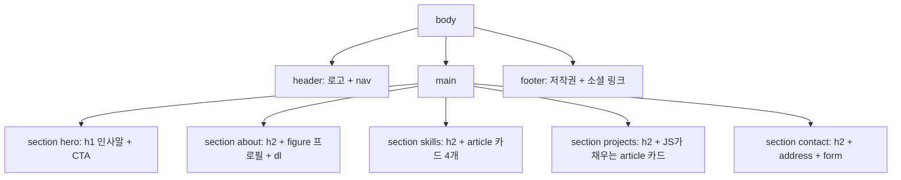
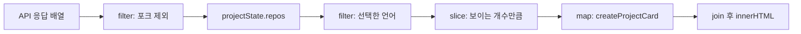
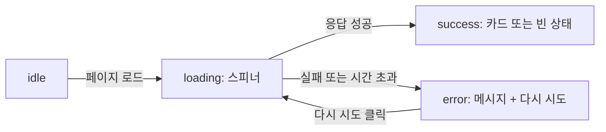
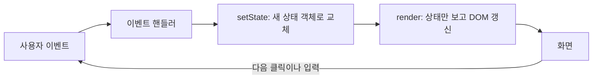
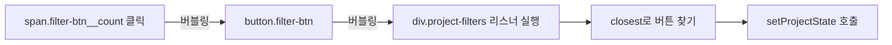
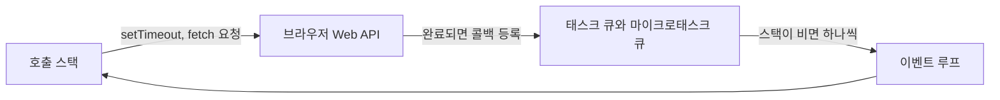
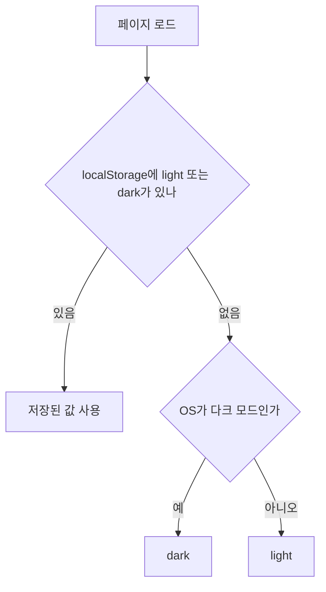

# 동료평가 예상 질문 & 모범 답변

동료평가에서 나올 만한 질문과, 이 저장소의 **실제 코드**를 근거로 한 답변을 모았습니다.
프로젝트 개요와 실행 방법은 [README](../README.md), 개념 설명은 [CONCEPTS.md](./CONCEPTS.md)에 있습니다.

> 코드 링크의 줄 번호(`#L10`)는 이 문서를 쓴 시점의 파일 기준입니다. 코드를 고쳐서 줄이 밀리더라도 함께 적어 둔 **함수·변수 이름**으로 찾으면 됩니다.

---

## 목차

- [답변 요령](#답변-요령)
- [A. 과제 목표 6가지](#a-과제-목표-6가지) — Q1 ~ Q12 (가장 중요)
- [B. HTML과 시맨틱 태그](#b-html과-시맨틱-태그) — Q13 ~ Q22
- [C. CSS](#c-css) — Q23 ~ Q35
- [D. DOM과 이벤트](#d-dom과-이벤트) — Q36 ~ Q45
- [E. ES6 이후 문법](#e-es6-이후-문법) — Q46 ~ Q54
- [F. 비동기와 API](#f-비동기와-api) — Q55 ~ Q65
- [G. 상태 관리](#g-상태-관리) — Q66 ~ Q70
- [H. 저장소와 테마](#h-저장소와-테마) — Q71 ~ Q76
- [I. 접근성](#i-접근성) — Q77 ~ Q82
- [J. 보안](#j-보안) — Q83 ~ Q87
- [K. 배포와 Git](#k-배포와-git) — Q88 ~ Q92
- [L. 까다로운 질문 대비](#l-까다로운-질문-대비) — Q93 ~ Q102
- [M. 트러블슈팅 경험](#m-트러블슈팅-경험) — Q103 ~ Q110

---

## 답변 요령

1. **결론 먼저** — "네, ○○ 때문에 △△로 했습니다." 한 문장으로 시작합니다. (각 질문의 **한 줄 답변**)
2. **이유** — 왜 그렇게 했는지, 다른 방법과 비교하면 무엇이 나은지 말합니다. (**자세한 답변**)
3. **코드 위치로 보여주기** — VS Code에서 파일을 열고 `Ctrl + G`로 줄 번호로 이동해 보여 주거나, 배포 사이트에서 직접 시연합니다. (**코드 근거**)

**시연할 때 쓸 수 있는 도구**

| 보여 줄 것 | 방법 |
| --- | --- |
| 로딩 / 에러 / 빈 상태 UI | 배포 주소 뒤에 `?demo=loading`, `?demo=error`, `?demo=empty` |
| 다크 모드 저장 | DevTools → Application → Local Storage → `theme` 키 확인 후 새로고침 |
| OS 다크 모드·동작 줄이기 | DevTools → 더보기(⋮) → More tools → Rendering → `prefers-color-scheme`, `prefers-reduced-motion` 에뮬레이션 |
| 반응형 | DevTools 기기 모드에서 390px / 768px / 1024px / 1440px |
| CSS 규칙 충돌 | DevTools → Elements → Styles에서 취소선이 그어진 규칙 확인 |
| 키보드 포커스 | `Tab`으로 이동하며 확인, 콘솔에서 `document.activeElement` |

**모르는 질문이 나오면** 추측으로 답하지 말고 "지금 코드는 ○○까지 되어 있고, △△는 확인해 보겠습니다"라고 말하는 것이 가장 좋습니다.

---

## A. 과제 목표 6가지

### Q1. 시맨틱 태그를 왜 썼나요? `div`만 써도 화면은 똑같지 않나요?

**한 줄 답변:** 화면은 같아도 "이 영역이 무엇인지"를 브라우저·스크린 리더·검색 엔진이 알 수 있게 하려고 썼습니다.

**자세한 답변:**
- `div`는 의미가 없는 상자입니다. `header`, `nav`, `main`, `section`, `article`, `footer`는 **역할**을 가지고 있어서, 스크린 리더 사용자는 "주요 메뉴(nav)", "본문(main)" 같은 **랜드마크** 목록으로 원하는 곳에 바로 이동할 수 있습니다.
- 코드를 읽는 사람도 태그만 보고 구조를 파악할 수 있습니다. `class` 이름에만 의미를 맡기지 않아도 됩니다.
- 검색 엔진이 본문과 메뉴를 구분하는 데도 도움이 됩니다.
- 그렇다고 `div`를 안 쓴 것은 아닙니다. `.container`, `.about__grid`처럼 **배치만을 위한 상자**에는 의미가 없으니 `div`가 맞습니다.

**코드 근거:** [index.html#L96](../index.html#L96) `header.header`, [index.html#L100](../index.html#L100) `nav`(aria-label="주요 메뉴"), [index.html#L124](../index.html#L124) `main#main`, [index.html#L126](../index.html#L126) `section.hero`, [index.html#L196](../index.html#L196) `article.skill-card`, [index.html#L356](../index.html#L356) `footer.footer`

---

### Q2. 페이지 구조는 어떤 기준으로 설계했나요?

**한 줄 답변:** "페이지 전체 → 섹션 → 섹션 안의 독립 콘텐츠" 순서로 나누고, 제목(h1 → h2 → h3)이 목차처럼 읽히도록 설계했습니다.

**자세한 답변:**
- 최상위는 `header`(로고 + 메뉴) / `main` / `footer` 세 덩어리입니다. `main`은 페이지에 하나뿐입니다.
- `main` 안에 `section` 5개(Hero, About, Skills, Projects, Contact)를 두고, 각 `section`은 `id`(메뉴 앵커 링크의 목적지)와 `aria-labelledby`(자기 제목과 연결)를 가집니다.
- 제목 계층: `h1`은 Hero에 하나, 섹션 제목은 `h2`, 카드 제목은 `h3` → 중간 단계를 건너뛰지 않습니다.
- 따로 떼어 내도 의미가 통하는 카드(스킬 카드, 프로젝트 카드)는 `article`로 만들었습니다.



**코드 근거:** [index.html#L126-L129](../index.html#L126-L129) Hero `section` + `h1`, [index.html#L144-L148](../index.html#L144-L148) About `section` + `h2`, [index.html#L198](../index.html#L198) 스킬 카드 `h3`, [js/projects.js#L111-L113](../js/projects.js#L111-L113) `createProjectCard`의 `article` + `h3`

---

### Q3. Flexbox와 Grid는 뭐가 다른가요?

**한 줄 답변:** Flexbox는 한 방향(1차원)으로 줄 세우는 도구이고, Grid는 행과 열(2차원) 격자에 배치하는 도구입니다.

**자세한 답변:**
- **Flexbox**: 주축 하나를 따라 아이템을 늘어놓고, 아이템(콘텐츠) 크기에 맞춰 유연하게 늘고 줄어듭니다. 정렬(`justify-content`, `align-items`)과 남는 공간 분배에 강합니다.
- **Grid**: 부모가 먼저 칸(트랙)을 정하고 아이템을 칸에 넣습니다. 여러 줄이 **같은 열 너비**로 맞춰집니다.
- 기억하기 쉬운 기준: **"콘텐츠가 레이아웃을 정하면 Flex, 레이아웃이 콘텐츠를 담으면 Grid."**
- 둘 다 `gap`으로 간격을 줄 수 있어서, 이 프로젝트에서는 마진 대신 `gap`을 썼습니다.

**코드 근거:** [css/style.css#L362-L368](../css/style.css#L362-L368) `.header__inner`(Flexbox), [css/style.css#L804-L808](../css/style.css#L804-L808) `.project-grid`(Grid)

---

### Q4. 이 프로젝트에서 Flexbox와 Grid를 각각 어디에, 어떤 기준으로 썼나요?

**한 줄 답변:** 한 줄로 흐르거나 줄바꿈되는 것(헤더, 태그, 필터 버튼)은 Flexbox, 카드를 격자로 맞추는 것(Projects, Skills, About, Contact)은 Grid입니다.

**자세한 답변:**

| 위치 | 선택 | 이유 |
| --- | --- | --- |
| 헤더 `.header__inner` | Flexbox | 로고(왼쪽) · 메뉴 · 버튼(오른쪽)을 한 줄에. `.nav`의 `margin-left: auto`로 나머지를 오른쪽으로 민다 |
| 태그 `.tag-list`, 필터 `.project-filters` | Flexbox + `flex-wrap` | 길이·개수가 제각각인 아이템을 흐르듯 줄바꿈 |
| 카드 내부 `.project-card` | Flexbox(column) | 설명(`flex-grow: 1`)이 남는 높이를 차지해서 언어·스타 정보가 항상 카드 아래에 붙는다 |
| Projects `.project-grid` | Grid(`auto-fit`) | 카드 폭을 맞춘 격자, 열 개수는 자동 |
| Skills `.skills__grid` | Grid | 1열 → 2열 → 4열을 브레이크포인트에서 명시 |
| About `.about__grid` | Grid | [사진 220px \| 소개 1fr] 두 열 |
| Contact `.contact__grid` | Grid | [연락처 1fr \| 폼 1.8fr] 두 열 |

**코드 근거:** [css/style.css#L362-L368](../css/style.css#L362-L368) `.header__inner`, [css/style.css#L381-L383](../css/style.css#L381-L383) `.nav`, [css/style.css#L728-L733](../css/style.css#L728-L733) `.tag-list`, [css/style.css#L893-L894](../css/style.css#L893-L894) `.project-card__desc`의 `flex-grow`, [css/style.css#L804-L808](../css/style.css#L804-L808) `.project-grid`, [css/style.css#L1369-L1372](../css/style.css#L1369-L1372)·[css/style.css#L1423-L1425](../css/style.css#L1423-L1425) `.skills__grid`, [css/style.css#L1354-L1359](../css/style.css#L1354-L1359) `.about__grid`, [css/style.css#L1427-L1431](../css/style.css#L1427-L1431) `.contact__grid`

**꼬리 질문 대비:** "네비게이션을 Grid로 해도 되지 않나요?" → 가능합니다(`grid-template-columns: auto 1fr auto` 같은 방식). 하지만 한 줄 배치에는 Flexbox가 더 단순하고, 과제 요구 사항도 "네비게이션은 Flexbox"였습니다.

---

### Q5. `querySelector`로 요소를 찾고 `addEventListener`로 이벤트를 연결하는 흐름을 설명해 주세요.

**한 줄 답변:** ① 요소를 선택하고 → ② "어떤 이벤트가 일어나면 이 함수를 실행해 달라"고 등록하면 → ③ 이벤트가 발생했을 때 브라우저가 그 함수를 `event` 객체와 함께 호출합니다.

**자세한 답변:** 다크 모드 버튼을 예로 들면,
1. `document.querySelector('.theme-toggle')` — CSS 선택자와 같은 문법으로 첫 번째로 일치하는 요소를 찾습니다.
2. `themeToggle.addEventListener('click', () => { ... })` — 함수를 **지금 실행하는 게 아니라 등록만** 합니다.
3. 사용자가 클릭하면 핸들러가 다음 테마를 계산하고 `setTheme()` → `renderTheme()`이 `<html data-theme>`을 바꿉니다.

- `<script defer>`라서 HTML을 다 읽은 뒤 실행되므로, `querySelector`가 아직 없는 요소를 찾다가 `null`을 받는 일이 없습니다.
- `onclick` 속성 대신 `addEventListener`를 쓰면 HTML과 JS가 분리되고, 한 요소에 여러 리스너를 달 수 있으며, `{ passive: true }` 같은 옵션도 줄 수 있습니다.

**코드 근거:** [js/theme.js#L15](../js/theme.js#L15) `themeToggle`, [js/theme.js#L56-L65](../js/theme.js#L56-L65) click 리스너, [js/theme.js#L49-L53](../js/theme.js#L49-L53) `setTheme`, [js/theme.js#L42-L46](../js/theme.js#L42-L46) `renderTheme`, [index.html#L35-L40](../index.html#L35-L40) `defer`

**꼬리 질문 대비:** "요소가 없으면 어떻게 되나요?" → `querySelector`는 `null`을 돌려주고, `null.addEventListener(...)`에서 TypeError가 나서 그 파일의 나머지 코드가 멈춥니다. 그래서 `defer`로 실행 시점을 보장했습니다.

---

### Q6. 화살표 함수는 왜 필요한가요?

**한 줄 답변:** 짧은 함수를 간결하게 쓸 수 있고, 자기만의 `this`가 없어서 콜백 안에서 `this`가 바뀌는 혼란이 없기 때문입니다.

**자세한 답변:**
- 한 줄짜리는 `{}`와 `return`을 생략할 수 있습니다: `const sleep = (ms) => new Promise(...)`, `const getSystemTheme = () => (...)`.
- 배열 메서드의 콜백이 특히 읽기 쉬워집니다: `data.filter(({ fork }) => !fork)`.
- 이 프로젝트는 `this`를 한 번도 쓰지 않고 `event.target`이나 바깥 변수(클로저)를 씁니다. 그래서 모든 함수를 화살표 함수로 통일했습니다. (`this` 차이는 [Q47](#q47-화살표-함수와-일반-function은-무엇이-다른가요) 참고)

**코드 근거:** [js/utils.js#L10](../js/utils.js#L10) `sleep`, [js/theme.js#L36](../js/theme.js#L36) `getSystemTheme`, [js/projects.js#L256](../js/projects.js#L256) `loadRepos`의 `filter` 콜백

---

### Q7. 구조분해 할당은 왜 필요하고, 어떻게 썼나요?

**한 줄 답변:** 객체·배열에서 필요한 값만 이름 붙여 꺼내서, `repo.stargazers_count`를 여러 번 쓰는 대신 `stars`처럼 짧고 읽기 쉽게 만들기 위해서입니다.

**자세한 답변:**
- `createProjectCard`는 매개변수 자리에서 GitHub 저장소 객체를 바로 구조분해합니다. 함수 첫 줄만 봐도 **카드에 어떤 데이터가 쓰이는지** 알 수 있습니다.
- 이름 바꾸기(`html_url: repoUrl`)로 API의 snake_case를 JS 스타일 camelCase로 바꾸고, 기본값(`topics = []`)으로 값이 없을 때를 대비했습니다.
- 상태 객체에서도 필요한 값만 꺼냅니다: `const { status, repos, filter, visibleCount, errorMessage } = projectState;`
- 이벤트 객체에서도: `const { name, value } = event.target;`

**코드 근거:** [js/projects.js#L100-L110](../js/projects.js#L100-L110) `createProjectCard` 매개변수, [js/projects.js#L175](../js/projects.js#L175) `renderProjects`, [js/contact.js#L138](../js/contact.js#L138) input 리스너, [js/layout.js#L96](../js/layout.js#L96) `handleScroll`

---

### Q8. `map`과 `filter`는 어디에, 왜 썼나요?

**한 줄 답변:** `map`은 "저장소 배열 → 카드 HTML 배열" 변환에, `filter`는 "포크 제외"와 "선택한 언어만 남기기"에 썼습니다.

**자세한 답변:**
- `map`: `shownRepos.map(createProjectCard).join('')` — 데이터 n개를 HTML 문자열 n개로 바꾸고 `join`으로 하나로 합쳐 `innerHTML`에 넣습니다.
- `filter`: 받은 데이터에서 `fork`가 아닌 것만 남기고, 필터 버튼을 누르면 `language`가 같은 것만 남깁니다.
- `for`문 대신 쓰는 이유: 둘 다 **새 배열을 돌려주고 원본은 건드리지 않습니다.** 그래서 필터를 '전체'로 되돌리면 원본 `projectState.repos`가 그대로 남아 있습니다. 또 "무엇을 할지"만 적으면 되어서 코드가 짧고 의도가 드러납니다.



**코드 근거:** [js/projects.js#L256](../js/projects.js#L256) 포크 제외 `filter`, [js/projects.js#L66-L69](../js/projects.js#L66-L69) `getFilteredRepos`, [js/projects.js#L177](../js/projects.js#L177) `slice`, [js/projects.js#L195](../js/projects.js#L195) `map` + `join`

---

### Q9. `fetch`와 `async/await`로 데이터를 어떻게 가져오나요?

**한 줄 답변:** `loadRepos`가 상태를 `loading`으로 바꾸고, `await fetchRepos()`로 응답을 기다린 뒤 성공하면 `success`, 예외가 나면 `catch`에서 `error`로 바꿉니다.

**자세한 답변:**
1. `setProjectState({ status: 'loading' })` → 스피너가 보입니다.
2. `await fetch(REPOS_API_URL, { headers, signal: AbortSignal.timeout(REQUEST_TIMEOUT) })` → 10초(`REQUEST_TIMEOUT = 10000`) 제한으로 요청합니다.
3. `response.ok`가 아니면 상태 코드별 에러를 `throw`합니다 (403/429, 404, 그 외).
4. `await response.json()` → 배열이 맞는지 확인합니다.
5. 포크를 걸러 내고, 필터 버튼을 만들고, `status: 'success'`로 바꿉니다.
6. 중간에 어디서든 에러가 나면 `catch`에서 `status: 'error'`와 사람이 읽을 수 있는 메시지를 저장합니다.



**코드 근거:** [js/projects.js#L251-L265](../js/projects.js#L251-L265) `loadRepos`, [js/projects.js#L225-L228](../js/projects.js#L225-L228) `fetch` 호출, [js/projects.js#L231-L244](../js/projects.js#L231-L244) `response.ok` 검사, [js/projects.js#L246-L248](../js/projects.js#L246-L248) `response.json()`

---

### Q10. 로딩·성공·실패(·빈 상태)를 UI로 어떻게 표현했나요?

**한 줄 답변:** `renderProjects` 한 함수가 `status` 값을 보고 네 가지 화면 중 하나를 그립니다.

**자세한 답변:**

| 상태 | 조건 | 화면 |
| --- | --- | --- |
| 로딩 | `status === 'loading'` | 스피너 + "프로젝트를 불러오는 중...", 목록에 `aria-busy="true"` |
| 성공 | `success`이고 결과가 1개 이상 | 언어 필터 + 카드 + "N개 중 M개 표시" + 더 보기 |
| 빈 상태 | `success`인데 결과가 0개 | "표시할 프로젝트가 없습니다." |
| 에러 | `status === 'error'` | "프로젝트를 불러올 수 없습니다." + 원인 + **다시 시도** + GitHub에서 보기 |

- 상태 메시지 영역은 `aria-live="polite"`라서 스크린 리더도 상태가 바뀐 것을 읽어 줍니다.
- 평가 때는 주소에 `?demo=loading`, `?demo=error`, `?demo=empty`를 붙이면 각 상태를 바로 보여 줄 수 있습니다.

**코드 근거:** [js/projects.js#L174-L201](../js/projects.js#L174-L201) `renderProjects`, [js/projects.js#L74-L97](../js/projects.js#L74-L97) `loadingTemplate`·`createErrorTemplate`·`emptyTemplate`, [js/projects.js#L213-L223](../js/projects.js#L213-L223) 데모 모드, [index.html#L273](../index.html#L273) `.project-status`의 `aria-live`

**꼬리 질문 대비:** "빈 상태는 왜 에러가 아닌가요?" → 요청 자체는 성공했기 때문입니다. 다시 시도해도 결과가 같으니 재시도 버튼도 없습니다. ([Q62](#q62-빈-상태와-에러-상태는-어떻게-다른가요))

---

### Q11. 이벤트 → 상태 변경 → DOM 업데이트가 어떻게 연결되나요?

**한 줄 답변:** 이벤트 핸들러는 DOM을 직접 고치지 않고 `setXxx()`로 **상태만** 바꾸고, `setXxx()`가 마지막에 `renderXxx()`를 불러 상태를 화면에 반영합니다.

**자세한 답변:** 이 흐름이 네 곳에 똑같은 모양으로 있습니다.

| 흐름 | 이벤트 | 상태 | 상태 변경 함수 | 렌더 함수 |
| --- | --- | --- | --- | --- |
| 다크 모드 | 토글 click, OS 테마 change | `currentTheme` | `setTheme` | `renderTheme` |
| GitHub API | 페이지 로드, 다시 시도 click | `projectState.status / repos / errorMessage` | `setProjectState` | `renderProjects` |
| 언어 필터·더 보기 | 필터 click, 더 보기 click | `projectState.filter / visibleCount` | `setProjectState` | `renderProjects` |
| 폼 검증 | input, focusout, submit | `formState.values / touched / status` | `setFormState` | `renderForm` |



**예시 — "C#" 필터 버튼을 누르면:**
1. `.project-filters`에 달린 리스너가 `closest('.filter-btn')`으로 누른 버튼을 찾습니다.
2. `setProjectState({ filter: 'C#', visibleCount: PAGE_SIZE })` → 상태만 바꿉니다.
3. `setProjectState`가 `renderProjects()`를 호출합니다.
4. `renderProjects`는 상태를 읽어 필터 버튼 강조(`aria-pressed`), 카드 목록, 개수 문구, 더 보기 버튼을 **한 번에** 맞춥니다.

**코드 근거:** [js/projects.js#L271-L275](../js/projects.js#L271-L275) 필터 리스너, [js/projects.js#L42-L45](../js/projects.js#L42-L45) `setProjectState`, [js/projects.js#L174-L201](../js/projects.js#L174-L201) `renderProjects`, [js/contact.js#L68-L71](../js/contact.js#L68-L71) `setFormState`, [js/theme.js#L49-L53](../js/theme.js#L49-L53) `setTheme`

---

### Q12. React의 상태-렌더링 흐름과는 어떤 관계인가요?

**한 줄 답변:** 구조는 같습니다. React는 `setState` 뒤의 렌더링과 DOM 비교를 자동으로 해 주고, 저는 그 부분을 `render` 함수로 직접 만든 셈입니다.

**자세한 답변:**
- **같은 점:** 화면은 상태의 결과(UI = f(state))이고, 상태는 setter로만 바꾸며, 새 객체로 교체하는 불변 업데이트(`{ ...prev, ...changes }`)를 씁니다.
- **다른 점 1 — 자동 vs 수동:** React는 `setState`만 하면 알아서 다시 그립니다. 여기서는 `setProjectState` 안에서 `renderProjects()`를 직접 부릅니다.
- **다른 점 2 — 바뀐 부분만 vs 전부:** React는 가상 DOM을 비교해 바뀐 부분만 고칩니다. 여기서는 카드 목록을 `innerHTML`로 통째로 다시 그리므로, 예를 들어 "더 보기"를 누르면 이미 있던 카드도 새로 만들어집니다.
- **다른 점 3 — 시점:** React는 여러 `setState`를 모아서(batch) 한 번에 렌더링합니다. 여기서는 `setProjectState`를 부르는 즉시 동기적으로 렌더링합니다.
- 직접 만들어 보니 React가 해결해 주는 문제(포커스 유지, DOM 비교)를 체감할 수 있었습니다. ([Q69](#q69-필터-버튼은-왜-데이터가-바뀔-때만-다시-만드나요), [Q70](#q70-react의-usestate로-옮긴다면-어떻게-되나요))

**코드 근거:** [js/projects.js#L41-L45](../js/projects.js#L41-L45) `setProjectState`와 주석, [js/projects.js#L195](../js/projects.js#L195) 카드 목록 `innerHTML`

---

## B. HTML과 시맨틱 태그

### Q13. `article`, `section`, `div`는 어떻게 구분했나요?

**한 줄 답변:** 혼자 떼어 내도 의미가 통하면 `article`, 제목을 가진 주제 묶음이면 `section`, 의미 없이 배치·스타일용이면 `div`입니다.

**자세한 답변:**
- `section`: About, Skills, Projects, Contact처럼 각자 `h2` 제목이 있는 주제 영역.
- `article`: 스킬 카드와 프로젝트 카드. 카드 하나만 다른 페이지로 옮겨도 완결된 콘텐츠입니다.
- `div`: `.container`, `.about__grid`, JS가 내용을 채우는 `.project-status`, `.project-grid` 같은 상자.
- 판단 질문: "이 영역에 제목을 붙일 수 있나?" → `section` / "이것만 따로 공유해도 말이 되나?" → `article`.

**코드 근거:** [index.html#L185](../index.html#L185) Skills `section`, [index.html#L196](../index.html#L196) `article.skill-card`, [js/projects.js#L111](../js/projects.js#L111) `article.project-card`, [index.html#L273-L274](../index.html#L273-L274) `div.project-status`·`div.project-grid`

**꼬리 질문 대비:** "프로젝트 카드 목록은 왜 `ul`이 아닌가요?" → 지금은 `div` 안에 `article`을 나열했습니다. 스킬 카드처럼 `ul > li > article`로 감싸면 "목록, 항목 N개"라는 정보가 더해지므로 개선할 수 있는 부분입니다.

---

### Q14. `section` 안에 `header`를 또 넣었는데, 헤더는 페이지에 하나 아닌가요?

**한 줄 답변:** `header`는 "가장 가까운 섹션의 머리말"이라 여러 개 쓸 수 있습니다. 페이지 전체 배너 역할은 `body` 바로 아래의 `header`만 가집니다.

**자세한 답변:**
- 각 섹션의 머리(작은 제목 + `h2` + 설명)를 `header.section-head`로 묶었습니다.
- 프로젝트 카드 안에도 `header`(제목 + Demo 링크)와 `footer`(언어·스타·포크·날짜)가 있습니다.
- `section`이나 `article` 안의 `header`/`footer`는 랜드마크(banner/contentinfo)가 되지 않으므로 스크린 리더의 랜드마크 목록이 헷갈리지 않습니다.
- 반대로 `main`은 페이지에 하나만 있어야 합니다.

**코드 근거:** [index.html#L146-L149](../index.html#L146-L149) `header.section-head`, [js/projects.js#L112](../js/projects.js#L112) 카드 `header`, [js/projects.js#L131](../js/projects.js#L131) 카드 `footer`

---

### Q15. 연락처를 `address` 태그로 감싼 이유는?

**한 줄 답변:** `address`는 "이 페이지 작성자의 연락처"를 뜻하는 태그라서 이메일·GitHub 링크 묶음에 맞습니다.

**자세한 답변:**
- 이름과 달리 우편 주소 전용이 아니라 **작성자에게 연락하는 수단 전반**을 뜻합니다.
- 브라우저 기본 스타일이 기울임꼴이라 `.contact__info`에서 `font-style: normal`로 되돌렸습니다.
- 문의 폼은 `address` 밖에 두었습니다. 폼은 연락처 정보가 아니라 입력 도구이기 때문입니다.

**코드 근거:** [index.html#L296-L311](../index.html#L296-L311) `address.contact__info`, [css/style.css#L1061-L1066](../css/style.css#L1061-L1066) `font-style: normal`

---

### Q16. About의 "소속 / 주력 엔진" 목록은 왜 `ul`이 아니라 `dl`인가요?

**한 줄 답변:** "항목 이름 – 값" 짝(소속: ADO STUDIO)이라서 정의 목록 `dl` / `dt` / `dd`가 의미에 맞습니다.

**자세한 답변:**
- `dt`는 이름, `dd`는 값입니다. 스크린 리더가 둘을 짝으로 인식할 수 있습니다.
- `dt`/`dd` 한 쌍을 `div`로 감싸는 것은 HTML 표준에서 허용됩니다. 이 `div`(`.about__fact`)에 카드 모양 스타일을 입혔습니다.
- 768px 이상에서는 Grid로 2열 배치됩니다.

**코드 근거:** [index.html#L161-L178](../index.html#L161-L178) `dl.about__facts`, [css/style.css#L654-L675](../css/style.css#L654-L675) `.about__facts`·`.about__fact`, [css/style.css#L1365-L1367](../css/style.css#L1365-L1367) 2열

---

### Q17. 프로필 이미지는 왜 `figure`로 감쌌고, `figcaption`은 왜 없나요?

**한 줄 답변:** 본문 흐름과 독립된 이미지 콘텐츠라서 `figure`로 묶었고, 설명은 `alt`로 충분해 화면용 캡션은 생략했습니다.

**자세한 답변:**
- `figure`는 이미지·도표·코드처럼 "참조할 수 있는 독립 콘텐츠"를 묶는 태그이고, `figcaption`은 선택 사항입니다.
- `img`에 `width="240" height="240"`을 적어 두면 이미지가 로드되기 전에도 브라우저가 공간을 미리 잡아서 화면이 덜컹거리지 않습니다.
- 픽셀 아트라서 `image-rendering: pixelated`로 확대해도 흐려지지 않게 했습니다.

**코드 근거:** [index.html#L152-L154](../index.html#L152-L154) `figure.about__photo`, [css/style.css#L643-L648](../css/style.css#L643-L648) `.about__photo img`

---

### Q18. `alt` 텍스트는 어떤 기준으로 썼나요?

**한 줄 답변:** "이미지가 안 보이는 사람에게 말로 설명한다면?"을 기준으로 무엇이 그려져 있는지 구체적으로 썼고, 장식용 아이콘은 `aria-hidden`으로 숨겼습니다.

**자세한 답변:**
- 콘텐츠 이미지: "헤드폰을 쓰고 웃고 있는 ADOHI의 픽셀 아트 프로필 캐릭터". "이미지", "사진" 같은 말은 스크린 리더가 이미 "이미지"라고 읽어 주므로 넣지 않았습니다.
- 페이지의 `img` 태그는 프로필 하나뿐이고, 나머지 그림은 SVG 아이콘입니다. 아이콘 옆에 글자가 있으면 장식이므로 `aria-hidden="true"`로 숨깁니다.
- 글자 없이 아이콘만 있는 버튼·링크는 `aria-label`로 이름을 줍니다 (다크 모드 토글, 햄버거 버튼, 맨 위로 버튼, 푸터 GitHub·이메일 링크).

**코드 근거:** [index.html#L153](../index.html#L153) 프로필 `alt`, [index.html#L111-L113](../index.html#L111-L113) 테마 토글 `aria-label` + 아이콘 `aria-hidden`, [index.html#L361-L362](../index.html#L361-L362) 푸터 GitHub 링크

---

### Q19. `label`의 `for`와 `input`의 `id`는 왜 맞춰야 하나요?

**한 줄 답변:** 둘을 연결해야 라벨을 눌러도 입력칸에 커서가 가고, 스크린 리더가 입력칸의 이름("이름", "이메일")을 읽어 주기 때문입니다.

**자세한 답변:**
- `for="contact-name"` ↔ `id="contact-name"`처럼 세 필드 모두 짝을 맞췄습니다.
- `name` 속성은 역할이 다릅니다: Formspree로 보낼 때의 **키**이자, JS에서 `contactForm.elements[field]`로 필드를 찾는 키입니다.
- `aria-describedby`로 입력칸과 에러 문구(`<p id="contact-name-error">`)도 연결해서, 스크린 리더가 이름 다음에 에러 내용을 읽어 줍니다.

**코드 근거:** [index.html#L321-L323](../index.html#L321-L323) 이름 필드, [index.html#L327-L329](../index.html#L327-L329) 이메일 필드, [index.html#L333-L334](../index.html#L333-L334) 메시지 필드, [js/contact.js#L92](../js/contact.js#L92) `contactForm.elements[field]`

---

### Q20. `form`에 `novalidate`를 붙인 이유는? `required`는 왜 남겼나요?

**한 줄 답변:** 브라우저 기본 말풍선 대신 필드 아래에 직접 만든 에러 메시지를 보여 주려고 기본 검증을 껐고, `required`는 "필수 항목"이라는 의미 정보로 남겼습니다.

**자세한 답변:**
- `novalidate`가 없으면 `submit` 이벤트가 오기도 전에 브라우저가 제출을 막고 말풍선을 띄웁니다. 문구·디자인·표시 시점을 제어할 수 없고 브라우저마다 모양이 다릅니다.
- `novalidate`가 있으면 `required`로 제출이 막히지는 않지만, 스크린 리더가 "필수"라고 알려 주는 의미는 그대로 남습니다.
- 실제 검증은 `validators`가 합니다: 이름 2자 이상, 이메일 형식, 메시지 10자 이상.
- `maxlength`는 검증이 아니라 입력 자체를 제한하므로 `novalidate`와 상관없이 동작합니다.

**코드 근거:** [index.html#L317](../index.html#L317) `novalidate`, [index.html#L313-L316](../index.html#L313-L316) 주석, [js/contact.js#L32-L48](../js/contact.js#L32-L48) `validators`

---

### Q21. `noscript`는 왜 넣었나요?

**한 줄 답변:** JavaScript가 꺼진 환경에서도 내용은 읽을 수 있게 하는 최소한의 대비책입니다.

**자세한 답변:**
- `<head>`의 `noscript`는 JS가 꺼졌을 때만 `noscript.css`를 불러옵니다. 이 파일은
  - 스크롤 애니메이션 때문에 투명하게 숨겨 둔 `.reveal` 요소를 바로 보이게 하고,
  - JS가 있어야 동작하는 버튼(테마 토글, 햄버거, 스크롤 탑, 필터, 더 보기)을 숨기고,
  - 햄버거 없이도 메뉴를 쓸 수 있게 모바일에서도 메뉴를 펼칩니다.
- Projects 영역에는 "JavaScript를 켜 주세요" 문구와 GitHub 저장소 링크를 둡니다.
- 한계: 프로젝트 카드, 폼 검증, 다크 모드는 JS가 필요하므로 대비는 최소한입니다.

**코드 근거:** [index.html#L27](../index.html#L27) `noscript` + `noscript.css`, [index.html#L280-L282](../index.html#L280-L282) Projects 안내, [css/noscript.css#L7-L18](../css/noscript.css#L7-L18) `.reveal` 표시·버튼 숨김, [css/noscript.css#L29-L42](../css/noscript.css#L29-L42) 메뉴 펼침

---

### Q22. SVG 아이콘 스프라이트에 `aria-hidden`을 붙인 이유는?

**한 줄 답변:** 아이콘 정의 묶음 자체는 콘텐츠가 아니라서 스크린 리더와 키보드 탐색에서 빼기 위해서입니다.

**자세한 답변:**
- 아이콘을 `<symbol id="icon-star">`로 한 번만 정의하고, 쓰는 곳에서는 `<svg><use href="#icon-star"></use></svg>`로 불러옵니다. 같은 `path`를 반복해서 쓰지 않아도 됩니다.
- 아이콘 선 색이 `stroke="currentColor"`라서 글자 색을 따라가므로 다크 모드에서도 따로 손댈 필요가 없습니다.
- 스프라이트 `svg`는 CSS로 크기를 0으로 만들어 화면에 그리지 않고, `aria-hidden="true"`로 보조 기술에서도 숨깁니다. `focusable="false"`는 옛 브라우저에서 SVG가 Tab으로 잡히던 문제를 막는 속성입니다.
- 아이콘은 Feather Icons(MIT)·Lucide(ISC)에서 가져왔고, 과제에서 아이콘은 허용됩니다.

**코드 근거:** [index.html#L46-L50](../index.html#L46-L50) 스프라이트 주석과 `svg.sprite`, [index.html#L66-L68](../index.html#L66-L68) `symbol#icon-star`, [css/style.css#L241-L246](../css/style.css#L241-L246) `.sprite`, [js/projects.js#L137](../js/projects.js#L137) `use href="#icon-star"`

---

## C. CSS

### Q23. CSS 변수로 다크 모드를 어떻게 구현했나요?

**한 줄 답변:** 색을 전부 `:root`의 변수로 쓰고, `[data-theme="dark"]`에서 **같은 변수 이름에 어두운 값만** 넣었습니다. JS는 `<html>`의 `data-theme` 속성 하나만 바꿉니다.

**자세한 답변:**
- 컴포넌트 CSS는 `background-color: var(--color-surface)`처럼 변수만 씁니다. 그래서 다크 모드용 컴포넌트 규칙을 거의 따로 쓰지 않아도 됩니다. (예외: 해/달 아이콘 교체, 어두운 언어 점에 테두리)
- `data-theme`은 `<html>`에 붙으므로 모든 요소가 바뀐 변수 값을 물려받습니다.
- `color-scheme: dark`로 스크롤바·폼 컨트롤 같은 브라우저 기본 UI도 어둡게 바뀝니다.
- 색뿐 아니라 글자 크기(`--fs-*`), 간격(`--space-*`), 모서리(`--radius-*`)도 변수(디자인 토큰)로 관리합니다.

**코드 근거:** [css/style.css#L33-L91](../css/style.css#L33-L91) `:root` 토큰, [css/style.css#L94-L116](../css/style.css#L94-L116) `[data-theme="dark"]`, [css/style.css#L441-L448](../css/style.css#L441-L448) 아이콘 교체, [js/theme.js#L43](../js/theme.js#L43) `renderTheme`의 `setAttribute('data-theme', ...)`

**꼬리 질문 대비:** "왜 class가 아니라 data 속성인가요?" → `light`/`dark`라는 **상태 값**을 속성 하나로 표현하기 좋고, 과제 요구 사항도 `[data-theme="dark"]`였습니다. class로도 구현은 가능합니다.

---

### Q24. 명시도(specificity)와 캐스케이드는 무엇이고, `:where()`는 왜 썼나요?

**한 줄 답변:** 리셋 규칙 `ul[class]`의 명시도가 `.nav__menu`보다 높아서 메뉴 padding을 지워 버렸고, `:where()`로 감싸 명시도를 0으로 만들어 해결했습니다.

**자세한 답변:**
- 명시도는 (id 개수, class·속성·가상 클래스 개수, 태그 개수)로 비교합니다.
  - `ul[class]` = (0, 1, 1) — 속성 선택자 1 + 태그 1
  - `.nav__menu` = (0, 1, 0) — class 1
  - → 파일 순서와 상관없이 `ul[class]`가 이겨서 `padding: 0`이 적용됐습니다.
- 명시도가 같으면 **나중에 선언된 규칙**이 이깁니다 (캐스케이드 순서).
- `:where(...)`는 안에 무엇이 있든 명시도가 0입니다. 그래서 "기본값"처럼 동작하고, 어떤 class 규칙이든 덮어쓸 수 있습니다. (비슷한 `:is()`는 안쪽에서 가장 높은 명시도를 가져서 해결이 안 됩니다.)

**코드 근거:** [css/style.css#L160-L164](../css/style.css#L160-L164) `:where(ul[class])`, [css/style.css#L386-L394](../css/style.css#L386-L394) `.nav__menu`의 `padding`

---

### Q25. `[hidden]`에 `display: none !important`를 준 이유는?

**한 줄 답변:** `hidden` 속성은 브라우저 기본 스타일(`display: none`)일 뿐이라서, `display: flex`를 준 class 규칙이 이겨 버려 숨겨지지 않기 때문입니다.

**자세한 답변:**
- `.project-filters`에는 `display: flex`가 있습니다. 작성자 CSS는 브라우저 기본 스타일보다 우선하므로 `hidden` 속성을 붙여도 보이게 됩니다.
- `!important`로 "`hidden`이면 무조건 숨김"이라는 의미를 지켰습니다.
- JS는 `projectFilters.hidden = ...`, `projectMoreButton.hidden = ...`처럼 `hidden` 속성으로 보이기/숨기기를 합니다.

**코드 근거:** [css/style.css#L188-L191](../css/style.css#L188-L191) `[hidden]`, [css/style.css#L755-L759](../css/style.css#L755-L759) `.project-filters`, [js/projects.js#L187](../js/projects.js#L187), [js/projects.js#L200](../js/projects.js#L200)

---

### Q26. `auto-fit`과 `auto-fill`은 무엇이 다른가요?

**한 줄 답변:** 둘 다 "들어가는 만큼 열을 만든다"는 점은 같지만, 아이템이 적을 때 `auto-fit`은 빈 열을 없애고 아이템을 늘리고, `auto-fill`은 빈 열을 남겨 둡니다.

**자세한 답변:**
- 예: 데스크톱에서 3열이 들어가는데 필터 결과가 1개라면
  - `auto-fit`(현재 코드): 카드 하나가 전체 폭으로 늘어납니다.
  - `auto-fill`: 카드는 한 칸 크기를 유지하고 오른쪽에 빈 칸 2개가 남습니다.
- 카드가 충분히 많으면 두 결과는 같습니다.
- 이 프로젝트는 결과가 적어도 빈 공간이 없도록 `auto-fit`을 골랐습니다. 카드 폭을 항상 똑같이 두고 싶다면 `auto-fill`이 맞습니다. (트레이드오프)

**코드 근거:** [css/style.css#L799-L808](../css/style.css#L799-L808) `.project-grid`와 주석

---

### Q27. `minmax(min(100%, 300px), 1fr)`는 무슨 뜻인가요?

**한 줄 답변:** "열의 최소 폭은 300px(단, 부모보다 넓어지지는 않게), 최대 폭은 남은 공간을 똑같이 나눈 1fr"이라는 뜻입니다.

**자세한 답변:**
- `minmax(300px, 1fr)`만 쓰면, 부모 폭이 300px보다 좁은 아주 작은 화면에서 카드가 넘쳐 가로 스크롤이 생깁니다.
- `min(100%, 300px)`는 둘 중 작은 값을 고르므로, 부모가 좁으면 100%, 넓으면 300px가 최소 폭이 됩니다.
- 계산 예 (컨테이너 최대 1120px, 좌우 패딩 모바일 16px·768px 이상 24px, 카드 간격 24px):
  - 390px 휴대폰: 내용 폭 358px → **1열**
  - 768px 태블릿: 내용 폭 720px → 300×2 + 24 = 624 ≤ 720 → **2열**
  - 1440px 데스크톱: 내용 폭 1072px → 300×3 + 48 = 948 ≤ 1072 < 1272 → **3열**
- 그래서 Projects 그리드는 미디어 쿼리 없이 1 → 2 → 3열로 바뀝니다.

**코드 근거:** [css/style.css#L806](../css/style.css#L806) `grid-template-columns`, [css/style.css#L202-L207](../css/style.css#L202-L207) `.container`, [css/style.css#L1324-L1326](../css/style.css#L1324-L1326) 768px 이상 패딩

---

### Q28. 모바일 퍼스트와 `min-width` 미디어 쿼리는 무엇인가요?

**한 줄 답변:** 기본 CSS를 모바일 기준으로 쓰고, 화면이 넓어질 때만 `@media (min-width: ...)`로 규칙을 **덧붙이는** 방식입니다.

**자세한 답변:**
- 예: `.nav__menu`의 기본 모양은 헤더 아래로 펼쳐지는 세로 드롭다운이고, 768px 이상에서만 가로 한 줄로 바뀌고 햄버거 버튼이 사라집니다.
- 예: `.skills__grid`는 기본 1열 → 768px 이상 2열 → 1024px 이상 4열.
- 장점: 작은 화면이 가장 단순한 규칙으로 동작하고, 큰 화면은 "추가"만 하면 되니 덮어쓰기 방향이 한쪽(작은 → 큰)으로 정리됩니다.
- 반대 방식(`max-width`, 데스크톱 퍼스트)은 모바일에서 데스크톱 규칙을 많이 되돌려야 합니다.

**코드 근거:** [css/style.css#L4-L6](../css/style.css#L4-L6) 작성 원칙 주석, [css/style.css#L386-L406](../css/style.css#L386-L406) 모바일 메뉴, [css/style.css#L1323](../css/style.css#L1323) `@media (min-width: 768px)`, [css/style.css#L1333-L1348](../css/style.css#L1333-L1348) 햄버거 숨김·가로 메뉴

---

### Q29. 브레이크포인트를 768px, 1024px로 잡은 이유는?

**한 줄 답변:** 과제 요구 사항이면서, 태블릿 세로(768px)와 태블릿 가로·작은 노트북(1024px)을 나누는 대표적인 폭이기 때문입니다.

**자세한 답변:**
- **768px 이상:** 햄버거 → 가로 메뉴, About 2열, Skills 2열, 폼 제출 버튼 오른쪽 정렬, 푸터 가로 배치.
- **1024px 이상:** Skills 4열, Contact 2열(연락처 | 폼), About 사진 칸 280px.
- Projects 그리드는 브레이크포인트 없이 `auto-fit`으로 알아서 바뀝니다.
- 숫자만 맞춘 것이 아니라 중간 폭도 확인했습니다. 768px ~ 약 1230px에서 스크롤 탑 버튼이 푸터 링크를 가리는 문제를 발견해 고쳤습니다. ([Q107](#q107-스크롤-탑-버튼이-푸터-링크를-가리던-문제는요))

**코드 근거:** [css/style.css#L1323-L1407](../css/style.css#L1323-L1407) 태블릿 구간, [css/style.css#L1413-L1432](../css/style.css#L1413-L1432) 데스크톱 구간

---

### Q30. `transition`과 `animation`은 무엇이 다르고, 각각 어디에 썼나요?

**한 줄 답변:** `transition`은 "값이 A에서 B로 바뀔 때" 그 사이를 부드럽게 채우는 것이고, `animation`은 `@keyframes`로 정의한 움직임을 스스로 재생하는 것입니다.

**자세한 답변:**

| | `transition` | `animation` |
| --- | --- | --- |
| 시작 조건 | 속성 값이 바뀔 때 (hover, 클래스 추가) | 요소가 그려질 때 / `animation` 속성이 적용될 때 |
| 반복 | 불가 (A↔B 한 번) | `infinite` 등 가능 |
| 이 프로젝트 | 버튼·카드 hover, `.reveal` → `.revealed`, 메뉴 열고 닫기, 헤더 배경, 스크롤 탑 버튼 | Hero 등장(`fade-up`), 새로 그려진 프로젝트 카드(`fade-up`), 로딩 스피너(`spin`, 무한), 타이핑 커서(`blink`) |

- 프로젝트 카드는 `innerHTML`로 **새로 생기는** 요소라 "바뀌기 전 값"이 없으므로 `transition`으로는 등장 효과를 줄 수 없어서 `animation`을 썼습니다.
- `animation`의 `fill-mode` 때문에 생긴 hover 버그는 [Q104](#q104-프로젝트-카드가-hover해도-떠오르지-않던-문제는요)에 정리했습니다.

**코드 근거:** [css/style.css#L266-L277](../css/style.css#L266-L277) `.btn` transition·hover, [css/style.css#L1301-L1310](../css/style.css#L1301-L1310) `.reveal`, [css/style.css#L821](../css/style.css#L821) 카드 `animation`, [css/style.css#L1027-L1040](../css/style.css#L1027-L1040) `.spinner`, [css/style.css#L546-L551](../css/style.css#L546-L551) 타이핑 커서

---

### Q31. 카드 hover에 `transform`과 `box-shadow`를 쓴 이유는?

**한 줄 답변:** 카드가 살짝 떠오르면서(`translateY(-4px)`) 그림자가 커지면 "누를 수 있다"는 신호가 되고, `transform`은 레이아웃을 다시 계산하지 않아 주변 요소를 밀지 않기 때문입니다.

**자세한 답변:**
- 그림자는 `--shadow-sm / md / lg` 토큰으로 관리하고, hover 때 `sm → lg`, 테두리를 강조색으로 바꿉니다.
- `top`이나 `margin`을 바꾸면 옆·아래 요소의 위치가 다시 계산되지만, `transform`은 그리는 위치만 옮겨서 옆 카드가 밀리지 않습니다.
- 프로젝트 카드는 `:has(:focus-visible)`로 **키보드 포커스**에도 같은 효과를 줍니다.
- 카드 어디를 눌러도 저장소로 가도록 제목 링크의 `::after`를 카드 크기로 늘렸고, Demo 링크는 `z-index: 1`로 그 위에 올려 따로 눌리게 했습니다.

**코드 근거:** [css/style.css#L51-L54](../css/style.css#L51-L54) 그림자 토큰, [css/style.css#L835-L840](../css/style.css#L835-L840) `.project-card:hover`, [css/style.css#L857-L862](../css/style.css#L857-L862) `.project-card__link::after`, [css/style.css#L873-L875](../css/style.css#L873-L875) `.project-card__demo`

---

### Q32. `:has()`는 어디에 썼나요?

**한 줄 답변:** "자식의 상태에 따라 부모 스타일을 바꾸는" 부모 선택자로 세 곳에 썼습니다.

**자세한 답변:**
- `.header:has(.nav__menu.active)` — 모바일 메뉴가 열리면 헤더 배경을 채웁니다. JS가 헤더에 클래스를 따로 달 필요가 없습니다.
- `.project-card:has(:focus-visible)` — 카드 안 링크에 키보드 포커스가 있으면 카드 전체를 강조합니다.
- `.project-more-wrap:has(.project-more[hidden])` — 더 보기 버튼이 숨으면 그 여백 영역도 숨깁니다.
- 과제 기준 브라우저인 최신 Chrome에서 지원합니다.

**코드 근거:** [css/style.css#L353-L360](../css/style.css#L353-L360), [css/style.css#L835-L836](../css/style.css#L835-L836), [css/style.css#L1048-L1050](../css/style.css#L1048-L1050)

---

### Q33. `clamp()`와 `rem`은 왜 썼나요?

**한 줄 답변:** `rem`은 사용자가 브라우저에서 설정한 기본 글자 크기를 따르게 하려고, `clamp()`는 미디어 쿼리 없이 화면 폭에 따라 글자 크기가 최소~최대 사이에서 자연스럽게 변하게 하려고 썼습니다.

**자세한 답변:**
- `rem`은 `<html>` 글자 크기(보통 16px)의 배수입니다. 사용자가 브라우저 글꼴을 키우면 rem으로 쓴 글자와 간격도 함께 커집니다. 테두리(1px)나 터치 영역(44px 아이콘 버튼)처럼 고정해야 하는 값은 px로 썼습니다.
- `clamp(최소, 선호, 최대)`: `--fs-hero: clamp(2.25rem, 7vw, 4rem)` → 화면 폭의 7%를 쓰되 36px보다 작아지거나 64px보다 커지지 않습니다.
- 간격 토큰은 4px 배수를 rem으로 적었습니다.

**코드 근거:** [css/style.css#L59-L66](../css/style.css#L59-L66) 글자 크기 토큰, [css/style.css#L68-L77](../css/style.css#L68-L77) 간격 토큰, [css/style.css#L540](../css/style.css#L540) `.hero__role`의 `clamp`

---

### Q34. `prefers-reduced-motion`에는 어떻게 대응했나요?

**한 줄 답변:** OS에서 '동작 줄이기'를 켠 사용자에게는 CSS 애니메이션·전환을 사실상 끄고, JS의 부드러운 스크롤·테마 전환 효과·타이핑 효과도 멈춥니다.

**자세한 답변:**
- CSS: 모든 요소의 `animation`/`transition` 시간을 0.01ms로, 지연을 0으로 만들고 `.reveal`은 처음부터 보이게 합니다.
- JS: `prefersReducedMotion()` 하나를 세 곳에서 씁니다.
  - 앵커 이동·맨 위로: `behavior`를 `'smooth'` 대신 `'auto'`
  - 테마 전환: View Transition 생략
  - 타이핑: 반복 조건에서 매 바퀴 확인 → 켜져 있으면 멈춤
- 스크린샷도 이 설정을 에뮬레이션해서 애니메이션이 멈춘 상태로 촬영했습니다.

**코드 근거:** [css/style.css#L1438-L1453](../css/style.css#L1438-L1453), [js/utils.js#L13](../js/utils.js#L13) `prefersReducedMotion`, [js/layout.js#L23](../js/layout.js#L23) `getScrollBehavior`, [js/theme.js#L60](../js/theme.js#L60), [js/effects.js#L56](../js/effects.js#L56)

---

### Q35. 메뉴를 숨길 때 `display: none` 대신 `opacity` + `visibility`를 쓴 이유는?

**한 줄 답변:** `display`는 기본적으로 `transition`이 적용되지 않아서 `opacity`로 서서히 사라지게 했고, `opacity: 0`만으로는 투명해도 Tab으로 링크에 들어가므로 `visibility: hidden`으로 포커스까지 막았습니다.

**자세한 답변:**
- `opacity: 0`: 안 보이지만 클릭·Tab이 됩니다 → 키보드 사용자가 보이지 않는 링크에 들어가는 문제.
- `visibility: hidden`: 안 보이고 포커스·클릭도 안 되며, `transition`에 넣을 수 있습니다.
- **닫을 때**는 `visibility 0s 0.2s` → 흐려지는 0.2초가 끝난 뒤에 hidden이 됩니다.
- **열 때**는 `visibility 0s` → 즉시 visible이 되어 JS가 바로 첫 링크에 `focus()`할 수 있습니다. 이렇게 나눈 이유는 [Q106](#q106-메뉴를-열-때-첫-링크에-포커스가-가지-않던-문제는요)에 있습니다.
- 스크롤 탑 버튼도 같은 `opacity` + `visibility` 방식입니다.

**코드 근거:** [css/style.css#L398-L417](../css/style.css#L398-L417) `.nav__menu`·`.nav__menu.active`, [css/style.css#L1274-L1288](../css/style.css#L1274-L1288) `.scroll-top`

---

## D. DOM과 이벤트

### Q36. `querySelector`, `querySelectorAll`, `getElementById`는 무엇이 다른가요?

**한 줄 답변:** `querySelector`는 CSS 선택자로 첫 요소 하나, `querySelectorAll`은 일치하는 모든 요소(NodeList), `getElementById`는 id로 하나만 찾습니다.

**자세한 답변:**
- 이 프로젝트는 CSS와 같은 문법으로 통일하려고 `querySelector`/`querySelectorAll`만 썼습니다 (`getElementById`는 쓰지 않음).
- 검색 범위를 좁힐 수 있습니다: `contactForm.querySelector('.form-status')`는 폼 안에서만 찾습니다.
- 폼 필드는 `contactForm.elements[field]`로 `name` 기준으로 찾았습니다.
- 없으면 `querySelector`는 `null`, `querySelectorAll`은 빈 NodeList를 돌려줍니다.

**코드 근거:** [js/layout.js#L16-L20](../js/layout.js#L16-L20) 요소 선택, [js/contact.js#L13-L16](../js/contact.js#L13-L16) 폼 안에서 찾기, [js/contact.js#L56-L57](../js/contact.js#L56-L57) `readValuesFromInputs`

---

### Q37. `querySelectorAll`이 돌려주는 NodeList는 배열인가요?

**한 줄 답변:** 아니요, 배열처럼 생긴 객체입니다. `forEach`는 있지만 `map`/`filter`는 없고, 호출한 순간의 목록을 담은 **정적** 목록입니다.

**자세한 답변:**
- `navLinks.forEach(...)`처럼 `forEach`는 바로 쓸 수 있습니다. `map`이 필요하면 `Array.from(nodeList)`나 `[...nodeList]`로 바꿔야 합니다.
- 정적이라서, 나중에 JS로 추가한 요소는 이전에 받아 둔 NodeList에 들어가지 않습니다. 그래서 `renderProjects`는 필터 버튼을 매번 `projectFilters.querySelectorAll('.filter-btn')`으로 새로 찾습니다.
- 참고: `getElementsByClassName`은 DOM이 바뀌면 자동으로 갱신되는 **라이브** 컬렉션입니다.

**코드 근거:** [js/layout.js#L19](../js/layout.js#L19) `navLinks`, [js/layout.js#L122](../js/layout.js#L122) `navLinks.forEach`, [js/projects.js#L188](../js/projects.js#L188) 필터 버튼 다시 찾기

---

### Q38. `textContent`와 `innerHTML`은 어떻게 구분해서 썼나요?

**한 줄 답변:** 글자만 넣을 때는 `textContent`, 태그 구조를 만들어야 할 때만 `innerHTML`을 쓰고, `innerHTML`에 들어가는 외부 데이터는 반드시 `escapeHTML`을 거칩니다.

**자세한 답변:**
- `textContent`: 에러 메시지, 글자 수, 제출 버튼 문구, 폼 결과 메시지, "N개 중 M개 표시", 푸터 연도, 타이핑 효과. 넣은 문자열이 태그로 해석되지 않아서 안전합니다.
- `innerHTML`: 카드 목록, 로딩/에러/빈 상태 UI, 필터 버튼처럼 **여러 태그로 된 구조**를 만들 때.
- `innerText`는 CSS가 적용된 "화면에 보이는 글자" 기준이라 읽을 때 레이아웃 계산이 필요하고, 넣을 때도 줄바꿈을 `<br>`로 바꾸는 등 동작이 더 복잡합니다. 글자만 넣는 용도에는 `textContent`가 더 단순하고 빠릅니다.

**코드 근거:** [js/contact.js#L96](../js/contact.js#L96), [js/contact.js#L102](../js/contact.js#L102), [js/projects.js#L199](../js/projects.js#L199), [js/layout.js#L138](../js/layout.js#L138) (`textContent`) / [js/projects.js#L181-L184](../js/projects.js#L181-L184), [js/projects.js#L195](../js/projects.js#L195), [js/projects.js#L259](../js/projects.js#L259) (`innerHTML`)

---

### Q39. `classList.toggle`의 두 번째 인자는 무엇인가요?

**한 줄 답변:** `true`면 추가, `false`면 제거를 강제하는 `force` 인자라서, `if/else` 없이 "조건이 참이면 클래스 켜기"를 한 줄로 쓸 수 있습니다.

**자세한 답변:**
- `siteHeader.classList.toggle('scrolled', scrollY >= HEADER_SCROLL_THRESHOLD)` → 조건식의 결과가 곧 클래스의 유무입니다.
- 두 번째 인자 없이 쓰면 "뒤집기"입니다: `navMenu.classList.toggle('active')`. 이때 반환값(붙었으면 `true`)을 `isOpen`으로 받아 버튼 상태를 맞춥니다.
- 다른 사용처: 필터 버튼 `active`, 폼 필드 `invalid`, 폼 결과 `success`/`error`, 스크롤 스파이 `current`.
- 이미 원하는 상태라면 class 속성을 바꾸지 않으므로 스크롤마다 호출해도 부담이 적습니다. ([Q96](#q96-스크롤할-때마다-classlisttoggle을-호출해도-괜찮나요))

**코드 근거:** [js/layout.js#L97-L98](../js/layout.js#L97-L98) `handleScroll`, [js/layout.js#L42](../js/layout.js#L42) 반환값 사용, [js/projects.js#L190](../js/projects.js#L190), [js/contact.js#L97](../js/contact.js#L97), [js/contact.js#L108-L109](../js/contact.js#L108-L109)

---

### Q40. `data-*` 속성과 `dataset`은 어디에 썼나요?

**한 줄 답변:** 필터 버튼이 "어떤 언어인지"를 HTML에 `data-filter`로 적어 두고, 클릭하면 `button.dataset.filter`로 읽었습니다.

**자세한 답변:**
- 버튼을 만들 때 `data-filter="${escapeHTML(language)}"`를 넣고, 읽을 때는 `button.dataset.filter`를 씁니다 (`data-filter` → `dataset.filter`).
- 버튼 글자에는 언어 이름 옆에 저장소 개수까지 섞여 있어서, 글자에서 언어 이름을 잘라 내는 것보다 안전합니다.
- CSS에서도 `data-lang` 속성 선택자로 언어별 점 색을 줬습니다: `.lang-dot[data-lang="C#"]`.
- `<html data-theme>`은 `setAttribute`로 바꿉니다 (`dataset.theme = ...`와 결과는 같습니다).

**코드 근거:** [js/projects.js#L159](../js/projects.js#L159) `data-filter` 생성, [js/projects.js#L189](../js/projects.js#L189), [js/projects.js#L274](../js/projects.js#L274) `dataset.filter`, [css/style.css#L960-L973](../css/style.css#L960-L973) `data-lang` 색상

---

### Q41. 이벤트 버블링과 이벤트 위임을 설명하고, 어디에 썼는지 알려 주세요.

**한 줄 답변:** 자식에서 일어난 이벤트가 부모로 전파(버블링)되는 성질을 이용해, 부모에 리스너를 하나만 달고 `event.target.closest()`로 실제 눌린 버튼을 찾는 방식입니다.

**자세한 답변:**
- **필터 버튼:** 버튼은 데이터가 도착한 뒤에 `innerHTML`로 만들어지므로 페이지 로드 시점엔 없습니다. 그래서 항상 존재하는 `.project-filters`에 리스너를 답니다.
- **다시 시도 버튼:** 에러 화면을 그릴 때마다 새로 만들어지는 요소라 개별 리스너를 달면 매번 다시 달아야 합니다. `.project-status`에 한 번만 답니다.
- **폼:** `input`과 `focusout`을 폼 하나에서 받고 `event.target.name`으로 필드를 구분합니다. `focus`/`blur`는 버블링되지 않아서 `focusout`을 썼습니다.
- **메뉴 바깥 클릭:** `document`에서 받아 `closest('.header')`로 헤더 안인지 확인합니다.
- `closest`가 필요한 이유: 버튼 안의 `<span>`(개수)을 누르면 `event.target`은 span입니다. `closest('.filter-btn')`으로 가장 가까운 버튼을 찾습니다.



**코드 근거:** [js/projects.js#L268-L275](../js/projects.js#L268-L275) 필터 위임, [js/projects.js#L277-L284](../js/projects.js#L277-L284) 다시 시도 위임, [js/contact.js#L137-L153](../js/contact.js#L137-L153) 폼 `input`·`focusout`, [js/layout.js#L62-L66](../js/layout.js#L62-L66) 바깥 클릭

---

### Q42. `preventDefault`와 `stopPropagation`은 무엇이 다른가요?

**한 줄 답변:** `preventDefault`는 브라우저의 기본 동작(링크 이동, 폼 제출)을 막고, `stopPropagation`은 이벤트가 부모로 올라가는 것을 막습니다. 이 프로젝트는 `preventDefault`만 씁니다.

**자세한 답변:**
- **앵커 링크:** 기본 동작(순간 이동)을 막고 `scrollIntoView({ behavior })`로 부드럽게 이동 + 주소창 갱신 + 섹션으로 포커스 이동을 직접 합니다. 이동할 대상이 없으면 `preventDefault`를 하지 않고 기본 동작을 그대로 둡니다.
- **폼 submit:** 기본 동작(action 주소로 이동하며 새로고침)을 막고 JS로 검증·전송합니다.
- `stopPropagation`을 안 쓴 이유: 메뉴 바깥 클릭 감지와 이벤트 위임이 **버블링에 의존**합니다. 중간에서 막으면 다른 기능이 조용히 깨집니다.

**코드 근거:** [js/layout.js#L72-L90](../js/layout.js#L72-L90) 앵커 클릭(`preventDefault`는 L78), [js/contact.js#L156-L157](../js/contact.js#L156-L157) submit

---

### Q43. 스크롤 리스너의 `{ passive: true }`는 무엇인가요?

**한 줄 답변:** "이 리스너는 `preventDefault`로 스크롤을 막지 않는다"고 브라우저에 약속해서, 브라우저가 리스너를 기다리지 않고 바로 스크롤할 수 있게 하는 옵션입니다.

**자세한 답변:**
- 효과가 큰 곳은 `wheel`, `touchmove`처럼 **취소 가능한** 이벤트입니다. 브라우저는 리스너가 스크롤을 취소할지 몰라 기다리는데, passive면 기다리지 않습니다.
- 솔직히 말하면 `scroll` 이벤트는 원래 취소할 수 없어서 실제 성능 차이는 거의 없습니다. "스크롤을 막지 않는 가벼운 리스너"라는 **의도를 코드에 표시**한 의미가 큽니다.

**코드 근거:** [js/layout.js#L101-L102](../js/layout.js#L101-L102) `addEventListener('scroll', handleScroll, { passive: true })`

---

### Q44. `defer`, `async`, `type="module"`은 무엇이 다른가요?

**한 줄 답변:** 셋 다 HTML 파싱을 멈추지 않고 내려받지만, `defer`는 파싱이 끝난 뒤 **적힌 순서대로**, `async`는 **다운로드되는 대로 순서 없이**, `module`은 `defer`처럼 실행되면서 파일마다 자기 스코프를 가집니다.

**자세한 답변:**

| | 실행 시점 | 실행 순서 | 스코프 |
| --- | --- | --- | --- |
| 속성 없음 (head) | 만나는 즉시 (파싱 멈춤) | 순서대로 | 전역 공유 |
| `defer` | 파싱 완료 후, DOMContentLoaded 전 | **적힌 순서대로** | 전역 공유 |
| `async` | 다운로드가 끝나는 즉시 | 보장 안 됨 | 전역 공유 |
| `type="module"` | 파싱 완료 후 (defer처럼) | 순서대로 | **파일마다 분리**, import/export |

- 다른 파일들이 `utils.js`의 `sleep`, `prefersReducedMotion`을 쓰므로 실행 순서가 중요합니다 → `async`는 안 되고 `defer`를 썼습니다.
- `<head>`에 두면서도 `defer`라서 다운로드는 일찍 시작하고, 실행은 DOM이 다 만들어진 뒤라 `querySelector`가 안전합니다.

**코드 근거:** [index.html#L29-L40](../index.html#L29-L40) 스크립트 6개와 주석, [js/utils.js#L1-L7](../js/utils.js#L1-L7) 전역 스코프 설명

---

### Q45. 스크롤 이벤트는 아주 자주 일어나는데, 성능은 어떻게 챙겼나요?

**한 줄 답변:** 스크롤 핸들러에는 가장 가벼운 일(스크롤 위치 읽고 클래스 두 개 켜고 끄기)만 두고, "요소가 화면에 보이는가" 같은 무거운 판단은 IntersectionObserver에 맡겼습니다.

**자세한 답변:**
- `handleScroll`은 `scrollY`를 한 번 읽고 `classList.toggle`을 두 번 하는 것이 전부입니다. 요소 위치를 재는 `getBoundingClientRect()` 같은 코드는 없습니다.
- 등장 애니메이션과 현재 섹션 표시(스크롤 스파이)는 스크롤 이벤트를 전혀 쓰지 않고 IntersectionObserver로 처리합니다. ([Q97](#q97-intersectionobserver를-쓴-이유는))
- 새로고침 후 스크롤 위치가 복원된 경우를 위해 로드할 때 `handleScroll()`을 한 번 직접 호출합니다.

**코드 근거:** [js/layout.js#L95-L103](../js/layout.js#L95-L103) `handleScroll`, [js/effects.js#L14-L25](../js/effects.js#L14-L25) `revealObserver`, [js/layout.js#L118-L133](../js/layout.js#L118-L133) `sectionObserver`

---

## E. ES6 이후 문법

### Q46. `const`/`let`과 `var`는 무엇이 다르고, 왜 `var`를 안 쓰나요?

**한 줄 답변:** `var`는 함수 스코프에 재선언·선언 전 사용이 조용히 허용되지만, `let`/`const`는 블록 스코프이고 선언 전에 쓰면 에러가 나서 실수를 일찍 잡아 줍니다.

**자세한 답변:**
- 원칙: **기본은 `const`, 다시 대입해야 할 때만 `let`.** 이 프로젝트의 `let`은 `projectState`, `formState`(새 객체로 통째로 교체), `currentTheme`, `for`문 카운터, `wordIndex`뿐이고 `var`는 0개입니다.
- `const`는 **재대입**만 막습니다. 객체 내부는 바꿀 수 있으므로 "상태를 통째로 새 객체로 바꾼다"는 의도를 드러내려고 상태 변수는 `let`으로 두었습니다.
- 전역에서 `var`로 선언하면 `window`의 속성이 되지만, `const`/`let`은 되지 않습니다.

**코드 근거:** [js/projects.js#L33](../js/projects.js#L33) `let projectState`, [js/contact.js#L62](../js/contact.js#L62) `let formState`, [js/theme.js#L39](../js/theme.js#L39) `let currentTheme`, [js/effects.js#L52](../js/effects.js#L52) `let wordIndex`

---

### Q47. 화살표 함수와 일반 `function`은 무엇이 다른가요?

**한 줄 답변:** 화살표 함수는 자기만의 `this`와 `arguments`가 없고 `new`로 만들 수 없습니다. 그리고 `const`에 담으면 선언 전에는 호출할 수 없습니다.

**자세한 답변:**
- 일반 `function`을 리스너로 쓰면 안에서 `this`가 이벤트가 걸린 요소가 됩니다. 화살표 함수는 바깥의 `this`를 그대로 씁니다. 이 프로젝트는 `this` 대신 `event.target`이나 바깥 변수를 쓰므로 화살표 함수로 통일해도 문제가 없습니다.
- `function` 선언은 호이스팅되어 선언 위에서도 부를 수 있지만, `const` 화살표 함수는 선언 줄이 실행된 뒤에만 쓸 수 있습니다.

**꼬리 질문 대비:** "`setProjectState`(L42)가 아래에 있는 `renderProjects`(L174)를 부르는데 괜찮나요?" → 함수 **본문**은 호출될 때 실행됩니다. `setProjectState`가 처음 호출되는 건 파일 맨 끝의 `loadRepos()`(L293)이고, 그때는 `renderProjects`가 이미 정의되어 있습니다.

**코드 근거:** [js/projects.js#L42-L45](../js/projects.js#L42-L45) `setProjectState`, [js/projects.js#L174](../js/projects.js#L174) `renderProjects`, [js/projects.js#L293](../js/projects.js#L293) `loadRepos()`

---

### Q48. 템플릿 리터럴로 HTML을 어떻게 만들었나요?

**한 줄 답변:** 백틱(`` ` ``) 문자열 안에 `${}`로 값을 끼워 넣으면 여러 줄 HTML을 그대로 쓸 수 있어서, 카드·필터 버튼·상태 UI를 템플릿으로 만들었습니다.

**자세한 답변:**
- **조건부:** `${isSafeUrl(homepage) ? `...Demo 링크...` : ''}` — 템플릿 안에 템플릿을 넣습니다.
- **반복:** `${topics.slice(0, 3).map((topic) => `<li>#${escapeHTML(topic)}</li>`).join('')}`
- **일반 문장:** `` `${filteredRepos.length}개 중 ${shownRepos.length}개 표시` ``
- 주의: 결국 문자열을 이어 붙이는 것이라 외부 값은 반드시 `escapeHTML`을 거쳐야 합니다. ([Q83](#q83-innerhtml은-xss-위험이-있지-않나요))

**코드 근거:** [js/projects.js#L110-L146](../js/projects.js#L110-L146) `createProjectCard` 템플릿, [js/projects.js#L118-L122](../js/projects.js#L118-L122) 조건부, [js/projects.js#L129](../js/projects.js#L129) 반복, [js/projects.js#L199](../js/projects.js#L199) 문장

---

### Q49. 구조분해의 이름 변경·기본값·배열 구조분해는 각각 어디에 썼나요?

**한 줄 답변:** 이름 변경은 API의 snake_case를 camelCase로, 기본값은 값이 없을 때 대비로, 배열 구조분해는 `Object.entries`의 `[키, 값]` 쌍을 꺼낼 때 썼습니다.

**자세한 답변:**
- **이름 변경:** `html_url: repoUrl`, `stargazers_count: stars`, `forks_count: forks`, `updated_at: updatedAt`
- **기본값:** `topics = []` → 토픽 정보가 없어도 `topics.length`에서 에러가 나지 않습니다. `setTheme(nextTheme, { save = false } = {})` → 두 번째 인자를 생략할 수 있습니다. (기본값은 값이 `undefined`일 때만 적용되고 `null`에는 적용되지 않습니다.)
- **배열 구조분해:** `.sort(([, countA], [, countB]) => countB - countA)` — 첫 요소(언어 이름)는 건너뛰고 개수만 꺼냅니다. `.map(([language, count]) => ...)`
- **매개변수 구조분해:** `({ isIntersecting, target }) => ...`, `({ fork }) => !fork`

**코드 근거:** [js/projects.js#L100-L110](../js/projects.js#L100-L110), [js/theme.js#L49](../js/theme.js#L49), [js/projects.js#L156-L158](../js/projects.js#L156-L158), [js/effects.js#L16](../js/effects.js#L16)

---

### Q50. 스프레드 연산자로 상태를 업데이트한 이유는? (불변 업데이트)

**한 줄 답변:** 기존 상태 객체를 직접 고치지 않고 "복사 + 바뀐 값만 덮어쓴 새 객체"로 교체해서, 상태가 set 함수 한 곳에서만 예측 가능하게 바뀌도록 했습니다.

**자세한 답변:**
- `{ ...projectState, ...changes }` → 뒤에 오는 값이 앞의 같은 키를 덮어씁니다.
- 스프레드는 **얕은 복사**라서 중첩 객체는 안쪽도 펼쳐야 합니다: `values: { ...formState.values, [name]: value }`.
- `projectState.filter = 'C#'`처럼 직접 고치는 코드는 어디서든 쓸 수 있고, 그러면 렌더링을 빠뜨리기 쉽습니다. 그래서 "상태는 set 함수로만, 새 객체로 바꾼다"는 규칙을 정해 지켰습니다. (언어 차원에서 막는 장치는 아니고 약속입니다. 막으려면 `Object.freeze` 같은 방법이 필요합니다.)
- React도 새 객체여야 변경을 감지하므로 같은 습관입니다. (이 프로젝트는 객체를 비교하지는 않으므로 일관성과 습관의 의미가 큽니다.)

**코드 근거:** [js/projects.js#L43](../js/projects.js#L43), [js/contact.js#L69](../js/contact.js#L69), [js/contact.js#L142](../js/contact.js#L142), [js/contact.js#L152](../js/contact.js#L152)

---

### Q51. `map`, `filter`, `forEach`, `reduce`는 무엇이 다른가요?

**한 줄 답변:** `map`은 같은 개수의 새 배열, `filter`는 조건을 통과한 것만 담은 새 배열, `forEach`는 반환값 없이 반복만, `reduce`는 값 하나로 누적합니다.

**자세한 답변:**

| 메서드 | 반환값 | 이 프로젝트에서 |
| --- | --- | --- |
| `map` | 같은 길이의 새 배열 | 저장소 → 카드 HTML, 토픽 → `<li>`, 언어 → 필터 버튼, 필드 이름 → `[필드, 에러]` 쌍 |
| `filter` | 조건 통과 요소만 새 배열 | 포크 제외, 선택한 언어만 |
| `forEach` | `undefined` (부수 효과용) | 필드별 에러 표시, 필터 버튼 강조, 요소 관찰 등록 |
| `reduce` | 누적된 값 하나 | 언어별 저장소 개수 객체 (예: `{ 'C#': 2, ... }`) |

- 그 밖에 `find`(첫 번째로 잘못된 필드 찾기), `includes`(허용된 필드 이름인지), `slice`(보이는 개수만큼)도 썼습니다.
- `forEach`는 반환값이 없어서 `map` 대신 쓸 수 없고, 반대로 DOM만 바꾸는 반복에 `map`을 쓰면 의도가 흐려집니다.

**코드 근거:** [js/projects.js#L195](../js/projects.js#L195) `map`, [js/contact.js#L51-L52](../js/contact.js#L51-L52) `validateForm`, [js/projects.js#L68](../js/projects.js#L68) `filter`, [js/contact.js#L91-L100](../js/contact.js#L91-L100) `forEach`, [js/projects.js#L151-L154](../js/projects.js#L151-L154) `reduce`, [js/contact.js#L165](../js/contact.js#L165) `find`

---

### Q52. `??`와 `||`는 무엇이 다른가요?

**한 줄 답변:** `||`는 `0`, `''`, `false` 같은 falsy 값에서도 오른쪽 값을 쓰지만, `??`는 `null`과 `undefined`일 때만 오른쪽 값을 씁니다.

**자세한 답변:**
- `readSavedTheme() ?? getSystemTheme()` → 저장된 값이 없을 때(`null`)만 OS 설정을 씁니다.
- `acc[language] ?? 0` → 처음 보는 언어면 `undefined`이므로 0부터 셉니다.
- `url ?? ''` → 홈페이지가 없는 저장소는 `homepage`가 `null`일 수 있습니다.
- 이 코드들에서는 `||`를 써도 결과는 같습니다. 하지만 `||`는 개수 `0`이나 빈 문자열을 "값 없음"으로 오해하는 버그를 만들 수 있어서, "**값이 없을 때만**"이라는 의도를 정확히 드러내는 `??`를 썼습니다.

**코드 근거:** [js/theme.js#L39](../js/theme.js#L39), [js/projects.js#L152](../js/projects.js#L152), [js/projects.js#L61](../js/projects.js#L61) `isSafeUrl`

---

### Q53. 옵셔널 체이닝 `?.`은 어디에 썼나요?

**한 줄 답변:** "있을 수도, 없을 수도 있는 요소"에 `focus()`를 부를 때 썼습니다. 없으면 에러 없이 그냥 넘어갑니다.

**자세한 답변:**
- `(projectStatus.querySelector('.retry-btn') ?? projectFilters.querySelector('.filter-btn'))?.focus()` → 다시 시도 버튼도 필터 버튼도 없으면 `null`이므로 `focus()`를 부르지 않습니다.
- `projectGrid.querySelectorAll('.project-card__link')[previousCount]?.focus()` → 해당 순번의 카드가 없으면 넘어갑니다.
- 반대로 **반드시 있어야 하는 요소**(`themeToggle` 등)에는 쓰지 않았습니다. 거기에 `?.`을 쓰면 HTML 실수가 에러 없이 숨어 버리기 때문입니다.

**코드 근거:** [js/projects.js#L282](../js/projects.js#L282), [js/projects.js#L290](../js/projects.js#L290)

---

### Q54. `[name]: value` 같은 계산된 속성 이름은 무엇인가요?

**한 줄 답변:** 객체의 키 자리에 변수의 **값**을 넣는 문법입니다. `name`이 `'email'`이면 `{ email: value }`가 됩니다.

**자세한 답변:**
- 입력 리스너 하나로 세 필드를 모두 처리할 수 있습니다: `values: { ...formState.values, [name]: value }`.
- 이 문법이 없으면 `if (name === 'name') ... else if (name === 'email') ...` 같은 분기가 필요합니다.
- 비슷하게 키를 동적으로 다루는 곳: `acc[language]`(reduce), `Object.fromEntries(FIELD_NAMES.map((field) => [field, ...]))`.

**코드 근거:** [js/contact.js#L137-L145](../js/contact.js#L137-L145) input 리스너, [js/contact.js#L152](../js/contact.js#L152) focusout, [js/contact.js#L51-L57](../js/contact.js#L51-L57) `Object.fromEntries`

---

## F. 비동기와 API

### Q55. 이벤트 루프를 설명해 주세요.

**한 줄 답변:** JavaScript는 한 번에 한 가지 일만 하는 싱글 스레드라서, 타이머·네트워크처럼 오래 걸리는 일은 브라우저에 맡기고, 끝나면 콜백을 대기열(큐)에 넣었다가 호출 스택이 비었을 때 하나씩 꺼내 실행합니다.

**자세한 답변:**
- **호출 스택:** 지금 실행 중인 함수들.
- **Web API:** `setTimeout`, `fetch`처럼 브라우저가 대신 기다려 주는 기능.
- **태스크 큐:** `setTimeout` 콜백, 클릭 이벤트 등.
- **마이크로태스크 큐:** Promise가 끝난 뒤 이어지는 코드(`await` 다음 줄). 태스크보다 먼저 비워집니다.
- 태스크 사이사이에 브라우저가 화면을 그립니다. 그래서 스택을 오래 붙잡지 않으면 화면이 멈추지 않습니다.
- 예: `sleep(ms)`는 `setTimeout`을 Promise로 감싼 것이라, `await sleep(90)` 동안 스택이 비어 다른 일을 할 수 있습니다.



**코드 근거:** [js/utils.js#L10](../js/utils.js#L10) `sleep`

---

### Q56. Promise란 무엇인가요?

**한 줄 답변:** 나중에 끝날 작업의 결과를 담는 객체로, 대기(pending) → 성공(fulfilled) 또는 실패(rejected) 중 하나로 한 번만 결정됩니다.

**자세한 답변:**
- `sleep`: `new Promise((resolve) => setTimeout(resolve, ms))` → ms 뒤에 성공으로 결정됩니다.
- `?demo=loading`: `new Promise(() => {})` → `resolve`를 절대 부르지 않으므로 **영원히 대기** 상태 → 로딩 화면이 계속 유지됩니다.
- `fetch()`와 `response.json()`도 모두 Promise를 돌려줍니다.

**코드 근거:** [js/utils.js#L10](../js/utils.js#L10) `sleep`, [js/projects.js#L215](../js/projects.js#L215) 끝나지 않는 Promise

---

### Q57. `async/await`는 무엇이고, `then` 체인과 비교하면 어떤가요?

**한 줄 답변:** `await`는 Promise가 끝날 때까지 **그 함수만** 잠시 멈추게 하는 문법이라, 비동기 코드를 위에서 아래로 읽히게 쓰고 `try/catch`로 에러를 처리할 수 있습니다.

**자세한 답변:**
- `async` 함수는 항상 Promise를 돌려줍니다. 그래서 재시도 핸들러에서 `await loadRepos()`로 "다 끝난 뒤에" 포커스를 옮길 수 있습니다.
- `then` 체인으로 쓰면 다음과 같습니다 (비교용 예시, 프로젝트 코드 아님):

```js
fetch(REPOS_API_URL)
  .then((response) => response.json())
  .then((data) => setProjectState({ status: 'success', repos: data }))
  .catch((error) => setProjectState({ status: 'error', errorMessage: error.message }));
```

- 단계가 늘어날수록(`response.ok` 검사, 데이터 검증, 포크 필터) `async/await` 쪽이 읽기 쉽습니다.

**코드 근거:** [js/projects.js#L251-L265](../js/projects.js#L251-L265) `loadRepos`, [js/projects.js#L277-L284](../js/projects.js#L277-L284) `await loadRepos()` 후 포커스

---

### Q58. `fetch`는 404에서도 reject되지 않는다는데, 어떻게 처리했나요?

**한 줄 답변:** `fetch`는 "응답을 받았는가"만 기준으로 성공/실패를 나누기 때문에 404·403·500도 정상 응답으로 resolve됩니다. 그래서 `response.ok`(200~299)를 직접 확인하고 아니면 `throw`했습니다.

**자세한 답변:**
- `fetch`가 reject되는 경우: 네트워크 끊김, CORS 차단, 시간 초과·중단 → **응답 자체를 못 받았을 때**.
- `!response.ok`일 때 상태 코드별로 다른 메시지를 던집니다.
  - 403/429 → 레이트 리밋인지 확인 ([Q61](#q61-403-레이트-리밋은-어떻게-처리했나요))
  - 404 → "GitHub 사용자 'ADOHI'를 찾을 수 없습니다."
  - 그 외 → "GitHub 서버에서 오류가 발생했습니다. (HTTP 상태 코드)"
- 던진 에러는 모두 `loadRepos`의 `catch` 한 곳에서 에러 화면으로 바뀝니다.
- 응답이 배열이 아니면 그것도 에러로 처리합니다.
- Formspree 전송도 같은 방식으로 `response.ok`를 확인합니다.

**코드 근거:** [js/projects.js#L230-L244](../js/projects.js#L230-L244), [js/projects.js#L247](../js/projects.js#L247) `Array.isArray` 검사, [js/contact.js#L130](../js/contact.js#L130)

---

### Q59. `try/catch`는 어디서 어떤 에러를 잡나요?

**한 줄 답변:** `loadRepos`의 `try/catch` 하나가 네트워크 에러, 시간 초과, 직접 던진 HTTP 에러, JSON 파싱 에러를 모두 잡아서 에러 상태로 바꿉니다.

**자세한 답변:**
- 잡는 에러: `fetch` reject(TypeError), 시간 초과(`TimeoutError`), `!response.ok`에서 던진 에러, `response.json()` 실패, 데모 에러.
- `toErrorMessage`가 에러 종류를 사람이 읽을 문장으로 바꿉니다: 시간 초과 → "서버 응답이 너무 늦습니다...", TypeError → "네트워크에 연결할 수 없습니다...", 그 외 → 직접 쓴 메시지.
- 개발자용 원본 에러는 `console.error`로 남깁니다.
- 다른 곳: 폼 전송(`submit` 리스너), `localStorage` 읽기/쓰기.
- 잡지 않으면: async 함수의 에러는 콘솔에 "Uncaught (in promise)"만 찍히고 화면은 로딩 상태에 멈춥니다.

**코드 근거:** [js/projects.js#L254-L264](../js/projects.js#L254-L264), [js/projects.js#L207-L211](../js/projects.js#L207-L211) `toErrorMessage`, [js/contact.js#L173-L180](../js/contact.js#L173-L180), [js/theme.js#L19-L34](../js/theme.js#L19-L34)

---

### Q60. `AbortSignal.timeout`은 왜 썼나요?

**한 줄 답변:** `fetch` 자체에는 시간 제한 옵션이 없어서, 서버가 응답하지 않으면 로딩이 끝없이 이어질 수 있기 때문에 10초 뒤 자동으로 요청을 취소하게 했습니다.

**자세한 답변:**
- `signal: AbortSignal.timeout(REQUEST_TIMEOUT)` — `REQUEST_TIMEOUT`은 10000ms입니다.
- 시간이 지나면 `fetch`가 이름이 `'TimeoutError'`인 에러로 reject되고, `toErrorMessage`가 "서버 응답이 너무 늦습니다..."로 바꿉니다.
- 예전에는 `AbortController`를 만들고 `setTimeout`으로 `abort()`를 불러야 했는데, 한 줄로 줄었습니다.
- 폼 전송에도 `SEND_TIMEOUT` 10초를 똑같이 걸었습니다.

**코드 근거:** [js/projects.js#L18](../js/projects.js#L18) `REQUEST_TIMEOUT`, [js/projects.js#L227](../js/projects.js#L227), [js/projects.js#L208](../js/projects.js#L208), [js/contact.js#L127](../js/contact.js#L127)

---

### Q61. 403 레이트 리밋은 어떻게 처리했나요?

**한 줄 답변:** 403/429가 오면 `x-ratelimit-remaining` 헤더가 `'0'`일 때만 "시간당 60회 초과"라고 안내하고, 다시 쓸 수 있는 시각(`x-ratelimit-reset`)을 한국어 시간 형식으로 보여 줍니다. 그 외의 403은 일반적인 거부 메시지입니다.

**자세한 답변:**
- 인증 없이 GitHub API를 부르면 **IP당 시간당 60회**로 제한되고, 넘으면 403 또는 429가 옵니다.
- `x-ratelimit-reset`은 초 단위 유닉스 시간 → `* 1000` → `Date` → `toLocaleTimeString('ko-KR', { hour: '2-digit', minute: '2-digit' })`로 "오후 03:20" 같은 시각을 만듭니다. `'ko-KR'`은 표기 형식만 정하고, 시간대는 방문자 컴퓨터의 설정을 따릅니다.
- 처음에는 **모든** 403/429를 레이트 리밋이라고 안내했는데, 리뷰에서 "다른 이유의 403도 있다"는 지적을 받고 헤더를 확인하도록 고쳤습니다.

**코드 근거:** [js/projects.js#L232-L241](../js/projects.js#L232-L241)

**꼬리 질문 대비:** "브라우저 JS가 이 응답 헤더를 읽을 수 있나요?" → CORS에서는 기본적으로 일부 응답 헤더만 JS에 공개되는데, GitHub API가 `Access-Control-Expose-Headers`로 `X-RateLimit-*` 헤더를 공개해 주기 때문에 읽을 수 있습니다.

---

### Q62. 빈 상태와 에러 상태는 어떻게 다른가요?

**한 줄 답변:** 에러는 "요청이 실패해서 결과를 모른다", 빈 상태는 "요청은 성공했는데 결과가 0개다"입니다. 그래서 재시도 버튼은 에러에만 있습니다.

**자세한 답변:**
- 에러: `status === 'error'` → 원인 메시지 + 다시 시도 + GitHub에서 보기
- 빈 상태: `status === 'success' && filteredRepos.length === 0` → "표시할 프로젝트가 없습니다."
- 필터 버튼은 저장소가 1개 이상일 때만 보이므로, 빈 상태에서는 필터와 더 보기도 숨겨집니다.
- 둘을 섞으면 네트워크 문제인데 "프로젝트가 없다"고 잘못 안내하게 됩니다.
- `?demo=empty`로 빈 상태를 확인할 수 있습니다.

**코드 근거:** [js/projects.js#L181-L187](../js/projects.js#L181-L187), [js/projects.js#L220-L223](../js/projects.js#L220-L223) 데모 빈 상태

---

### Q63. '다시 시도'는 어떻게 동작하나요?

**한 줄 답변:** 에러 화면의 다시 시도 버튼을 누르면 `.project-status`에 위임한 리스너가 `loadRepos()`를 다시 실행하고, 끝나면 사라진 버튼 대신 새 화면의 버튼으로 포커스를 옮깁니다.

**자세한 답변:**
1. 클릭 → `closest('.retry-btn')`으로 확인 → `await loadRepos()`
2. 상태가 `loading`으로 바뀌며 `innerHTML`이 교체되어 **누른 버튼이 사라집니다** → 포커스가 `body`로 떨어집니다.
3. 요청이 끝나면, 포커스가 `body`에 있을 때만 새 다시 시도 버튼(또 실패) 또는 첫 필터 버튼(성공)으로 포커스를 옮깁니다.
- 레이트 리밋이면 한도가 풀리기 전까지 계속 실패하므로 메시지에 다시 쓸 수 있는 시각을 적고, API와 상관없이 볼 수 있는 "GitHub에서 보기" 링크를 함께 둡니다.

**코드 근거:** [js/projects.js#L277-L284](../js/projects.js#L277-L284), [js/projects.js#L86-L89](../js/projects.js#L86-L89) 버튼과 링크

---

### Q64. `while` 반복문 안에서 `await`를 쓰는데 왜 화면이 멈추지 않나요?

**한 줄 답변:** `await`를 만날 때마다 함수가 잠시 멈추고 제어권을 이벤트 루프에 돌려주기 때문에, 그 사이 브라우저가 클릭 처리와 화면 그리기를 할 수 있습니다.

**자세한 답변:**
- 타이핑 효과: `while (!prefersReducedMotion()) { await sleep(HOLD_DELAY); await eraseWord(...); ... await typeWord(...); }`
- 한 글자를 쓸 때마다 `await sleep(90)`을 하므로, 실제로는 "아주 짧게 실행 → 90ms 쉬기"의 반복입니다.
- `await` 없는 `while (true)`는 호출 스택을 영원히 붙잡아서 탭 전체가 먹통이 됩니다.
- 반복 조건에서 '동작 줄이기'를 매 바퀴 확인하므로, 도중에 설정을 켜면 다음 바퀴에서 멈춥니다.

**코드 근거:** [js/effects.js#L51-L62](../js/effects.js#L51-L62) `runTypingEffect`, [js/effects.js#L37-L42](../js/effects.js#L37-L42) `typeWord`

---

### Q65. CORS가 무엇이고, GitHub API는 왜 그냥 호출되나요?

**한 줄 답변:** 브라우저는 다른 출처(도메인)의 응답을 JS가 읽지 못하게 기본적으로 막는데, GitHub API가 "모든 출처 허용" 헤더(`Access-Control-Allow-Origin: *`)를 보내 주기 때문에 읽을 수 있습니다.

**자세한 답변:**
- 출처 = 프로토콜 + 도메인 + 포트. `adohi.github.io`와 `api.github.com`은 다른 출처입니다.
- CORS 허용은 **서버**가 정하는 것이라 클라이언트 코드로 우회할 수 없습니다.
- 허용하지 않는 서버라면 `fetch`가 TypeError로 reject되고, 이 프로젝트에서는 "네트워크에 연결할 수 없습니다" 메시지로 보입니다.
- Formspree도 CORS를 허용합니다. `Accept: application/json`을 보내면 감사 페이지로 리다이렉트하는 대신 결과를 JSON으로 돌려주므로, `fetch`로 보내고 같은 페이지에서 결과만 확인할 수 있습니다.

**코드 근거:** [js/projects.js#L225-L228](../js/projects.js#L225-L228) GitHub 요청, [js/projects.js#L209](../js/projects.js#L209) TypeError 메시지, [js/contact.js#L123-L128](../js/contact.js#L123-L128) Formspree 요청

---

## G. 상태 관리

### Q66. "setState 패턴"이 무엇인가요?

**한 줄 답변:** 상태 변수를 직접 고치지 않고 set 함수 하나로만 바꾸며, set 함수는 바꾼 뒤 항상 render 함수를 호출하게 만든 패턴입니다.

**자세한 답변:**
- 세 파일이 같은 모양입니다: `setTheme` → `renderTheme`, `setProjectState` → `renderProjects`, `setFormState` → `renderForm`.
- render 함수는 **상태만 읽고** DOM에 반영합니다. 이벤트 핸들러는 "무엇이 바뀌었는지"만 말합니다.

```js
// 직접 조작 방식이었다면 (비교용): 핸들러마다 화면 여러 곳을 따로 고쳐야 한다
button.classList.add('active');           // 누른 버튼 강조
otherButtons.forEach((b) => b.classList.remove('active'));
projectGrid.innerHTML = /* 걸러 낸 카드 */ '';
projectCount.textContent = /* 개수 문구 */ '';

// 이 프로젝트: 상태만 바꾸면 나머지는 renderProjects가 맞춘다
setProjectState({ filter: button.dataset.filter, visibleCount: PAGE_SIZE });
```

**코드 근거:** [js/theme.js#L49-L53](../js/theme.js#L49-L53), [js/projects.js#L42-L45](../js/projects.js#L42-L45), [js/contact.js#L68-L71](../js/contact.js#L68-L71)

---

### Q67. 상태를 한 곳에서만 바꾸는 이유는 무엇인가요?

**한 줄 답변:** 화면이 상태와 어긋나는 버그를 막고, 무엇이 언제 바뀌었는지 한 곳에서 추적할 수 있기 때문입니다.

**자세한 답변:**
- 여러 핸들러가 DOM을 직접 고치면 한 곳만 빠뜨려도 "버튼은 C#인데 카드는 전체" 같은 불일치가 생깁니다.
- set 함수 안에 `console.log(projectState)` 한 줄만 넣으면 모든 상태 변화를 볼 수 있어 디버깅이 쉽습니다.
- 여러 이벤트가 같은 render를 공유합니다: 첫 로드, 필터 클릭, 더 보기, 다시 시도 → 모두 `renderProjects` 하나.
- 테마도 버튼 클릭과 OS 변경 두 경로가 모두 `setTheme`을 거칩니다. 핵심 차이는 저장 여부(`{ save: true }`)입니다. (버튼 클릭 쪽은 View Transition 효과도 씁니다.)

**코드 근거:** [js/projects.js#L252](../js/projects.js#L252), [js/projects.js#L260](../js/projects.js#L260), [js/projects.js#L274](../js/projects.js#L274), [js/projects.js#L288](../js/projects.js#L288) (모두 `setProjectState`), [js/theme.js#L61-L63](../js/theme.js#L61-L63), [js/theme.js#L69](../js/theme.js#L69)

---

### Q68. 폼 에러 메시지를 상태로 저장하지 않은 이유는? (파생 상태)

**한 줄 답변:** 에러는 입력값(`values`)만 있으면 언제든 계산할 수 있는 **파생 값**이라, 따로 저장하면 값과 에러가 서로 어긋날 수 있기 때문입니다.

**자세한 답변:**
- `renderForm`이 그릴 때마다 `validateForm(values)`로 에러를 계산하고, `touched`(한 번이라도 벗어난 필드)인 필드만 보여 줍니다.
- 에러를 저장했다면, 값을 고칠 때 에러 갱신을 깜빡하는 순간 "올바르게 고쳤는데 에러가 남는" 버그가 생깁니다.
- 다른 파생 값들: `filteredRepos`, `shownRepos`, `hasList`, 메시지 글자 수.
- 반대로 `projectState.errorMessage`는 **저장합니다.** 실패한 요청에서만 알 수 있는 정보라 다른 상태로 계산할 수 없기 때문입니다.
- 원칙: **상태는 최소한으로, 나머지는 계산한다.**

**코드 근거:** [js/contact.js#L9-L10](../js/contact.js#L9-L10) 주석, [js/contact.js#L85-L110](../js/contact.js#L85-L110) `renderForm`, [js/projects.js#L176-L178](../js/projects.js#L176-L178) 파생 값, [js/projects.js#L263](../js/projects.js#L263) `errorMessage` 저장

---

### Q69. 필터 버튼은 왜 데이터가 바뀔 때만 다시 만드나요?

**한 줄 답변:** 렌더할 때마다 버튼을 `innerHTML`로 새로 만들면 방금 누른 버튼 요소가 사라져서, 키보드 포커스가 페이지 맨 앞(`body`)으로 튀기 때문입니다.

**자세한 답변:**
- 버튼 HTML은 `loadRepos`에서 데이터를 받았을 때 **한 번만** 만듭니다.
- `renderProjects`는 이미 있는 버튼의 `active` 클래스와 `aria-pressed`만 바꿉니다.
- 키보드 사용자 입장: Tab으로 "C#" 버튼에 가서 Enter → 버튼이 새로 만들어지면 포커스를 잃고 → 다시 처음부터 Tab. 이를 막은 것입니다.
- React는 같은 자리의 요소를 재사용(key와 가상 DOM 비교)해서 이 문제를 자동으로 해결합니다. 직접 만들어 보며 체감한 부분입니다.
- 카드 목록은 매번 새로 그리므로, 더 보기로 버튼이 사라지면 새로 추가된 첫 카드로 포커스를 옮깁니다.

**코드 근거:** [js/projects.js#L258-L259](../js/projects.js#L258-L259) 주석과 버튼 생성, [js/projects.js#L186-L192](../js/projects.js#L186-L192) 강조만 변경, [js/projects.js#L289-L290](../js/projects.js#L289-L290) 더 보기 포커스

---

### Q70. React의 `useState`로 옮긴다면 어떻게 되나요?

**한 줄 답변:** `let` 상태 변수 → `useState`, `setTheme` → React의 setter, `renderTheme` → JSX 반환 + `useEffect`로 대응됩니다. 다시 그리는 일은 React가 대신합니다.

**자세한 답변:**

```js
// 이 프로젝트 (js/theme.js 요약 — View Transition 분기는 생략)
let currentTheme = readSavedTheme() ?? getSystemTheme();

const setTheme = (nextTheme, { save = false } = {}) => {
  currentTheme = nextTheme;
  if (save) saveTheme(nextTheme);
  renderTheme(); // 직접 다시 그린다
};

themeToggle.addEventListener('click', () => {
  const nextTheme = currentTheme === 'dark' ? 'light' : 'dark';
  setTheme(nextTheme, { save: true });
});
```

```jsx
// React로 옮긴다면 (비교용 예시 — 이 프로젝트는 React를 쓰지 않습니다)
function ThemeToggle() {
  const [theme, setTheme] = useState(() => readSavedTheme() ?? getSystemTheme());

  useEffect(() => {
    document.documentElement.setAttribute('data-theme', theme); // renderTheme의 역할
  }, [theme]);

  const handleClick = () => {
    const nextTheme = theme === 'dark' ? 'light' : 'dark';
    saveTheme(nextTheme);
    setTheme(nextTheme); // 이후 렌더링은 React가 알아서
  };

  return (
    <button type="button" aria-pressed={theme === 'dark'} onClick={handleClick}>
      다크 모드
    </button>
  );
}
```

- JSX의 `onClick`은 HTML의 `onclick` 속성과 다릅니다. React가 내부에서 이벤트 리스너를 관리하는 방식입니다.
- 가장 큰 차이: 이 프로젝트는 `renderTheme()`을 **직접** 부르고, React는 setter 호출 후 **자동으로** 다시 렌더링합니다.

**코드 근거:** [js/theme.js#L39-L65](../js/theme.js#L39-L65)

---

## H. 저장소와 테마

### Q71. `localStorage`, `sessionStorage`, 쿠키는 무엇이 다르고, 왜 `localStorage`를 골랐나요?

**한 줄 답변:** 테마는 "다음에 방문해도 유지"되어야 하고 서버로 보낼 필요가 없어서, 브라우저에 계속 남고 서버로 전송되지 않는 `localStorage`를 골랐습니다.

**자세한 답변:**

| | `localStorage` | `sessionStorage` | 쿠키 |
| --- | --- | --- | --- |
| 유지 기간 | 직접 지울 때까지 | 탭을 닫으면 삭제 | 만료일까지 |
| 서버 전송 | 안 함 | 안 함 | 요청마다 자동 전송 |
| 용량 | 약 5MB | 약 5MB | 약 4KB |
| 공유 범위 | 같은 출처의 모든 탭 | 그 탭만 | 도메인·경로 단위 |

- 키는 `'theme'`, 값은 `'light'` 또는 `'dark'`입니다. 과제 요구 사항도 localStorage였습니다.

**코드 근거:** [js/theme.js#L14](../js/theme.js#L14) `THEME_STORAGE_KEY`, [js/theme.js#L19-L34](../js/theme.js#L19-L34) `readSavedTheme`·`saveTheme`

**꼬리 질문 대비:** "다른 GitHub Pages 프로젝트와 겹치지 않나요?" → `adohi.github.io` 아래의 프로젝트 사이트들은 **같은 출처**라 localStorage를 공유합니다. 다른 프로젝트가 같은 `theme` 키를 쓰면 설정이 공유될 수 있습니다. 키에 프로젝트 이름을 붙이면 피할 수 있습니다.

---

### Q72. `localStorage`를 `try/catch`로 감싼 이유는?

**한 줄 답변:** 브라우저 설정으로 사이트 데이터 저장을 막았거나 저장 공간이 가득 찬 환경에서는 `localStorage` 접근이 에러를 던지는데, 그래도 테마 기능은 동작해야 하기 때문입니다.

**자세한 답변:**
- 읽기 실패 → `null` → OS 설정을 따릅니다.
- 저장 실패 → 조용히 넘어가고 이번 방문 동안만 적용됩니다.
- 저장된 값도 검증합니다: `'light'`/`'dark'`가 아닌 값(직접 수정했거나 다른 코드가 같은 키를 쓴 경우)은 없는 것으로 봅니다.
- `catch {}`처럼 에러 변수를 생략한 것은 ES2019 문법(optional catch binding)입니다.

**코드 근거:** [js/theme.js#L18-L34](../js/theme.js#L18-L34)

---

### Q73. 저장된 값과 OS 설정 중 무엇이 우선인가요?

**한 줄 답변:** 사용자가 직접 고른 저장값 → OS 설정(`prefers-color-scheme`) → 라이트 순서입니다.

**자세한 답변:**
- `currentTheme = readSavedTheme() ?? getSystemTheme()` — `getSystemTheme`은 OS가 다크가 아니면 `'light'`를 돌려줍니다.
- 직접 누른 선택이 자동 감지보다 사용자의 의도에 가깝기 때문입니다.
- 한계: 한 번 토글하면 저장값이 생겨서 이후 OS 테마 변경을 따라가지 않습니다. "시스템 설정 따르기"로 되돌리는 버튼은 없습니다.



**코드 근거:** [js/theme.js#L8-L11](../js/theme.js#L8-L11) 우선순위 주석, [js/theme.js#L36-L39](../js/theme.js#L36-L39)

---

### Q74. `matchMedia`의 `change` 리스너는 무엇을 하나요?

**한 줄 답변:** 미디어 쿼리 결과가 바뀌는 순간 알려 주는 이벤트로, OS 테마 변경을 따라가는 데와 화면이 768px 이상으로 커질 때 모바일 메뉴를 닫는 데 썼습니다.

**자세한 답변:**
- `window.matchMedia('(prefers-color-scheme: dark)')`는 CSS 미디어 쿼리를 JS에서 검사하는 객체이고, `.matches`가 현재 결과입니다.
- **테마:** OS가 다크↔라이트로 바뀌면, **저장값이 없을 때만** 따라갑니다(저장하지 않고).
- **메뉴:** `(min-width: 768px)`이 참이 되면(휴대폰 가로 회전 등) 열린 메뉴를 닫습니다.
- `resize` 이벤트는 크기가 바뀔 때마다 계속 발생하지만, `change`는 **경계를 넘을 때만** 한 번 발생해서 효율적입니다.

**코드 근거:** [js/theme.js#L16](../js/theme.js#L16), [js/theme.js#L67-L70](../js/theme.js#L67-L70), [js/layout.js#L48-L51](../js/layout.js#L48-L51)

---

### Q75. 새로고침할 때 테마가 깜빡이지 않나요? (`defer`와의 트레이드오프)

**한 줄 답변:** 이론상 가능성은 있습니다. `theme.js`가 `defer`라 HTML을 다 읽은 뒤 실행되기 때문인데, 측정해 보니 일반적인 로드에서는 첫 화면이 그려지기 전에 테마가 적용됐습니다.

**자세한 답변:**
- CSS의 기본값(`:root`)은 라이트입니다. 최종 테마가 다크인 방문자(저장값이 dark이거나, 저장값 없이 OS가 다크)라면 `theme.js` 실행 전에 한 프레임이라도 그려지면 밝은 화면이 잠깐 보일 수 있습니다.
- 흔한 해결책은 `<head>`에 작은 인라인 스크립트를 넣어 즉시 `data-theme`을 정하는 것입니다. 하지만 인라인 스크립트에는 `defer`가 적용되지 않아서 "JS는 defer로 연결" 요구와 부딪칩니다.
- 요구 사항을 지키면서 실제로 문제가 관찰되지 않아 `defer`를 유지하고, 알려진 한계로 기록했습니다.

**꼬리 질문 대비:** "JS 없이 줄일 방법은?" → CSS에 `@media (prefers-color-scheme: dark)`로 "`data-theme`이 아직 없을 때의 다크 변수"를 넣으면, 저장값이 없는 OS 다크 사용자는 첫 페인트부터 다크가 됩니다. 지금 코드에는 없는 개선 아이디어입니다.

**코드 근거:** [index.html#L35-L36](../index.html#L35-L36) `theme.js`의 `defer`, [css/style.css#L33-L35](../css/style.css#L33-L35) 라이트 기본값, [js/theme.js#L72-L73](../js/theme.js#L72-L73) 첫 렌더

---

### Q76. View Transitions API는 무엇인가요?

**한 줄 답변:** `document.startViewTransition(콜백)`을 부르면 브라우저가 바뀌기 전 화면과 바뀐 뒤 화면을 부드럽게 교차시켜 주는 **브라우저 내장 API**입니다. 테마 전환에 썼습니다.

**자세한 답변:**
- 브라우저가 현재 화면을 찍어 두고 → 콜백에서 DOM을 바꾸고(`setTheme`) → 두 화면을 페이드로 전환합니다.
- 지원하는 브라우저이면서 '동작 줄이기'가 꺼져 있을 때만 쓰고, 아니면 즉시 바꿉니다 (점진적 향상).
- 수많은 요소에 `color`·`background-color` transition을 거는 것보다 간단합니다. 라이브러리가 아니라 브라우저 기능이라 과제 제약에도 맞습니다.

**코드 근거:** [js/theme.js#L59-L64](../js/theme.js#L59-L64)

---

## I. 접근성

### Q77. 스킵 링크(본문으로 건너뛰기)는 무엇이고 왜 넣었나요?

**한 줄 답변:** 키보드 사용자가 페이지에 들어올 때마다 헤더의 로고·메뉴·버튼을 전부 Tab으로 지나지 않고 바로 본문으로 갈 수 있게 해 주는 링크입니다.

**자세한 답변:**
- `body`의 첫 요소라서 첫 번째 Tab에 잡힙니다.
- 평소에는 화면 밖(`translateY(-200%)`)에 있다가 포커스를 받으면 나타납니다.
- 누르면 부드러운 스크롤 핸들러가 `main`에 `tabindex="-1"`을 주고 포커스를 옮기므로, 다음 Tab이 본문부터 시작합니다.

**코드 근거:** [index.html#L44](../index.html#L44), [css/style.css#L222-L238](../css/style.css#L222-L238) `.skip-link`, [js/layout.js#L84-L86](../js/layout.js#L84-L86) 섹션 포커스

---

### Q78. `aria-expanded`, `aria-pressed`, `aria-current`는 각각 언제 쓰나요?

**한 줄 답변:** 펼침 여부는 `aria-expanded`, 켜고 끄는 토글 버튼은 `aria-pressed`, 여러 개 중 "현재" 것은 `aria-current`입니다.

**자세한 답변:**

| 속성 | 의미 | 사용처 |
| --- | --- | --- |
| `aria-expanded` | 이 버튼이 여는 영역이 펼쳐졌나 | 햄버거 버튼 (`aria-controls="nav-menu"`와 함께) |
| `aria-pressed` | 토글 버튼이 눌린 상태인가 | 다크 모드 토글, 언어 필터 버튼 |
| `aria-current` | 여러 항목 중 현재 것 | 스크롤 스파이: 지금 보고 있는 섹션의 메뉴 링크 (`location`) |

- 눈에 보이는 표시(`.active`, `.current` 클래스)와 **항상 같이** 바꿔서, 보는 사용자와 스크린 리더 사용자가 같은 정보를 얻게 했습니다.
- 다크 모드 토글은 이름("다크 모드")은 고정하고 눌림 상태만 바꾸고, 햄버거는 이름도 "메뉴 열기"/"메뉴 닫기"로 바꿉니다.

**코드 근거:** [index.html#L111](../index.html#L111), [index.html#L115](../index.html#L115), [js/layout.js#L29-L33](../js/layout.js#L29-L33) `syncNavToggle`, [js/theme.js#L45](../js/theme.js#L45), [js/projects.js#L191](../js/projects.js#L191), [js/layout.js#L123-L126](../js/layout.js#L123-L126)

---

### Q79. `aria-live`, `role="status"`, `aria-invalid`는 어떻게 썼나요?

**한 줄 답변:** 화면 내용이 바뀌었을 때 스크린 리더가 알려 주도록 `aria-live`/`role="status"`를, 잘못 입력된 필드임을 알리려고 `aria-invalid`를 썼습니다.

**자세한 답변:**
- `aria-live="polite"`: 내용이 바뀌면 스크린 리더가 하던 말을 마친 뒤 읽습니다 → 프로젝트 상태 영역(로딩 → 에러 등), 개수 안내.
- `role="status"`: 암묵적으로 `aria-live="polite"`인 역할 → 폼 전송 결과 메시지.
- 결과 메시지가 비었을 때 `display: none` 대신 `padding: 0`만 줍니다. 라이브 영역이 접근성 트리에서 빠졌다가 다시 생기면 새 메시지를 놓칠 수 있기 때문입니다.
- `aria-invalid`: 에러가 있는 필드에 `true`. `aria-describedby`로 연결된 에러 문구도 함께 읽힙니다.
- `aria-busy`: 로딩 중인 카드 목록에 `true`.

**코드 근거:** [index.html#L270](../index.html#L270), [index.html#L273](../index.html#L273), [index.html#L348](../index.html#L348), [css/style.css#L1214-L1216](../css/style.css#L1214-L1216), [js/contact.js#L98](../js/contact.js#L98), [js/projects.js#L196](../js/projects.js#L196)

---

### Q80. 포커스 관리는 어디서, 왜 했나요?

**한 줄 답변:** 요소가 사라지거나 화면이 바뀌어서 키보드 포커스가 길을 잃는 순간마다, 사용자가 다음에 있어야 할 자리로 포커스를 옮겼습니다.

**자세한 답변:**

| 상황 | 포커스 이동 | 코드 |
| --- | --- | --- |
| 모바일 메뉴 열기 | 첫 메뉴 링크 | [js/layout.js#L45](../js/layout.js#L45) |
| Esc로 메뉴 닫기 | 햄버거 버튼 | [js/layout.js#L54-L59](../js/layout.js#L54-L59) |
| 앵커 링크로 섹션 이동 | 이동한 섹션 (`tabindex="-1"`) | [js/layout.js#L85-L86](../js/layout.js#L85-L86) |
| 맨 위로 버튼 (곧 사라짐) | 로고 | [js/layout.js#L111](../js/layout.js#L111) |
| 더 보기 (마지막이라 버튼 사라짐) | 새로 추가된 첫 카드 링크 | [js/projects.js#L290](../js/projects.js#L290) |
| 다시 시도 (버튼 다시 그려짐) | 새 다시 시도 버튼 또는 첫 필터 버튼 | [js/projects.js#L281-L283](../js/projects.js#L281-L283) |
| 제출했는데 잘못된 칸이 있음 | 첫 번째로 잘못된 칸 | [js/contact.js#L165-L168](../js/contact.js#L165-L168) |
| 전송 후 (버튼이 잠시 비활성화됨) | 제출 버튼 | [js/contact.js#L183](../js/contact.js#L183) |

- 섹션처럼 원래 포커스를 받지 않는 요소는 `tabindex="-1"`을 주면 JS로만 포커스할 수 있고, 이때 생기는 포커스 테두리는 CSS에서 숨겼습니다.
- 버튼이 비활성화(`disabled`)되거나 DOM에서 사라지면 포커스가 `body`로 떨어집니다. 그래서 `document.activeElement === document.body`일 때만 되돌립니다.

**코드 근거:** 위 표, [css/style.css#L183-L186](../css/style.css#L183-L186) `[tabindex="-1"]:focus`

---

### Q81. 모바일 메뉴의 키보드 Tab 순서 문제는 무엇이었고 어떻게 해결했나요?

**한 줄 답변:** HTML에서 메뉴가 햄버거 버튼보다 **앞에** 있어서, 버튼으로 메뉴를 연 뒤 Tab을 누르면 메뉴 링크를 건너뛰고 본문으로 가 버렸습니다. 메뉴를 열 때 첫 링크로 포커스를 옮겨 해결했습니다.

**자세한 답변:**
- 데스크톱에서는 로고 → 메뉴 → 버튼 순서가 자연스러워서 HTML 순서를 그렇게 두었습니다.
- 모바일에서 햄버거(뒤쪽)로 메뉴(앞쪽)를 열면 Tab은 DOM 순서대로 다음 요소, 즉 본문으로 갑니다.
- 해결: `if (isOpen) navMenu.querySelector('.nav__link').focus();`
- 그런데 이 `focus()`가 처음에는 조용히 실패했습니다. 원인은 CSS `visibility` 전환이었고, [Q106](#q106-메뉴를-열-때-첫-링크에-포커스가-가지-않던-문제는요)에 정리했습니다.
- 그 밖의 메뉴 접근성: Esc로 닫고 버튼으로 복귀, 메뉴 바깥 클릭으로 닫기, 768px 이상이 되면 자동으로 닫기.

**코드 근거:** [index.html#L100-L119](../index.html#L100-L119) 메뉴와 버튼 순서, [js/layout.js#L40-L66](../js/layout.js#L40-L66)

---

### Q82. 고대비 모드(forced-colors)는 무슨 대응인가요?

**한 줄 답변:** Windows 고대비 모드에서는 배경색이 강제로 바뀌어 `background-color`로 그린 햄버거 선 세 줄이 사라질 수 있어서, 시스템 글자색(`CanvasText`)으로 그리게 했습니다.

**자세한 답변:**
- 햄버거 선은 `span`에 `background-color: currentColor`를 줘서 그린 것입니다.
- `@media (forced-colors: active)`에서만 `CanvasText`를 지정합니다.

**코드 근거:** [css/style.css#L456-L463](../css/style.css#L456-L463) `.nav-toggle__bar`, [css/style.css#L1459-L1463](../css/style.css#L1459-L1463)

---

## J. 보안

### Q83. `innerHTML`은 XSS 위험이 있지 않나요?

**한 줄 답변:** 맞습니다. 그래서 `innerHTML`에 들어가는 GitHub 데이터(저장소 이름·설명·토픽·언어·주소)는 모두 `escapeHTML`로 `& < > " '`를 문자 참조로 바꾼 뒤 넣습니다.

**자세한 답변:**
- XSS 예: 저장소 설명에 ``이 있으면 `innerHTML`이 태그로 해석해 스크립트가 실행됩니다.
- `escapeHTML`은 정규식 `/[&<>"']/g`로 찾은 문자를 `&amp;`, `&lt;` 등으로 바꿉니다. `"`와 `'`까지 바꾸므로 `href="..."`, `data-lang="..."` 같은 **속성 값 밖으로 탈출**하는 것도 막습니다.
- 저장소 설명은 저장소 주인이 쓴 내용이지만, "외부 데이터는 믿지 않는다"는 원칙으로 모두 처리했습니다. 에러 메시지도 escape합니다.
- 대안: `createElement` + `textContent`로 DOM을 만들면 escape가 필요 없습니다. 템플릿 리터럴 요구 사항과 가독성 때문에 "innerHTML + escape"를 골랐습니다.

**코드 근거:** [js/projects.js#L50-L58](../js/projects.js#L50-L58) `escapeHTML`, [js/projects.js#L114-L115](../js/projects.js#L114-L115), [js/projects.js#L125](../js/projects.js#L125), [js/projects.js#L85](../js/projects.js#L85)

**꼬리 질문 대비:** "스타·포크 수는 escape하지 않았는데요?" → API가 주는 **숫자** 값이라 태그가 될 수 없다고 봤습니다. 더 엄격하게 하려면 `Number(stars)`로 감싸면 됩니다. ([js/projects.js#L138](../js/projects.js#L138), [js/projects.js#L142](../js/projects.js#L142))

---

### Q84. `isSafeUrl`은 왜 필요한가요? `escapeHTML`만으로는 부족한가요?

**한 줄 답변:** `escapeHTML`은 태그 삽입은 막지만 `javascript:alert(1)` 같은 **위험한 주소 자체**는 막지 못합니다. 그래서 홈페이지 주소는 `http://`·`https://`로 시작할 때만 링크로 만듭니다.

**자세한 답변:**
- `homepage`는 저장소 주인이 설정에 자유롭게 적는 값입니다.
- `/^https?:\/\//i.test(url ?? '')` → `null`이면 빈 문자열이 되어 `false`.
- 통과하지 못하면 Demo 링크를 아예 그리지 않습니다.
- `html_url`은 GitHub이 만드는 저장소 주소라 escape만 적용했습니다.

**코드 근거:** [js/projects.js#L60-L61](../js/projects.js#L60-L61) `isSafeUrl`, [js/projects.js#L118-L122](../js/projects.js#L118-L122) Demo 링크

---

### Q85. `target="_blank"`에 `rel="noopener noreferrer"`를 붙인 이유는?

**한 줄 답변:** 새 탭으로 열린 페이지가 `window.opener`로 원래 탭을 조작하지 못하게(noopener), 그리고 이동한 사이트에 출발 주소를 보내지 않게(noreferrer) 하려고 붙였습니다.

**자세한 답변:**
- **noopener:** 새 탭의 페이지가 원래 탭을 피싱 페이지로 바꿔치기하는 공격(reverse tabnabbing)을 막습니다. 최신 브라우저는 `_blank`에 기본 적용하지만 명시했습니다.
- **noreferrer:** `Referer` 헤더를 보내지 않고, noopener 효과도 포함합니다.
- 새 창으로 열린다는 것을 스크린 리더에도 알리도록 `sr-only`로 "(새 창)"을 붙였습니다.

**코드 근거:** [js/projects.js#L114](../js/projects.js#L114), [js/projects.js#L119](../js/projects.js#L119), [js/projects.js#L88](../js/projects.js#L88), [index.html#L304](../index.html#L304), [index.html#L361](../index.html#L361)

---

### Q86. honeypot 필드는 무엇인가요?

**한 줄 답변:** 사람에게는 보이지 않는 입력칸(`_gotcha`)을 숨겨 두고, 봇이 이 칸을 채우면 Formspree가 스팸으로 보고 무시하게 하는 장치입니다.

**자세한 답변:**
- 스팸 봇은 폼의 모든 칸을 채우는 경향이 있습니다. 사람은 이 칸을 볼 수 없으니 비워 둡니다.
- CSS `display: none`으로 숨기고, `tabindex="-1"`, `autocomplete="off"`, `aria-hidden="true"`로 키보드·자동 완성·스크린 리더에서도 빼서 사람이 실수로 채우지 않게 했습니다.
- CAPTCHA처럼 사용자를 귀찮게 하지 않는 장점이 있지만, 똑똑한 봇은 피해 갈 수 있으므로 Formspree 자체 스팸 필터와 함께 동작합니다.

**코드 근거:** [index.html#L341-L345](../index.html#L341-L345), [css/style.css#L1198-L1201](../css/style.css#L1198-L1201) `.hp-field`

---

### Q87. Formspree 폼 주소가 HTML에 그대로 보여도 괜찮나요?

**한 줄 답변:** 괜찮습니다. 폼 `action` 주소는 원래 누구나 제출할 수 있도록 공개하는 "우편함 주소"이고, 비밀 키가 아닙니다.

**자세한 답변:**
- 반대로 GitHub 토큰 같은 **비밀 값**은 프론트엔드 코드에 넣으면 누구나 볼 수 있어서 절대 넣으면 안 됩니다.
- 그래서 GitHub API도 토큰 없이(인증 없이) 호출했고, 그 대가로 시간당 60회 제한을 받아들였습니다.

**코드 근거:** [index.html#L317](../index.html#L317) `form action`, [js/projects.js#L225-L228](../js/projects.js#L225-L228) 인증 헤더 없는 요청

---

## K. 배포와 Git

### Q88. GitHub Pages는 어떻게 동작하나요?

**한 줄 답변:** 저장소 설정에서 `main` 브랜치의 루트 폴더를 배포 대상으로 지정하면, push할 때마다 GitHub가 파일을 그대로 정적 웹사이트로 올려 줍니다.

**자세한 답변:**
- 배포 주소: https://adohi.github.io/Codyssey_1_1/
- 서버 코드 없이 HTML·CSS·JS·이미지 파일을 그대로 전달하는 **정적 호스팅**이라, 빌드 과정이 없는 이 프로젝트에 잘 맞습니다.
- 프로젝트 목록 같은 동적 데이터는 방문자의 브라우저가 GitHub API를 직접 호출해서 가져옵니다.
- push 후 반영까지 보통 수십 초에서 몇 분 걸리며, 저장소의 Actions 탭에서 배포 진행 상황을 볼 수 있습니다.

**코드 근거:** [index.html#L14](../index.html#L14) `og:url`(배포 주소)

---

### Q89. `.nojekyll` 파일은 왜 있나요?

**한 줄 답변:** GitHub Pages가 기본으로 돌리는 Jekyll(정적 사이트 생성기) 가공을 끄고, 파일을 있는 그대로 배포하게 하는 빈 파일입니다.

**자세한 답변:**
- Jekyll은 `_`로 시작하는 파일·폴더를 무시하는 등 자체 규칙으로 저장소를 가공합니다.
- 이 프로젝트는 Jekyll이 필요 없는 순수 정적 사이트라서, 예상하지 못한 가공을 막는 안전장치로 두었습니다. (지금은 `_`로 시작하는 파일은 없습니다.)

**코드 근거:** 저장소 루트의 `.nojekyll` (내용 없는 빈 파일)

---

### Q90. 경로를 `/css/style.css`가 아니라 `css/style.css`로 쓴 이유는?

**한 줄 답변:** 이 사이트는 도메인 루트가 아니라 `/Codyssey_1_1/` 아래에 배포되기 때문에, `/`로 시작하는 경로는 엉뚱한 곳을 가리키게 됩니다.

**자세한 답변:**
- `/css/style.css` → `https://adohi.github.io/css/style.css` → 404.
- `css/style.css`(상대 경로) → 현재 페이지 기준 → `https://adohi.github.io/Codyssey_1_1/css/style.css`.
- 그래서 Live Server(`http://127.0.0.1:5500/`)에서도, 배포 사이트에서도 똑같이 동작합니다.
- GitHub Pages 서버는 **대소문자를 구분**합니다. Windows에서는 `Profile.svg`와 `profile.svg`가 같게 취급되어도 배포에서는 깨질 수 있습니다. 그래서 페이지가 불러오는 파일(css, js, images)의 이름은 모두 소문자로 통일되어 있습니다.
- 예외: 링크 공유 미리보기용 `og:image`는 SNS 크롤러가 읽으므로 절대 주소로 적었습니다.

**코드 근거:** [index.html#L25](../index.html#L25) `css/style.css`, [index.html#L35-L40](../index.html#L35-L40) `js/...`, [index.html#L153](../index.html#L153) `images/profile.svg`, [index.html#L15](../index.html#L15) `og:image`

---

### Q91. 배포된 사이트의 API 레이트 리밋은 누구 기준인가요?

**한 줄 답변:** **방문자 각자의 IP** 기준입니다. 요청을 GitHub Pages 서버가 아니라 방문자의 브라우저가 직접 보내기 때문입니다.

**자세한 답변:**
- 방문자 A가 60번 새로고침해도 방문자 B에게는 영향이 없습니다.
- 단, 같은 공유기·같은 건물 네트워크는 공인 IP를 공유할 수 있습니다. **동료평가 현장처럼 같은 네트워크에서 여러 명이 동시에 새로고침하면 합쳐서 60회**가 될 수 있습니다. 이때 에러 화면이 나오면 오히려 에러 상태 UI를 보여 줄 기회입니다.
- 응답을 캐싱하지 않아서 새로고침할 때마다 요청이 1회 나갑니다.
- 스크린샷을 여러 장 찍으면서 한도를 쓰지 않도록, 스크린샷은 한 번 받아 둔 응답(fixture)을 재사용해서 촬영했습니다.

**코드 근거:** [js/projects.js#L17](../js/projects.js#L17) `REPOS_API_URL`, [js/projects.js#L232-L241](../js/projects.js#L232-L241) 레이트 리밋 처리

---

### Q92. 개발 환경과 커밋은 어떻게 구성했나요?

**한 줄 답변:** VS Code + Live Server(포트 5500)로 개발했고, 커밋은 "기능 구현 → 리뷰 반영 수정 → 문서" 단계로 나누고, `feat:`, `fix:`처럼 커밋 종류를 알려 주는 접두어를 붙였습니다.

**자세한 답변:**
- `.vscode/extensions.json`이 Live Server 확장을 추천하고, `.vscode/settings.json`에 포트 5500을 적어 두어 저장소를 연 사람도 같은 환경을 쓸 수 있습니다.
- Live Server는 파일을 저장하면 자동으로 새로고침되고, `file://`이 아닌 `http://` 주소로 열려서 배포 환경과 비슷하게 테스트할 수 있습니다.
- 커밋:
  - `feat: 순수 HTML/CSS/JS 반응형 포트폴리오 초기 구현`
  - `fix: 다관점 리뷰 반영 (hover·접근성·반응형·에러 처리)` — 본문에 고친 항목을 목록으로 정리
  - 이어서 문서(README, docs) 커밋
- 개선점: 기능 단위로 더 잘게 커밋하면 리뷰와 되돌리기가 쉬워집니다.

**코드 근거:** `.vscode/extensions.json`, `.vscode/settings.json` (저장소 루트)

---

## L. 까다로운 질문 대비

### Q93. 전역 변수를 여러 파일에서 공유하는 건 나쁜 습관 아닌가요?

**한 줄 답변:** 규모가 커지면 맞는 지적입니다. 이 프로젝트는 일반 `defer` 스크립트라 전역 스코프를 공유하는데, 다른 파일과 공유하는 건 `utils.js`의 함수 두 개뿐이고 최상위 이름 80개가 겹치지 않는 것을 확인했습니다.

**자세한 답변:**
- 위험: 같은 이름을 두 파일에서 `const`로 선언하면 뒤 파일이 SyntaxError로 **통째로** 실행되지 않습니다. 또 어느 파일에서 무엇을 바꿨는지 추적하기 어려워집니다.
- 완화한 방법:
  - 여러 파일에서 쓰는 함수(`sleep`, `prefersReducedMotion`)는 `utils.js` 한 곳에만 선언하고 가장 먼저 불러옵니다.
  - 나머지 이름은 파일별로 구분되게 지었습니다 (`projectState`, `formState`, `navMenu`...).
  - 상태는 각 파일 안에서만, set 함수로만 바꿉니다.
- `const`/`let` 전역은 `window`의 속성이 되지 않아 `var`보다는 덜 위험합니다.
- 다시 만든다면 `type="module"` + `import`/`export`로 파일마다 스코프를 나누겠습니다.

**코드 근거:** [js/utils.js#L1-L13](../js/utils.js#L1-L13), [index.html#L29-L40](../index.html#L29-L40)

---

### Q94. `?demo` 파라미터가 실제 서비스에 남아 있어도 되나요?

**한 줄 답변:** 괜찮다고 판단했습니다. 방문자 **자신의 화면**에서 로딩·에러·빈 상태를 보여 주기만 하고, 서버나 다른 사람에게는 아무 영향이 없기 때문입니다.

**자세한 답변:**
- `demoMode`는 `fetchRepos` 맨 앞에서 문자열 비교에만 쓰입니다. `loading`/`error`/`empty`가 아닌 값(예: `?demo=abc`)은 무시하고 정상 요청을 합니다.
- 값이 화면(`innerHTML`)에 들어가지 않으므로 XSS 경로도 아닙니다.
- 데모 모드에서는 GitHub API를 호출하지 않으므로 레이트 리밋도 쓰지 않습니다.
- 목적: 평가자가 네트워크를 끊지 않고도 상태 UI를 확인할 수 있게 하기 위해서입니다.
- 실제 서비스라면 빌드 단계에서 빼거나 개발 환경에서만 켜지게 하겠지만, 이 프로젝트는 빌드 도구가 없어서 코드에 남기고 주석으로 명시했습니다.

**코드 근거:** [js/projects.js#L13](../js/projects.js#L13) 주석, [js/projects.js#L22](../js/projects.js#L22) `demoMode`, [js/projects.js#L214-L223](../js/projects.js#L214-L223)

---

### Q95. 왜 JS 파일을 6개로 나눴나요?

**한 줄 답변:** 기능(관심사)별로 나눠서 "파일 하나 = 설명할 흐름 하나"가 되게 했습니다.

**자세한 답변:**

| 파일 | 역할 |
| --- | --- |
| `utils.js` | 여러 파일이 함께 쓰는 `sleep`, `prefersReducedMotion` |
| `theme.js` | 다크 모드 (상태-렌더 흐름 ①) |
| `layout.js` | 햄버거, 부드러운 스크롤, 헤더·스크롤 탑, 스크롤 스파이, 푸터 연도 |
| `effects.js` | 스크롤 등장 애니메이션, 타이핑 효과 |
| `projects.js` | GitHub API, 필터, 더 보기 (흐름 ②·④) |
| `contact.js` | 폼 검증과 전송 (흐름 ③) |

- 수정할 때 어느 파일을 열어야 할지 바로 알 수 있고, 평가 때 흐름별로 설명하기 쉽습니다.
- 비용은 요청 6번인데, 파일이 작고 `defer`로 병렬 다운로드되어 부담이 적습니다. 하나로 합치려면 빌드 도구가 필요합니다.

**코드 근거:** 각 파일 맨 위 주석 — [js/layout.js#L1-L10](../js/layout.js#L1-L10), [js/projects.js#L1-L14](../js/projects.js#L1-L14), [js/contact.js#L1-L11](../js/contact.js#L1-L11)

---

### Q96. 스크롤할 때마다 `classList.toggle`을 호출해도 괜찮나요?

**한 줄 답변:** 괜찮습니다. 핸들러가 `scrollY` 하나를 읽고 `toggle`을 두 번 하는 가벼운 작업이고, `toggle`은 이미 원하는 상태면 class 속성을 바꾸지 않아서 스타일을 다시 계산할 일도 생기지 않습니다.

**자세한 답변:**
- 최신 브라우저는 `scroll` 이벤트를 화면 갱신(프레임)에 맞춰 보내므로, 프레임당 한 번 정도만 실행됩니다.
- 레이아웃을 강제로 계산시키는 읽기(`offsetTop`, `getBoundingClientRect()`)를 스크롤 핸들러에서 하지 않습니다.
- 나중에 무거운 작업이 필요해지면 `requestAnimationFrame`으로 묶거나 throttle을 걸고, 위치 감지는 IntersectionObserver로 옮기면 됩니다 (이미 등장 효과와 스크롤 스파이는 그렇게 했습니다).

**코드 근거:** [js/layout.js#L95-L102](../js/layout.js#L95-L102) `handleScroll`

---

### Q97. IntersectionObserver를 쓴 이유는?

**한 줄 답변:** "요소가 화면에 들어왔는가"를 브라우저가 대신 계산해서 알려 주기 때문에, 스크롤 이벤트마다 모든 요소의 위치를 직접 재는 것보다 간단하고 효율적입니다.

**자세한 답변:**
- **등장 애니메이션:** `threshold: 0.2` → 요소가 20% 이상 보이면 `.revealed`를 붙이고 `unobserve`로 관찰을 멈춥니다(한 번만 등장).
- **스크롤 스파이:** `rootMargin: '-45% 0px -50% 0px'` → 화면 위 45%와 아래 50%를 잘라 낸 **가운데 5% 띠**에 걸친 섹션을 "현재 섹션"으로 보고 메뉴 링크에 표시합니다.
- 직접 구현하면 `scroll` 이벤트마다 `getBoundingClientRect()`로 요소마다 위치를 재야 하고, 요소가 많을수록 무거워집니다.
- `threshold` 0.2를 고른 이유: 과제 권장값(0.2 이상)이고, 조금 보이기 시작할 때 나타나 자연스럽습니다. `1.0`으로 하면 화면보다 큰 요소는 100% 보일 수 없어 영원히 나타나지 않을 수 있습니다.

**코드 근거:** [js/effects.js#L11-L25](../js/effects.js#L11-L25) `revealObserver`, [js/layout.js#L117-L133](../js/layout.js#L117-L133) `sectionObserver`

---

### Q98. Formspree 폼 ID가 없으면 폼은 어떻게 되나요?

**한 줄 답변:** 지금은 실제 폼 주소(`https://formspree.io/f/xwlpaqwy`)가 설정되어 있어 메시지가 **실제로 전송**됩니다. 주소가 자리 표시자(`YOUR_FORM_ID`)로 돌아가면 실제 전송 없이 데모 흐름으로 동작하도록 대비책을 만들어 두었습니다.

**자세한 답변:**
- `contact.js`는 `form`의 `action` 주소에 `YOUR_FORM_ID`가 들어 있는지로 `isFormspreeReady`를 정합니다. 지금은 실제 주소라 `true`입니다.
- 실제 전송: `fetch` POST, `FormData`, `Accept: application/json`, 10초 제한. 성공하면 "메시지가 전송되었습니다. 확인 후 답장드릴게요. 감사합니다!"를 보여 주고 폼을 비우며, Formspree가 오류로 응답하거나 10초 안에 응답이 없으면 "전송에 실패했습니다. 잠시 후 다시 시도하거나 이메일로 직접 연락해 주세요."를 보여 줍니다.
- 2026-09-29 배포된 사이트에서 테스트 메시지를 한 번 보내 Formspree 응답 성공 → 성공 메시지 → 폼 초기화까지 확인했습니다. (새 폼의 첫 제출은 Formspree가 보내는 확인 메일을 승인해야 할 수 있습니다.)
- 대비책(데모 흐름): 주소가 자리 표시자면 검증은 똑같이 하고, 0.8초 동안 "전송 중..."을 보여 준 뒤 "데모 모드라 실제 메일은 전송되지 않았어요"라고 **정직하게** 안내합니다. 지금 설정에서는 이 경로를 타지 않습니다.
- 설정 방법: formspree.io 가입 → New Form → 폼 주소 복사 → `index.html`의 `action` 교체 → commit/push → 첫 제출 때 Formspree가 보내는 확인 메일 승인.
- JS가 꺼진 환경에서는 브라우저가 `action` 주소로 직접 제출하므로, 이때도 Formspree로 전송됩니다.

**코드 근거:** [index.html#L317](../index.html#L317), [js/contact.js#L26-L27](../js/contact.js#L26-L27) `isFormspreeReady`, [js/contact.js#L73-L80](../js/contact.js#L73-L80) `STATUS_MESSAGES`, [js/contact.js#L115-L131](../js/contact.js#L115-L131) `sendMessage`

---

### Q99. 라이브러리 없이 만든 게 무슨 의미가 있나요?

**한 줄 답변:** 라이브러리가 대신 해 주던 일(상태가 바뀌면 다시 그리기, 바뀐 부분만 고치기, 포커스 유지, 안전한 출력)을 직접 구현해 보면서 React 같은 도구가 **왜** 필요한지 이해할 수 있었습니다.

**자세한 답변:**
- 필터 버튼을 다시 만들면 포커스가 사라지는 문제 → React의 DOM 비교(재조정)가 해결해 주는 문제였습니다.
- `innerHTML` + `escapeHTML` → JSX가 문자열을 기본으로 escape해 주는 것의 가치.
- 반대로 브라우저 기본 기능만으로 충분한 것도 많았습니다: IntersectionObserver, `matchMedia`, View Transitions, `AbortSignal.timeout`, `:has()`, Grid `auto-fit`.
- 결과물은 빌드 없이 바로 GitHub Pages에 올라가고, 불러올 라이브러리 코드가 없습니다.

**코드 근거:** [js/projects.js#L258-L259](../js/projects.js#L258-L259), [js/projects.js#L50-L58](../js/projects.js#L50-L58)

---

### Q100. 과제의 목표가 UI보다 "흐름 이해"인데, 무엇을 배웠나요?

**한 줄 답변:** "이벤트 → 상태 → 렌더"를 분리하면 기능이 늘어나도 화면과 데이터가 어긋나지 않는다는 것을 배웠습니다.

**자세한 답변:** (본인 경험에 맞게 바꿔 말하세요)
- 핸들러는 "무엇이 바뀌었나"만, render는 "이 상태면 화면은 이렇다"만 책임지게 나누니 코드가 단순해졌습니다.
- 비동기는 성공만 있는 게 아니라 로딩·에러·빈 상태까지 **상태로 설계**해야 한다는 것.
- `fetch`는 HTTP 에러에서 reject되지 않으므로 `response.ok`를 직접 확인해야 한다는 것.
- 저장하지 않고 계산할 수 있는 값(파생 상태)은 저장하지 않는 것이 버그를 줄인다는 것.
- CSS 명시도·캐스케이드 문제가 JS 버그처럼 보일 수 있다는 것 (hover 버그들).
- 포커스도 상태처럼 관리해야 키보드 사용자가 길을 잃지 않는다는 것.

**코드 근거:** [Q11](#q11-이벤트--상태-변경--dom-업데이트가-어떻게-연결되나요)의 표, [js/contact.js#L1-L11](../js/contact.js#L1-L11)

---

### Q101. 다시 만든다면 무엇을 바꾸겠어요?

**한 줄 답변:** ES 모듈로 전역 스코프를 나누고, API 응답을 캐싱해 레이트 리밋 부담을 줄이고, 카드 목록은 바뀐 부분만 그리도록 바꾸겠습니다.

**자세한 답변:**
- **ES 모듈:** `type="module"` + `import`/`export`로 전역 이름 공유 제거. ([Q93](#q93-전역-변수를-여러-파일에서-공유하는-건-나쁜-습관-아닌가요))
- **캐싱:** 받은 저장소 목록을 `sessionStorage` 등에 저장해 짧은 시간 안의 새로고침에는 다시 요청하지 않기.
- **부분 렌더링:** 더 보기를 누르면 지금은 목록 전체를 `innerHTML`로 다시 그리므로, 추가된 카드만 덧붙이기.
- **테마:** "시스템 설정 따르기" 선택지 추가, CSS `prefers-color-scheme`으로 첫 화면 깜빡임 가능성 제거. ([Q75](#q75-새로고침할-때-테마가-깜빡이지-않나요-defer와의-트레이드오프))
- **저장소 100개 초과 대비:** 지금은 `per_page=100`으로 한 페이지만 요청합니다.
- **테스트:** `validators`, `escapeHTML`, `isSafeUrl` 같은 순수 함수에 간단한 자동 테스트.

**코드 근거:** [js/projects.js#L17](../js/projects.js#L17) `per_page=100`, [js/projects.js#L195](../js/projects.js#L195) 전체 다시 그리기

---

### Q102. AI 도구를 사용했나요? 그렇다면 본인이 이해했다고 할 수 있나요?

**한 줄 답변:** (사실대로 답하세요.) 커밋 기록에 `Co-Authored-By`로 남아 있듯 AI 코딩 도구를 활용했고, 그래서 더더욱 **모든 코드를 왜 그렇게 썼는지 설명할 수 있도록** 이 문서로 준비했습니다.

**자세한 답변:**
- 개발 과정: ① 기능 구현 → ② 브라우저에서 확인 → ③ 5개 관점(명세 준수, 코드 스타일 제약, JS 예외 상황, CSS·반응형·접근성, 실제 헤드리스 Chrome 실행 테스트)의 자동 리뷰 + 지적 사항을 검증하는 판정 단계 → 49건 중 27건 확정 → ④ 27건 모두 수정 → ⑤ 재검증 → ⑥ 스크린샷 → ⑦ 문서.
- 도구를 썼는지보다 중요한 것은 "이 줄이 왜 있는지" 답할 수 있는가입니다. 평가자가 아무 줄이나 가리켜도 설명할 수 있도록 A~M의 질문으로 연습하세요.

**코드 근거:** `git log`의 커밋 메시지

---

## M. 트러블슈팅 경험

### Q103. 스킬 카드에 마우스를 올려도 아무 반응이 없던 문제는요?

**한 줄 답변:** 한 요소에 `.skill-card`와 `.reveal`을 같이 붙였더니, 나중에 선언된 `.reveal` 쪽 규칙이 카드의 `transition`과 hover `transform`을 덮어써 버렸습니다. 요소를 둘로 나눠 해결했습니다.

**자세한 답변:**
- **처음 구조:** `<li class="skill-card reveal">` — 등장 애니메이션과 카드 모양·hover를 한 요소가 담당.
- **원인 1:** `.skill-card`와 `.reveal`은 명시도가 같은 (0,1,0)이라, 파일 뒤쪽의 `.reveal`의 `transition: opacity, transform`이 카드의 `transition` 목록(transform, box-shadow, border-color)을 **통째로** 대체했습니다.
- **원인 2:** `.reveal.revealed`와 `.skill-card:hover`도 명시도가 (0,2,0)으로 같아서, 뒤쪽에 있는 `.reveal.revealed`의 `transform: translateY(0)`이 hover의 `translateY(-4px)`를 이겼습니다.
- **해결:** 책임 분리 — `<li class="reveal">`(등장)이 `<article class="skill-card">`(모양·hover)를 감쌉니다. 서로 다른 요소라 충돌하지 않고, 덤으로 카드가 `article`이 되었습니다.
- **배운 점:** 같은 속성(`transform`, `transition`)을 두 규칙이 한 요소에서 다루면 캐스케이드 충돌이 납니다. `!important`로 누르기보다 구조로 해결했습니다.

**코드 근거:** [index.html#L193-L196](../index.html#L193-L196) 주석과 새 구조, [css/style.css#L686-L703](../css/style.css#L686-L703) `.skill-card`, [css/style.css#L1301-L1310](../css/style.css#L1301-L1310) `.reveal`

---

### Q104. 프로젝트 카드가 hover해도 떠오르지 않던 문제는요?

**한 줄 답변:** 등장 애니메이션을 `animation-fill-mode: both`로 줬더니, 애니메이션이 끝난 뒤에도 마지막 키프레임의 `transform`이 계속 적용되어 hover의 `transform`을 이겼습니다. `backwards`로 바꿔 해결했습니다.

**자세한 답변:**
- `animation: fade-up 0.5s ease both` → `both`는 `forwards`를 포함해서, 끝난 뒤에도 `transform: translateY(0)`을 붙잡고 있습니다.
- 애니메이션이 적용하는 값은 일반 CSS 규칙(`:hover` 포함)보다 캐스케이드에서 우선합니다. 그래서 테두리·그림자는 바뀌는데 떠오르기만 안 됐습니다.
- `animation-fill-mode` 정리:

| 값 | 시작 전(지연 시간 동안) | 끝난 뒤 |
| --- | --- | --- |
| `none` | 원래 스타일 | 원래 스타일 |
| `forwards` | 원래 스타일 | 마지막 키프레임 유지 |
| `backwards` | 첫 키프레임 적용 | 원래 스타일 |
| `both` | 첫 키프레임 적용 | 마지막 키프레임 유지 |

- `backwards`면 지연 시간 동안은 첫 키프레임(투명)으로 숨어 있다가, 끝나면 원래 스타일로 돌아와 hover가 동작합니다. 마지막 키프레임(불투명, 제자리)이 원래 스타일과 같아서 눈에 보이는 차이도 없습니다.
- Hero는 `both`를 유지했습니다. 애니메이션이 걸린 요소(인사말, 제목, 역할 문구, 소개 문장, 버튼 묶음 `div`)에는 hover `transform`이 없고, 버튼은 그 묶음의 **자식**이라 영향을 받지 않기 때문입니다.

**코드 근거:** [css/style.css#L820-L821](../css/style.css#L820-L821) 카드 `animation`과 주석, [css/style.css#L835-L840](../css/style.css#L835-L840) hover, [css/style.css#L509-L511](../css/style.css#L509-L511) Hero `both`, [css/style.css#L567-L576](../css/style.css#L567-L576) `@keyframes fade-up`

---

### Q105. 모바일 메뉴의 여백(padding)이 0이 되던 문제는요?

**한 줄 답변:** 목록 기본 스타일을 지우는 리셋 규칙 `ul[class]`의 명시도(0,1,1)가 `.nav__menu`(0,1,0)보다 높아서 메뉴 padding까지 0으로 만들었습니다. `:where(ul[class])`로 명시도를 0으로 낮춰 해결했습니다.

**자세한 답변:**
- 증상: 모바일에서 메뉴를 열면 메뉴 상자의 안쪽 여백이 사라져, 링크들이 화면 가장자리 쪽으로 붙어 보였습니다.
- DevTools의 Styles 패널에서 `.nav__menu`의 `padding`에 취소선이 그어져 있으면, 다른 규칙이 이기고 있다는 뜻입니다.
- `:where()`는 안쪽 선택자와 관계없이 명시도가 0이라 "기본값" 역할만 하고, 어떤 class 규칙이든 덮어쓸 수 있습니다. 자세한 설명은 [Q24](#q24-명시도specificity와-캐스케이드는-무엇이고-where는-왜-썼나요).

**코드 근거:** [css/style.css#L160-L164](../css/style.css#L160-L164), [css/style.css#L394](../css/style.css#L394) `.nav__menu`의 `padding`

---

### Q106. 메뉴를 열 때 첫 링크에 포커스가 가지 않던 문제는요?

**한 줄 답변:** 메뉴를 여는 순간 `focus()`를 불렀는데, CSS에서 `visibility`가 0.2초에 걸쳐 전환되고 있어서 **그 순간엔 아직 hidden**이었고, 숨겨진 요소라 포커스가 조용히 실패했습니다. 열 때는 `visibility`를 즉시 바꾸도록 해 해결했습니다.

**자세한 답변:**
- [Q81](#q81-모바일-메뉴의-키보드-tab-순서-문제는-무엇이었고-어떻게-해결했나요)에서 추가한 `navMenu.querySelector('.nav__link').focus()`가 동작하지 않았습니다.
- 당시 CSS: `transition: ..., visibility var(--transition-fast)`. `visibility`는 hidden → visible로 전환될 때 시작 시점(0초)에는 아직 hidden입니다. `focus()`는 클래스를 붙인 **바로 그 순간** 실행되므로, 포커스를 줄 수 없는 hidden 요소였습니다.
- `focus()`는 실패해도 에러를 던지지 않아서 알아차리기 어려웠습니다. 콘솔에서 `document.activeElement`를 확인해야 합니다.
- 해결:
  - 열 때(`.nav__menu.active`): `visibility 0s` → 즉시 visible, 바로 포커스 가능
  - 닫을 때(`.nav__menu`): `visibility 0s 0.2s` → 흐려지는 효과가 끝난 뒤 hidden

**코드 근거:** [js/layout.js#L44-L45](../js/layout.js#L44-L45), [css/style.css#L399-L417](../css/style.css#L399-L417)

---

### Q107. 스크롤 탑 버튼이 푸터 링크를 가리던 문제는요?

**한 줄 답변:** 768px ~ 약 1230px 폭에서 페이지 끝까지 내리면, 오른쪽 아래에 고정된 스크롤 탑 버튼이 푸터 오른쪽의 이메일 링크를 덮었습니다. 768px 이상에서 푸터 아래쪽 여백을 버튼 크기만큼 늘려 해결했습니다.

**자세한 답변:**
- 768px부터 푸터가 가로 배치가 되어 소셜 링크가 오른쪽 끝으로 갑니다. 컨테이너는 최대 1120px이라 화면이 그보다 넓어지면 좌우 바깥 여백이 생기고, 약 1230px부터는 그 여백이 충분히 커져 링크가 버튼 왼쪽으로 비켜납니다. 그래서 **그 사이 구간에서만** 겹쳤습니다.
- 768px 미만에서는 푸터가 가운데 정렬 세로 배치라 겹치지 않습니다.
- 해결: `padding-bottom: calc(var(--space-6) + 48px + var(--space-5))` = 기본 여백 + 버튼 높이 + 간격 → 맨 아래까지 내려도 링크가 버튼보다 위에 있습니다.
- 배운 점: 브레이크포인트 숫자만이 아니라 **그 사이 폭과 스크롤 끝**까지 확인해야 합니다.

**코드 근거:** [css/style.css#L1393-L1396](../css/style.css#L1393-L1396), [css/style.css#L1403-L1406](../css/style.css#L1403-L1406) 스크롤 탑 위치, [css/style.css#L1398-L1401](../css/style.css#L1398-L1401) 푸터 가로 배치

---

### Q108. 명암비(contrast) 문제는 무엇이었나요?

**한 줄 답변:** 흐린 글자(placeholder, 필터 개수, 설명 없는 저장소 문구)에 `opacity`를 추가로 줬더니, 이미 연한 색이 더 옅어져 배경 대비 4.5:1(본문 글자 기준)에 못 미쳤습니다. `opacity`를 빼고 색 토큰으로만 조절했습니다.

**자세한 답변:**
- 예전 코드: `--color-text-muted` 색에 `opacity: 0.7 ~ 0.75`를 더함 → 실제로 보이는 색이 배경과 너무 비슷해짐.
- 수정:
  - `opacity` 제거, `--color-text-muted`만 사용.
  - 라이트 모드 에러 색을 더 진한 `#b42318`로 변경.
  - 입력칸 테두리 전용 토큰 `--color-border-strong`(`#8a8d99`, 배경 대비 3:1 이상 — UI 요소 기준) 추가.
- 배운 점: "흐리게"는 `opacity`가 아니라 대비를 확인한 **색**으로 표현해야 합니다. Chrome DevTools의 색상 선택기에서 대비율을 바로 확인할 수 있습니다.

**코드 근거:** [css/style.css#L39-L46](../css/style.css#L39-L46) 색 토큰, [css/style.css#L1147](../css/style.css#L1147) 입력칸 테두리, [css/style.css#L1153-L1156](../css/style.css#L1153-L1156) placeholder, [css/style.css#L903-L905](../css/style.css#L903-L905) 빈 설명

---

### Q109. 그 밖에 리뷰에서 발견해 고친 것들은?

**한 줄 답변:** 레이트 리밋 오안내, 포커스 소실 두 건, 화면 회전 후 메뉴 상태, 이메일 정규식, 같은 앵커 반복 클릭 시 방문 기록 중복 등을 고쳤습니다.

**자세한 답변:**
- **레이트 리밋 오안내:** 모든 403/429를 "60회 초과"로 안내 → `x-ratelimit-remaining === '0'`일 때만. ([Q61](#q61-403-레이트-리밋은-어떻게-처리했나요))
- **포커스 소실:** 다시 시도 버튼이 다시 그려질 때, 제출 버튼이 비활성화될 때 → 작업이 끝난 뒤 포커스 복원. 전송 중에는 입력칸을 `readOnly`로 잠가, 전송 중 고친 내용이 `reset()`으로 사라지지 않게 함.
- **회전 후 메뉴:** 메뉴를 연 채 768px 이상이 되면 `.active`가 남아 있었음 → `matchMedia` `change`로 닫기.
- **이메일 정규식:** `a@b..com`처럼 점이 연달아 있는 주소도 통과 → 도메인의 각 부분이 비어 있을 수 없도록 강화.
- **방문 기록:** 같은 메뉴를 여러 번 누르면 뒤로 가기 기록이 쌓임 → 주소가 같으면 `replaceState`.

**코드 근거:** [js/projects.js#L234](../js/projects.js#L234), [js/contact.js#L99](../js/contact.js#L99), [js/contact.js#L183](../js/contact.js#L183), [js/layout.js#L49-L51](../js/layout.js#L49-L51), [js/contact.js#L22-L23](../js/contact.js#L22-L23) `EMAIL_PATTERN`, [js/layout.js#L81-L82](../js/layout.js#L81-L82)

---

### Q110. 이 문제들을 겪으면서 얻은 디버깅 방법이 있나요?

**한 줄 답변:** "코드가 틀렸다"고 가정하기 전에 **브라우저가 실제로 무엇을 적용했는지**부터 확인하는 습관입니다.

**자세한 답변:** (시연할 때 이렇게 보여 줄 수 있습니다)
- **CSS가 안 먹을 때:** DevTools → Elements → Styles에서 취소선이 그어진 규칙과, 이긴 규칙의 선택자를 봅니다. Computed 탭에서 최종 값을 확인합니다. (Q103, Q104, Q105)
- **포커스가 이상할 때:** 콘솔에서 `document.activeElement`를 확인합니다. `focus()`는 실패해도 에러가 나지 않습니다. (Q106)
- **API 에러:** Network 탭에서 상태 코드와 `x-ratelimit-remaining` 응답 헤더를 확인합니다. (Q61)
- **상태 흐름:** `setProjectState`나 `setFormState` 안에 `console.log`를 잠깐 넣으면 모든 상태 변화를 순서대로 볼 수 있습니다. (Q67)
- **반응형:** 기기 모드에서 브레이크포인트 사이 폭까지 드래그하며 확인합니다. (Q107)

**코드 근거:** [js/projects.js#L42-L45](../js/projects.js#L42-L45) `setProjectState`, [js/contact.js#L68-L71](../js/contact.js#L68-L71) `setFormState`
